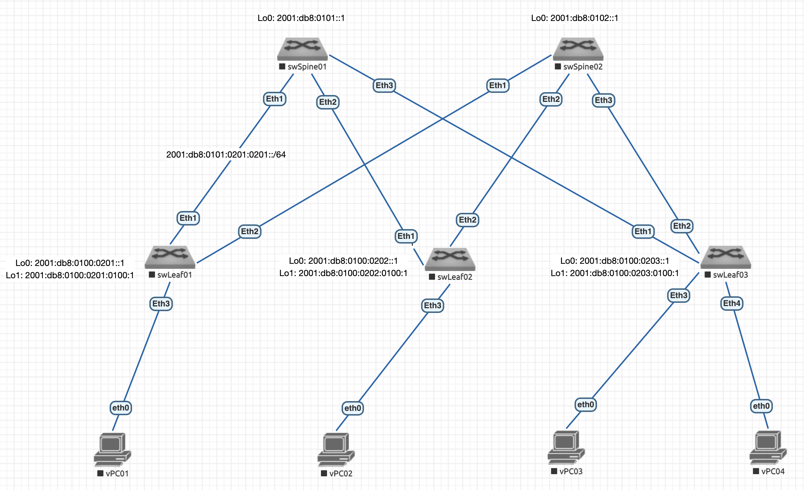

# Основы проектирования сети

## Состав работы
- [Схема сети](#схема-сети)
- [Расчет емкости ЦОД](#расчет-емкости-цод)
- [Распределение адресного пространства для Underlay сети](#распределение-адресного-пространства-для-underlay-сети)

### Схема сети


### Расчет емкости ЦОД
Будем считать, что DC представляет собой коммерческий микро-ЦОД следующей конфигурации:
- Цод предназначен для размещения 2 одинаковых POD'ов (модульных блоков), состоящих из 8 коммуникационных конструктивов высотой 48U;
- Каждый POD имеет следующую конфигурацию:
    - 6 конструктивов стандартного типа, предназначенных для размещения серверного оборудования. Каждый конструктив оснащен 2 коммутаторами TOP (Top of Rack) уровня Leaf, размещенными с задней стороны конструктива в специализированных местах установки (так называемых Zero Unit);
    - 1  коммуникационный конструктив, содержащий в своем объеме весь необходимый connectivity и предназначенный для установки проектируемого количества коммутаторов уровня Spine;
    - 1 специализированный конструктив распределения энергии.

Опираясь на рассматриваемое ТЗ, общая емкость составляет 288U/POD или 576U проектной емкости (максимальной) всего ЦОД.

Исходя из полученных данных и условия, что на уровне Leaf применяются коммутаторы с 48 downlink портами, нам понадобится 12 пар без учета 1 пары Border Leaf. Итого: 13 пар или 26 коммутаторов уровня Leaf.

При расчете количества Spine коммутаторов, будем исходить из условия заданного коэффициента переподписки 2/1 (oversubscription ratio) и полосы пропускания downlink на стороне Leaf-коммутатора в 10Gbps:

`480Gbps/2 ~ 250Gbps`

Т.о., при использовании 50Gbps аплинтов нам потребуется 5 коммутаторов уровня Spine и по 6 портов аплинков на стороне Leaf с соответствующей полосой пропускания.

### Распределение адресного пространства для Underlay сети
Со своей точки зрения, считаю вариант использования IPv6-стека для подстилающей сети наиболее гибким с точки зрения дальнейшей интеграции или масштабирования.

Учитывая заложенные в протокол IPv6 механизмы масштабирования, будем использовать поддиапазон `2001:db8::/32`, так как он не должен быть маршрутизируемым в сети Интернет, являясь инфраструктурной сетью OOB (Out-Of-Band).

В рамках совместимости будем оперировать префиксами /64.

Структура адреса:
`2001 : db8 : <DC><Spine> : <Leaf-Type><Leaf> : <Service-Type>00 :: <Host>/64`

где:
- 3 хексет:
    - <DC> - определяет порядковый номер сайта/датацентра (8 бит);
    - <Spine> - порядковый номер коммутатора уровня Spine (8 бит);

- 4 хексет:
    - <Leaf-Type> - тип коммутатора уровня Leaf (8 бит):
        - 00 - зарезервировано для Spine;
        - 01 - зарезервировано для Client Edge;
        - 02 - Server Edge;
        - FF - зарезервировано для Border Leaf;
    - <Leaf> - порядковый номер коммутатора уровня Leaf (8 бит);

- 5 хексет:
    - <Service-Type> - тип сервиса (8 бит):
        - 00 — Underlay Control Plane (Loopback0);
        - 01 — Overlay Data Plane VTEP (Loopback1);
        - 02 — p2p линки между коммутаторами;
        - FF — Зарезервировано для подключения серверов AnyCast;

Т.о., данный IP план позволяет нам достаточно широко масштабироваться до 255 сайтов/ЦОД с 255 коммутаторами на каждом из уровней.

*Таблица 1: Underlay Control Plane*

| Hostname | Type | If | IP/Mask |
|------------|-----------|-----------|-----------------|
| swSpine01 | Spine | Loopback0 | `2001:db8:0101::1/128` |
| swSpine02 | Spine | Loopback0 | `2001:db8:0102::1/128` |
| swLeaf01 | Leaf | Loopback0 | `2001:db8:0100:0201::1/128` |
| swLeaf02 | Leaf | Loopback0 | `2001:db8:0100:0202::1/128` |
| swLeaf03 | Leaf | Loopback0 | `2001:db8:0100:0203::1/128` |

*Таблица 2: Overlay Data Plane VTEP*

| Hostname | Type | If | IP/Mask |
|------------|-----------|-----------|-----------------|
| swLeaf01 | Leaf | Loopback1 | `2001:db8:0100:0201:0100:1/128` |
| swLeaf02 | Leaf | Loopback1 | `2001:db8:0100:0202:0100:1/128` |
| swLeaf03 | Leaf | Loopback1 | `2001:db8:0100:0203:0100:1/128` |

*Таблица 3: p2p соединения фабрики*

| Link | Network | Spine IP | Leaf IP |
|----------------------|------------------------------|------------------------------|------------------------------|
| swSpine01 - swLeaf01 | `2001:db8:0101:0201:0201::/64` | `2001:db8:0101:0201:0201::1/64` | `2001:db8:0101:0201:0201::2/64` |
| swSpine01 - swLeaf02 | `2001:db8:0101:0202:0201::/64` | `2001:db8:0101:0202:0201::1/64` | `2001:db8:0101:0202:0201::2/64` |
| swSpine01 - swLeaf03 | `2001:db8:0101:0203:0201::/64` | `2001:db8:0101:0203:0201::1/64` | `2001:db8:0101:0203:0201::2/64` |
| swSpine02 - swLeaf01 | `2001:db8:0102:0201:0201::/64` | `2001:db8:0102:0201:0201::1/64` | `2001:db8:0102:0201:0201::2/64` |
| swSpine02 - swLeaf02 | `2001:db8:0102:0201:0202::/64` | `2001:db8:0102:0202:0201::1/64` | `2001:db8:0102:0202:0201::2/64` |
| swSpine02 - swLeaf03 | `2001:db8:0102:0203:0201::/64` | `2001:db8:0102:0203:0201::1/64` | `2001:db8:0102:0203:0201::2/64` |

> Cуммаризация в BGP будет выглядеть следующим образом:
> - На Border Leaf (при анонсе в Core-сеть): 2001:db8:0100::/40.
> - На Spine-коммутаторах для сборки EVPN-соседств достаточно прописать два суммаризированных маршрута до всех VTEP: 2001:db8:0100:0200:0100::/56

### Конфигурирование Undelay
Перед началом настройки необходимо отключить процесс Zero Touch Provisioning (ZTP)командой `zerotouch cancel`, после чего коммутатор будет перегружен.

#### Настройка локальных стеков
Начальная конфигурация для коммутаторов уровня Spine выглядит следующим образом:

```ssh
hostname swSpine01
dns domain local

lldp run

ip routing

ipv6 unicast-routing

interface Loopback0
   description --- Virtual (no VRF, no VLAN): Underlay Control Plane
   load-interval 60
   ipv6 address 2001:db8:101::1/128

end
```

Для второго коммутатора уровня Spine конфигурация аналогичная.

Начальная конфигурация для коммутаторов уровня Leaf выглядит следующим образом:
```ssh
hostname swLeaf01
dns domain local

lldp run

ip routing

ipv6 unicast-routing

interface Loopback0
   description --- Virtual (no VRF, no VLAN): Underlay Control Plane
   load-interval 60
   ipv6 address 2001:db8:0100:0201::1/128

interface Loopback1
   description --- Virtual (no VRF, no VLAN): Overlay VTEP Edge
   load-interval 60
   ipv6 address 2001:db8:100:201:100::1/128

end
```

Далее, соберем линки. Рассмотрим в примере соединение swSpine01-swLeaf01.

На стороне swSpine01 производим следующие действия:
```ssh
swSpine01#sh lldp neighbors 
Last table change time   : 0:14:53 ago
Number of table inserts  : 4
Number of table deletes  : 1
Number of table drops    : 0
Number of table age-outs : 1

Port          Neighbor Device ID       Neighbor Port ID    TTL
---------- ------------------------ ---------------------- ---
Et1           swLeaf01.local           Ethernet1           120
Et2           localhost                Ethernet1           120
Et3           localhost                Ethernet1           120
```

Как видно из вывода, для этого соединения необходимо сконфигурировать интерфейс `Et1` следующим образом:
```ssh
interface Ethernet1
   description --- L3 (no VRF, no VLAN): p2p connection to swLeaf01/Et1
   load-interval 60
   no switchport
   ipv6 address 2001:db8:101:201:201::1/64
```

Переходим на swLeaf01:
```ssh
swLeaf01#sh lldp neighbors 
Last table change time   : 0:08:38 ago
Number of table inserts  : 2
Number of table deletes  : 0
Number of table drops    : 0
Number of table age-outs : 0

Port          Neighbor Device ID       Neighbor Port ID    TTL
---------- ------------------------ ---------------------- ---
Et1           swSpine01.local          Ethernet1           120
Et2           swSpine02.local          Ethernet1           120
```

и конфигурируем соответствующий порт:
```ssh
interface Ethernet1
   description --- L3 (no VRF, no VLAN): p2p connection to swSpine01/Et1
   load-interval 60
   no switchport
   ipv6 address 2001:db8:101:201:201::2/64
```

Проверим связанность:
```ssh
swLeaf01#ping ipv6 2001:db8:101:201:201::1
PING 2001:db8:101:201:201::1(2001:db8:101:201:201::1) 52 data bytes
60 bytes from 2001:db8:101:201:201::1: icmp_seq=1 ttl=64 time=51.7 ms
60 bytes from 2001:db8:101:201:201::1: icmp_seq=2 ttl=64 time=54.4 ms
60 bytes from 2001:db8:101:201:201::1: icmp_seq=3 ttl=64 time=51.6 ms
60 bytes from 2001:db8:101:201:201::1: icmp_seq=4 ttl=64 time=68.3 ms
60 bytes from 2001:db8:101:201:201::1: icmp_seq=5 ttl=64 time=64.9 ms

--- 2001:db8:101:201:201::1 ping statistics ---
5 packets transmitted, 5 received, 0% packet loss, time 47ms
rtt min/avg/max/mdev = 51.698/58.231/68.352/7.044 ms, pipe 5, ipg/ewma 11.931/55.418 ms
```

Остальные соединения настраиваются аналогично.