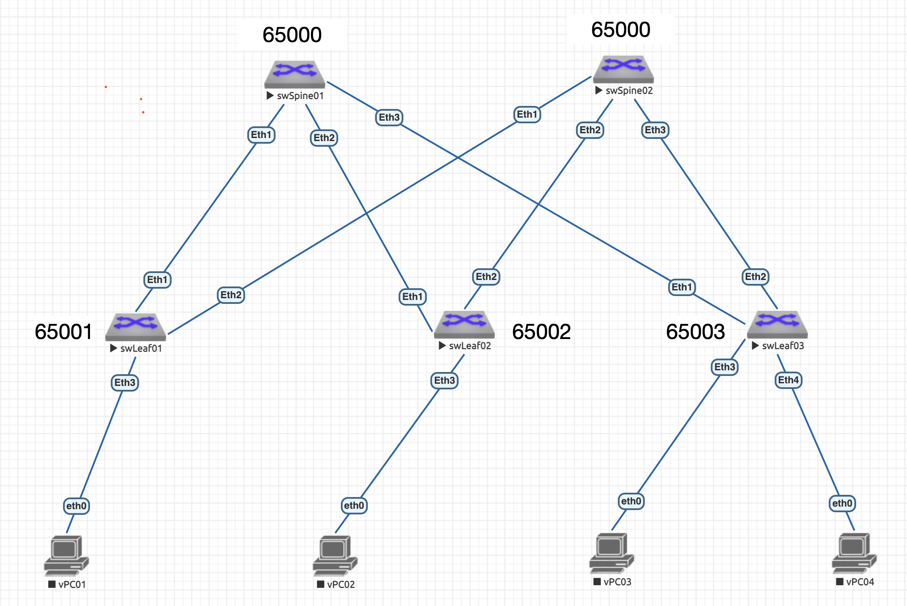
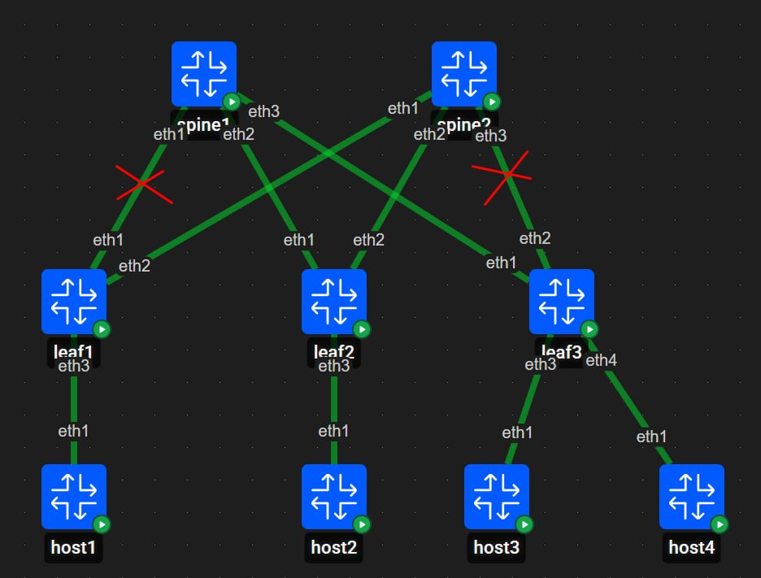
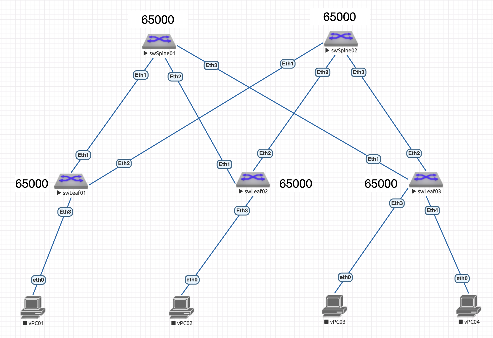

# Lab04: Построение Underlay сети (BGP)

## Состав работы
- [Условие задачи](#условие-задачи)
- [Описание решения](#описание-решения)
- [Стартовая конфигурация](#стартовая-конфигурация)
   - [Стартовая конфигурация коммутуторов уровня Spine](#стартовая-конфигурация-коммутуторов-уровня-spine)
   - [Стартовая конфигурация коммутуторов уровня Leaf](#стартовая-конфигурация-коммутуторов-уровня-leaf)
- [Конфигурирование Underlay сети с использованием BGP](#конфигурирование-underlay-сети-с-использованием-bgp)
   - [Вариант eBGP](#вариант-ebgp)
   - [Вариант iBGP](#вариант-ibgp)
   - [Вариант iBGP с конфедерацией](#вариант-ibgp-с-конфедерацией)

### Условие задачи
В этой самостоятельной работе мы ожидаем, что вы самостоятельно:
1. Настроите BGP в Underlay сети, для IP связанности между всеми сетевыми устройствами. iBGP или eBGP - решать вам!
2. Зафиксируете в документации - план работы, адресное пространство, схему сети, конфигурацию устройств.
3. Убедитесь в наличии IP связанности между устройствами в BGP домене.

### Описание решения
Со стороны сторонников BGP в подстилающей сети звучит следующий аргумент "зачем при необходимости использования BGP на уровне оверлея использовать другой протокол на уровне Underlay?".

Вероятно, из-за недостатка опыта, я не рассматриваю данный вариант своим фаворитом. Причины следующие:
1. BGP - дистанционно-векторный протокол, спроектированный для функционирования сети Интернет с достаточно инерционными механизмами, и как следствие, «маршрутизации по слухам» (Routing by Rumor) - маршрутизатор BGP верит на слово своим соседям о том, какие сети существуют в мире, не проверяя топологию всей сети лично. Такой подход, с моей точки зрения, не совсем подходит для развертывания подстилающей (Underlay) сети.
2. BGP - протокол маршрутизации, ориентирован на соединение (179/TCP). И сам этот факт порождает дополнительные проблемы, связанные как с таймерами транспортного уровня (L4/TCP), так и необходимостью наличия связанности между соседями.
3. Нагруженность конфигурации в сетях с большим количеством соседей - потребуется создавать BGP-соседство по количеству соединений p2p, что значительно раздует конфигурацию и усложнит ее чтение (нивелируется современным динамическим способом описания соседства).
4. Адаптация стандартного BGP-процесса для подстилающей сети потребует измения системных таймеров.

В любом случае, есть интерес рассмотреть все варианты конфигурирования сети Underlay на основе как iBGP, так и eBGP.

Основное различие между iBGP и eBGP заключается в механизмах предотвращения петель (кольцевых маршрутов) и правилах распространения сетевой информации.
- В eBGP (Exterior BGP) для защиты от петель используется атрибут AS-Path. Если маршрутизатор видит в этом списке номер своей локальной автономной системы (AS), он отклоняет такой апдейт.
- В iBGP (Interior BGP) атрибут AS-Path внутри одной автономной системы не меняется. Поэтому для предотвращения петель применяется правило расщепления горизонта (Split Horizon): маршрутизатор не передает iBGP-соседям маршруты, которые сам получил от другого iBGP-соседа. Из-за правила Split Horizon в iBGP по умолчанию требуется полносвязная топология (Full Mesh) — каждый iBGP-маршрутизатор должен иметь сессию со всеми остальными.

Для обхода этого ограничения в крупных сетях используют два метода: Route Reflectors (RR) — отражатели маршрутов, которые позволяют обходить правило Split Horizon и переход на eBGP через дробление одной большой AS на несколько мелких суб-AS. Более правильно даже сказать, что внутри конфедерации между суб-AS используется не чистый eBGP, а его особый гибридный вариант — intra-confederation eBGP.

Таким образом, начнем с eBGP и перейдем через iBGP к intra-confederation iBGP, раскрыв все возможные варианты применения.

### Стартовая конфигурация
В работе [Lab1](../Lab01/README.md) была построена сеть Клоза, разработан IP-план для стеков IPv4 и IPv6, а также выполнены некоторые дополнительные действия, описанные в материале.

Учитывая эквивалентность настройки устройств одного уровня, ниже будут указаны конфигурации только двух устройств разного уровня: swSpine01 и swLeaf01.

#### Стартовая конфигурация коммутуторов уровня Spine
```
! Command: show running-config
! device: swSpine01 (vEOS-lab, EOS-4.29.2F)
!
! boot system flash:/vEOS-lab.swi
!
no aaa root
!
transceiver qsfp default-mode 4x10G
!
service routing protocols model ribd
!
hostname swSpine01
dns domain local
!
spanning-tree mode mstp
!
vrf instance plnOOB
   description --- Plane OOB: Out-Of-Band
   rd 1:255
!
interface Ethernet1
   description --- L3 (no VRF, no VLAN): p2p connection to swLeaf01/Et1
   load-interval 60
   mtu 9214
   no switchport
   ip address unnumbered Loopback0
   ipv6 enable
   ipv6 address 2001:db8:101:201:201::1/64
!
interface Ethernet2
   description --- L3 (no VRF, no VLAN) p2p connection to swLeaf02/Et1
   load-interval 60
   mtu 9214
   no switchport
   ip address unnumbered Loopback0
   ipv6 enable
   ipv6 address 2001:db8:101:202:201::1/64
!
interface Ethernet3
   description --- L3 (no VRF, no VLAN) p2p connection to swLeaf03/Et1
   load-interval 60
   mtu 9214
   no switchport
   ip address unnumbered Loopback0
   ipv6 enable
   ipv6 address 2001:db8:101:203:201::1/64
!
interface Ethernet4
   description --- SECURITY OFF
   shutdown
   load-interval 60
!
interface Ethernet5
   description --- SECURITY OFF
   shutdown
   load-interval 60
!
interface Ethernet6
   description --- SECURITY OFF
   shutdown
   load-interval 60
!
interface Ethernet7
   description --- SECURITY OFF
   shutdown
   load-interval 60
!
interface Ethernet8
   description --- SECURITY OFF
   shutdown
   load-interval 60
!
interface Loopback0
   description --- Virtual (no VRF, no VLAN): Underlay Control Plane
   load-interval 60
   ip address 10.1.0.1/32
   ipv6 address 2001:db8:101::1/128
!
interface Management1
   description --- L3 (vrf: plnOOB, no VLAN): Management network
   load-interval 60
   vrf plnOOB
   ip address 10.1.255.1/24
!
ip routing
no ip routing vrf plnOOB
!
ipv6 unicast-routing
!
ip route vrf plnOOB 0.0.0.0/0 10.1.255.254
!
end
```

#### Стартовая конфигурация коммутуторов уровня Leaf
```
! Command: show running-config
! device: swLeaf01 (vEOS-lab, EOS-4.29.2F)
!
! boot system flash:/vEOS-lab.swi
!
no aaa root
!
transceiver qsfp default-mode 4x10G
!
service routing protocols model ribd
!
hostname swLeaf01
dns domain local
!
spanning-tree mode mstp
!
vrf instance plnOOB
   description --- Plane OOB: Out-Of-Band
   rd 1:255
!
interface Ethernet1
   description --- L3 (no VRF, no VLAN): p2p connection to swSpine01/Et1
   load-interval 60
   mtu 9214
   no switchport
   ip address unnumbered Loopback0
   ipv6 enable
   ipv6 address 2001:db8:101:201:201::2/64
!
interface Ethernet2
   description --- L3 (no VRF, no VLAN): p2p connection to swSpine02/Et1
   load-interval 60
   mtu 9214
   no switchport
   ip address unnumbered Loopback0
   ipv6 enable
   ipv6 address 2001:db8:102:201:201::2/64
!
interface Ethernet3
   description --- SECURITY OFF
   shutdown
   load-interval 60
!
interface Ethernet4
   description --- SECURITY OFF
   shutdown
   load-interval 60
!
interface Ethernet5
   description --- SECURITY OFF
   shutdown
   load-interval 60
!
interface Ethernet6
   description --- SECURITY OFF
   shutdown
   load-interval 60
!
interface Ethernet7
   description --- SECURITY OFF
   shutdown
   load-interval 60
!
interface Ethernet8
   description --- SECURITY OFF
   shutdown
   load-interval 60
!
interface Loopback0
   description --- Virtual (no VRF, no VLAN): Underlay Control Plane
   load-interval 60
   ip address 10.1.2.1/32
   ipv6 address 2001:db8:100:201::1/128
!
interface Loopback1
   description --- Virtual (no VRF, no VLAN): Overlay VTEP Edge
   load-interval 60
   ip address 10.1.102.1/32
   ipv6 address 2001:db8:100:201:100::1/128
!
interface Management1
   description --- L3 (vrf: plnOOB, no VLAN): Management network
   load-interval 60
   vrf plnOOB
   ip address 10.1.255.101/24
!
ip routing
no ip routing vrf plnOOB
!
ipv6 unicast-routing
!
ip route vrf plnOOB 0.0.0.0/0 10.1.255.254
!
end
```

### Конфигурирование Underlay сети с использованием BGP

#### Вариант eBGP
Конструкт использования eBGP на уровне Underlay выглядит следующим образом:
- Все коммутаторы уровня Spine принадлежат одной автономной системе (в нашем случае - 65000)
- Коммутаторы уровня Leaf принадлежат своим собственным AS, с последовательным ASN: swLeaf01 - 65001, swLeaf02 - 65002, swLeaf03 - 65003 и так далее при необходимости.



Такая архитектура позволяет избежать петель маршрутизации за счет применения механизма подавления петель (AS-Path Loop Prevention) eBGP между коммутаторами уровня Leaf, но потенциально создает проблему связанности между коммутаторами уровня Spine.

В свете примера, озвученного Андреем Блиновым:



Давайте рассмотрим детально. Исходя из конфигурации связей, трафик от Host1 к Host4 должен пойти по следующей траектории: Host1 -> Leaf1 -> Spine2 -> Leaf2 -> Spine1 -> Leaf3 -> Host4. Однако, даже коммутатор Leaf1 не будет ничего знать о сетях за коммутатором Leaf2. Причина кроется в том, что коммутаторы Spine отвергнут апдейты друг от друга, так как сработает защита механизма подавления петель. Речь об апдейтах пришедших в Spine со стороны Leaf'ов, содержащих префиксы интерфейсов обратных петель от других Spine'ов и, очевидно, имеющих в последовательности AS-Path свою же ASN.

Для митигации этой проблемы можно воспользоваться двумя механизмами:
1. На стороне коммутаторов уровня Spine, используя команду `allowas-in`, разрешить принимать маршруты со своей AS в пути AS-Path;
2. На Leaf-коммутаторах настроить опцию `as-override`, изменяющей AS-Path для соответствующих префиксов (с моей точки зрения не самый элегантный метод).

Я буду использовать механизм `allowas-in`, реализуя вариант минимализации расходования IPv4 через Link-local адреса (IPv6) p2p ребер.

Начнем с подготовки анонсируемых префиксов. Стандартно, для этого используется директива `network` в контексте соответствующего стека (`address-family`), но более гибким вариантом является получение анонсируемых префиксов через редистрибьюцию по имени интерфейса. Кроме того, мы можем обеспечить чистоту RIB за счет фильтрации списка редистрибьюции - отобрать только используемые выше интерфейсы, используя для этого маршрутную карту:

```config
route-map rmapBGPRedistributeConnected permit 10
   description --- BGP: Redistribute connection list
   match interface Loopback0     ! Указываем список редистрибьюции через имя интерфейса
   set origin igp                ! Меняем origin с incomplete на igp для редистрибьюированных интерфейсов
```

Я буду использовать его только для стека IPv4, но устанавливать соседство через IPv6 Link-local адрес. Теперь можно настроить контекст процесса:

```ssh
swSpine01(config)#router bgp 65000
swSpine01(config-router-bgp)#router-id 10.1.0.1          ! Используем для идентификации Lo0
swSpine01(config-router-bgp)#bgp log-neighbor-changes    ! Включаем журналирование сходимости
swSpine01(config-router-bgp)#address-family ipv4
swSpine01(config-router-bgp-af)#redistribute connected route-map rmapBGPRedistributeConnected
```

> **Важно!**
> Underlay плоскость настраивается в GRT.

В операционной системе Arista EOS BGP-шаблоны реализуются через механизм Peer-Group. Шаблоны (Peer-Groups) позволяют сгруппировать общие настройки (например, номер автономной системы, политики фильтрации маршрутов, параметры таймеров) и применять их сразу к множеству соседей. Шаблон создается в контексте соответствующего экземпляра BGP-процесса:

```ssh
swSpine01(config-router-bgp)#neighbor tmpUnderlay2Leaf peer group                ! Создаем шаблон
```

Я только создал шаблон (он пока пуст), чтобы потом было удобно реконфигуровать все соседства одновременно.

Теперь любые реконфигурации шаблона будут производиться и в настройках соседства, созданных через этот шаблон. Останется только перезапустить процесс для запуска процесса обмена апдейтами с измененными настройками.

Так как я буду использовать IPv6 Link-local адреса для установления соседства, необходимо их определить:

```
swSpine01(config-router-bgp)#sh ipv6 neighbors
IPv6 Address                                  Age Hardware Addr   Interface
fe80::5200:ff:fed5:5dc0                   2:32:08 5000.00d5.5dc0  Et1
fe80::5200:ff:fe03:3766                   2:39:57 5000.0003.3766  Et2
fe80::5200:ff:fe15:f4e8                   2:33:50 5000.0015.f4e8  Et3
```

Теперь мы может описать соседство, указая не только Link-local адрес соседа (на всех портах удаленного коммутатора они будут одинаковые), но и физический порт, через который осуществляется соседство:

```
swSpine01(config-router-bgp)#neighbor fe80::5200:ff:fed5:5dc0%Et1 peer group tmpUnderlay2Leaf
swSpine01(config-router-bgp)#neighbor fe80::5200:ff:fed5:5dc0%Et1 remote-as 65001
swSpine01(config-router-bgp)#address-family ipv4
swSpine01(config-router-bgp-af)#neighbor fe80::5200:ff:fed5:5dc0%Et1 activate
```

где суффикс `Et1` указывает на интерфейс `Ethernet1`.

> В этой конфигурации стоит отметить следующий момент: не следует изменять интерфейс-источник для апдейтов в сторону соседа на интерфейс(например, на интерфейс локальной петли через команду `update-source loopback 0`), так как апдейт будет отброшен из-за строгого механизма валидации TCP-соединения: несоответствия на своей стороне поля `neighbor` и `update-source`, которое мы не сможем устранить без дополнительного указания маршрута к удаленному интерфейсу локальной петли.

Теперь мы можем проверить функционирование соседства:

```
swSpine01#sh bgp summary
BGP summary information for VRF default
Router identifier 10.1.0.1, local AS number 65000
Neighbor                             AS Session State AFI/SAFI                AFI/SAFI State   NLRI Rcd   NLRI Acc
--------------------------- ----------- ------------- ----------------------- -------------- ---------- ----------
fe80::5200:ff:fed5:5dc0%Et1       65001 Established   IPv4 Unicast            Negotiated              0          0
```

Здесь мы видим, что соседство установлено (`Established`), но коммутатор не получает ни одного NLRI (Network Layer Reachability Information), несмотря на то, что редистрибьюция настроена.

Проверим, попадает ли она в локальную таблицу BGP:

```
swSpine01#sh ip bgp
BGP routing table information for VRF default
Router identifier 10.1.0.1, local AS number 65000
Route status codes: s - suppressed contributor, * - valid, > - active, E - ECMP head, e - ECMP
                    S - Stale, c - Contributing to ECMP, b - backup, L - labeled-unicast
                    % - Pending best path selection
Origin codes: i - IGP, e - EGP, ? - incomplete
RPKI Origin Validation codes: V - valid, I - invalid, U - unknown
AS Path Attributes: Or-ID - Originator ID, C-LST - Cluster List, LL Nexthop - Link Local Nexthop

          Network                Next Hop              Metric  AIGP       LocPref Weight  Path
 * >      10.1.0.1/32            -                     -       -          -       0       i
```

Как видно, префикс локального интерфейса Lo0 присутствует, он валиден и активен, но у него нет параметра `Next-Hop`, так как в рамках самого коммутатора он и не нужен. И вот что здесь происходит: когда Spine пытается отправить маршрут 10.1.0.1/32 в сторону Leaf, по стандарту BGP он обязан указать в качестве Next Hop свой собственный IP-адрес. Но у Spine на интерфейсе в сторону Leaf есть только Link-local IPv6-адрес. Он не может просто так передать IPv6-адрес в качестве Next Hop для IPv4-сети внутри стандартного обновления, потому что Leaf ожидает там увидеть 32-битный IPv4-адрес. Так как Spine «не знает», какой IPv4 Next Hop поставить для этого анонса, он блокирует отправку маршрута:

```
swSpine01#sh bgp neighbors fe80::5200:ff:fed5:5dc0%Et1 advertised-routes
BGP routing table information for VRF default
Router identifier 10.1.0.1, local AS number 65000
Route status codes: s - suppressed contributor, * - valid, > - active, E - ECMP head, e - ECMP
                    S - Stale, c - Contributing to ECMP, b - backup, L - labeled-unicast, q - Queued for advertisement
                    % - Pending best path selection
Origin codes: i - IGP, e - EGP, ? - incomplete
RPKI Origin Validation codes: V - valid, I - invalid, U - unknown
AS Path Attributes: Or-ID - Originator ID, C-LST - Cluster List, LL Nexthop - Link Local Nexthop

          Network                Next Hop              Metric  AIGP       LocPref Weight  Path
```

Этот момент решается использованием директивы "next-hop address-family ipv6 originate" в конфигурации соответствующего соседства.

Также чтобы не тянуть IPv6 адреса в настройке соседства, Arista позволяет описывать его через интерфейс соответствующего ребра:

```
swSpine01#sh run sec bgp
route-map rmapBGPRedistributeConnected permit 10
   description --- BGP: Redistribute connection list
   match interface Loopback0
   set origin igp
router bgp 65000
   router-id 10.1.0.1
   neighbor tmpUnderlay2Leaf peer group
   neighbor interface Et1 peer-group tmpUnderlay2Leaf remote-as 65001
   !
   address-family ipv4
      neighbor tmpUnderlay2Leaf activate
      neighbor tmpUnderlay2Leaf next-hop address-family ipv6 originate  ! Разрешить анонсировать IPv6 адрес в качестве параметра next-hop
      redistribute connected route-map rmapBGPRedistributeConnected
```

Теперь проверим анонсы:

```
swSpine01#sh bgp neighbors fe80::5200:ff:fed5:5dc0%Et1 advertised-routes
BGP routing table information for VRF default
Router identifier 10.1.0.1, local AS number 65000
Route status codes: s - suppressed contributor, * - valid, > - active, E - ECMP head, e - ECMP
                    S - Stale, c - Contributing to ECMP, b - backup, L - labeled-unicast, q - Queued for advertisement
                    % - Pending best path selection
Origin codes: i - IGP, e - EGP, ? - incomplete
RPKI Origin Validation codes: V - valid, I - invalid, U - unknown
AS Path Attributes: Or-ID - Originator ID, C-LST - Cluster List, LL Nexthop - Link Local Nexthop

          Network                Next Hop              Metric  AIGP       LocPref Weight  Path
 * >      10.1.0.1/32            fe80::5200:ff:fed7:ee0b%Et1 -       -          -       -       65000 i
```

Аналогичные настройки имеет и Leaf-коммутатор:

```
swLeaf01#sh run section bgp
route-map rmapBGPRedistributeConnected permit 10
   description --- BGP: Redistribute connection list
   match interface Loopback0
   set origin igp
router bgp 65001
   router-id 10.1.2.1
   neighbor tmpUnderlay2Spine peer group
   neighbor interface Et1 peer-group tmpUnderlay2Spine remote-as 65000
   !
   address-family ipv4
      neighbor tmpUnderlay2Spine activate
      neighbor tmpUnderlay2Spine next-hop address-family ipv6 originate
      redistribute connected route-map rmapBGPRedistributeConnected
```

Проверим состояние соседства:

```
swSpine01#show bgp summary
BGP summary information for VRF default
Router identifier 10.1.0.1, local AS number 65000
Neighbor                             AS Session State AFI/SAFI                AFI/SAFI State   NLRI Rcd   NLRI Acc
--------------------------- ----------- ------------- ----------------------- -------------- ---------- ----------
fe80::5200:ff:fed5:5dc0%Et1       65001 Established   IPv4 Unicast            Negotiated              1          1
```

Перенесем настройки на все коммутаторы фабрики.

Теперь если сравнить вывод RIB на стороне Spine и Leaf, увидим следующее:

```
swSpine01#sh ip route

VRF: default
Source Codes:
       C - connected, S - static, K - kernel,
       O - OSPF, IA - OSPF inter area, E1 - OSPF external type 1,
       E2 - OSPF external type 2, N1 - OSPF NSSA external type 1,
       N2 - OSPF NSSA external type2, B - Other BGP Routes,
       B I - iBGP, B E - eBGP, R - RIP, I L1 - IS-IS level 1,
       I L2 - IS-IS level 2, O3 - OSPFv3, A B - BGP Aggregate,
       A O - OSPF Summary, NG - Nexthop Group Static Route,
       V - VXLAN Control Service, M - Martian,
       DH - DHCP client installed default route,
       DP - Dynamic Policy Route, L - VRF Leaked,
       G  - gRIBI, RC - Route Cache Route,
       CL - CBF Leaked Route

Gateway of last resort is not set

 C        10.1.0.1/32 [0/0]
           via Loopback0, directly connected
 B E      10.1.2.1/32 [200/0]
           via fe80::5200:ff:fed5:5dc0, Ethernet1
 B E      10.1.2.2/32 [200/0]
           via fe80::5200:ff:fe03:3766, Ethernet2
 B E      10.1.2.3/32 [200/0]
           via fe80::5200:ff:fe15:f4e8, Ethernet3

swLeaf01#sh ip route

VRF: default
Source Codes:
       C - connected, S - static, K - kernel,
       O - OSPF, IA - OSPF inter area, E1 - OSPF external type 1,
       E2 - OSPF external type 2, N1 - OSPF NSSA external type 1,
       N2 - OSPF NSSA external type2, B - Other BGP Routes,
       B I - iBGP, B E - eBGP, R - RIP, I L1 - IS-IS level 1,
       I L2 - IS-IS level 2, O3 - OSPFv3, A B - BGP Aggregate,
       A O - OSPF Summary, NG - Nexthop Group Static Route,
       V - VXLAN Control Service, M - Martian,
       DH - DHCP client installed default route,
       DP - Dynamic Policy Route, L - VRF Leaked,
       G  - gRIBI, RC - Route Cache Route,
       CL - CBF Leaked Route

Gateway of last resort is not set

 B E      10.1.0.1/32 [200/0]
           via fe80::5200:ff:fed7:ee0b, Ethernet1
 B E      10.1.0.2/32 [200/0]
           via fe80::5200:ff:fecb:38c2, Ethernet2
 C        10.1.2.1/32 [0/0]
           via Loopback0, directly connected
 B E      10.1.2.2/32 [200/0]
           via fe80::5200:ff:fed7:ee0b, Ethernet1
 B E      10.1.2.3/32 [200/0]
           via fe80::5200:ff:fed7:ee0b, Ethernet1
```

Коммутаторы Spine не знают ничего друг о друге: это результат работы BGP AS-Path Loop Prevention, о котором шла речь ранее. Если посмотреть на списки анонсированных со стороны Leaf:

```
swLeaf01#sh bgp neighbors fe80::5200:ff:fed7:ee0b%Et1 advertised-routes
BGP routing table information for VRF default
Router identifier 10.1.2.1, local AS number 65001
Route status codes: s - suppressed contributor, * - valid, > - active, E - ECMP head, e - ECMP
                    S - Stale, c - Contributing to ECMP, b - backup, L - labeled-unicast, q - Queued for advertisement
                    % - Pending best path selection
Origin codes: i - IGP, e - EGP, ? - incomplete
RPKI Origin Validation codes: V - valid, I - invalid, U - unknown
AS Path Attributes: Or-ID - Originator ID, C-LST - Cluster List, LL Nexthop - Link Local Nexthop

          Network                Next Hop              Metric  AIGP       LocPref Weight  Path
 * >      10.1.0.2/32            fe80::5200:ff:fed5:5dc0%Et1 -       -          -       -       65001 65000 i
 * >      10.1.2.1/32            fe80::5200:ff:fed5:5dc0%Et1 -       -          -       -       65001 i
```

и полученных на стороне Spine маршрутов:

```
swSpine01#sh bgp neighbors fe80::5200:ff:fed5:5dc0%Et1 received-routes
BGP routing table information for VRF default
Router identifier 10.1.0.1, local AS number 65000
Route status codes: s - suppressed contributor, * - valid, > - active, E - ECMP head, e - ECMP
                    S - Stale, c - Contributing to ECMP, b - backup, L - labeled-unicast
                    % - Pending best path selection
Origin codes: i - IGP, e - EGP, ? - incomplete
RPKI Origin Validation codes: V - valid, I - invalid, U - unknown
AS Path Attributes: Or-ID - Originator ID, C-LST - Cluster List, LL Nexthop - Link Local Nexthop

          Network                Next Hop              Metric  AIGP       LocPref Weight  Path
 * >      10.1.2.1/32            fe80::5200:ff:fed5:5dc0%Et1 -       -          -       -       65001 i
```

мы увидим `10.1.0.2/32` в полученных отсутствует, несмотря на то, что со стороны Leaf он анонсирован. Т.е., видно, что Spine его фильтрует, так как AS-Path содержит собственную ASN 65000.

Разрешим принимать апдейты для своей же зоны на обоих Spine'ах, добавив в темплейт команду `neighbor tmpUnderlay2Leaf allowas-in 1`, где последняя `1` указывает на разверешнное количество включений ASN в полученный AS-Path префикса. Для архитектуры Clos в данной конфигурации - это один уровень.

После мягкого перезапуска процессов (`lear bgp * soft`), проверим RIB:

```
swSpine01#sh ip route

VRF: default
Source Codes:
       C - connected, S - static, K - kernel,
       O - OSPF, IA - OSPF inter area, E1 - OSPF external type 1,
       E2 - OSPF external type 2, N1 - OSPF NSSA external type 1,
       N2 - OSPF NSSA external type2, B - Other BGP Routes,
       B I - iBGP, B E - eBGP, R - RIP, I L1 - IS-IS level 1,
       I L2 - IS-IS level 2, O3 - OSPFv3, A B - BGP Aggregate,
       A O - OSPF Summary, NG - Nexthop Group Static Route,
       V - VXLAN Control Service, M - Martian,
       DH - DHCP client installed default route,
       DP - Dynamic Policy Route, L - VRF Leaked,
       G  - gRIBI, RC - Route Cache Route,
       CL - CBF Leaked Route

Gateway of last resort is not set

 C        10.1.0.1/32 [0/0]
           via Loopback0, directly connected
 B E      10.1.0.2/32 [200/0]
           via fe80::5200:ff:fed5:5dc0, Ethernet1
 B E      10.1.2.1/32 [200/0]
           via fe80::5200:ff:fed5:5dc0, Ethernet1
 B E      10.1.2.2/32 [200/0]
           via fe80::5200:ff:fe03:3766, Ethernet2
 B E      10.1.2.3/32 [200/0]
           via fe80::5200:ff:fe15:f4e8, Ethernet3
```

и связанность с ним:

```
swSpine01#ping 10.1.0.2
PING 10.1.0.2 (10.1.0.2) 72(100) bytes of data.
80 bytes from 10.1.0.2: icmp_seq=1 ttl=64 time=5.20 ms
80 bytes from 10.1.0.2: icmp_seq=2 ttl=64 time=3.52 ms
80 bytes from 10.1.0.2: icmp_seq=3 ttl=64 time=3.55 ms
80 bytes from 10.1.0.2: icmp_seq=4 ttl=64 time=3.63 ms
80 bytes from 10.1.0.2: icmp_seq=5 ttl=64 time=3.25 ms

--- 10.1.0.2 ping statistics ---
5 packets transmitted, 5 received, 0% packet loss, time 25ms
rtt min/avg/max/mdev = 3.248/3.830/5.201/0.697 ms, ipg/ewma 6.346/4.486 ms
```

Будем считать основной функционал настроенным. Полная конфигурация Spine-коммутаторов:
```
route-map rmapBGPRedistributeConnected permit 10
   description --- BGP: Redistribute connection list
   match interface Loopback0
   set origin igp
!
router bgp 65000
   router-id 10.1.0.1
   neighbor tmpUnderlay2Leaf peer group
   neighbor tmpUnderlay2Leaf allowas-in 1
   neighbor interface Et1 peer-group tmpUnderlay2Leaf remote-as 65001
   neighbor interface Et2 peer-group tmpUnderlay2Leaf remote-as 65002
   neighbor interface Et3 peer-group tmpUnderlay2Leaf remote-as 65003
   !
   address-family ipv4
      neighbor tmpUnderlay2Leaf activate
      neighbor tmpUnderlay2Leaf next-hop address-family ipv6 originate
      redistribute connected route-map rmapBGPRedistributeConnected
```

и на стороне Spine'ов:

```
route-map rmapBGPRedistributeConnected permit 10
   description --- BGP: Redistribute connection list
   match interface Loopback0
   set origin igp
!
router bgp 65001
   router-id 10.1.2.1
   neighbor tmpUnderlay2Spine peer group
   neighbor interface Et1-2 peer-group tmpUnderlay2Spine remote-as 65000
   !
   address-family ipv4
      neighbor tmpUnderlay2Spine activate
      neighbor tmpUnderlay2Spine next-hop address-family ipv6 originate
      redistribute connected route-map rmapBGPRedistributeConnected
```


#### Вариант iBGP
В случае iBGP, все коммутаторы фабрики принадлежат одной и той же AS.



При использовании внутреннего механизма предотвращения петель, мы сталкиваемся с проблемой фильтрации апдейтов на принимающей стороне с ASN своей же системы. Чтобы обойти эту особенность, нам на уровне Spine необходимо создать "отражатель маршрутов" в сторону коммутаров уровня Leaf.

Как и в предыдущем примере eBGP, будем использовать динамический метод указанания соседства. Работающая конфигурация для коммутаторов уровня Spine приведена ниже:

```
swSpine01#sh run sec bgp
route-map rmapBGPRedistributeConnected permit 10
   description --- BGP: Redistribute connection list
   match interface Loopback0
   set origin igp
router bgp 65000
   router-id 10.1.0.1
   bgp listen range fe80::/10 peer-group tmpUnderlay2Leaf remote-as 65000
   neighbor tmpUnderlay2Leaf peer group
   !
   address-family ipv4
      neighbor tmpUnderlay2Leaf activate
      neighbor tmpUnderlay2Leaf next-hop address-family ipv6 originate
      redistribute connected route-map rmapBGPRedistributeConnected
```

и коммутаторов Leaf:

```
swLeaf01#sh run sec bgp
route-map rmapBGPRedistributeConnected permit 10
   description --- BGP: Redistribute connection list
   match interface Loopback0
   set origin igp
router bgp 65000
   router-id 10.1.2.1
   neighbor tmpUnderlay2Spine peer group
   neighbor tmpUnderlay2Spine next-hop-self
   neighbor interface Et1-2 peer-group tmpUnderlay2Spine remote-as 65000
   !
   address-family ipv4
      neighbor tmpUnderlay2Spine activate
      neighbor tmpUnderlay2Spine next-hop address-family ipv6 originate
      redistribute connected route-map rmapBGPRedistributeConnected
```

Проверим после настройки состояние RIB, получим:

```
swSpine01#sh ip route

VRF: default
Source Codes:
       C - connected, S - static, K - kernel,
       O - OSPF, IA - OSPF inter area, E1 - OSPF external type 1,
       E2 - OSPF external type 2, N1 - OSPF NSSA external type 1,
       N2 - OSPF NSSA external type2, B - Other BGP Routes,
       B I - iBGP, B E - eBGP, R - RIP, I L1 - IS-IS level 1,
       I L2 - IS-IS level 2, O3 - OSPFv3, A B - BGP Aggregate,
       A O - OSPF Summary, NG - Nexthop Group Static Route,
       V - VXLAN Control Service, M - Martian,
       DH - DHCP client installed default route,
       DP - Dynamic Policy Route, L - VRF Leaked,
       G  - gRIBI, RC - Route Cache Route,
       CL - CBF Leaked Route

Gateway of last resort is not set

 C        10.1.0.1/32 [0/0]
           via Loopback0, directly connected
 B I      10.1.2.1/32 [200/0]
           via fe80::5200:ff:fed5:5dc0, Ethernet1
 B I      10.1.2.2/32 [200/0]
           via fe80::5200:ff:fe03:3766, Ethernet2
 B I      10.1.2.3/32 [200/0]
           via fe80::5200:ff:fe15:f4e8, Ethernet3
```

видно, что Spine'ы не получают апдейты со Spine'ами,

```
swLeaf01#sh ip route

VRF: default
Source Codes:
       C - connected, S - static, K - kernel,
       O - OSPF, IA - OSPF inter area, E1 - OSPF external type 1,
       E2 - OSPF external type 2, N1 - OSPF NSSA external type 1,
       N2 - OSPF NSSA external type2, B - Other BGP Routes,
       B I - iBGP, B E - eBGP, R - RIP, I L1 - IS-IS level 1,
       I L2 - IS-IS level 2, O3 - OSPFv3, A B - BGP Aggregate,
       A O - OSPF Summary, NG - Nexthop Group Static Route,
       V - VXLAN Control Service, M - Martian,
       DH - DHCP client installed default route,
       DP - Dynamic Policy Route, L - VRF Leaked,
       G  - gRIBI, RC - Route Cache Route,
       CL - CBF Leaked Route

Gateway of last resort is not set

 B I      10.1.0.1/32 [200/0]
           via fe80::5200:ff:fed7:ee0b, Ethernet1
 B I      10.1.0.2/32 [200/0]
           via fe80::5200:ff:fecb:38c2, Ethernet2
 C        10.1.2.1/32 [0/0]
           via Loopback0, directly connected
```

а Leaf'ы - от остальных Leaf'ов.

Воспользуемся, сначала, рекоменацией, настройке на стороне коммутаторов Spine отражателей маршрутов:

```
swSpine01(config-router-bgp)#neighbor tmpUnderlay2Leaf route-reflector-client
```

Если теперь посмотреть, анонсы в сторону swLeaf01:

```
swSpine01#sh bgp neighbors fe80::5200:ff:fed5:5dc0%Et1 advertised-routes
BGP routing table information for VRF default
Router identifier 10.1.0.1, local AS number 65000
Route status codes: s - suppressed contributor, * - valid, > - active, E - ECMP head, e - ECMP
                    S - Stale, c - Contributing to ECMP, b - backup, L - labeled-unicast, q - Queued for advertisement
                    % - Pending best path selection
Origin codes: i - IGP, e - EGP, ? - incomplete
RPKI Origin Validation codes: V - valid, I - invalid, U - unknown
AS Path Attributes: Or-ID - Originator ID, C-LST - Cluster List, LL Nexthop - Link Local Nexthop

          Network                Next Hop              Metric  AIGP       LocPref Weight  Path
 * >      10.1.0.1/32            fe80::5200:ff:fed7:ee0b%Et1 -       -          100     -       i
```

и увидим только префикс его петлевого интерфейса при том, что его RIB содержит префиксы всех спайнов. То есть отражения не происходит. И происходит это потому, он по стандартам BGP обязан сохранить оригинальный Next-Hop `next-hop` адрес - Link-local IPv6 адреса за интерфейсами самого Spine'а и он сам считает, что со стороны другого оборудования такие адреса будут недоступны.

Особенность команды `next-hop address-family ipv6 originate` в Arista EOS: эта команда заставила Spine генерировать IPv6 Next-Hop для локальных маршрутов (поэтому на его собственном интерфейсе локальной петли 10.1.0.1/32 оно работает). Но для отражаемых iBGP-маршрутов эта команда не применима, так как Route Reflector не имеет права модифицировать Next-Hop клиентов, если не включены специальные политики.

Чтобы решить проблему недостижимости чужих Link-Local адресов, нужно заставить Spine при отражении маршрутов стирать оригинальный Next-Hop лифов и подставлять вместо него себя:

```
swSpine01(config-router-bgp)#address-family ipv4
swSpine01(config-router-bgp-af)#neighbor tmpUnderlay2Leaf next-hop-self
```

В результате чего, анонсы заработают правильно:

```
swSpine01#sh bgp neighbors fe80::5200:ff:fed5:5dc0%Et1 advertised-routes
BGP routing table information for VRF default
Router identifier 10.1.0.1, local AS number 65000
Route status codes: s - suppressed contributor, * - valid, > - active, E - ECMP head, e - ECMP
                    S - Stale, c - Contributing to ECMP, b - backup, L - labeled-unicast, q - Queued for advertisement
                    % - Pending best path selection
Origin codes: i - IGP, e - EGP, ? - incomplete
RPKI Origin Validation codes: V - valid, I - invalid, U - unknown
AS Path Attributes: Or-ID - Originator ID, C-LST - Cluster List, LL Nexthop - Link Local Nexthop

          Network                Next Hop              Metric  AIGP       LocPref Weight  Path
 * >      10.1.0.1/32            fe80::5200:ff:fed7:ee0b%Et1 -       -          100     -       i
 * >      10.1.2.2/32            fe80::5200:ff:fed7:ee0b%Et1 -       -          100     -       i Or-ID: 10.1.2.2 C-LST: 10.1.0.1
 * >      10.1.2.3/32            fe80::5200:ff:fed7:ee0b%Et1 -       -          100     -       i Or-ID: 10.1.2.3 C-LST: 10.1.0.1
```

И лифы получат желанное после распространения указанной настройки на все коммутаторы уровня Spine:

```
swLeaf01#sh ip route

VRF: default
Source Codes:
       C - connected, S - static, K - kernel,
       O - OSPF, IA - OSPF inter area, E1 - OSPF external type 1,
       E2 - OSPF external type 2, N1 - OSPF NSSA external type 1,
       N2 - OSPF NSSA external type2, B - Other BGP Routes,
       B I - iBGP, B E - eBGP, R - RIP, I L1 - IS-IS level 1,
       I L2 - IS-IS level 2, O3 - OSPFv3, A B - BGP Aggregate,
       A O - OSPF Summary, NG - Nexthop Group Static Route,
       V - VXLAN Control Service, M - Martian,
       DH - DHCP client installed default route,
       DP - Dynamic Policy Route, L - VRF Leaked,
       G  - gRIBI, RC - Route Cache Route,
       CL - CBF Leaked Route

Gateway of last resort is not set

 B I      10.1.0.1/32 [200/0]
           via fe80::5200:ff:fed7:ee0b, Ethernet1
 B I      10.1.0.2/32 [200/0]
           via fe80::5200:ff:fecb:38c2, Ethernet2
 C        10.1.2.1/32 [0/0]
           via Loopback0, directly connected
 B I      10.1.2.2/32 [200/0]
           via fe80::5200:ff:fed7:ee0b, Ethernet1
 B I      10.1.2.3/32 [200/0]
           via fe80::5200:ff:fed7:ee0b, Ethernet1
```

Теперь можно проверить работоспособность всей схемы, проведя ping между крайними Leaf'ами:

```
swLeaf01#ping 10.1.2.3
PING 10.1.2.3 (10.1.2.3) 72(100) bytes of data.
80 bytes from 10.1.2.3: icmp_seq=1 ttl=64 time=5.54 ms
80 bytes from 10.1.2.3: icmp_seq=2 ttl=64 time=4.33 ms
80 bytes from 10.1.2.3: icmp_seq=3 ttl=64 time=3.49 ms
80 bytes from 10.1.2.3: icmp_seq=4 ttl=64 time=3.53 ms
80 bytes from 10.1.2.3: icmp_seq=5 ttl=64 time=3.75 ms

--- 10.1.2.3 ping statistics ---
5 packets transmitted, 5 received, 0% packet loss, time 26ms
rtt min/avg/max/mdev = 3.487/4.128/5.535/0.764 ms, ipg/ewma 6.539/4.796 ms
```

У нас осталась только проблема связанности между коммутаторами уровня Spine.

```
swLeaf01#sh bgp neighbors fe80::5200:ff:fed7:ee0b%Et1 advertised-routes
BGP routing table information for VRF default
Router identifier 10.1.2.1, local AS number 65000
Route status codes: s - suppressed contributor, * - valid, > - active, E - ECMP head, e - ECMP
                    S - Stale, c - Contributing to ECMP, b - backup, L - labeled-unicast, q - Queued for advertisement
                    % - Pending best path selection
Origin codes: i - IGP, e - EGP, ? - incomplete
RPKI Origin Validation codes: V - valid, I - invalid, U - unknown
AS Path Attributes: Or-ID - Originator ID, C-LST - Cluster List, LL Nexthop - Link Local Nexthop

          Network                Next Hop              Metric  AIGP       LocPref Weight  Path
 * >      10.1.2.1/32            fe80::5200:ff:fed5:5dc0%Et1 -       -          100     -       i
```

Лифы не настроены как RR, и делать из них RR нельзя. Это полностью сломает логику Spine-Leaf фабрики.

Spine'ы не соединены между собой напрямую, а iBGP Split Horizon запрещает Leaf'у передавать маршрут, полученный от одного спайна, в сторону другого. Из-за этого спайны никогда не узнают друг о друге (и о сетях за ними) через обычный iBGP.

При этом Правило `Split Horizon` гласит: маршрутизатор, получивший апдейт от одного iBGP-соседа, никогда не передаст его другому iBGP-соседу. Протокол BGP блокирует эту отправку на корню, чтобы защитить сеть от петель. Так как Leaf не является рефлектором, никакими командами фильтрации или тюнинга `next-hop` маршрут, принятый внутри iBGP не может быть передан далее (в сторону Spine'а).

Эта проблема, как раз и является аргументом выбора eBGP (рассмотренного ранее), либо использования конфедерации (рассматриваемого далее).

Полная конфигурация коммутаторов уровня Spine выглядит следующим образом:

```
swSpine01#sh run sec bgp
route-map rmapBGPRedistributeConnected permit 10
   description --- BGP: Redistribute connection list
   match interface Loopback0
   set origin igp
router bgp 65000
   router-id 10.1.0.1
   bgp listen range fe80::/10 peer-group tmpUnderlay2Leaf remote-as 65000
   neighbor tmpUnderlay2Leaf peer group
   neighbor tmpUnderlay2Leaf route-reflector-client
   !
   address-family ipv4
      neighbor tmpUnderlay2Leaf activate
      neighbor tmpUnderlay2Leaf next-hop address-family ipv6 originate
      neighbor tmpUnderlay2Leaf next-hop-self
      redistribute connected route-map rmapBGPRedistributeConnected
```

для Spine:

```
swLeaf01#sh run sec bgp
route-map rmapBGPRedistributeConnected permit 10
   description --- BGP: Redistribute connection list
   match interface Loopback0
   set origin igp
router bgp 65000
   router-id 10.1.2.1
   maximum-paths 64
   neighbor tmpUnderlay2Spine peer group
   neighbor interface Et1-2 peer-group tmpUnderlay2Spine remote-as 65000
   !
   address-family ipv4
      neighbor tmpUnderlay2Spine activate
      neighbor tmpUnderlay2Spine next-hop address-family ipv6 originate
      redistribute connected route-map rmapBGPRedistributeConnected
```

Решить вопрос связанности между Spine'ами можно с помощью костыля - статических маршрутов через все соседние Leaf'ы:

```
ip route 10.1.0.2/32 10.1.2.1
ip route 10.1.0.2/32 10.1.2.2
ip route 10.1.0.2/32 10.1.2.3
```

#### Вариант iBGP с конфедерацией
BGP Confederation (Конфедерация BGP) — это метод масштабирования протокола iBGP внутри одной автономной системы (AS), стандартизированный в RFC 5065. Он позволяет обойти ограничение правила iBGP Split Horizon и полностью отказаться от построения полносвязной топологии (Full Mesh) путем логического деления одной большой глобальной AS (Public AS) на несколько мелких приватных систем — Member-AS (суб-AS). При этом, для внешнего мира вся фабрика останется в единой AS 65000.

Основная цель конфедерации — устранение требования полносвязной топологии iBGP (Full Mesh) и обход ограничения правила iBGP Split Horizon без использования Route Reflectors (RR). 

При использовании конфедерации одна крупная глобальная автономная система (Public AS) дробится на несколько мелких, приватных систем — Member-AS (или суб-AS). Внутри конфедерации выделяют два типа соседства, которые работают по разным правилам:
- Intra-Member-AS iBGP: Классический iBGP внутри одной суб-AS. Здесь по-прежнему действует правило Split Horizon и требуется Full Mesh (или локальные рефлекторы - RR).
- Inter-Member-AS eBGP (Intra-Confederation eBGP): Гибридный тип соседства между разными суб-AS. Протокольно и по механизмам предотвращения петель он работает как eBGP, но при этом сохраняет ключевые свойства iBGP.

*Таблица 1. Различия механизмов BGP*

| Механизм/Атрибут | eBGP | iBGP | Confederation eBGP |
| ------------------ | ------------------ | ------------------ | ------------------ |
| Предотвращение петель (Loop Prevention) | На базе AS-Path: Анонс отклоняется, если в списке есть собственный ASN | На базе Split Horizon: маршрут, полученный от iBGP-соседа, не передается другим iBGP-соседям | На базе AS-Path (суб-AS): Анонс отклоняется, если в списке суб-AS есть своя |


Схема распредеделния ASN повторяет решение для eBGP:


В терминологии BGP понятия часто переплетаются. Когда говорят про «мягкие» механизмы обновления без падения сессий, обычно имеют в виду два разных механизма, которые часто путают из-за схожести названий:Soft Reset (Мягкий сброс сессии) — то, что мы обсуждали шагом ранее (динамическое обновление таблиц маршрутов).Graceful Restart (Плавный перезапуск) — механизм, который защищает сеть от прерывания трафика, если процесс BGP или сам роутер действительно уходит в перезагрузку.

### Тюниннг и дополнительные настройки
Ниже собраны дополнительные настройки, которые могут применяться факультативно для Arista EOS.

#### Защита от перегрузки при загрузке
Когда коммутатор Spine перезагружается, его процесс IS-IS поднимается раньше, чем полностью инициализируются внутренние таблицы коммутации (ASIC). Если Spine сразу начнет анонсировать себя, Leaf-коммутаторы пустят через него трафик, и пакеты начнут дропаться (черная дыра).

Для митигации такого состояния существует механизм перегрузки (Overload), который можно выставить в контексте экземпляра процесса ISIS:
```
router isis Underlay
   set-overload-bit on-startup 300
```

Период указывается в секундах: 300 секунд = 5 минут, отсчитываемых от времени запуска ОС.

EOS позволяет выставить бит перегрузки (Overload bit) до окончания процесса загрузки BGP-процесса.

#### Агрессивные таймеры генерации LSP
При использовании ISIS на подстилающей сети критически важным является быстрая реакция на изменения топологии. Если линк падает, коммутатор должен мгновенно сгенерировать новое объявление (LSP) и разослать его соседям.

Управление таймером производится также в контексте экземплара процесса:
```
router isis Underlay
   lsp-gen-interval 5 50 50
```
где:
- 5 (lsp-max-wait): Максимальное время ожидания в секундах между генерациями LSP. Если сеть долгое время штормит, протокол зажмет отправку обновлений и будет отправлять их не чаще, чем раз в 5 секунд.
- 50 (lsp-initial-wait): Начальная задержка в миллисекундах перед генерацией самого первого LSP после изменения топологии. Это обеспечивает мгновенную сходимость (Fast Convergence). Как только линк упал, роутер ждет всего 50 мс и сразу рассылает об этом информацию.
- 50 (lsp-second-wait): Задержка в миллисекундах между первой и второй генерацией LSP, которая также служит базовым шагом для инкремента.

Данная настройка является аналогом Cisco'вской `timers lsp generation 5 50 50`.

### Поддержка BFD
ISIS, как и большинство протоколов маршрутизации, поддерживает BFD.

Включение протокола может производиться на в контексте экземпляра процесса (как это было сделано при настройке ISIS), так и в контексте интерфейса через использование команды
```
interface Ethernet1
   isis bfd
```

Использование BFD крайне желательно. Вкупе с настройкой таймеров LSP, влияющих на скорость работы самого алгоритма вычисления маршрутов, сигнал от BFD, поступающий в случае падения линка, создаст высокодоступную конфигурацию Underlay-сети.

IS-IS без BFD будет ждать стандартный таймаут (Hold-time), который равен 30 секундам в период которого трафик может уйти в нерабочий линк ("бэкдоится").

Проверка осуществляется следующим образом:
```
swSpine01#sh bfd peers 
VRF name: default
-----------------
DstAddr       MyDisc    YourDisc  Interface/Transport    Type           LastUp 
--------- ----------- ----------- -------------------- ------- ----------------
10.1.2.1  1028649901  3486473988        Ethernet1(14)  normal   08/20/26 21:09 
10.1.2.2  2900926268  3179794147        Ethernet2(15)  normal   08/21/26 06:59 
10.1.2.3  1447908443   143109816        Ethernet3(16)  normal   08/21/26 07:08 

   LastDown            LastDiag    State
-------------- ------------------- -----
         NA       No Diagnostic       Up
         NA       No Diagnostic       Up
         NA       No Diagnostic       Up
```

### Поддержка ECMP
В операционной системе Arista EOS протокол IS-IS из коробки отлично оптимизирован для работы в Leaf-Spine фабриках и включен по-умолчанию (разрешено использование до 16 путей). 

Как было показано выше, настройка производится в контексте семейства протокола экземпляра процесса ISIS

Я не нашел, как в Arista EOS проверить настройки ECPM, кроме присутствия соответствующих строк в конфигурации.

### Защита Underlay Control Plane
В широком смысле, защита плоскости Underlay должна строиться на защите процесса ISIS от
- сниффинга (прослушивания маршрутов) через прямое подключение к фабрике;
- спуффинга (подмены) данных, отсылаемых участниками в открытом режиме.

#### Защита от сниффинга
Для защиты от сниффинга нам необходимо запретить трансляцию ISIS-трафика на нелегитимных интерфейсах. Я так же стараюсь отключать неиспользуемые интерфейсы административно (что уже было сделано на этапе выполнения лабораторной 1).

На оборудовании Arista все интерфейсы по-умолчанию рассматриваются как не включенные в процесс ISIS. В отличии от OSPF, директива `passive-interface` включает на интерфейсе пассивный режим: его префикс анонсируется в сеть, но сам интерфейс не участвует в отправке Hello-пакетов и установлении соседства.

#### Защита от спуффинга
Протокол ISIS поддерживает аутентификации управляющего плана (Control Plane), что определено в самой фундаментальной архитектуре стандарта ISO 10589, специфицирующей протокол IS-IS.

В стандарте производится разделение пакетов для аутентификации:
- **Инфраструктурный уровень**: подразумевает аутентификацию пакетов состояния каналов (LSP), а также пакеты синхронизации базы данных (CSNP и PSNP). Настраивается в контексте экземпляра процесса ISIS.
- **Уровень установления соседства**: подразумевает аутентификацию сторон при обмене Hello-пакетами (IIH - IS-to-IS Hello PDU). Настраивается в контекстах интерфейсов, подразумевающих соседство.

Оба контекста настраиваются единообразно, а опции носят эквивалентный смысл.

ISIS поддерживает следующие режимы аутентификации:
- text (Cleartext): Пароль передается в TLV-поле в абсолютно открытом виде. Поддерживается исключительно для обратной совместимости со старым оборудованием и не рекомендуется к использованию.
- md5 (HMAC-MD5): Классический криптографический стандарт для большинства сетей с передачей пароля в хэшированом виде. Имеет более высокую криптостойкость, но с точки зрения современных требований ИБ  считается устаревшим и спорную математическую стойкость.
- sha (HMAC-SHA): Самый современный и безопасный режим. Обеспечивает максимальную стойкость к атакам методом перебора и коллизий.

Кроме описанного выше стандартного механизма аутентификации, Arista EOS поддерживает более современный 
фреймворк управления улючами - это бесшовной механизм смены паролей (Hitless Authentication Key Rollover).

Смысл этого механизма сводится к следующему. В классическом случае, чтобы поменять пароль, инженеру приходилось одновременно менять его на нескольких роутерах. Это вызывало разрыв соседства и сеть штормило. HAKR предусматривает возможность прописать на коммутаторе несколько ключей одновременно (например, key-id 56 и key-id 57) и настроить расписание, например, до полуночи работает 56-й ключ, после полуночи — 57-й. Коммутатор будет принимать пакеты, зашифрованные любым из валидных на данный момент key-id, что позволяет обновить пароли на всей фабрике фактически без потери данных.

Настройку начнем с инфраструктурного уровня (глобальный контекст экземпляра процесса ISIS):
```
swSpine01(config)#router isis Underlay 
swSpine01(config-router-isis)#authentication key-id 1 algorithm sha-512 key P@ssw0rd1
swSpine01(config-router-isis)#authentication mode sha key-id 1 
```

Далее, настраиваем аутентификацию при установлении соседства в контексте соответствующих интерфейсов:
```
swSpine01(config)#interface ethernet 1 - 3
swSpine01(config-if-Et1-3)#isis authentication key-id 1 algorithm sha-512 P@ssw0rd2
swSpine01(config-if-Et1-3)#isis authentication key-id 2 algorithm sha-512 P@ssw0rd2
swSpine01(config-if-Et1-3)#isis authentication mode sha key-id 2 
```

Если просмотреть конфигурацию:
```
swSpine01#show running-config section isis
interface Ethernet1
   isis enable Underlay
   isis network point-to-point
   isis authentication mode sha key-id 2
   isis authentication key-id 1 algorithm sha-512 key 7 073SzWKz9AcnZmwFcPJUug==
   isis authentication key-id 2 algorithm sha-512 key 7 073SzWKz9AcnZmwFcPJUug==
interface Ethernet2
   isis enable Underlay
   isis network point-to-point
   isis authentication mode sha key-id 2
   isis authentication key-id 1 algorithm sha-512 key 7 073SzWKz9AcnZmwFcPJUug==
   isis authentication key-id 2 algorithm sha-512 key 7 073SzWKz9AcnZmwFcPJUug==
interface Ethernet3
   isis enable Underlay
   isis network point-to-point
   isis authentication mode sha key-id 2
   isis authentication key-id 1 algorithm sha-512 key 7 073SzWKz9AcnZmwFcPJUug==
   isis authentication key-id 2 algorithm sha-512 key 7 073SzWKz9AcnZmwFcPJUug==
interface Loopback0
   isis enable Underlay
   isis passive
router isis Underlay
   hello padding disabled
   net 49.0001.0100.0100.0001.00
   is-type level-2
   log-adjacency-changes
   authentication mode sha key-id 1
   authentication key-id 1 algorithm sha-512 key 7 073SzWKz9AfaVuWj9oGliQ==
   !
   address-family ipv4 unicast
      maximum-paths 64
      bfd all-interfaces
```

видно, что идентификаторы ключей не пересекаются для разных уровней аутентификации, а сам идентификатор имеет локальную область видимости: `key-id` не пересылается между участниками процесса ISIS.

### Отказоустойчивость управляющего плана
Под аварийным режимом будем понимать состояние, возникшее в состоянии конфигурирования коммутатора, когда в результате действий инженера доступность устройства может быть утеряна.

При использовании IP-адресации на гранях соединений p2p у инженера остается возможность подключения через использование IP-адреса интерфейса. Однако, при использовании Unnumbered такая возможность отсутствует. Для обеспечения отказоустойчивости производителями рекомендуется использовать отдельную сеть управления Out-of-Band.

Однако, при использовании ISIS, у бОльшого количества производителей остается возможность доступа через In-Band подлежащей сети через использование протокола CLNS. Например, на оборудовании Cisco Systems можно использовать команды `ping clns swLeaf03` или `ping clns 49.0001.0100.0100.2003.00` для проверки доступности устройства используя имя устройста или его NET-адрес.

Кроме того, на таком оборудовании остается возможность подключения к терминалу удаленного устройства, используя команду `connect clns swLeaf03`.

Однако, разработчики Arista заложили в операционную систему поддержку CLNP только на уровне IS-IS. Т.е., архитектура Arista EOS обрабатывает пакеты CLNS исключительно процессом маршрутизации (внутри ядра для построения топологии), но не умеет инкапсулировать пользовательский трафик приложений, таких как SSH, Telnet или API в CLNP-пакеты. Соответственно, поднять VTY-сервер на базе адресов NET на Arista невозможно. Но есть хинт: можно для этого использовать Link-local адреса IPv6, включив поддержку протокола на интерфейсах. Тогда любые проблемы, возникшие в IPv4, на котором работает слой Underlay не скажутся на возможности аварийного доступа и к оборудованию Arista EOS.

Например доступность коммутатора swLeaf01 со стороны swSpine01 через адрес `ff02::1` (все устройства на канале):
```
swLeaf01#ping ipv6 ff02::1 interface ethernet 1
PING ff02::1(ff02::1) from fe80::5200:ff:fed5:5dc0%et1 et1: 52 data bytes
60 bytes from fe80::5200:ff:fed5:5dc0%et1: icmp_seq=1 ttl=64 time=0.558 ms
60 bytes from fe80::5200:ff:fed5:5dc0%et1: icmp_seq=2 ttl=64 time=0.135 ms
60 bytes from fe80::5200:ff:fed5:5dc0%et1: icmp_seq=3 ttl=64 time=0.134 ms
60 bytes from fe80::5200:ff:fed5:5dc0%et1: icmp_seq=4 ttl=64 time=0.144 ms
60 bytes from fe80::5200:ff:fed5:5dc0%et1: icmp_seq=5 ttl=64 time=0.152 ms
```

Но, к сожалению, Arista не дает возможность подключения таким же образом. Для успешной работы telnet и ssh требуется Unicast-адрес соседа: его глобальный IP или конкретный Link-Local вида fe80::... Получить его мы можем добавив обработку IPv6 в контексте экземпляра процесса, либо, чтобы не загроможность RIB Link-local адресами, следующим образом:
```
swLeaf01#show ipv6 neighbors 
IPv6 Address                                  Age Hardware Addr    State Interface
fe80::5200:ff:fed7:ee0b                   3:22:44 5000.00d7.ee0b   REACH Et1
fe80::5200:ff:fecb:38c2                   1:04:07 5000.00cb.38c2   REACH Et2
```
Проверить доступность можно встроенными средствами OES:
```
swLeaf01#ping ipv6 fe80::5200:ff:fed7:ee0b interface Ethernet 1
PING fe80::5200:ff:fed7:ee0b(fe80::5200:ff:fed7:ee0b) from fe80::5200:ff:fed5:5dc0%et1 et1: 52 data bytes
60 bytes from fe80::5200:ff:fed7:ee0b%et1: icmp_seq=1 ttl=64 time=9.34 ms
60 bytes from fe80::5200:ff:fed7:ee0b%et1: icmp_seq=2 ttl=64 time=6.41 ms
60 bytes from fe80::5200:ff:fed7:ee0b%et1: icmp_seq=3 ttl=64 time=7.95 ms
60 bytes from fe80::5200:ff:fed7:ee0b%et1: icmp_seq=4 ttl=64 time=18.7 ms
60 bytes from fe80::5200:ff:fed7:ee0b%et1: icmp_seq=5 ttl=64 time=14.6 ms

--- fe80::5200:ff:fed7:ee0b ping statistics ---
5 packets transmitted, 5 received, 0% packet loss, time 50ms
rtt min/avg/max/mdev = 6.417/11.405/18.703/4.575 ms, pipe 2, ipg/ewma 12.512/10.648 ms
```

а вот для соединения, например, по SSH, потребуется уже хинт с коммандным процессором `bash`:
```
swLeaf01#bash ssh admin@fe80::5200:ff:fed7:ee0b%et1
Warning: Permanently added 'fe80::5200:ff:fed7:ee0b%et1' (ECDSA) to the list of known hosts.
Password: 
```

> Номер интерфейса необходимо задавать строчными буквами.

### Graceful shutdown
Graceful shutdown (или graceful degradation) — это плавный и контролируемый вывод устройства или протокола из работы без потери передаваемого трафика.

В протоколе IS-IS аналогом механизма Max-Metric из OSPF является управление битом Overload (OL-бит).

Для включения в контексте экземпляра процесса маршрутизации вводим команду `set-overload-bit`. Убедиться, что коммутатор анонсирует себя в режиме Overload, можно командой `isis database detail`
В выводе для локального LSP (обычно с расширением -00) ищите флаг Overload.
```ssh
swLeaf01#sh isis database detail 

IS-IS Instance: Underlay VRF: default
  IS-IS Level 2 Link State Database
    LSPID                   Seq Num  Cksum  Life Length IS Flags
    swLeaf01.00-00              395  56849  1173    167 L2 <DBOverload>
      LSP generation remaining wait time: 0 ms
      Time remaining until refresh: 873 s
      NLPID: 0xCC(IPv4)
      Hostname: swLeaf01
      Authentication mode: SHA Key id: 1 Length: 67
      Area addresses: 49.0001
      Interface address: 10.1.2.1
      IS Neighbor          : 0100.0100.0002.00   Metric: 10
      IS Neighbor          : 0100.0100.0001.00   Metric: 10
      Reachability         : 10.1.2.1/32 Metric: 10 Type: 1 Up
      Router Capabilities: Router Id: 10.1.102.1 Flags: []
        Area leader priority: 250 algorithm: 0
```


---

bgp [номер суб-AS] — запускает процесс BGP именно под локальным (приватным) номером.
bgp confederation identifier [номер основной AS] — указывает «внешний» номер AS, который будет виден всему интернету.
bgp confederation peers [номер соседней суб-AS] — указывает номера других суб-AS, с которыми мы строим eBGP-соседство внутри конфедерации.

