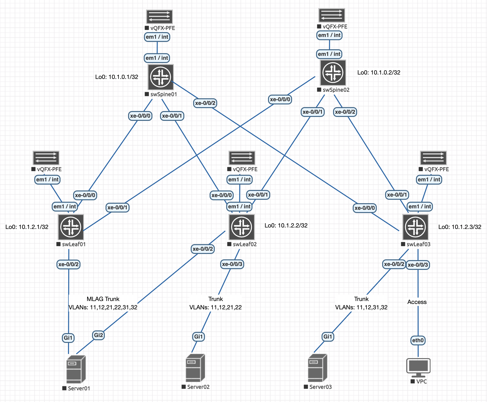

# Lab05: VxLAN. EVPN L2

## Состав работы
- [Условие задачи](#условие-задачи)
- [Особенности виртуализации и подготовка к работе](#особенности-виртуализации-и-подготовка-к-работе)
- [Начальное конфигурирование пары RE-PFE](#начальное-конфигурирование-пары-re-pfe)
    - [Сброс до фабричных настроек](#сброс-до-фабричных-настроек)
    - [Возможные проблемы и их решения](#возможные-проблемы-и-их-решения)
- [Первоначальная настройка фабрики](#первоначальная-настройка-фабрики)
- [Настройка подстилающего слоя (Underlay) с использованием OSPF](#настройка-подстилающего-слоя-underlay-с-использованием-ospf)
- [Замечение относительно MTU](#замечение-относительно-mtu)
- [Настройка наложенной сети (Overlay)](#настройка-наложенной-сети-overlay)
    - [Сторона Spine](#сторона-spine)
    - [Сторона Leaf: глобальная часть](#сторона-leaf-глобальная-часть)
    - [Сторона Leaf: настройка L2VPN-сервисов](#сторона-leaf-настройка-l2vpn-сервисов)
        - [Модель: VLAN-Aware Bundle (VLAN 11 и VLAN 12)](#модель-vlan-aware-bundle-vlan-11-и-vlan-12)

### Условие задачи
В этой самостоятельной работе мы ожидаем, что вы самостоятельно:
- Настроите BGP peering между Leaf и Spine в AF l2vpn evpn
- Настроите связанность между клиентами в первой зоне и убедитесь в её наличии
- Зафиксируете в документации - план работы, адресное пространство, схему сети, конфигурацию устройств

### Особенности виртуализации и подготовка к работе 
Учитывая тот факт, что лабораторные проводятся на EVE-NG, необходимо принимать и митигировать вызовы, связанные с переносом софта (JunOS) под QEMU.

Juniper vQFX — это виртуализированный аналог высокопроизводительных аппаратных коммутаторов Juniper серий QFX (в частности, QFX10000 и QFX5100). Он разработан для моделирования, тестирования и валидации сетевых топологий (включая фабрики Clos, EVPN-VXLAN, eBGP/iBGP-Underlay/Overlay) в виртуальных средах эмуляции, таких как EVE-NG, GNS3 или VMware ESXi.

Основная особенность архитектуры vQFX заключается в её двухнодовой структуре (Twin-VM). В отличие от монолитных виртуальных роутеров (например, vMX), vQFX разделен на две независимые виртуальные машины (ноды): Routing Engine (RE) и Packet Forwarding Engine (PFE). Это полностью повторяет разделение плоскостей управления (Control Plane) и передачи данных (Data Plane) в реальных модульных коммутаторах Juniper.

Разберем компоненты:
- **Компонент управления: vQFX-RE (Routing Engine)**. Виртуальная машина vQFX-RE отвечает за Control Plane (плоскость управления). На ней запущена полноценная операционная система Junos OS (FreeBSD).
    - *Функции*: 
        - Обеспечение работы интерфейса командной строки (CLI) и управление конфигурационным файлом.
        - Запуск протоколов маршрутизации (BGP, OSPF, IS-IS) и построение таблиц маршрутизации (Routing Information Base — RIB).
        - Обработка системных событий, SNMP, политик маршрутизации и генерация таблицы коммутации (Forwarding Information Base — FIB).
    - *Специфика в EVE-NG*: Эта нода предоставляет пользователю доступ к консоли коммутатора. Именно к этой ноде подключаются все внешние для виртуального коммутатора кабели. Порты, выходящие из RE, в интерфейсе EVE-NG обычно обозначаются как eth1, eth2 и т.д., а внутри операционной системы Junos они отображаются как высокоскоростные интерфейсы xe- (10G) или et- (100G).
- **Компонент коммутации: vQFX-PFE (Packet Forwarding Engine)**. Виртуальная машина vQFX-PFE отвечает за Data Plane (плоскость передачи данных). В ней развернута специализированная среда Linux, эмулирующая работу программно-аппаратного комплекса коммутации Juniper.
    - *Функции*:
        - Эмуляция работы кремниевого чипсета (ASIC) Juniper Trio / Q5.
        - Аппаратная (на программном уровне) обработка, инкапсуляция/декапсуляция и продвижение пакетов на основе FIB-таблицы, полученной от RE.
        - Генерация виртуальных сетевых интерфейсов линейной карты (портов данных).
    - *Специфика в EVE-NG*: Не используется для внешнего управления в среде EVE-NG.
- **Межкомпонентное взаимодействие (Внутренняя шина)**. Для синхронизации RE и PFE между ними создается выделенный изолированный канал связи.
    - *Технология туннелирования*: Связь осуществляется через проприетарный внутренний протокол Juniper — RPIO (Routing Engine to Packet Forwarding Engine Input/Output), который инкапсулируется в UDP/IP-туннель (за это отвечает демон rpio_tunnel_br).
    - *Связующие интерфейсы*: В среде EVE-NG для этого строго выделены внутренние порты. На обоих сторонах - это интерфейсы `em1`/`int` (но могут зависеть от среды виртуализации и шаблона).
    - *Адресация*: На интерфейсе `em1` программно закрепляется IP-адрес из диапазона Link-Local (традиционно 169.254.0.2/24). Через этот IP-адрес RE передает на PFE скомпилированную таблицу FIB и конфигурацию портов.
- **Состояние «FPC Online» и инициализация портов**. Поскольку физические порты данных генерируются на стороне PFE, плата управления (RE) изначально ничего не знает об их существовании. Процесс инициализации vQFX выглядит следующим образом:
    1. Загружается операционная система Junos на RE. В этот момент в CLI видны только системные порты (`em0`, `em1`, `fxp0`). В режиме конфигурации порты `xe-` видны как текстовая заготовка, но в операционной системе их нет.
    2. Загружается PFE и через внутренний линк `em1` связывается с RE.
    3. RE распознает PFE как подключенную виртуальную линейную карту (Flexible PIC Concentrator — FPC 0).
    4. При успешном установлении RPIO-туннеля команда `show chassis fpc` возвращает статус `Slot 0 -> Online`.
    5. Только после перехода FPC в состояние `Online` операционная система Junos динамически активирует интерфейсы типа `xe-` или `et-` в CLI (`show interfaces terse`), делая устройство полноценным коммутатором фабрики Clos.

### Начальное конфигурирование пары RE-PFE

**Правила подключения компонентов** (оба виртуальных компонента должны быть выключены для коммутации соединений):
- На vQFX-PFE необходимо выбрать: `em1`/`int`.
- На vQFX-RE выберите: `em1`/`int`.


После этого, запускаем обе ноды и переходим в telnet-соединение к ноде RE.

Произведем полный этап подготовки виртуального маршрутизатора к ручному конфигурированию.

В результате загрузки полуичм системное приглашение:
```
Sun Aug 30 18:46:06 UTC 2026

vqfx-re (ttyd0)

login:
```

Вводим дефолтные аутентификационные параметры: `root`/`Juniper`, после чего попадаем в командную оболочку `csh`:
```
--- JUNOS 20.3R1.8 built 2020-09-21 09:20:04 UTC
root@vqfx-re:RE:0%
```

Фактически мы получаем командную строку FreeBSD. Для перехода в режим управления коммутатором, необходимо использовать интерпрететор `cli`:
```
root@vqfx-re:RE:0% cli
{master:0}
root@vqfx-re>
```

Это основной режим управления коммутатором. Переход в режим конфигурирования осуществляется командой `configure`:
```
root@vqfx-re> configure
Entering configuration mode

{master:0}[edit]
```

Следует отметить, что стартовая конфигурация сильно перегружена сервисом Juniper ZTP (Zero Touch Provisioning), часто вешающей на все интерфейсы DHCP и vendor-id, чтобы коммутатор мог автоматически найти сервер управления при первой загрузке.

Я предпочитаю удалить все ненужные интерфейсы и их настройки, чтобы не путаться:
```
root@swSpine01# wildcard delete interfaces .*
  matched: et-0/0/0
  matched: xe-0/0/0:0
  matched: xe-0/0/0:1
  matched: xe-0/0/0:2
  matched: xe-0/0/0:3
  matched: et-0/0/1
  matched: xe-0/0/1
  matched: xe-0/0/1:0
  ...
Delete 409 objects? [yes,no] (no) yes

{master:0}[edit]
```

установить на интерфейс связи с PFE правильный IP-адрес (он одинаковый для всех инсталляций):
```
root@vqfx-re# set interfaces em1 unit 0 family inet address 169.254.0.2/24
```

установить новый пароль:
```
root@vqfx-re# set system root-authentication plain-text-password
New password: <PASSWORD>
Retype new password: <PASSWORD>

{master:0}[edit]
```

> Пароль должен соответствовать политикам безопасности и должен содержать символы разного регистра, цифры или знаки пунктуации (require change of case, digits or punctuation).

и произвести коммит:
```
root@vqfx-re# commit
configuration check succeeds
commit complete

{master:0}[edit]
```

После этого необоходимо подождать, пока PE и PFE перестроят туннель. И можно проверить связанность:
```
root@vqfx-re# run show arp
MAC Address       Address         Name                      Interface               Flags
50:00:00:01:00:01 169.254.0.1     169.254.0.1               em1.0                   none

{master:0}[edit]

root@vqfx-re# run ping 169.254.0.1
PING 169.254.0.1 (169.254.0.1): 56 data bytes
64 bytes from 169.254.0.1: icmp_seq=0 ttl=64 time=2.824 ms
64 bytes from 169.254.0.1: icmp_seq=1 ttl=64 time=1.422 ms
64 bytes from 169.254.0.1: icmp_seq=2 ttl=64 time=1.293 ms
^C
--- 169.254.0.1 ping statistics ---
3 packets transmitted, 3 packets received, 0% packet loss
round-trip min/avg/max/stddev = 1.293/1.846/2.824/0.693 ms

{master:0}[edit]
```

После этого можно проверить высокоуровневые интерфейсы: список всех линейных карт FPC:
```
root@vqfx-re# run show chassis hardware
Hardware inventory:
Item             Version  Part number  Serial number     Description
Chassis                                08061003465       QFX3500

{master:0}[edit]
```

и слоты:
```
root@vqfx-re# run show chassis fpc
                     Temp  CPU Utilization (%)   CPU Utilization (%)  Memory    Utilization (%)
Slot State            (C)  Total  Interrupt      1min   5min   15min  DRAM (MB) Heap     Buffer
  0  Online           Testing  41         4        0      0      0    1920        0         45
  1  Empty
  2  Empty
  3  Empty
  4  Empty
  5  Empty
  6  Empty
  7  Empty
  8  Empty
  9  Empty

{master:0}[edit]
```

Слот `0` находится в состоянии `Online`, следовательно в режиме мониторинга мы должны будем увидеть "присутствующие" интерфейсы.

```
root@vqfx-re# exit
Exiting configuration mode

{master:0}

root@vqfx-re> show interfaces terse
Interface               Admin Link Proto    Local                 Remote
gr-0/0/0                up    up
pfe-0/0/0               up    up
pfe-0/0/0.16383         up    up   inet
                                   inet6
pfh-0/0/0               up    up
pfh-0/0/0.16383         up    up   inet
pfh-0/0/0.16384         up    up   inet
xe-0/0/0                up    up
xe-0/0/0.16386          up    up
xe-0/0/1                up    up
xe-0/0/1.16386          up    up
xe-0/0/2                up    up
xe-0/0/2.16386          up    up
xe-0/0/3                up    up
xe-0/0/3.16386          up    up
xe-0/0/4                up    up
xe-0/0/4.16386          up    up
xe-0/0/5                up    up
xe-0/0/5.16386          up    up
xe-0/0/6                up    up
xe-0/0/6.16386          up    up
xe-0/0/7                up    up
...
```

Все интерфейсы присутствуют. Можно приступать к дальнейшим действиям.

#### Сброс до фабричных настроек
В случае, если понадобится сброс до "фабричных" настроек, рекомендую выполнить следующие действия:
```
root@vqfx-re:RE:0% cli
{master:0}

root@swSpine01> configure
Entering configuration mode

{master:0}[edit]

root@swSpine01# load factory-default
warning: activating factory configuration

root@swSpine01# commit
[edit]
  'system'
    Missing mandatory statement: 'root-authentication'
error: commit failed: (missing mandatory statements)
```

Операционная система Junos запрещает применять любые изменения (commit), пока этот пароль не будет установлен. Это базовое требование безопасности Juniper.

Чтобы успешно применить конфигурацию, вам нужно сначала задать пароль суперпользователя.
```
root@swSpine01# set system root-authentication plain-text-password
New password:
Retype new password:

{master:0}[edit]
```

После этого возможна перезапись конфигурации:
```
root@swSpine01# commit
configuration check succeeds
Generating DSA key /etc/ssh/ssh_host_dsa_key
Generating public/private dsa key pair.
Your identification has been saved in /config/ssh_host_dsa_key.
Your public key has been saved in /config/ssh_host_dsa_key.pub.
The key fingerprint is:
SHA256:GpLLyRM9Eo9b8aIhTbBS40uO3qDOAnZgl0oz1jUBaQ8 root@swSpine01
The key's randomart image is:
+---[DSA 1024]----+
|  +.o..          |
| o E o           |
|. * B o          |
| % B B o         |
|=.X O B S        |
|+oo= @ =         |
|+...O .          |
|+    .           |
|.o               |
+----[SHA256]-----+

swSpine01 (ttyd0)

login:
```

Можно воспользоваться и рекомендуемым производителем методом через команду контекста управления `request system zeroize`, но в окружении EVE-NG это не является хорошей идеей по следующей причине. В результате такого действия конфигурация будет полностью стерта (как это происходит с аппаратными решениями), но, при этом, в отличии от рекомендованного варианта (load factory-default) не будет скопирован шаблон, оптимизированный для работы в окружении среды виртуализации.

#### Возможные проблемы и их решения
У меня при полном отключении пары RE/PFE, коммутатор Juniper QFX загрузился в режиме подчинённого узла (Linecard) внутри виртуального шасси (Virtual Chassis):
```
root@swLeaf01:LC:1% cli
warning: This chassis is operating in a non-master role as part of a virtual-chassis (VC) system.
warning: Use of interactive commands should be limited to debugging and VC Port operations.
warning: Full CLI access is provided by the Virtual Chassis Master (VC-M) chassis.
warning: The VC-M can be identified through the show virtual-chassis status command executed at this console.
warning: Please logout and log into the VC-M to use CLI.
{linecard:1}
root@swLeaf01>
```

Это происходит потому, что плата коммутации (PFE) пытается связаться с платой управления (RE) по внутренним IP-адресам (128.0.0.16 или 10.0.0.16), но не может до нее достучаться, так как она не успела загрузиться. Из-за этого, виртуальный коммутатор считает себя подчиненным при недоступном VC-M.

На физическом железе, привести в чувство мятежный PFE можно командой:
```
root@swLeaf01> request session member 0
connect to address 128.0.0.16: No route to host
Trying 10.0.0.16...
fpc0: No route to host
```

но для ее срабатывания придется подождать.

Заблокировать переход в режим линейной карты можно, запретив коммутатору работать в данном режиме, передав в режиме конфигурации следующие команды:
```
set virtual-chassis no-split-detection
set virtual-chassis member 0 mastership-priority 255
```

Здесь:
- no-split-detection — отключает алгоритм, который заставляет коммутатор паниковать и уходить в Linecard, если он теряет связь со вторым участником.
- mastership-priority 255 — выставляет максимальный приоритет. Коммутатор всегда будет объявлять себя Мастером, даже если база данных vctopo.db пересоздастся.

После чего будет произведена переинициализация системы (без перезагрузки)):
```
root@swLeaf01# commit and-quit

swLeaf01 (ttyd0)

login:
```

Но следует обратить внимание на то, что в текущей сессии карта может "подключиться" не к слоту 0, например:
```
root@swLeaf01> show chassis fpc
                     Temp  CPU Utilization (%)   CPU Utilization (%)  Memory    Utilization (%)
Slot State            (C)  Total  Interrupt      1min   5min   15min  DRAM (MB) Heap     Buffer
  0  Empty
  1  Online           Testing  56         7        0      0      0    1920        0         44
  2  Empty
  3  Empty
  4  Empty
  5  Empty
  6  Empty
  7  Empty
  8  Empty
  9  Empty
```

что создаст неработоспособную конфигурацию для виртуального коммутатора.

Я вылечил перезагрузкой. Все следующие загрузки системы произведились правильно.

Либо, что является более вандальным вариантом, можно удалить базы, используемые сервисом Virtual Chassis из окружения командного процессора (`start shell`):
```
rm -f /config/vctopo.db
rm -f /var/db/vctopo.db
rm -f /data/config/vctopo.db
```

и произведя перезагрузку PFE:
```
exit && reboot
```

### Первоначальная настройка фабрики
Схема подключений стенда имеет следующий вид:



После удаления интерфейсов, конфигурация приобретает удобное состояние для первоначальной ручной настройки:
```
root@vqfx-re# show
## Last changed: 2026-08-30 19:00:04 UTC
version 20.3R1.8;
system {
    host-name vqfx-re;
    root-authentication {
        encrypted-password "$6$qwIDF/35$sQ8xBVZioJaf8ZkiPqXGYMPURFw2YfrASAoGwgHRK2uPbop5M5HjELmT/JHNrGeNNAo9vCqPNNKgji8oFZNlT."; ## SECRET-DATA
        ssh-rsa "ssh-rsa AAAAB3NzaC1yc2EAAAABIwAAAQEA6NF8iallvQVp22WDkTkyrtvp9eWW6A8YVr+kz4TjGYe7gHzIw+niNltGEFHzD8+v1I2YJ6oXevct1YeS0o9HZyN1Q9qgCgzUFtdOKLv6IedplqoPkcmF0aYet2PkEDo3MlTBckFXPITAMzF8dJSIFo9D8HfdOV0IAdx4O7PtixWKn5y2hMNG0zQPyUecp4pzC6kivAIhyfHilFR61RGL+GPXQ2MWZWFYbAGjyiYJnAmCP3NOTd0jMZEnDkbUvxhMmBYSdETk1rRgm+R4LOzFUGaHqHDLKLX+FIPKcF96hrucXzcWyLbIbEgE98OHlnVYCzRdK8jlqm8tehUc9c9WhQ== vagrant insecure public key"; ## SECRET-DATA
    }
    login {
        user vagrant {
            uid 2000;
            class super-user;
            authentication {
                ssh-rsa "ssh-rsa AAAAB3NzaC1yc2EAAAABIwAAAQEA6NF8iallvQVp22WDkTkyrtvp9eWW6A8YVr+kz4TjGYe7gHzIw+niNltGEFHzD8+v1I2YJ6oXevct1YeS0o9HZyN1Q9qgCgzUFtdOKLv6IedplqoPkcmF0aYet2PkEDo3MlTBckFXPITAMzF8dJSIFo9D8HfdOV0IAdx4O7PtixWKn5y2hMNG0zQPyUecp4pzC6kivAIhyfHilFR61RGL+GPXQ2MWZWFYbAGjyiYJnAmCP3NOTd0jMZEnDkbUvxhMmBYSdETk1rRgm+R4LOzFUGaHqHDLKLX+FIPKcF96hrucXzcWyLbIbEgE98OHlnVYCzRdK8jlqm8tehUc9c9WhQ== vagrant insecure public key"; ## SECRET-DATA
            }
        }
    }
    services {
        ssh {
            root-login allow;
        }
        netconf {
            ssh;
        }
        rest {
            http {
                port 8080;
            }
            enable-explorer;
        }
    }
    syslog {
        user * {
            any emergency;
        }
        file messages {
            any notice;
            authorization info;
        }
        file interactive-commands {
            interactive-commands any;
        }
    }
    extensions {
        providers {
            juniper {
                license-type juniper deployment-scope commercial;
            }
            chef {
                license-type juniper deployment-scope commercial;
            }
        }
    }
}
interfaces {
    em1 {
        unit 0 {
            family inet {
                address 169.254.0.2/24;
            }
        }
    }
}
forwarding-options {
    storm-control-profiles default {
        all;
    }
}
protocols {
    igmp-snooping {
        vlan default;
    }
}
vlans {
    default {
        vlan-id 1;
    }
}

{master:0}[edit]
```

Начнем с настройки коммутатора swSpine01. Настройка остальных коммутаторов во многом аналогична. 

Произведем следующие настройки:
```
set system host-name swSpine01              ! Задаем системное имя устройства
set system domain-name Underlay.local       ! Указываем DNS-домен

set protocols lldp interface all            ! Включаем протокол LLDP
set protocols lldp-med interface all        ! Включаем расширение LLDP-MED

set chassis network-services enhanced-ip    ! Включение оптимизации распределения обработки трафика между PFE и RE
```

В рамках первоначальной настройки нам необходимо настроить интерфейс локальной петли lo0.0, используемой для Underlay-слоя и p2p интерфейсы, являющиеся гранями, соединяющими Spine'ы и Leaf'ы фабрики. Будем использовать на гранях unnumbered с Link-local IPv6 адресом для Inbound-управления.
```
set interfaces lo0.0 family inet address 10.1.0.1/32
set interfaces lo0 description "--- Virtual (no VRF, no VLAN): Underlay Control Plane"
```

Получаем следующую конфигурацию:
```
root@swSpine01# show interfaces lo0
description "--- Virtual (no VRF, no VLAN): Underlay Control Plane";
unit 0 {
    family inet {
        address 10.1.0.1/32;
    }
}
```

Проверим доступность:
```
root@swSpine01# exit
Exiting configuration mode

{master:0}
root@swSpine01> ping 10.1.0.1 count 2
PING 10.1.0.1 (10.1.0.1): 56 data bytes
64 bytes from 10.1.0.1: icmp_seq=0 ttl=64 time=2.599 ms
64 bytes from 10.1.0.1: icmp_seq=1 ttl=64 time=0.628 ms
64 bytes from 10.1.0.1: icmp_seq=2 ttl=64 time=8.534 ms
64 bytes from 10.1.0.1: icmp_seq=3 ttl=64 time=0.757 ms
^C
--- 10.1.0.1 ping statistics ---
4 packets transmitted, 4 packets received, 0% packet loss
round-trip min/avg/max/stddev = 0.628/3.130/8.534/3.216 ms

{master:0}
```

Далее, необходимо настроить интерфейсы `xe0/0/0-2`, участвующие в p2p, включив в них IPv6 link-local адрес (используемых для подключения в случае аварии). Настроим интерфейс `xe-0/0/0`:
```
set interfaces xe-0/0/0 unit 0 family inet unnumbered-address lo0.0 ! Используем адрес lo0 для включения протокола IPv4 и установления OSPF-соседства
set interfaces xe-0/0/0 unit 0 family inet6     ! Включаем протокол IPv6 для генерации Link-local адреса.и использования в рамках In-Band управления
```

а остальные скопируем (также в контексте конфигурирования):
```
copy interfaces xe-0/0/0 to xe-0/0/1
copy interfaces xe-0/0/0 to xe-0/0/2
```

Осталось добавить описания:
```
set interfaces xe-0/0/0 description "--- L3 (no VRF, no VLAN): p2p connection to swLeaf01:xe0/0/0"
set interfaces xe-0/0/1 description "--- L3 (no VRF, no VLAN): p2p connection to swLeaf02:xe0/0/1"
set interfaces xe-0/0/2 description "--- L3 (no VRF, no VLAN): p2p connection to swLeaf02:xe0/0/2"
```

После произведенных действий интерфейсы p2p получат Link-local адреса, но не будет работать сервис Router Advertisement - мы не будем видить соседей, а команда `show ipv6 neighbors` будет иметь нулевой вывод.

Это абсолютно нормальное и стандартное поведение стека IPv6 в Junos. Пока не поступит трафик, интерфейс будет находится в режиме экономии ресурсов и не будет слать фоновые широковещательные NDP-запросы (Neighbor Solicitation). 

Однако, если произвести ping соседа, ядро Junos инициирует его поиск, отправит NDP, на что получит ответ и запишет соседский Link-local адрес в таблицу — после чего show ipv6 neighbors начинает его видеть.

Чтобы заставить коммутатор сразу включить сервис обнаружения, можно либо включить его на конкретном интерфейсе:
```
set protocols router-advertisement interface xe-0/0/0.0
```

либо глобально:
```
set protocols router-advertisement interface all
```

После чего (если настроить и ответные стороны), соседство будет иметь вид, аналогичный следующему:
```
root@swSpine01# run show ipv6 neighbors
IPv6 Address                            Linklayer Address  State       Exp   Rtr  Secure  Interface
fe80::205:86ff:fe71:2103                 02:05:86:71:21:03  stale       410   yes  no      xe-0/0/1.0
fe80::205:86ff:fe71:2a03                 02:05:86:71:2a:03  stale       101   yes  no      xe-0/0/2.0
fe80::205:86ff:fe71:a803                 02:05:86:71:a8:03  stale       569   yes  no      xe-0/0/0.0
Total entries: 3

{master:0}[edit]
```

Теперь в случае расхождения связанности к какому-то коммутатору, можно будет осуществить доступ через его Link-local IPv6-адрес, подключившись, например, следующим образом:
```
root@swSpine02> ssh fe80::205:86ff:fe71:2607
The authenticity of host 'fe80::205:86ff:fe71:2607 (fe80::205:86ff:fe71:2607)' can't be established.
ECDSA key fingerprint is SHA256:tDUQi+3Wvgv8dwZOIVqJNZwi3AzUCF26+Q4JcrBZVB4.
Are you sure you want to continue connecting (yes/no)? yes
Warning: Permanently added 'fe80::205:86ff:fe71:2607' (ECDSA) to the list of known hosts.
Password:
root@swSpine01:RE:0%
```

### Настройка подстилающего слоя (Underlay) с использованием OSPF
Получив связанность между соседями, можно перейти к процессу настройки OSPF.

В операционной системе Junos процессы динамической маршрутизации полностью изолированы от ядра ОС и выполняются в рамках единого модульного демона rpd (Routing Protocol Daemon), который управляет таблицами маршрутизации (RIB) в контексте Control Plane.

В отличие от Cisco IOS/XE, где протоколы маршрутизации исторически выполнялись как отдельные экземпляры в общем пространстве памяти ядра (хоть и изолированные в более поздних архитектурах IOS-XE через субпроцессы), или модульной Arista EOS, где каждый протокол представляет собой независимый агент (например, Rib, Bgp), взаимодействующий через централизованную базу данных состояний SysDB, подход Juniper гарантирует, что сбой в работе одного протокола внутри rpd не дестабилизирует ОС, однако падение самого демона перезапускает всю маршрутизацию целиком.

Ключевое архитектурное отличие Junos заключается в жестком разделении таблиц маршрутизации (inet.0, inet6.0) и таблиц продвижения пакетов (FIB/forwarding-table), при этом программирование линейных карт (PFE) происходит асинхронно через ядро только на основе активных маршрутов, выбранных rpd. Если в Cisco и Arista политики маршрутизации (Route-Maps) применяются динамически «снизу вверх» в процессе обработки апдейтов и конфигурация сразу влияет на RIB, то в Junos механизм policy-options интегрирован на уровне ядра самого rpd как сквозной компилируемый конвейер. Любое изменение импортных или экспортных фильтров требует явной валидации и коммита (commit), после чего rpd атомарно пересчитывает RIB и пушит изменения в FIB, что исключает появление промежуточных аномалий маршрутизации и делает поведение Control Plane в Junos наиболее предсказуемым среди всех трех вендоров.

В операционной системе Junos идентификатор router-id настраивается на уровне `routing-options` и по умолчанию является единым для всех протоколов в рамках конкретной таблицы маршрутизации.

> Однако он не строго глобален для всего устройства, так как может быть изолированно переопределен внутри каждого отдельного экземпляра маршрутизации (`routing-instance`) или точечно изменен в параметрах конкретного протокола (например, через `protocols bgp router-id`). При этом модульный демон `rpd` строго требует уникальности этого значения в пределах одного домена маршрутизации, а в случае отсутствия явной конфигурации автоматически выбирает в качестве `router-id` первичный (primary) IPv4-адрес петлевого интерфейса lo0.0 либо наибольший IP-адрес активного физического порта, без которого запуск OSPF или BGP станет невозможным:
```
set routing-options router-id 10.1.0.1
```

Сама же настройка OSPF достаточно тривиальна:
```
set protocols ospf area 0.0.0.0 interface lo0.0 passive
set protocols ospf area 0.0.0.0 interface xe-0/0/0.0 interface-type p2p
set protocols ospf area 0.0.0.0 interface xe-0/0/1.0 interface-type p2p
set protocols ospf area 0.0.0.0 interface xe-0/0/2.0 interface-type p2p
```

Сразу включим BFD на гранях p2p и установим интервал ожидания в 100 мс, коэффициент удержания (детектор потерь) в 3 потерянных пакета:
```
set protocols ospf area 0.0.0.0 interface xe-0/0/0.0 bfd-liveness-detection minimum-interval 100
set protocols ospf area 0.0.0.0 interface xe-0/0/0.0 bfd-liveness-detection multiplier 3
set protocols ospf area 0.0.0.0 interface xe-0/0/1.0 bfd-liveness-detection minimum-interval 100
set protocols ospf area 0.0.0.0 interface xe-0/0/1.0 bfd-liveness-detection multiplier 3
set protocols ospf area 0.0.0.0 interface xe-0/0/2.0 bfd-liveness-detection minimum-interval 100
set protocols ospf area 0.0.0.0 interface xe-0/0/2.0 bfd-liveness-detection multiplier 3
```

То есть, если в течение 300 мс (3 х 100 мс) от соседа не пришло ни одного BFD-пакета, OSPF-сессия будет мгновенно разорвана.

Из функциональных механизмов осталось настроить ECMP. Он настраивается через политику балансировки:
```
set policy-options policy-statement polECMP then load-balance consistent-hash
```

где:
- **policy-options policy-statement polECMP** — создание или редактирование именованной политики маршрутизации с названием polECMP.
- **then load-balance** — указывает, что при совпадении условий маршрута (в данном случае условий from нет, значит, применяется ко всем), ядро Junos должно включить для этих префиксов режим балансировки трафика по нескольким путям (по умолчанию Junos выбирает только один лучший маршрут для установки в FIB, даже если в RIB их несколько).
- **consistent-hash** — ключевая опция, которая активирует алгоритм согласованного хэширования за счет реализации концепции «Хэш-кольца» (Hash Ring), препятствующей перемешиванию пакетов из разных потоков (out-of-order).

И применяем политику:
```
set routing-options forwarding-table export polECMP
```

Завершим настройку Underlay конфигурацией компонентов безопасности: необходимо защитить OSPF-соседство между Leaf'ами и Spine'ами от подмены маршрутов и несанкционированного подключения сторонних устройств.

В современных сетях и согласно рекомендациям Juniper для безопасности OSPF используют криптографическое хэширование HMAC-SHA-256 (вместо устаревшего и уязвимого MD5). Сама аутентификация настраивается 
в контексте интерфейсов:
```
set protocols ospf area 0.0.0.0 interface xe-0/0/0.0 authentication md5 1 key "P@ssw0rd"
```

> В синтаксисе Junos ключевое слово 'md5' используется как контейнер для всех типов криптографических хэшей, алгоритм SHA-256 активируется автоматически, если длина ключа и синтаксис поддерживают его, либо задается через keychain.

В результате, настройки OSPF будут иметь следующий вид:
```
root@swSpine01> show configuration routing-options
forwarding-table {
    export polECMP;
}
router-id 10.1.0.1;

root@swSpine01> show configuration protocols ospf
area 0.0.0.0 {
    interface lo0.0 {
        passive;
    }
    interface xe-0/0/0.0 {
        interface-type p2p;
        authentication {
            md5 1 key "$9$l0ue8x7NVY4Z-V5F3nCAvWLX7V"; ## SECRET-DATA
        }
        bfd-liveness-detection {
            minimum-interval 100;
            multiplier 3;
        }
    }
    interface xe-0/0/1.0 {
        interface-type p2p;
        authentication {
            md5 1 key "$9$FyNL3Cpu01hyKO1b2g4ZG69Atu1"; ## SECRET-DATA
        }
        bfd-liveness-detection {
            minimum-interval 100;
            multiplier 3;
        }
    }
    interface xe-0/0/2.0 {
        interface-type p2p;
        authentication {
            md5 1 key "$9$f53/9CpBRSAp7Vbwg4QFn69p"; ## SECRET-DATA
        }
        bfd-liveness-detection {
            minimum-interval 100;
            multiplier 3;
        }
    }
}
```

Распространим данные настройки на остальные коммутаторы фабрики.

Проверим соседство:
```
root@swSpine01> show ospf neighbor
Address          Interface              State           ID               Pri  Dead
10.1.2.1         xe-0/0/0.0             Full            10.1.2.1         128    34
10.1.2.2         xe-0/0/1.0             Full            10.1.2.2         128    32
10.1.2.3         xe-0/0/2.0             Full            10.1.2.3         128    39
```

базу данных OSPF:
```
root@swSpine01> show ospf database

    OSPF database, Area 0.0.0.0
 Type       ID               Adv Rtr           Seq      Age  Opt  Cksum  Len
Router  *10.1.0.1         10.1.0.1         0x80000732    51  0x22 0xc805  72
Router   10.1.0.2         10.1.0.2         0x8000066a    27  0x22 0x553e  72
Router   10.1.2.1         10.1.2.1         0x8000032f    26  0x22 0x84a8  60
Router   10.1.2.2         10.1.2.2         0x8000059a    56  0x22 0xa11b  60
Router   10.1.2.3         10.1.2.3         0x80000537   235  0x22 0x62ba  60
```

и полученные маршруты:
```
root@swSpine01> show ospf route
Topology default Route Table:

Prefix             Path  Route      NH       Metric NextHop       Nexthop
                   Type  Type       Type            Interface     Address/LSP
10.1.0.2           Intra Router     IP            2 xe-0/0/0.0    10.1.2.1
                                                    xe-0/0/1.0    10.1.2.2
                                                    xe-0/0/2.0    10.1.2.3
10.1.2.1           Intra Router     IP            1 xe-0/0/0.0    10.1.2.1
10.1.2.2           Intra Router     IP            1 xe-0/0/1.0    10.1.2.2
10.1.2.3           Intra Router     IP            1 xe-0/0/2.0    10.1.2.3
10.1.0.1/32        Intra Network    IP            0 lo0.0
10.1.0.2/32        Intra Network    IP            2 xe-0/0/0.0    10.1.2.1
                                                    xe-0/0/1.0    10.1.2.2
                                                    xe-0/0/2.0    10.1.2.3
10.1.2.1/32        Intra Network    IP            1 xe-0/0/0.0    10.1.2.1
10.1.2.2/32        Intra Network    IP            1 xe-0/0/1.0    10.1.2.2
10.1.2.3/32        Intra Network    IP            1 xe-0/0/2.0    10.1.2.3
```

RIB-таблицу:
```
root@swSpine01> show route

inet.0: 8 destinations, 11 routes (8 active, 0 holddown, 0 hidden)
@ = Routing Use Only, # = Forwarding Use Only
+ = Active Route, - = Last Active, * = Both

10.1.0.1/32        *[Direct/0] 04:48:18
                    >  via lo0.0
10.1.0.2/32        *[OSPF/10] 00:00:04, metric 2
                       to 10.1.2.2 via xe-0/0/1.0
                    >  to 10.1.2.3 via xe-0/0/2.0
10.1.2.1/32        @[OSPF/10] 00:00:04, metric 3
                       to 10.1.2.2 via xe-0/0/1.0
                    >  to 10.1.2.3 via xe-0/0/2.0
                   #[Direct/0] 00:00:04, metric 1
                    >  to 10.1.2.1 via xe-0/0/0.0
10.1.2.2/32        @[OSPF/10] 00:02:45, metric 1
                    >  to 10.1.2.2 via xe-0/0/1.0
                   #[Direct/0] 00:02:50, metric 1
                    >  to 10.1.2.2 via xe-0/0/1.0
10.1.2.3/32        @[OSPF/10] 00:05:56, metric 1
                    >  to 10.1.2.3 via xe-0/0/2.0
                   #[Direct/0] 00:06:02, metric 1
                    >  to 10.1.2.3 via xe-0/0/2.0
169.254.0.0/24     *[Direct/0] 04:48:18
                    >  via em1.0
169.254.0.2/32     *[Local/0] 04:48:18
                       Local via em1.0
224.0.0.5/32       *[OSPF/10] 04:48:23, metric 1
                       MultiRecv

inet6.0: 5 destinations, 5 routes (5 active, 0 holddown, 0 hidden)
+ = Active Route, - = Last Active, * = Both

fe80::205:860f:fc71:8100/128
                   *[Direct/0] 04:48:18
                    >  via lo0.0
fe80::205:86ff:fe71:8103/128
                   *[Local/0] 01:12:52
                       Local via xe-0/0/0.0
fe80::205:86ff:fe71:8107/128
                   *[Local/0] 01:12:25
                       Local via xe-0/0/1.0
fe80::205:86ff:fe71:810b/128
                   *[Local/0] 01:12:25
                       Local via xe-0/0/2.0
ff02::2/128        *[INET6/0] 04:48:22
                       MultiRecv
```

И связанность со всеми коммутаторами фабрики:
```
root@swSpine01> ping count 2 10.1.0.2
PING 10.1.0.2 (10.1.0.2): 56 data bytes
64 bytes from 10.1.0.2: icmp_seq=0 ttl=63 time=341.089 ms
64 bytes from 10.1.0.2: icmp_seq=1 ttl=63 time=382.863 ms

--- 10.1.0.2 ping statistics ---
2 packets transmitted, 2 packets received, 0% packet loss
round-trip min/avg/max/stddev = 341.089/361.976/382.863/20.887 ms

{master:0}
root@swSpine01> ping count 2 10.1.2.1
PING 10.1.2.1 (10.1.2.1): 56 data bytes
64 bytes from 10.1.2.1: icmp_seq=0 ttl=64 time=294.359 ms
64 bytes from 10.1.2.1: icmp_seq=1 ttl=64 time=212.573 ms

--- 10.1.2.1 ping statistics ---
2 packets transmitted, 2 packets received, 0% packet loss
round-trip min/avg/max/stddev = 212.573/253.466/294.359/40.893 ms

{master:0}
root@swSpine01> ping count 2 10.1.2.2
PING 10.1.2.2 (10.1.2.2): 56 data bytes
64 bytes from 10.1.2.2: icmp_seq=0 ttl=64 time=186.610 ms
64 bytes from 10.1.2.2: icmp_seq=1 ttl=64 time=336.032 ms

--- 10.1.2.2 ping statistics ---
2 packets transmitted, 2 packets received, 0% packet loss
round-trip min/avg/max/stddev = 186.610/261.321/336.032/74.711 ms

{master:0}
root@swSpine01> ping count 2 10.1.2.3
PING 10.1.2.3 (10.1.2.3): 56 data bytes
64 bytes from 10.1.2.3: icmp_seq=0 ttl=64 time=662.174 ms
64 bytes from 10.1.2.3: icmp_seq=1 ttl=64 time=375.978 ms

--- 10.1.2.3 ping statistics ---
2 packets transmitted, 2 packets received, 0% packet loss
round-trip min/avg/max/stddev = 375.978/519.076/662.174/143.098 ms

{master:0}
```

Дополнительно просмотрим информацию о работе BFD:
```
root@swSpine01> show bfd session
                                                  Detect   Transmit
Address                  State     Interface      Time     Interval  Multiplier
10.1.2.1                 Up        xe-0/0/0.0     6.000     2.000        3
10.1.2.2                 Up        xe-0/0/1.0     0.300     0.100        3
10.1.2.3                 Up        xe-0/0/2.0     0.300     0.100        3

3 sessions, 3 clients
Cumulative transmit rate 20.5 pps, cumulative receive rate 20.5 pps
```

На этом Underlay можно считать настроенным.

### Замечение относительно MTU
Перед тем, как перейти к настройке оверлея, необходимо уделить особое внимание параметрам MTU, используемым на интерфейсах граней фабрики.

Инкапсуляция VXLAN добавляет к каждому пакету ровно 50 байт оверхеда (заголовки сокетов UDP, VXLAN и внешний IP-заголовок). Если клиент внутри сети отправит стандартный пакет размером 1500 байт, Leaf-коммутатор упакует его в VXLAN, и на Spine полетит кадр размером уже 1550 байт и, по-умолчанию, будет отфильтрован.

Однако, промышленным стандартом, используемым в дата-центрах являются большие пакеты - «Jumbo Frames», 
позволяющие существенно экономить полосу пропускания.

Рекомендуемой настройкой интерфейса, в общем случае, является следующий:
```
set interfaces xe-0/0/0 mtu 9216
set interfaces xe-0/0/0 unit 0 family inet mtu 9000
set interfaces xe-0/0/0 unit 0 family inet6 mtu 1470
```

где:
- **set interfaces xe-0/0/0 mtu 9216** — это L2 MTU (Media MTU). Он определяет максимальный размер всего Ethernet-кадра, включая заголовки L2, который физический порт способен отправить или принять.
- **set interfaces xe-0/0/0 unit 0 family inet mtu 9000** — это L3 MTU (Protocol MTU). Он определяет максимальный размер IPv4-пакета (полезной нагрузки внутри Ethernet-кадра).
- **set interfaces xe-0/0/0 unit 0 family inet6 mtu 1472** - L3 MTU для In-Band операций. У меня не получилось достичь полной работоспособности фабрике с большими пакетами, поэтому я оставил самую самую большую длину пакетов, которая у меня протискивалась между виртуальными коммутаторами.

> IPv6 стек у меня не используется для построения Underlay и не влият на процессы передачи клиентского трафика в лабораторной среде.

Гипервизор ESXi получил следующие настройки:
```ssh
[root@hstLAB01:~] esxcli network vswitch standard set -m 9000 -v vSwitch0
[root@hstLAB01:~] esxcli network ip interface set -m 9000 -i vmk0
```

На стороне EVE-NG были сделаны следующие настройки:
```
cp /opt/unetlab/html/includes/config.php.distribution /opt/unetlab/html/includes/config.php
```

и конфигурационный файл была добавлена строка
```php
$TEMPLATE_MTU = 9216;
```

После чего расширены все линки:
```
root@vmEVE-NG:~# for i in $(ls /sys/class/net/); do ip link set dev $i mtu 9000 2>/dev/null; done
```

Что обеспечило связанность между EVE-NG и ESXi:
```
root@vmEVE-NG:~# ping -M do -s 8972 10.1.10.11
PING 10.1.10.11 (10.1.10.11) 8972(9000) bytes of data.
8980 bytes from 10.1.10.11: icmp_seq=1 ttl=64 time=0.193 ms
8980 bytes from 10.1.10.11: icmp_seq=2 ttl=64 time=0.222 ms
8980 bytes from 10.1.10.11: icmp_seq=3 ttl=64 time=0.133 ms
^C
--- 10.1.10.11 ping statistics ---
3 packets transmitted, 3 received, 0% packet loss, time 2056ms
rtt min/avg/max/mdev = 0.133/0.182/0.222/0.037 ms
```

Но это так и не привело к полноценной работе эмулятора.

### Настройка наложенной сети (Overlay)
Буду использовать архитектуру iBGP Full-Mesh с Route Reflector (RR) на Spine-коммутаторах для организации Overlay Control Plane.

Поскольку Spine не терминирует VxLAN на своих интерфейсах, а лишь продвигает через себя трафик, на нем настраивается только MP-iBGP в роли Route Reflector для передачи EVPN NLRIs между петлевыми интерфейсами Leaf'ов.

#### Сторона Spine
Настройку начинаем на стороне swSpine01. Задам ASN и определю группу:
```
set routing-options autonomous-system 65000
set protocols bgp group Leafs type internal
```

В Junos исторически рекомендуется указывать в качестве источника (source) соединений соседства непосредственно IP-адрес локальной петли, а не название интерфейса через опцию `local-interface`, так как она заставляет BGP-процесс (rpd) пытаться отправить пакеты непосредственно из подсети этого интерфейса, ожидая увидеть соседа в том же L2-домене (как в классическом eBGP на физических стыках). Поскольку lo0.0 — это виртуальная петля, у которой нет физического бродкаст-домена, BGP-сессия между /32 адресами через OSPF просто не сможет инициировать TCP-соедство и зависнет в статусе `Active` или `Idle`.

Соответствующая настройка:
```
set protocols bgp group Leafs local-address 10.1.0.1
```

Включим требуемую сигнализацию:
```
set protocols bgp group Leafs family evpn signaling
```

В оверлее family evpn signaling отвечает за передачу следующих ключевых данных:
- Поиск соседей (VTEP Discovery): Коммутаторы Leaf сигнализируют Spine-серверу о своем существовании. spine транслирует это остальным лифам, благодаря чему они автоматически строят VXLAN-туннели «каждый с каждым» (маршруты EVPN Type 3 / IMET).
- Синхронизация MAC и IP клиентов: Когда к swLeaf01 подключается сервер, коммутатор узнает его MAC-адрес и сигнализирует об этом по BGP всем остальным участникам фабрики (маршруты EVPN Type 2).
- Передача параметров инкапсуляции: Внутри BGP-сообщений передаются специальные атрибуты (Extended Communities), которые указывают тип инкапсуляции (в вашем случае — VXLAN) и номер виртуальной сети (VNI).

На оборудовании Juniper используется весьма специфическая команда для настройки отражателя маршрутов:
```
set protocols bgp group Leafs cluster 10.1.0.1
```

где в качестве параметра `Cluster ID`, Juniper рекомендует задавать адрес лупбэк-интерфейса, на котором строится iBGP-соседство. Этот идентификатор используется для предотвращения образования петель:
- Когда Spine отражает BGP-апдейт (маршруты EVPN Type-2, Type-3 и др.), он принудительно добавляет к нему необязательный транзитивный атрибут `CLUSTER_LIST` и записывает туда свой `Cluster ID` (`10.1.0.1`).
- Если в топологии есть другие Spine'ы или если маршрут каким-то образом возвращается назад, коммутатор, получив BGP Update, проверяет поле `CLUSTER_LIST`.
- Если он видит в этом списке свой собственный `Cluster ID` (`10.1.0.1`), он понимает, что этот пакет он уже когда-то обрабатывал и маршрут мгновенно отбрасывается.

Осталось произвести настройку соседей:
```
set protocols bgp group Leafs neighbor 10.1.2.1
set protocols bgp group Leafs neighbor 10.1.2.2
set protocols bgp group Leafs neighbor 10.1.2.3
```

Итоговая конфигурация выглядит следующим образом:
```
set routing-options autonomous-system 65000
set protocols bgp group Leafs type internal
set protocols bgp group Leafs local-address 10.1.0.1
set protocols bgp group Leafs family evpn signaling
set protocols bgp group Leafs cluster 10.1.0.1
set protocols bgp group Leafs neighbor 10.1.2.1
set protocols bgp group Leafs neighbor 10.1.2.2
set protocols bgp group Leafs neighbor 10.1.2.3
```

После коммита можно проверить работоспособность протокола и состояние соседей:
```
root@swSpine01> show bgp summary
Threading mode: BGP I/O
Default eBGP mode: advertise - accept, receive - accept
Groups: 1 Peers: 3 Down peers: 3
Table          Tot Paths  Act Paths Suppressed    History Damp State    Pending
bgp.evpn.0
                       0          0          0          0          0          0
Peer                     AS      InPkt     OutPkt    OutQ   Flaps Last Up/Dwn State|#Active/Received/Accepted/Damped...
10.1.2.1              65000          0          0       0       0          10 Active
10.1.2.2              65000          0          0       0       0          10 Active
10.1.2.3              65000          0          0       0       0          10 Active
```

#### Сторона Leaf: глобальная часть
Переходим на сторону swLeaf01. Первая часть настроек аналогична настройкам Spine'а:
```
set routing-options autonomous-system 65000
set protocols bgp group Spines type internal
set protocols bgp group Spines family evpn signaling
set protocols bgp group Spines neighbor 10.1.0.1
set protocols bgp group Spines neighbor 10.1.0.2
```

Уже на этой стадии мы сможем запустить BGP и проверить состояние соседства:
```
root@swLeaf01> show bgp summary
Threading mode: BGP I/O
Default eBGP mode: advertise - accept, receive - accept
Groups: 1 Peers: 2 Down peers: 0
Table          Tot Paths  Act Paths Suppressed    History Damp State    Pending
bgp.evpn.0
                       0          0          0          0          0          0
Peer                     AS      InPkt     OutPkt    OutQ   Flaps Last Up/Dwn State|#Active/Received/Accepted/Damped...
10.1.0.1              65000          7          7       0       0        2:42 Establ
  bgp.evpn.0: 0/0/0/0
10.1.0.2              65000          7          6       0       0        2:38 Establ
  bgp.evpn.0: 0/0/0/0
```

На стороне swSpine01 также произойдут изменения, связанные с настраиваемым Leaf'ом:
```
root@swSpine01> show bgp summary
Threading mode: BGP I/O
Default eBGP mode: advertise - accept, receive - accept
Groups: 1 Peers: 3 Down peers: 2
Table          Tot Paths  Act Paths Suppressed    History Damp State    Pending
bgp.evpn.0
                       0          0          0          0          0          0
Peer                     AS      InPkt     OutPkt    OutQ   Flaps Last Up/Dwn State|#Active/Received/Accepted/Damped...
10.1.2.1              65000          8          6       0       0        2:32 Establ
  bgp.evpn.0: 0/0/0/0
10.1.2.2              65000          0          0       0       0       19:05 Active
10.1.2.3              65000          0          0       0       0       19:05 Active
```

#### Сторона Leaf: настройка L2VPN-сервисов
Процесс конфигурирования намеренно разделен на два этапа, поскольку именно на текущем шаге реализуется ключевая логика взаимодействия плоскости управления MP-BGP EVPN (Control Plane) и плоскости передачи данных VxLAN (Data Plane).

Для детального понимания принципов конфигурирования необходимо предварительно рассмотреть общую концепцию построения оверлейных сетей VxLAN (Virtual Extensible LAN). Вне зависимости от уровня организуемых сетевых сервисов (L2/L3 VPN), базовая сегментация и изоляция трафика осуществляется с помощью классического механизма VRF (Virtual Routing and Forwarding). Этот подход исторически интегрирован в протокол MP-BGP (Multiprotocol BGP) со времен представления архитектуры MPLS, где предоставление сервисов L3VPN и L2VPN является стандартным и проверенным решением.

В современной архитектуре Junos OS для разделения Layer 2 и Layer 3 функций оверлея используется комбинированная двухкомпонентная модель: 
- **Для Layer 2 (Bridging)**: отвечает исключительно за логическое разделение таблиц MAC-адресов клиентов и привязку L2 VNI (VxLAN Network Identifier). Использует тип `mac-vrf`.
- **Для Layer 3 (Routing)**: межсегментная маршрутизация (Inter-Subnet Routing) реализуется через интеграцию с интерфейсами IRB (Integrated Routing and Bridging). Интерфейсы IRB терминируются в стандартном сервисном экземпляре `instance-type vrf`.

Тем не менее специфика построения современных IP-фабрик (IP Clos) потребовала адаптации этих технологий, что привело к появлению различных моделей сетевых сервисов (Service Models) в рамках L2VPN-сервиса, состав и специфика реализации которых зависят от конкретного вендора. В частности, на коммутаторах линейки QFX/PTX под управлением Junos OS поддерживаютсят следующие типы моделей сервисов для EVPN-VXLAN:
- **VLAN-Based Service**: Каждому широковещательному L2-домену (VLAN) соответствует выделенный экземпляр EVPN-инстанса (EVI) и уникальный идентификатор VNI (один VLAN, один EVI, один VNI). Механизм, используемый компанией Cisco Systems. Его особенности:
    - *Простота траблшутинга*: Каждый широковещательный домен полностью изолирован на уровне плоскости управления (Control Plane). Обновление или сбой в одном VLAN никак не аффектит соседние.
    - *Высокое потребление ресурсов*: Поскольку для каждого VLAN генерируется собственный экземпляр EVI и уникальный набор RD (Route Distinguisher) / RT (Route Target), модель создает максимальную нагрузку на процессор управления (RE) и протокол MP-BGP при большом количестве VLAN.
    - *Сценарий применения*: Небольшие и средние дата-центры (обычно до 100–200 VLAN), где требуется максимальная изоляция и простота конфигурации.
- **VLAN-Bundle Service**: Несколько виртуальных сетей (VLAN) объединяются в рамках одного EVPN-инстанса, используя общую таблицу MAC-адресов. Соответствие «многие ко одному». Несколько физических или логических VLAN агрегируются внутри одного EVPN-инстанса (EVI) и инкапсулируются в один общий VNI.
    - *Единое пространство MAC-адресов*: Коммутатор строит одну общую таблицу MAC-адресов для всех VLAN, входящих в бандл. Это означает, что пересечение MAC-адресов в разных VLAN недопустимо (возможен флэппинг и некорректная коммутация).
    - *Экономия ресурсов Control Plane*: Модель максимально разгружает MP-BGP, так как для группы сетей генерируется всего один набор маршрутов EVPN Type 3 (Inclusive Multicast) и общие RD/RT.
    - *Неэффективное использование полосы*: Служебный трафик (BUM), пришедший в один VLAN, будет транслироваться во все VLAN данного бандла на удаленных VTEP, создавая избыточную нагрузку на фабрику.
    - *Сценарий применения*: Специфические топологии операторов связи или миграция старых legacy-сетей, где необходимо прозрачно пробросить группу тегированных VLAN между двумя точками без детального разбора заголовков.
- **VLAN-Aware Bundle Service**: Позволяет агрегировать несколько VLAN в один EVPN-инстанс (EVI), но с сохранением логической изоляции таблиц MAC-адресов для каждого VLAN за счет использования индивидуальных VNI. Это наиболее масштабируемая и рекомендуемая Juniper модель для архитектуры MAC-VRF.
    - *Изоляция таблиц MAC-адресов*: Несмотря на то, что конфигурация находится в рамках одного инстанса, таблицы MAC-адресов логически разделены для каждого VLAN. Допускается использование одинаковых MAC-адресов в разных VLAN (пересечение пространств арендаторов).
    - *Идеальный баланс масштабирования*: Нагрузка на Control Plane минимизирована: для сотен VLAN используется один процесс BGP-сессии (один EVI), но трафик инкапсулируется точечно в разные туннели (разные VNI).
    - *Сценарий применения*: Крупные enterprise-сети и облачные дата-центры с высокой плотностью VLAN, где критически важна экономия аппаратных ресурсов коммутаторов (TCAM/памяти) и поддержка multi-tenancy.

Иными словами, необходимо понимать, что сервисы, которыми мы будем оперировать потребуют настройки VRF-aware модели, реализуемой, в случае Junos, через механизм экземпляра процесса маршрутизации. Если говорить фундаментально, инстанс (routing-instance) — это виртуальный маршрутизатор/коммутатор внутри одного физического устройства. Это способ разделить один железный коммутатор на несколько полностью изолированных друг от друга логических контекстов. У каждого инстанса своя собственная таблица маршрутизации (RIB), своя таблица коммутации (MAC-таблица), свои интерфейсы и свои процессы протоколов.

Я хочу рассмотреть все модели сервисов L2VPN. Так как виртуальный коммутатор использует старый синтаксис задания модели сервиса, я хочу свести некоторые особенности в таблицу:

*Таблица 1. Специфика настройки модели сервиса L2VPN*

| **Характеристика** | **VLAN-Based** | **VLAN Bundle** | **VLAN-Aware Bundle** |
|--------------------|-----------------------|-----------------------|-----------------------|
| **Новый синтаксис**: `mac-vrf`| `service-type vlan-based` | `service-type vlan-bundle` | `service-type vlan-aware` |
| **Старый синтаксис**: `<>` | evpn | evpn | virtual-switch |
| Таблицы MAC | Изолированные (1 на VLAN) | Одна общая на весь инстанс |  весь инстансИзолированные (1 на bridge-domain) |
| **Масштабируемость** | Низкая (много инстансов) | Высокая | Высокая (рекомендуется) |
| **Поддержка L3 (IRB)** | Да | Нет | Да |

##### Модель: VLAN-Aware Bundle (VLAN 11 и VLAN 12)
Начну с модели VLAN-Aware, так как она является рекомендуемой производителем оборудования. Учитывая мое желание сконфигурировать разные модели сервисов, дальнейшие действия я буду проводить в отдельных экземплярах:
```
set routing-instances eviVLANAWARE instance-type virtual-switch

set routing-instances eviVLANAWARE interface xe-0/0/2.0                ! Привязывем все связанные клиентские порты к экземпляру

set routing-instances eviVLANAWARE route-distinguisher 10.1.2.1:10
set routing-instances eviVLANAWARE vrf-target target:65000:10010

set routing-instances eviVLANAWARE vtep-source-interface lo0.0
set routing-instances eviVLANAWARE protocols evpn encapsulation vxlan
set routing-instances eviVLANAWARE protocols evpn extended-vni-list all

set routing-instances eviVLANAWARE vlans VLANAWARE01 vlan-id 11
set routing-instances eviVLANAWARE vlans VLANAWARE01 vxlan vni 10011
set routing-instances eviVLANAWARE vlans VLANAWARE02 vlan-id 12
set routing-instances eviVLANAWARE vlans VLANAWARE02 vxlan vni 10012
```

Эти VLAN будут находиться в таблице соответствующего виртуального коммутатора (`eviVLANAWARE`), что мы увидим немного ниже. 

Конфигурируем интерфейс подключения из учета единственного линка (Gi1 <-> XE-0/0/2):
```
set interfaces xe-0/0/2 unit 0 family ethernet-switching interface-mode trunk
set interfaces xe-0/0/2 unit 0 family ethernet-switching vlan members 11-12
```

> Следует отметить, что режим виртуального коммутатора `unit 0 family ethernet-switching` поддерживается только в юните `unit 0`.

Проверим ARP-таблицы:
```
root@swLeaf01> show vlans

Routing instance        VLAN name             Tag          Interfaces
default-switch          MGMT                  100

eviVLANAWARE            VLANAWARE01           11
                                                           vtep.32769*
                                                           vtep.32770*
                                                           xe-0/0/2.0*
eviVLANAWARE            VLANAWARE02           12
                                                           vtep.32769*
                                                           vtep.32770*
                                                           xe-0/0/2.0*
```

Благодаря этому выводу видно, что во время конфигурирования экземпляра маршрутизации (`eviVLANAWARE`) были косвенно создали и соответствующие VLAN'ы. Созданный ранее VLAN 100 находится в виртуальном коммутаторе `default-switch` и даже в определении не пересекается с VLAN'ами других виртуальных коммутаторов.

Если сейчас проверить базу EVPN (`show evpn database`) - она будет пустой, но работоспособность экземпляра маршрутизации мы сможем увидеть по контекстной подсказке:
```
root@swLeaf01> show route table ?
Possible completions:
  <table>              Name of routing table
  :vxlan.inet.0
  bgp.evpn.0
  eviVLANAWARE.evpn.0
  inet.0
  inet6.0
```

Это дает нам возможность увидеть состояние таблицы экземпляра:
```
root@swLeaf01> show route table bgp.evpn.0

bgp.evpn.0: 2 destinations, 2 routes (2 active, 0 holddown, 0 hidden)
+ = Active Route, - = Last Active, * = Both

3:10.1.2.1:10::10011::10.1.2.1/248 IM
                   *[EVPN/170] 00:01:13
                       Indirect
3:10.1.2.1:10::10012::10.1.2.1/248 IM
                   *[EVPN/170] 00:01:13
                       Indirect
```

и даже посмотреть, какую маршрутную информацию коммутатор swLeaf01 анонсирует, например, в сторону коммутатора swSpine01:
```
root@swLeaf01> show route advertising-protocol bgp 10.1.0.1

bgp.evpn.0: 2 destinations, 2 routes (2 active, 0 holddown, 0 hidden)
  Prefix		  Nexthop	       MED     Lclpref    AS path
  3:10.1.2.1:10::10011::10.1.2.1/248 IM
*                         Self                         100        I
  3:10.1.2.1:10::10012::10.1.2.1/248 IM
*                         Self                         100        I

eviVLANAWARE.evpn.0: 2 destinations, 2 routes (2 active, 0 holddown, 0 hidden)
  Prefix		  Nexthop	       MED     Lclpref    AS path
  3:10.1.2.1:10::10011::10.1.2.1/248 IM
*                         Self                         100        I
  3:10.1.2.1:10::10012::10.1.2.1/248 IM
*                         Self                         100        I
```

Сейчас это маршруты EVPN типа 3, (Type 3 Route), называемые IMET (Inclusive Multicast Ethernet Tag) и, если упрощенно, являются "автоматическими строителями" VxLAN-туннелей (VTEP-to-VTEP).

У нас в качестве сервера выступает Cisco IOS роутер. Сконфигурируем его следующим образом:
```
hostname Server01
!
ip domain name local
!
interface GigabitEthernet1
 description --- Trunk (VLAN100): Connection to swLeaf01:XE-0/0/2
 no ip address
 load-interval 60
 negotiation auto
 no mop enabled
 no mop sysid
!
interface GigabitEthernet1.11
 description --- Virtual (VLAN011): VLANAWARE01
 encapsulation dot1Q 11
 ip address 192.168.11.1 255.255.255.0
!
interface GigabitEthernet1.12
 description --- Virtual (VLAN012): VLANAWARE02
 encapsulation dot1Q 12
 ip address 192.168.12.1 255.255.255.0
```

Как только мы настроили его и подняли интерфейс `Gi1`, подсистема EVPN изучит MAC-адреса клиентов (если они не Silent Host):
```
root@swLeaf01> show evpn database
Instance: eviVLANAWARE
VLAN  DomainId  MAC address        Active source                  Timestamp        IP address
     10011      50:00:00:0f:00:00  xe-0/0/2.0                     Sep 13 09:25:08  192.168.11.1
     10012      50:00:00:0f:00:00  xe-0/0/2.0                     Sep 13 09:25:16  192.168.12.1
```

внесет в таблицу экземпляра в виде маршрутов типа 2. Маршрут EVPN Типа 2 (Type 2 Route) называется MAC/IP Advertisement Route. Если маршруты 3-го типа (IMET) строят сами туннели между свитчами, то маршрут 2-го типа наполняет их смыслом — он анонсирует в BGP конкретные MAC-адреса хостов:
```
root@swLeaf01> show route table bgp.evpn.0

bgp.evpn.0: 6 destinations, 6 routes (6 active, 0 holddown, 0 hidden)
+ = Active Route, - = Last Active, * = Both

2:10.1.2.1:10::10011::50:00:00:0f:00:00/304 MAC/IP
                   *[EVPN/170] 00:01:38
                       Indirect
2:10.1.2.1:10::10012::50:00:00:0f:00:00/304 MAC/IP
                   *[EVPN/170] 00:01:29
                       Indirect
2:10.1.2.1:10::10011::50:00:00:0f:00:00::192.168.11.1/304 MAC/IP
                   *[EVPN/170] 00:01:37
                       Indirect
2:10.1.2.1:10::10012::50:00:00:0f:00:00::192.168.12.1/304 MAC/IP
                   *[EVPN/170] 00:01:29
                       Indirect
3:10.1.2.1:10::10011::10.1.2.1/248 IM
                   *[EVPN/170] 00:18:51
                       Indirect
3:10.1.2.1:10::10012::10.1.2.1/248 IM
                   *[EVPN/170] 00:18:51
                       Indirect
```

Теперь увидеть изученные MAC-адреса мы сможем в базе EVPN:
```
root@swLeaf02> show evpn database
Instance: eviVLANAWARE
VLAN  DomainId  MAC address        Active source                  Timestamp        IP address
     10011      50:00:00:0f:00:00  10.1.2.1                       Sep 13 09:37:52  192.168.11.1
     10012      50:00:00:0f:00:00  10.1.2.1                       Sep 13 09:37:52  192.168.12.1
```

Посмотрим со стороны другого Leaf'а, что приходит ему от Spine'а:
```
root@swLeaf02> show route receive-protocol bgp 10.1.0.1

inet.0: 8 destinations, 10 routes (8 active, 0 holddown, 0 hidden)

:vxlan.inet.0: 4 destinations, 4 routes (4 active, 0 holddown, 0 hidden)

inet6.0: 4 destinations, 4 routes (4 active, 0 holddown, 0 hidden)

bgp.evpn.0: 8 destinations, 14 routes (8 active, 0 holddown, 0 hidden)
  Prefix		  Nexthop	       MED     Lclpref    AS path
  2:10.1.2.1:10::10011::50:00:00:0f:00:00/304 MAC/IP
*                         10.1.2.1                     100        I
  2:10.1.2.1:10::10012::50:00:00:0f:00:00/304 MAC/IP
*                         10.1.2.1                     100        I
  2:10.1.2.1:10::10011::50:00:00:0f:00:00::192.168.11.1/304 MAC/IP
*                         10.1.2.1                     100        I
  2:10.1.2.1:10::10012::50:00:00:0f:00:00::192.168.12.1/304 MAC/IP
*                         10.1.2.1                     100        I
  3:10.1.2.1:10::10011::10.1.2.1/248 IM
*                         10.1.2.1                     100        I
  3:10.1.2.1:10::10012::10.1.2.1/248 IM
*                         10.1.2.1                     100        I

eviVLANAWARE.evpn.0: 8 destinations, 14 routes (8 active, 0 holddown, 0 hidden)
  Prefix                  Nexthop              MED     Lclpref    AS path
  2:10.1.2.1:10::10011::50:00:00:0f:00:00/304 MAC/IP
*                         10.1.2.1                     100        I
  2:10.1.2.1:10::10012::50:00:00:0f:00:00/304 MAC/IP
*                         10.1.2.1                     100        I
  2:10.1.2.1:10::10011::50:00:00:0f:00:00::192.168.11.1/304 MAC/IP
*                         10.1.2.1                     100        I
  2:10.1.2.1:10::10012::50:00:00:0f:00:00::192.168.12.1/304 MAC/IP
*                         10.1.2.1                     100        I
  3:10.1.2.1:10::10011::10.1.2.1/248 IM
*                         10.1.2.1                     100        I
  3:10.1.2.1:10::10012::10.1.2.1/248 IM
*                         10.1.2.1                     100        I
```

Как видно, мы получили всю необходиму информацию о хосте за первым Leaf'ом. Настроим остальные коммутаторы и хосты соответствующим образом. И получим полную базу EVPN:
```
root@swLeaf01> show evpn database
Instance: eviVLANAWARE
VLAN  DomainId  MAC address        Active source                  Timestamp        IP address
     10011      50:00:00:05:00:00  10.1.2.2                       Sep 13 09:54:53
     10011      50:00:00:0c:00:00  10.1.2.3                       Sep 13 10:04:39
     10011      50:00:00:0f:00:00  xe-0/0/2.0                     Sep 13 10:27:41
     10012      50:00:00:05:00:00  10.1.2.2                       Sep 13 09:55:11
     10012      50:00:00:0c:00:00  10.1.2.3                       Sep 13 10:04:40
     10012      50:00:00:0f:00:00  xe-0/0/2.0                     Sep 13 10:27:29
```

Проверим доступность любого из "удаленных" хостов:
```
Server01>ping 192.168.11.2
Type escape sequence to abort.
Sending 5, 100-byte ICMP Echos to 192.168.11.2, timeout is 2 seconds:
..!!!
Success rate is 60 percent (3/5), round-trip min/avg/max = 369/393/428 ms
```

Как видно, мы потеряли на 1 пакет больше, чем в широковещательной среде из-за "удлиннения" траектории за счет дополнительной инкапсуляции.

Полная таблица экземпляра выглядит следующим образом:
```
root@swLeaf01> show route table eviVLANAWARE.evpn.0

eviVLANAWARE.evpn.0: 12 destinations, 20 routes (12 active, 0 holddown, 0 hidden)
+ = Active Route, - = Last Active, * = Both

2:10.1.2.1:10::10011::50:00:00:0f:00:00/304 MAC/IP
                   *[EVPN/170] 00:38:17
                       Indirect
2:10.1.2.1:10::10012::50:00:00:0f:00:00/304 MAC/IP
                   *[EVPN/170] 00:38:29
                       Indirect
2:10.1.2.2:10::10011::50:00:00:05:00:00/304 MAC/IP
                   *[BGP/170] 01:11:04, localpref 100, from 10.1.0.1
                      AS path: I, validation-state: unverified
                       to 10.1.0.1 via xe-0/0/0.0
                    >  to 10.1.0.2 via xe-0/0/1.0
                    [BGP/170] 01:11:03, localpref 100
                      AS path: I, validation-state: unverified
                       to 10.1.0.1 via xe-0/0/0.0
                    >  to 10.1.0.2 via xe-0/0/1.0
2:10.1.2.2:10::10012::50:00:00:05:00:00/304 MAC/IP
                   *[BGP/170] 01:10:46, localpref 100, from 10.1.0.1
                      AS path: I, validation-state: unverified
                       to 10.1.0.1 via xe-0/0/0.0
                    >  to 10.1.0.2 via xe-0/0/1.0
                    [BGP/170] 01:10:46, localpref 100
                      AS path: I, validation-state: unverified
                       to 10.1.0.1 via xe-0/0/0.0
                    >  to 10.1.0.2 via xe-0/0/1.0
2:10.1.2.3:10::10011::50:00:00:0c:00:00/304 MAC/IP
                   *[BGP/170] 01:01:18, localpref 100
                      AS path: I, validation-state: unverified
                    >  to 10.1.0.1 via xe-0/0/0.0
                    [BGP/170] 01:01:18, localpref 100, from 10.1.0.2
                      AS path: I, validation-state: unverified
                    >  to 10.1.0.1 via xe-0/0/0.0
2:10.1.2.3:10::10012::50:00:00:0c:00:00/304 MAC/IP
                   *[BGP/170] 01:01:17, localpref 100
                      AS path: I, validation-state: unverified
                    >  to 10.1.0.1 via xe-0/0/0.0
                    [BGP/170] 01:01:17, localpref 100, from 10.1.0.2
                      AS path: I, validation-state: unverified
                    >  to 10.1.0.1 via xe-0/0/0.0
3:10.1.2.1:10::10011::10.1.2.1/248 IM
                   *[EVPN/170] 01:58:03
                       Indirect
3:10.1.2.1:10::10012::10.1.2.1/248 IM
                   *[EVPN/170] 01:58:03
                       Indirect
3:10.1.2.2:10::10011::10.1.2.2/248 IM
                   *[BGP/170] 01:28:00, localpref 100
                      AS path: I, validation-state: unverified
                    >  to 10.1.0.1 via xe-0/0/0.0
                       to 10.1.0.2 via xe-0/0/1.0
                    [BGP/170] 01:28:00, localpref 100, from 10.1.0.2
                      AS path: I, validation-state: unverified
                    >  to 10.1.0.1 via xe-0/0/0.0
                       to 10.1.0.2 via xe-0/0/1.0
3:10.1.2.2:10::10012::10.1.2.2/248 IM
                   *[BGP/170] 01:28:00, localpref 100
                      AS path: I, validation-state: unverified
                    >  to 10.1.0.1 via xe-0/0/0.0
                       to 10.1.0.2 via xe-0/0/1.0
                    [BGP/170] 01:28:00, localpref 100, from 10.1.0.2
                      AS path: I, validation-state: unverified
                    >  to 10.1.0.1 via xe-0/0/0.0
                       to 10.1.0.2 via xe-0/0/1.0
3:10.1.2.3:10::10011::10.1.2.3/248 IM
                   *[BGP/170] 01:04:20, localpref 100
                      AS path: I, validation-state: unverified
                    >  to 10.1.0.1 via xe-0/0/0.0
                    [BGP/170] 01:04:21, localpref 100, from 10.1.0.2
                      AS path: I, validation-state: unverified
                    >  to 10.1.0.1 via xe-0/0/0.0
3:10.1.2.3:10::10012::10.1.2.3/248 IM
                   *[BGP/170] 01:04:20, localpref 100
                      AS path: I, validation-state: unverified
                    >  to 10.1.0.1 via xe-0/0/0.0
                    [BGP/170] 01:04:21, localpref 100, from 10.1.0.2
                      AS path: I, validation-state: unverified
                    >  to 10.1.0.1 via xe-0/0/0.0
```

Дополнительно можно посмотреть на интерфейсы VTEP, создаваемые коммутатором:
```
root@swLeaf01> show interfaces vtep
Physical interface: vtep, Enabled, Physical link is Up
  Interface index: 641, SNMP ifIndex: 516
  Type: Software-Pseudo, Link-level type: VxLAN-Tunnel-Endpoint, MTU: Unlimited,
  Speed: Unlimited
  Device flags   : Present Running
  Link type      : Full-Duplex
  Link flags     : None
  Last flapped   : Never
    Input packets : 0
    Output packets: 0

  Logical interface vtep.32768 (Index 569) (SNMP ifIndex 575)
    Flags: Up SNMP-Traps 0x4000 Encapsulation: ENET2
    Ethernet segment value: 00:00:00:00:00:00:00:00:00:00, Mode: single-homed,
    Multi-homed status: Forwarding
    VXLAN Endpoint Type: Source, VXLAN Endpoint Address: 10.1.2.1, L2 Routing Instance: eviVLANAWARE, L3 Routing Instance: default
    Input packets : 0
    Output packets: 0

  Logical interface vtep.32769 (Index 559) (SNMP ifIndex 579)
    Flags: Up SNMP-Traps Encapsulation: ENET2
    VXLAN Endpoint Type: Remote, VXLAN Endpoint Address: 10.1.2.2, L2 Routing Instance: eviVLANAWARE, L3 Routing Instance: default
    Input packets : 131
    Output packets: 18
    Protocol eth-switch, MTU: Unlimited
      Flags: Trunk-Mode

  Logical interface vtep.32770 (Index 571) (SNMP ifIndex 580)
    Flags: Up SNMP-Traps Encapsulation: ENET2
    VXLAN Endpoint Type: Remote, VXLAN Endpoint Address: 10.1.2.3, L2 Routing Instance: eviVLANAWARE, L3 Routing Instance: default
    Input packets : 47
    Output packets: 47
    Protocol eth-switch, MTU: Unlimited
      Flags: Trunk-Mode
```

Попробуем переделать подключение сервера `Server01` с использованием технологии мультихоминга (Multihoming).

Я начну делать со стороны swLaef02. Соберем, сначала, LAG-интерфейс:
```
set interfaces xe-0/0/2 ether-options 802.3ad ae0
set interfaces ae0 aggregated-ether-options lacp active
set interfaces ae0 aggregated-ether-options lacp system-id 00:11:22:33:44:55
```

> По стандарту LACP, сервер строит агрегированный канал (Port-Channel / Bond) только в том случае, если от всех сетевых карт ему прилетают LACP-кадры с абсолютно одинаковым MAC-адресом коммутатора (System ID).

Зададим уникальный идентификатор ESI (Ethernet Segment Identifier) - это уникальный 10-байтный ID на всей EVPN-фабрике. Когда swLeaf01 и swLeaf02 видят, что у них на портах ae0 прописан один и тот же ESI, они генерируют специальный системный маршрут EVPN Type 4 (Ethernet Segment route) и отправляют его на Spine.
```
set interfaces ae0 esi 00:10:01:02:02:00:00:00:00:02
set interfaces ae0 esi all-active       ! Переводить все интерфейсы агререгата в состояние Active 
```

Фактически, агрегат подготовлен. Осталось перенести на него настройки транка:
```
set interfaces ae0 unit 0 family ethernet-switching interface-mode trunk
set interfaces ae0 unit 0 family ethernet-switching vlan members 11-12
```

Далее, необходимо привязать настроенный пользовательский интерфейс к экземпляру маршрутизиции EVPN:
```
set routing-instances eviVLANAWARE interface ae0.0
```

После коммита произведем дефектовку выполненных действий. Если запросить состояние агрегата (`show lacp interfaces`), мы получим пустой вывод несмотря на то, что при коммите ошибок не было обнаружено.

При этом пустой вывод означает, что LACP на коммутаторе вообще не запущен. Физический порт xe-0/0/2.0 привязан к ae0.0, но сам процесс LACP не обменивается кадрами. В Juniper JunOS агрегированный интерфейс (aeX) не начнет работать по протоколу LACP, пока явно не установлено ему количество поддерживаемых физических портов в агрегате (device-count). Без этой глобальной команды конфигурация LACP внутри интерфейса ae0 просто игнорируется ядром.

Произведем ее настройку:
```
root@swLeaf02# set chassis aggregated-devices ethernet device-count 10
```

После этого, состояние агрегата изменится:
```
root@swLeaf02> show lacp interfaces
Aggregated interface: ae0
    LACP state:       Role   Exp   Def  Dist  Col  Syn  Aggr  Timeout  Activity
      xe-0/0/2       Actor    No    No    No   No   No   Yes     Fast    Active
      xe-0/0/2     Partner   Yes    No    No   No   No   Yes     Fast    Active
    LACP protocol:        Receive State  Transmit State          Mux State
      xe-0/0/2                  Current   Fast periodic            Waiting
```

Этот вывод означает, что LACP-сессия зависла на этапе согласования (в режиме ожидания), и трафик через этот канал сейчас НЕ ходит. Физически порт xe-0/0/2 активен, но коммутатор и роутер (`Server01`) не могут договориться между собой - он просто не настроен.

Перенастроим роутер `Server01` следующим образом:
```
hostname Server01
!
ip domain name local
!
interface Port-channel1
 description --- Trunk (VLAN100): Connection to ESI:
 no ip address
 load-interval 60
 no negotiation auto
 no mop enabled
 no mop sysid
!
interface Port-channel1.11
 description --- Virtual (VLAN011): VLANAWARE01
 encapsulation dot1Q 11
 ip address 192.168.11.11 255.255.255.0
!
interface Port-channel1.12
 description --- Virtual (VLAN012): VLANAWARE02
 encapsulation dot1Q 12
 ip address 192.168.12.11 255.255.255.0
!
interface GigabitEthernet1
 description --- Port-channel 1 (LACP): Connection to ESI
 no ip address
 load-interval 60
 negotiation auto
 no mop enabled
 no mop sysid
 channel-group 1 mode active
!
interface GigabitEthernet2
 description --- Port-channel 1 (LACP): Connection to ESI
 no ip address
 load-interval 60
 negotiation auto
 no mop enabled
 no mop sysid
 channel-group 1 mode active
```

После настройки проверим базу EVPN:
```
root@swLeaf02> show evpn database
Instance: eviVLANAWARE
VLAN  DomainId  MAC address        Active source                  Timestamp        IP address
     10011      00:1e:49:49:74:c0  00:10:01:02:02:00:00:00:00:02  Sep 13 12:15:59
     10011      50:00:00:05:00:00  xe-0/0/3.0                     Sep 13 09:54:52
     10011      50:00:00:0c:00:00  10.1.2.3                       Sep 13 10:04:39
     10011      50:00:00:0f:00:00  10.1.2.1                       Sep 13 10:27:42
     10012      00:1e:49:49:74:c0  00:10:01:02:02:00:00:00:00:02  Sep 13 12:15:59
     10012      50:00:00:05:00:00  xe-0/0/3.0                     Sep 13 09:55:09
     10012      50:00:00:0c:00:00  10.1.2.3                       Sep 13 10:04:40
     10012      50:00:00:0f:00:00  10.1.2.1                       Sep 13 10:27:30
```

Теперь можно проверить связанность семжу хостами:
```
Server01#ping 192.168.11.2
Type escape sequence to abort.
Sending 5, 100-byte ICMP Echos to 192.168.11.2, timeout is 2 seconds:
.!!!!
Success rate is 80 percent (4/5), round-trip min/avg/max = 194/323/403 ms
Server01#ping 192.168.11.3
Type escape sequence to abort.
Sending 5, 100-byte ICMP Echos to 192.168.11.3, timeout is 2 seconds:
.!!!!
Success rate is 80 percent (4/5), round-trip min/avg/max = 357/552/662 ms
```

Перейдем на swLeaf01 и произведем аналогичные действия:
```
root@swLeaf01> show evpn database
Instance: eviVLANAWARE
VLAN  DomainId  MAC address        Active source                  Timestamp        IP address
     10011      00:1e:49:49:74:c0  00:10:01:02:02:00:00:00:00:02  Sep 13 12:16:34  192.168.11.11
     10011      50:00:00:05:00:00  10.1.2.2                       Sep 13 12:16:46  192.168.11.2
     10011      50:00:00:0c:00:00  10.1.2.3                       Sep 13 12:16:52  192.168.11.3
     10012      00:1e:49:49:74:c0  00:10:01:02:02:00:00:00:00:02  Sep 13 12:16:01
     10012      50:00:00:05:00:00  10.1.2.2                       Sep 13 09:55:11
     10012      50:00:00:0c:00:00  10.1.2.3                       Sep 13 10:04:40
```

и после пинга:

```
root@swLeaf01> show evpn database
Instance: eviVLANAWARE
VLAN  DomainId  MAC address        Active source                  Timestamp        IP address
     10011      00:1e:49:49:74:c0  00:10:01:02:02:00:00:00:00:02  Sep 13 12:16:34  192.168.11.11
     10011      50:00:00:05:00:00  10.1.2.2                       Sep 13 12:16:46  192.168.11.2
     10011      50:00:00:0c:00:00  10.1.2.3                       Sep 13 12:16:52  192.168.11.3
     10012      00:1e:49:49:74:c0  00:10:01:02:02:00:00:00:00:02  Sep 13 12:29:33  192.168.12.11
     10012      50:00:00:05:00:00  10.1.2.2                       Sep 13 12:29:31  192.168.12.2
     10012      50:00:00:0c:00:00  10.1.2.3                       Sep 13 12:29:36  192.168.12.3
```

Таблица CAM на коммутаторе будет иметь следующий вид:
```
root@swLeaf01> show ethernet-switching table

MAC flags (S - static MAC, D - dynamic MAC, L - locally learned, P - Persistent static
           SE - statistics enabled, NM - non configured MAC, R - remote PE MAC, O - ovsdb MAC)


Ethernet switching table : 6 entries, 6 learned
Routing instance : eviVLANAWARE
   Vlan                MAC                 MAC      Logical                SVLBNH/      Active
   name                address             flags    interface              VENH Index   source
   VLANAWARE01         00:1e:49:49:74:c0   DR       ae0.0
   VLANAWARE01         50:00:00:05:00:00   D        vtep.32769                          10.1.2.2
   VLANAWARE01         50:00:00:0c:00:00   D        vtep.32770                          10.1.2.3
   VLANAWARE02         00:1e:49:49:74:c0   DLR      ae0.0
   VLANAWARE02         50:00:00:05:00:00   D        vtep.32769                          10.1.2.2
   VLANAWARE02         50:00:00:0c:00:00   D        vtep.32770                          10.1.2.3
```

Осталось только посмотреть наличие маршрутов EVPN 4 типа (Ethernet Segment Route), и это прямое доказательство того, что на уровне BGP-сигнализации мультихоминг полностью собрался и работает:
```
root@swLeaf01> show route table bgp.evpn.0 match-prefix 4:*

bgp.evpn.0: 23 destinations, 39 routes (23 active, 0 holddown, 0 hidden)
+ = Active Route, - = Last Active, * = Both

4:10.1.2.1:0::100102020000000002:10.1.2.1/296 ES
                   *[EVPN/170] 00:16:24
                       Indirect
4:10.1.2.2:0::100102020000000002:10.1.2.2/296 ES
                   *[BGP/170] 00:16:56, localpref 100
                      AS path: I, validation-state: unverified
                    >  to 10.1.0.1 via xe-0/0/0.0
                       to 10.1.0.2 via xe-0/0/1.0
                    [BGP/170] 00:16:56, localpref 100, from 10.1.0.2
                      AS path: I, validation-state: unverified
                    >  to 10.1.0.1 via xe-0/0/0.0
                       to 10.1.0.2 via xe-0/0/1.0
```

У меня не получилось в виртуальном окружении EVE-NG настроить другие модели сервисов.