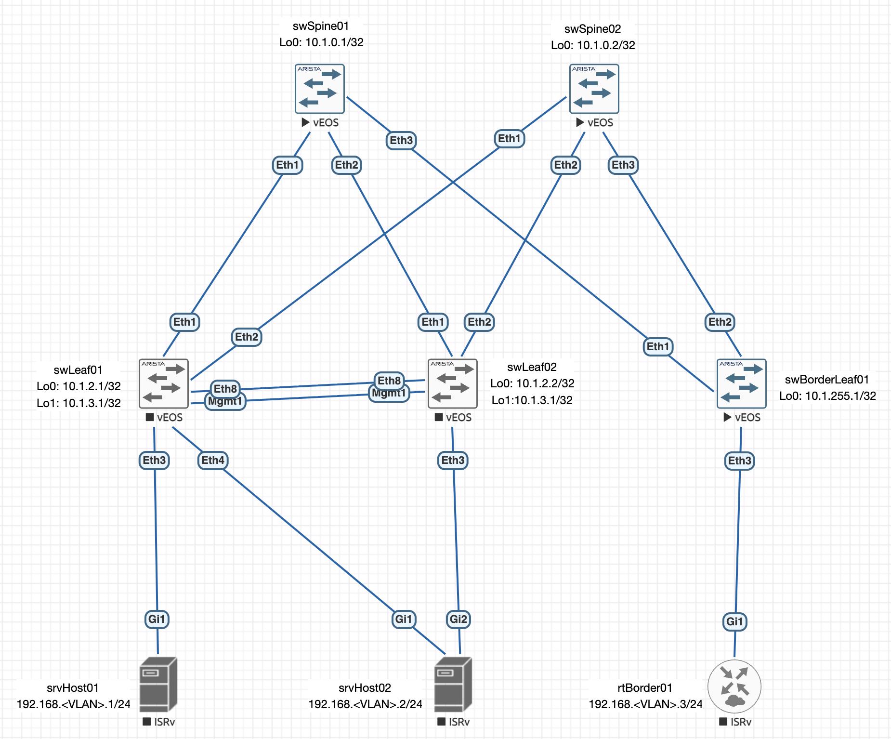

# Lab06: VxLAN. EVPN L3

## Состав работы
- [Условие задачи](#условие-задачи)
- [Описание выбранного решения](#описание-выбранного-решения)
- [Настройка Underlay (ISIS)](#настройка-underlay-isis)
  - [Коммутаторы Arista](#коммутаторы-arista)
  - [Коммутаторы Juniper](#коммутаторы-juniper)

### Условие задачи
В этой самостоятельной работе мы ожидаем, что вы самостоятельно:
- Настроите каждого клиента в своем VNI
- Настроите маршрутизацию между клиентами.
- Зафиксируете в документации - план работы, адресное пространство, схему сети, конфигурацию устройств

### Описание выбранного решения
Наигравшись с [мультивендорным решением](https://github.com/abeskrovny/OTuS-DC-Networks/blob/main/Lab06/TEST.md) и получив зависание хоста, на котором крутилась лаба, принял решение отказаться от мультивендорности и перейти на наиболее гибкое решение в середе EVE-NG - Arista vEOS.

Для себя ставлю задачу попробовать возможные сервисные модели и режимы работы IRB, поддерживаемые данным виртуальным коммутатором.

=== ПОПРАВИТЬ ===

В качестве подстилающей сети придется выбрать либо гомогенную на базе BGP, либо гибридную с использованием BGP и, например, ISIS. Я выбираю ISIS за его простоту, гибкость и независимость от стека IP. Для In-Band - IPv6 link-local.



Однако, есть один момент: 

=== ПОПРАВИТЬ ===

### Настройка Underlay (ISIS)
Первоначально, рассмотрим решение без vPC-пары: будем считать линки между swLeaf01 и swLeaf02 отсутствующими. Тогда конфигурация всех коммутаторов фабрики будет сходной:
```
hostname swSpine01
dns domain Underlay.local
!
spanning-tree mode mstp
!
interface Ethernet1
   description --- L3 p2p (no VLAN, no VRF): connection to swLeaf01:Ethernet1
   load-interval 60
   mtu 9000
   no switchport
   ip address unnumbered Loopback0
   ipv6 enable
   isis enable Underlay
   isis network point-to-point
!
interface Ethernet2
   description --- L3 p2p (no VLAN, no VRF): connection to swLeaf02:Ethernet1
   load-interval 60
   mtu 9000
   no switchport
   ip address unnumbered Loopback0
   ipv6 enable
   isis enable Underlay
   isis network point-to-point
!
interface Ethernet3
   description --- L3 p2p (no VLAN, no VRF): connection to swBorderLeaf01:Ethernet1
   load-interval 60
   mtu 9000
   no switchport
   ip address unnumbered Loopback0
   ipv6 enable
   isis enable Underlay
   isis network point-to-point
!
interface Loopback0
   description --- Loopback 0 (no VRF): interface for Underlay Control-Plane
   load-interval 60
   ip address 10.1.0.1/32
   isis enable Underlay
   isis passive
!
ip routing
!
ipv6 unicast-routing
!
router isis Underlay
   hello padding disabled
   net 49.0001.0100.0100.0001.00
   is-type level-2
   log-adjacency-changes
   !
   address-family ipv4 unicast
      maximum-paths 10
      bfd all-interfaces
```

Проверим состояние соседства LLDP:
```
swSpine01#sh lldp neighbors
Last table change time   : 0:02:33 ago
Number of table inserts  : 5
Number of table deletes  : 2
Number of table drops    : 0
Number of table age-outs : 2

Port          Neighbor Device ID                  Neighbor Port ID    TTL
---------- ----------------------------------- ---------------------- ---
Et1           swLeaf01.Underlay.local             Ethernet1           120
Et2           swLeaf02.Underlay.local             Ethernet1           120
Et3           swBorderLeaf01.Underlay.local       Ethernet1           120
```

Состояние стека IPv6, предназначенного для In-Band управления:
```
swSpine01#sh ipv6 neighbors
IPv6 Address                                  Age Hardware Addr   Interface
fe80::5200:ff:fecb:38c2                   0:15:10 5000.00cb.38c2  Et1
fe80::5200:ff:fed5:5dc0                   0:16:31 5000.00d5.5dc0  Et1
fe80::5200:ff:fed7:ee0b                   0:17:08 5000.00d7.ee0b  Et1
fe80::5200:ff:fe03:3766                   0:05:44 5000.0003.3766  Et2
fe80::5200:ff:fed5:5dc0                   0:16:31 5000.00d5.5dc0  Et2
fe80::5200:ff:fe15:f4e8                   0:44:02 5000.0015.f4e8  Et3
```

Проверим связанность с любым из соседей:
```
swSpine01#ping fe80::5200:ff:fed7:ee0b interface ethernet 1
PING fe80::5200:ff:fed7:ee0b%et1(fe80::5200:ff:fed7:ee0b%et1) 52 data bytes
60 bytes from fe80::5200:ff:fed7:ee0b%et1: icmp_seq=1 ttl=64 time=0.473 ms
60 bytes from fe80::5200:ff:fed7:ee0b%et1: icmp_seq=2 ttl=64 time=0.023 ms
60 bytes from fe80::5200:ff:fed7:ee0b%et1: icmp_seq=3 ttl=64 time=0.023 ms
60 bytes from fe80::5200:ff:fed7:ee0b%et1: icmp_seq=4 ttl=64 time=0.023 ms
60 bytes from fe80::5200:ff:fed7:ee0b%et1: icmp_seq=5 ttl=64 time=0.023 ms

--- fe80::5200:ff:fed7:ee0b%et1 ping statistics ---
5 packets transmitted, 5 received, 0% packet loss, time 15ms
rtt min/avg/max/mdev = 0.023/0.113/0.473/0.180 ms, ipg/ewma 3.656/0.287 ms
```

Далее, проверим сходимость протокола ISIS:
```
swSpine01#show isis neighbors

Instance  VRF      System Id        Type Interface          SNPA              State Hold time   Circuit Id
Underlay  default  swLeaf01         L2   Ethernet1          P2P               UP    29          1A
Underlay  default  swLeaf02         L2   Ethernet2          P2P               UP    24          14
Underlay  default  swBorderLeaf01   L2   Ethernet3          P2P               UP    21          11
```

и полученные маршруты:
```
swSpine01#show ip route isis

VRF: default
Source Codes:
       C - connected, S - static, K - kernel,
       O - OSPF, IA - OSPF inter area, E1 - OSPF external type 1,
       E2 - OSPF external type 2, N1 - OSPF NSSA external type 1,
       N2 - OSPF NSSA external type2, B - Other BGP Routes,
       B I - iBGP, B E - eBGP, R - RIP, I L1 - IS-IS level 1,
       I L2 - IS-IS level 2, O3 - OSPFv3, A B - BGP Aggregate,
       A O - OSPF Summary, NG - Nexthop Group Static Route,
       V - VXLAN Control Service, M - Martian,
       DH - DHCP client installed default route,
       DP - Dynamic Policy Route, L - VRF Leaked,
       G  - gRIBI, RC - Route Cache Route,
       CL - CBF Leaked Route

 I L2     10.1.0.2/32 [115/30]
           via 10.1.2.1, Ethernet1
           via 10.1.2.2, Ethernet2
           via 10.1.255.1, Ethernet3
 I L2     10.1.2.1/32
           directly connected, Ethernet1
 I L2     10.1.2.2/32
           directly connected, Ethernet2
 I L2     10.1.255.1/32
           directly connected, Ethernet3
```

Проверим сходимость с любым коммутатором фабрики:
```
swSpine01#ping 10.1.0.2
PING 10.1.0.2 (10.1.0.2) 72(100) bytes of data.
80 bytes from 10.1.0.2: icmp_seq=1 ttl=63 time=6.03 ms
80 bytes from 10.1.0.2: icmp_seq=2 ttl=63 time=3.50 ms
80 bytes from 10.1.0.2: icmp_seq=3 ttl=63 time=3.36 ms
80 bytes from 10.1.0.2: icmp_seq=4 ttl=63 time=4.52 ms
80 bytes from 10.1.0.2: icmp_seq=5 ttl=63 time=3.29 ms

--- 10.1.0.2 ping statistics ---
5 packets transmitted, 5 received, 0% packet loss, time 29ms
rtt min/avg/max/mdev = 3.286/4.139/6.029/1.045 ms, ipg/ewma 7.237/5.054 ms
```

Тонкий тюнинг производить не будем.

### Настройка L2-слоя наложенной сети (Overlay)
Я буду использовать iBGP с ASN:65000 для данного POD'а.

Настройку начну с коммутаторов уровня Spine, которые должны выступать отражателями маршрутов (Route-Reflector):
```
router bgp 65000
   router-id 10.1.0.1
   neighbor grpLEAFS peer group
   neighbor grpLEAFS remote-as 65000
   neighbor grpLEAFS update-source Loopback0
   neighbor grpLEAFS route-reflector-client
   neighbor grpLEAFS send-community
   neighbor 10.1.2.1 peer group grpLEAFS
   neighbor 10.1.2.2 peer group grpLEAFS
   neighbor 10.1.2.3 peer group grpLEAFS
   neighbor 10.1.2.4 peer group grpLEAFS
   neighbor 10.1.255.1 peer group grpLEAFS
   !
   address-family evpn
      neighbor grpLEAFS activate
      neighbor grpLEAFS next-hop-unchanged
```

> Команда `neighbor grpLEAFS send-community` разрешает коммутатору Arista отправлять стандартные BGP Communities (сообщества) в сторону peer-группы grpLEAFS. По умолчанию в протоколе BGP при отправке маршрутных обновлений (BGP Updates) атрибут `Community` удаляется.

На стороне коммутатора swBorderLeaf01 конфигурация следующая:
```
router bgp 65000
   router-id 10.1.255.1
   neighbor grpSPINES peer group
   neighbor grpSPINES remote-as 65000
   neighbor grpSPINES update-source Loopback0
   neighbor grpSPINES send-community
   neighbor 10.1.0.1 peer group grpSPINES
   neighbor 10.1.0.2 peer group grpSPINES
   neighbor 10.1.0.3 peer group grpSPINES
   !
   address-family evpn
      neighbor grpSPINES activate
```

Проверим соседство BGP на любом из коммутаторов фабрики:
```
swSpine01#sh bgp summary
BGP summary information for VRF default
Router identifier 10.1.0.1, local AS number 65000
Neighbor            AS Session State AFI/SAFI                AFI/SAFI State   NLRI Rcd   NLRI Acc
---------- ----------- ------------- ----------------------- -------------- ---------- ----------
10.1.2.1         65000 Established   IPv4 Unicast            Negotiated              0          0
10.1.2.1         65000 Established   L2VPN EVPN              Negotiated              0          0
10.1.2.2         65000 Established   IPv4 Unicast            Negotiated              0          0
10.1.2.2         65000 Established   L2VPN EVPN              Negotiated              0          0
10.1.2.3         65000 Established   IPv4 Unicast            Negotiated              0          0
10.1.2.3         65000 Established   L2VPN EVPN              Negotiated              0          0
10.1.2.4         65000 Established   IPv4 Unicast            Negotiated              0          0
10.1.2.4         65000 Established   L2VPN EVPN              Negotiated              0          0
10.1.255.1       65000 Established   IPv4 Unicast            Negotiated              0          0
10.1.255.1       65000 Established   L2VPN EVPN              Negotiated              0          0
```

Фабрика готова, хоть при этом ни одного маршрута и не было анонсировано и получено. Осталось настроить сервисные модели.

Перед применением любой из моделей, на Лифе должен быть описан интерфейс Vxlan1, который привязан к вашему Loopback0.
```
interface Vxlan1
   description --- VxLAN (no VRF): interface for Overlay Control-Plane
   vxlan source-interface Loopback0
   load-interval 60
```

### Настройка сервисов EVPN

#### Сервисная модель VLAN-Based
???

```
vlan 11
   name VLAN-BASED01
vlan 12
   name VLAN-BASED02
!
interface Vxlan1
   vxlan vlan 11 vni 10011
   vxlan vlan 12 vni 10012
!
router bgp 65000
   vlan 11
      rd auto
      route-target both 65000:11
      redistribute learned
   !
   vlan 12
      rd auto
      route-target both 65000:12
      redistribute learned
```

Пока мы ничего не отсылаем.

Настроим абонентский порт `rtBorder01` для Сentralized Routing:
```
hostname rtBorder01
!
ip domain name local
!
lldp run
!
interface GigabitEthernet1
 description --- Trunk (VLAN001): connection to swBorderLeaf01:Ethernet4
 ip dhcp client client-id ascii rtBorder01.Underlay.local
 ip address dhcp
 load-interval 60
 negotiation auto
 ipv6 enable
 no mop enabled
 no mop sysid
!
interface GigabitEthernet1.11
 description --- Virtual (VLAN011): VLAN-BASED01
 encapsulation dot1Q 11
 ip address 192.168.11.254 255.255.255.0
!
interface GigabitEthernet1.12
 description --- Virtual (VLAN012): VLAN-BASED02
 encapsulation dot1Q 12
 ip address 192.168.12.254 255.255.255.0
```

Проверим LLDP
```
rtBorder01#sh lldp neighbors
Capability codes:
    (R) Router, (B) Bridge, (T) Telephone, (C) DOCSIS Cable Device
    (W) WLAN Access Point, (P) Repeater, (S) Station, (O) Other

Device ID           Local Intf     Hold-time  Capability      Port ID
swBorderLeaf01.UnderGi1            120        B,R             Ethernet4

Total entries displayed: 1
```

```
rtBorder01#sh ipv6 neighbors
IPv6 Address                              Age Link-layer Addr State Interface
FE80::6987:6D68:9A6D:4B41                   1 406c.8f4c.42d0  STALE Gi1
```

```
rtBorder01#ping ipv6 FE80::6987:6D68:9A6D:4B41
Output Interface: gigabitEthernet1
Type escape sequence to abort.
Sending 5, 100-byte ICMP Echos to FE80::6987:6D68:9A6D:4B41, timeout is 2 seconds:
Packet sent with a source address of FE80::5200:FF:FE06:0%GigabitEthernet1
!!!!!
Success rate is 100 percent (5/5), round-trip min/avg/max = 2/4/8 ms
```

в текущей конфигурации и топологии Leaf не будет отдавать другие EVPN-маршруты (Type 2 или Type 5) в сторону Spine, так как VxLAN настроен только на одном коммутаторе.Однако он будет анонсировать сам факт установления сессии и пустые UPDATE (или технические BGP-сообщения), но реальных сетевых префиксов абонента в EVPN другие коммутаторы не увидят.

Начнем с настройки swLeaf04. Будем настраивать только 1 стык Ethernet4 - Gi2. VRF!!!
```
hostname srvHost03
!
ip domain name local
!
vrf definition vrfVLAN-BUNDLE01
 !
 address-family ipv4
 exit-address-family
!
vrf definition vrfVLAN-BUNDLE02
 !
 address-family ipv4
 exit-address-family
!
interface GigabitEthernet2
 description --- Trunk (VLAN001): connection swLeaf04:Ethernet4
 no ip address
 load-interval 60
 negotiation auto
 no mop enabled
 no mop sysid
!
interface GigabitEthernet2.11
 description --- Virtual (VLAN011): VLAN-BUNDLE01
 encapsulation dot1Q 11
 vrf forwarding vrfVLAN-BUNDLE01
 ip address 192.168.11.3 255.255.255.0
!
interface GigabitEthernet2.12
 description --- Virtual (VLAN012): VLAN-BUNDLE02
 encapsulation dot1Q 12
 vrf forwarding vrfVLAN-BUNDLE02
 ip address 192.168.12.3 255.255.255.0
```

Теперь попробуем Сentralized Routing пингануть себя же через роутер на палке:

```
srvHost03#ping vrf vrfVLAN-BUNDLE01 192.168.12.3
Type escape sequence to abort.
Sending 5, 100-byte ICMP Echos to 192.168.12.3, timeout is 2 seconds:
!!!!!
Success rate is 100 percent (5/5), round-trip min/avg/max = 31/41/51 ms
```

Ниже


Произведем просмотр:


swLeaf04#show mac address-table
          Mac Address Table
------------------------------------------------------------------

Vlan    Mac Address       Type        Ports      Moves   Last Move
----    -----------       ----        -----      -----   ---------
  11    5000.0006.0000    DYNAMIC     Vx1        1       0:00:49 ago
  11    5000.000c.0001    DYNAMIC     Et4        1       0:00:49 ago
  12    5000.0006.0000    DYNAMIC     Vx1        1       0:00:49 ago
  12    5000.000c.0001    DYNAMIC     Et4        1       0:00:49 ago
Total Mac Addresses for this criterion: 4

          Multicast Mac Address Table
------------------------------------------------------------------

Vlan    Mac Address       Type        Ports
----    -----------       ----        -----
Total Mac Addresses for this criterion: 0


swLeaf04#show bgp evpn summary
BGP summary information for VRF default
Router identifier 10.1.2.4, local AS number 65000
Neighbor Status Codes: m - Under maintenance
  Neighbor V AS           MsgRcvd   MsgSent  InQ OutQ  Up/Down State   PfxRcd PfxAcc
  10.1.0.1 4 65000           1004      1007    0    0 02:23:17 Estab   4      4
  10.1.0.2 4 65000           1002      1009    0    0 01:42:57 Estab   4      4
  10.1.0.3 4 65000           1002      1001    0    0 14:07:16 Estab   4      4


swLeaf04#show vxlan vtep
Remote VTEPS for Vxlan1:

VTEP             Tunnel Type(s)
---------------- --------------
10.1.255.1       unicast, flood

Total number of remote VTEPS:  1


swLeaf04#show vxlan vni
VNI to VLAN Mapping for Vxlan1
VNI         VLAN       Source       Interface       802.1Q Tag
----------- ---------- ------------ --------------- ----------
10011       11         static       Ethernet4       11
                                    Vxlan1          11
10012       12         static       Ethernet4       12
                                    Vxlan1          12

VNI to dynamic VLAN Mapping for Vxlan1
VNI       VLAN       VRF       Source
--------- ---------- --------- ------------


swLeaf04#show bgp evpn instance
EVPN instance: VLAN 11
  Route distinguisher: 10.1.2.4:11
  Route target import: Route-Target-AS:65000:11
  Route target export: Route-Target-AS:65000:11
  Service interface: VLAN-based
  Local VXLAN IP address: 10.1.2.4
  VXLAN: enabled
  MPLS: disabled
EVPN instance: VLAN 12
  Route distinguisher: 10.1.2.4:12
  Route target import: Route-Target-AS:65000:12
  Route target export: Route-Target-AS:65000:12
  Service interface: VLAN-based
  Local VXLAN IP address: 10.1.2.4
  VXLAN: enabled
  MPLS: disabled


swLeaf04#show bgp evpn route-type mac-ip
BGP routing table information for VRF default
Router identifier 10.1.2.4, local AS number 65000
Route status codes: * - valid, > - active, S - Stale, E - ECMP head, e - ECMP
                    c - Contributing to ECMP, % - Pending best path selection
Origin codes: i - IGP, e - EGP, ? - incomplete
AS Path Attributes: Or-ID - Originator ID, C-LST - Cluster List, LL Nexthop - Link Local Nexthop

          Network                Next Hop              Metric  LocPref Weight  Path
 * >Ec    RD: 10.1.255.1:11 mac-ip 5000.0006.0000
                                 10.1.255.1            -       100     0       i Or-ID: 10.1.255.1 C-LST: 10.1.0.2
 *  ec    RD: 10.1.255.1:11 mac-ip 5000.0006.0000
                                 10.1.255.1            -       100     0       i Or-ID: 10.1.255.1 C-LST: 10.1.0.3
 *  ec    RD: 10.1.255.1:11 mac-ip 5000.0006.0000
                                 10.1.255.1            -       100     0       i Or-ID: 10.1.255.1 C-LST: 10.1.0.1
 * >Ec    RD: 10.1.255.1:12 mac-ip 5000.0006.0000
                                 10.1.255.1            -       100     0       i Or-ID: 10.1.255.1 C-LST: 10.1.0.2
 *  ec    RD: 10.1.255.1:12 mac-ip 5000.0006.0000
                                 10.1.255.1            -       100     0       i Or-ID: 10.1.255.1 C-LST: 10.1.0.3
 *  ec    RD: 10.1.255.1:12 mac-ip 5000.0006.0000
                                 10.1.255.1            -       100     0       i Or-ID: 10.1.255.1 C-LST: 10.1.0.1
 * >      RD: 10.1.2.4:11 mac-ip 5000.000c.0001
                                 -                     -       -       0       i
 * >      RD: 10.1.2.4:12 mac-ip 5000.000c.0001
                                 -                     -       -       0       i


swLeaf04#show bgp evpn route-type imet
BGP routing table information for VRF default
Router identifier 10.1.2.4, local AS number 65000
Route status codes: * - valid, > - active, S - Stale, E - ECMP head, e - ECMP
                    c - Contributing to ECMP, % - Pending best path selection
Origin codes: i - IGP, e - EGP, ? - incomplete
AS Path Attributes: Or-ID - Originator ID, C-LST - Cluster List, LL Nexthop - Link Local Nexthop

          Network                Next Hop              Metric  LocPref Weight  Path
 * >      RD: 10.1.2.4:11 imet 10.1.2.4
                                 -                     -       -       0       i
 * >      RD: 10.1.2.4:12 imet 10.1.2.4
                                 -                     -       -       0       i
 * >Ec    RD: 10.1.255.1:11 imet 10.1.255.1
                                 10.1.255.1            -       100     0       i Or-ID: 10.1.255.1 C-LST: 10.1.0.2
 *  ec    RD: 10.1.255.1:11 imet 10.1.255.1
                                 10.1.255.1            -       100     0       i Or-ID: 10.1.255.1 C-LST: 10.1.0.1
 *  ec    RD: 10.1.255.1:11 imet 10.1.255.1
                                 10.1.255.1            -       100     0       i Or-ID: 10.1.255.1 C-LST: 10.1.0.3
 * >Ec    RD: 10.1.255.1:12 imet 10.1.255.1
                                 10.1.255.1            -       100     0       i Or-ID: 10.1.255.1 C-LST: 10.1.0.2
 *  ec    RD: 10.1.255.1:12 imet 10.1.255.1
                                 10.1.255.1            -       100     0       i Or-ID: 10.1.255.1 C-LST: 10.1.0.1
 *  ec    RD: 10.1.255.1:12 imet 10.1.255.1
                                 10.1.255.1            -       100     0       i Or-ID: 10.1.255.1 C-LST: 10.1.0.3


sh bgp neighbors 10.1.0.1 advertised-routes


swBorderLeaf01#sh interfaces vxlan 1
Vxlan1 is up, line protocol is up (connected)
  Hardware is Vxlan
  Description: --- VxLAN (no VRF): interface for Overlay Control-Plane
  Source interface is Loopback0 and is active with 10.1.255.1
  Listening on UDP port 4789
  Replication/Flood Mode is headend with Flood List Source: EVPN
  Remote MAC learning via EVPN
  VNI mapping to VLANs
  Static VLAN to VNI mapping is
    [11, 10011]       [12, 10012]
  Note: All Dynamic VLANs used by VCS are internal VLANs.
        Use 'show vxlan vni' for details.
  Static VRF to VNI mapping is not configured
  Shared Router MAC is 0000.0000.0000
swBorderLeaf01#show vxlan vni
VNI to VLAN Mapping for Vxlan1
VNI         VLAN       Source       Interface       802.1Q Tag
----------- ---------- ------------ --------------- ----------
10011       11         static       Vxlan1          11
10012       12         static       Vxlan1          12

VNI to dynamic VLAN Mapping for Vxlan1
VNI       VLAN       VRF       Source
--------- ---------- --------- ------------


----

commit-confirm

Сentralized Routing