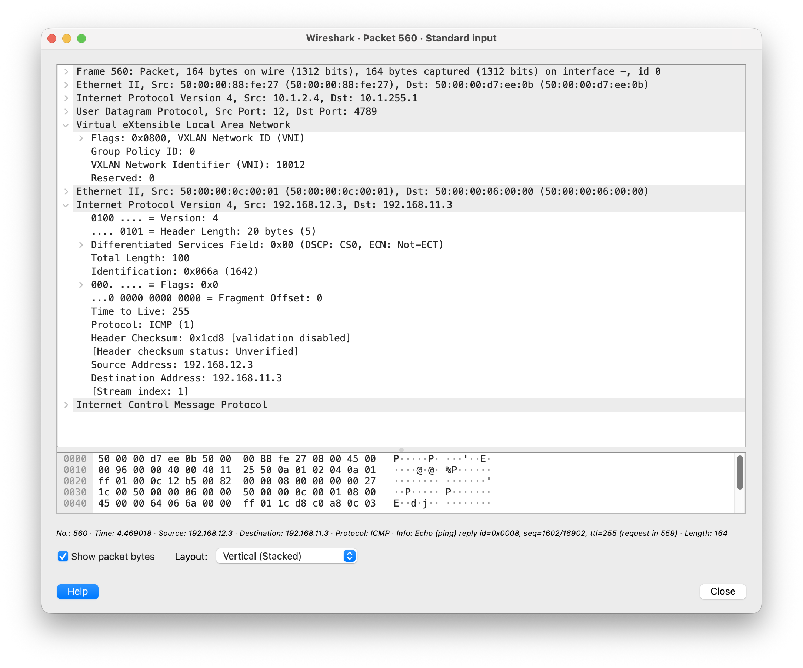
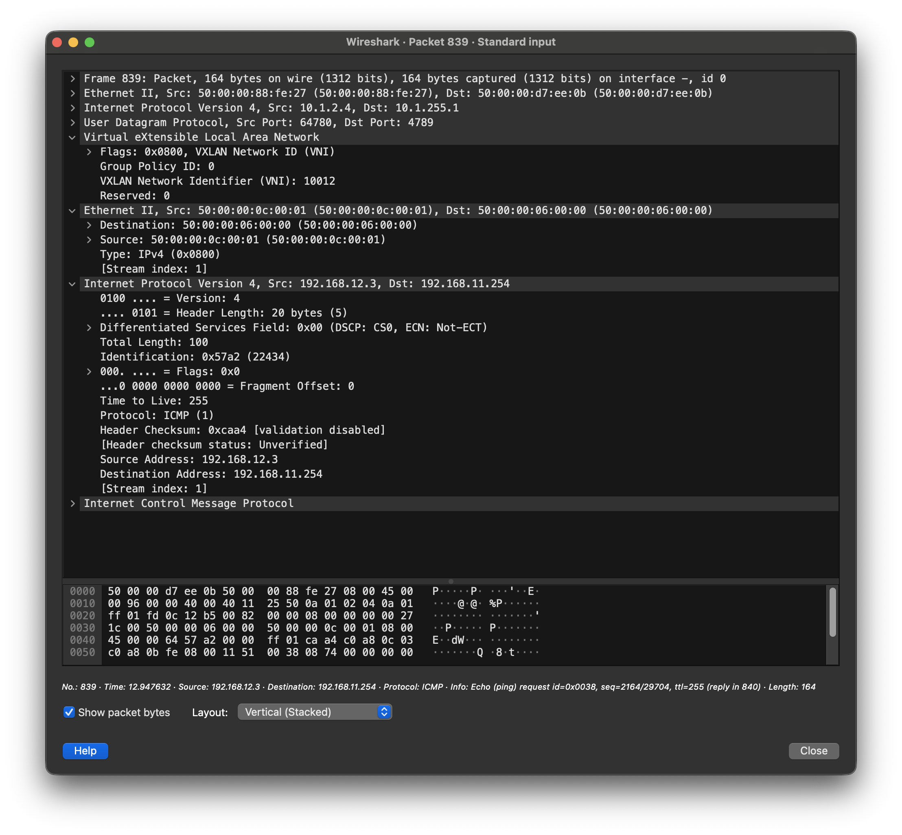
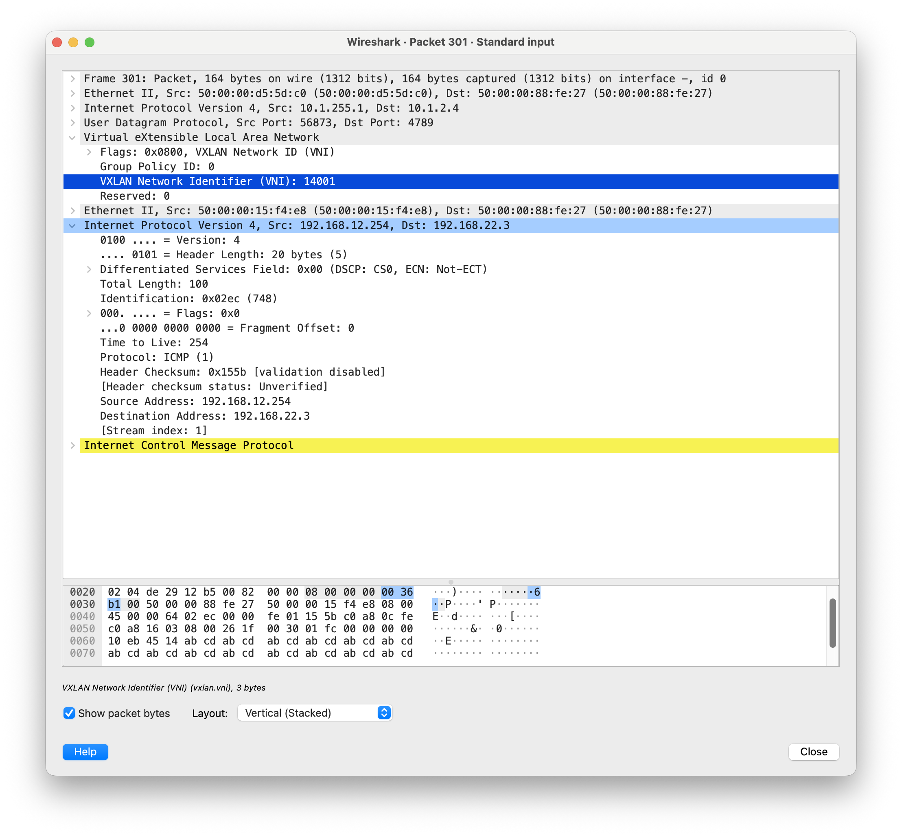

# Lab06: VxLAN. EVPN L3

## Состав работы
- [Условие задачи](#условие-задачи)
- [Описание выбранного решения](#описание-выбранного-решения)
- [Настройка Underlay (ISIS)](#настройка-underlay-isis)
- [Настройка L2-слоя наложенной сети (Overlay)](#настройка-l2-слоя-наложенной-сети-overlay)
- [Настройка сервисов EVPN](#настройка-сервисов-evpn)
  - [Cервисная модель VLAN-Based](#сервисная-модель-vlan-based)
  - [Сервисная модель VLAN-Bundle](#сервисная-модель-vlan-bundle)
  - [Сервисная модель VLAN-Aware Bundle](#сервисная-модель-vlan-aware-bundle)
- [Настройка EVPN L3](#настройка-evpn-l3)
  - [Asymmetric IRB](#asymmetric-irb)
  - [Symmetric IRB](#symmetric-irb)

### Условие задачи
В этой самостоятельной работе мы ожидаем, что вы самостоятельно:
- Настроите каждого клиента в своем VNI
- Настроите маршрутизацию между клиентами.
- Зафиксируете в документации - план работы, адресное пространство, схему сети, конфигурацию устройств

### Описание выбранного решения
Наигравшись с [мультивендорным решением](https://github.com/abeskrovny/OTuS-DC-Networks/blob/main/Lab06/TEST.md) и получив зависание хоста, на котором крутилась лаба, принял решение отказаться от мультивендорности и перейти на наиболее гибкое решение в середе EVE-NG - Arista vEOS.

Для себя ставлю задачу попробовать возможные сервисные модели и режимы работы IRB, поддерживаемые данным виртуальным коммутатором.

Схема лабораторной сети:


В качестве подстилающей сети я выбираю ISIS за его простоту, гибкость и независимость от стека IP. Для In-Band - IPv6 link-local.

### Настройка Underlay (ISIS)
Первоначально, рассмотрим решение без vPC-пар (M-LAG в терминологии Arista) и Multihoming подключений на коммутаторе `srvHost03`: будем считать рабочим только линк `srvHost03:Gi2 <-> swLeaf04:Ethernet4`.

Тогда конфигурации всех коммутаторов фабрики будут сходными:
```
hostname swSpine01
dns domain Underlay.local
!
spanning-tree mode mstp
!
interface Ethernet1
   description --- L3 p2p (no VLAN, no VRF): connection to swLeaf01:Ethernet1
   load-interval 60
   mtu 9000
   no switchport
   ip address unnumbered Loopback0
   ipv6 enable
   isis enable Underlay
   isis network point-to-point
!
interface Ethernet2
   description --- L3 p2p (no VLAN, no VRF): connection to swLeaf02:Ethernet1
   load-interval 60
   mtu 9000
   no switchport
   ip address unnumbered Loopback0
   ipv6 enable
   isis enable Underlay
   isis network point-to-point
!
interface Ethernet3
   description --- L3 p2p (no VLAN, no VRF): connection to swBorderLeaf01:Ethernet1
   load-interval 60
   mtu 9000
   no switchport
   ip address unnumbered Loopback0
   ipv6 enable
   isis enable Underlay
   isis network point-to-point
!
interface Loopback0
   description --- Loopback 0 (no VRF): interface for Underlay Control-Plane
   load-interval 60
   ip address 10.1.0.1/32
   isis enable Underlay
   isis passive
!
ip routing
!
ipv6 unicast-routing
!
router isis Underlay
   hello padding disabled
   net 49.0001.0100.0100.0001.00
   is-type level-2
   log-adjacency-changes
   !
   address-family ipv4 unicast
      maximum-paths 10
      bfd all-interfaces
```

Проверим состояние соседства LLDP:
```
swSpine01#sh lldp neighbors
Last table change time   : 1:50:05 ago
Number of table inserts  : 7
Number of table deletes  : 2
Number of table drops    : 0
Number of table age-outs : 2

Port          Neighbor Device ID                  Neighbor Port ID    TTL
---------- ----------------------------------- ---------------------- ---
Et1           swLeaf01.Underlay.local             Ethernet1           120
Et2           swLeaf02.Underlay.local             Ethernet1           120
Et3           swLeaf03.Underlay.local             Ethernet1           120
Et4           swLeaf04.Underlay.local             Ethernet2           120
Et5           swBorderLeaf01.Underlay.local       Ethernet1           120 
```

Состояние стека IPv6, предназначенного для In-Band управления:
```
swSpine01#sh ipv6 neighbors
IPv6 Address                                  Age Hardware Addr   Interface
fe80::5200:ff:fecb:38c2                   2:41:35 5000.00cb.38c2  Et1
fe80::5200:ff:fe03:3766                   2:43:22 5000.0003.3766  Et2
fe80::5200:ff:feaf:d3f6                   2:44:24 5000.00af.d3f6  Et3
fe80::5200:ff:fe88:fe27                   2:43:16 5000.0088.fe27  Et4
fe80::5200:ff:fe15:f4e8                   2:42:42 5000.0015.f4e8  Et5
```

Проверим связанность с любым из соседей:
```
swSpine01#ping fe80::5200:ff:fed7:ee0b interface ethernet 1
PING fe80::5200:ff:fed7:ee0b%et1(fe80::5200:ff:fed7:ee0b%et1) 52 data bytes
60 bytes from fe80::5200:ff:fed7:ee0b%et1: icmp_seq=1 ttl=64 time=0.473 ms
60 bytes from fe80::5200:ff:fed7:ee0b%et1: icmp_seq=2 ttl=64 time=0.023 ms
60 bytes from fe80::5200:ff:fed7:ee0b%et1: icmp_seq=3 ttl=64 time=0.023 ms
60 bytes from fe80::5200:ff:fed7:ee0b%et1: icmp_seq=4 ttl=64 time=0.023 ms
60 bytes from fe80::5200:ff:fed7:ee0b%et1: icmp_seq=5 ttl=64 time=0.023 ms

--- fe80::5200:ff:fed7:ee0b%et1 ping statistics ---
5 packets transmitted, 5 received, 0% packet loss, time 15ms
rtt min/avg/max/mdev = 0.023/0.113/0.473/0.180 ms, ipg/ewma 3.656/0.287 ms
```

Далее, проверим сходимость протокола ISIS:
```
swSpine01#sh isis neighbors

Instance  VRF      System Id        Type Interface          SNPA              State Hold time   Circuit Id
Underlay  default  swLeaf01         L2   Ethernet1          P2P               UP    29          1F
Underlay  default  swLeaf02         L2   Ethernet2          P2P               UP    23          18
Underlay  default  swLeaf03         L2   Ethernet3          P2P               UP    23          13
Underlay  default  swLeaf04         L2   Ethernet4          P2P               UP    22          10
Underlay  default  swBorderLeaf01   L2   Ethernet5          P2P               UP    22          1B
```

и полученные через ISIS маршруты:
```
swSpine01#sh ip route isis

VRF: default
Source Codes:
       C - connected, S - static, K - kernel,
       O - OSPF, IA - OSPF inter area, E1 - OSPF external type 1,
       E2 - OSPF external type 2, N1 - OSPF NSSA external type 1,
       N2 - OSPF NSSA external type2, B - Other BGP Routes,
       B I - iBGP, B E - eBGP, R - RIP, I L1 - IS-IS level 1,
       I L2 - IS-IS level 2, O3 - OSPFv3, A B - BGP Aggregate,
       A O - OSPF Summary, NG - Nexthop Group Static Route,
       V - VXLAN Control Service, M - Martian,
       DH - DHCP client installed default route,
       DP - Dynamic Policy Route, L - VRF Leaked,
       G  - gRIBI, RC - Route Cache Route,
       CL - CBF Leaked Route

 I L2     10.1.0.2/32 [115/30]
           via 10.1.2.1, Ethernet1
           via 10.1.2.2, Ethernet2
           via 10.1.2.3, Ethernet3
           via 10.1.2.4, Ethernet4
           via 10.1.255.1, Ethernet5
 I L2     10.1.0.3/32 [115/30]
           via 10.1.2.1, Ethernet1
           via 10.1.2.2, Ethernet2
           via 10.1.2.3, Ethernet3
           via 10.1.2.4, Ethernet4
           via 10.1.255.1, Ethernet5
 I L2     10.1.2.1/32
           directly connected, Ethernet1
 I L2     10.1.2.2/32
           directly connected, Ethernet2
 I L2     10.1.2.3/32
           directly connected, Ethernet3
 I L2     10.1.2.4/32
           directly connected, Ethernet4
 I L2     10.1.255.1/32
           directly connected, Ethernet5
```

Проверим сходимость с любым коммутатором фабрики:
```
swSpine01#ping 10.1.0.2
PING 10.1.0.2 (10.1.0.2) 72(100) bytes of data.
80 bytes from 10.1.0.2: icmp_seq=1 ttl=63 time=6.03 ms
80 bytes from 10.1.0.2: icmp_seq=2 ttl=63 time=3.50 ms
80 bytes from 10.1.0.2: icmp_seq=3 ttl=63 time=3.36 ms
80 bytes from 10.1.0.2: icmp_seq=4 ttl=63 time=4.52 ms
80 bytes from 10.1.0.2: icmp_seq=5 ttl=63 time=3.29 ms

--- 10.1.0.2 ping statistics ---
5 packets transmitted, 5 received, 0% packet loss, time 29ms
rtt min/avg/max/mdev = 3.286/4.139/6.029/1.045 ms, ipg/ewma 7.237/5.054 ms
```

Тонкий тюнинг производить не будем.

### Настройка L2-слоя наложенной сети (Overlay)
Я буду использовать iBGP с `ASN:65000` для данного POD'а.

Настройку начну с коммутаторов уровня Spine, которые должны выступать отражателями маршрутов (Route-Reflector) в режиме `Client` для коммутаторов уровня Leaf:
```
router bgp 65000
   router-id 10.1.0.1
   neighbor grpLEAFS peer group
   neighbor grpLEAFS remote-as 65000
   neighbor grpLEAFS update-source Loopback0
   neighbor grpLEAFS route-reflector-client
   neighbor grpLEAFS send-community
   neighbor 10.1.2.1 peer group grpLEAFS
   neighbor 10.1.2.2 peer group grpLEAFS
   neighbor 10.1.2.3 peer group grpLEAFS
   neighbor 10.1.2.4 peer group grpLEAFS
   neighbor 10.1.255.1 peer group grpLEAFS
   !
   address-family evpn
      neighbor grpLEAFS activate
      neighbor grpLEAFS next-hop-unchanged
```

> Команда `neighbor grpLEAFS send-community` разрешает коммутатору Arista отправлять стандартные BGP Communities (сообщества) в сторону peer-группы grpLEAFS. По умолчанию в протоколе BGP при отправке маршрутных обновлений (BGP Updates) атрибут `Community` удаляется.

На стороне коммутаторов уровня Leaf конфигурация следующая:
```
router bgp 65000
   router-id 10.1.255.1
   neighbor grpSPINES peer group
   neighbor grpSPINES remote-as 65000
   neighbor grpSPINES update-source Loopback0
   neighbor grpSPINES send-community
   neighbor 10.1.0.1 peer group grpSPINES
   neighbor 10.1.0.2 peer group grpSPINES
   neighbor 10.1.0.3 peer group grpSPINES
   !
   address-family evpn
      neighbor grpSPINES activate
```

Проверим соседство BGP на любом из коммутаторов фабрики:
```
swSpine01#sh bgp summary
BGP summary information for VRF default
Router identifier 10.1.0.1, local AS number 65000
Neighbor            AS Session State AFI/SAFI                AFI/SAFI State   NLRI Rcd   NLRI Acc
---------- ----------- ------------- ----------------------- -------------- ---------- ----------
10.1.2.1         65000 Established   IPv4 Unicast            Negotiated              0          0
10.1.2.1         65000 Established   L2VPN EVPN              Negotiated              0          0
10.1.2.2         65000 Established   IPv4 Unicast            Negotiated              0          0
10.1.2.2         65000 Established   L2VPN EVPN              Negotiated              0          0
10.1.2.3         65000 Established   IPv4 Unicast            Negotiated              0          0
10.1.2.3         65000 Established   L2VPN EVPN              Negotiated              0          0
10.1.2.4         65000 Established   IPv4 Unicast            Negotiated              0          0
10.1.2.4         65000 Established   L2VPN EVPN              Negotiated              0          0
10.1.255.1       65000 Established   IPv4 Unicast            Negotiated              0          0
10.1.255.1       65000 Established   L2VPN EVPN              Negotiated              0          0
```

Фабрика готова, хоть при этом ни одного маршрута не было ни анонсировано и ни получено. Осталось настроить сервисные модели.

Перед работой с любой из моделей, на коммутаторе уровня Leaf должен быть описан интерфейс Vxlan1, предназначенный для терминирования туннелей VTEP. На коммутаторах `swBorderLeaf01` и `swLeaf04` привяжем его к локальным петлевым интерфесам Loopback0. Настройку остальных коммутаторов будем производить в контексте соответствующего подключния серверов.
```
interface Vxlan1
   description --- VxLAN (no VRF): interface for Overlay Control-Plane
   vxlan source-interface Loopback0
   load-interval 60
```

### Настройка сервисов EVPN

#### Сервисная модель VLAN-Based
VLAN-Based (VLAN-Aware Single-Service) — это классическая модель обслуживания EVPN, в которой обеспечивается строгое монопольное соответствие «один VLAN — один широковещательный домен (MAC-VRF) — один сетевой идентификатор VNI». В рамках этой архитектуры для каждого клиентского VLAN на коммутаторе (VTEP) выделяется изолированная таблица коммутации MAC-адресов и уникальный экземпляр BGP EVPN (EVI) со своими независимыми параметрами Route Distinguisher (RD) и Route Target (RT). Данная модель гарантирует абсолютную изоляцию трафика на Layer 2, исключает пересечение адресных пространств между разными VLAN и является стандартом де-факто для построения простых, легко масштабируемых и предсказуемых Enterprise-фабрик, хотя и накладывает ограничения на утилизацию ресурсов Control Plane при оперировании тысячами сервисных VLAN.

На коммутаторах `swBorderLeaf01` и `swLeaf04` произведем идентичные настройки:
```
vlan 11
   name VLAN-BASED01
vlan 12
   name VLAN-BASED02
!
interface Vxlan1
   vxlan vlan 11 vni 10011
   vxlan vlan 12 vni 10012
!
router bgp 65000
   vlan 11
      rd auto
      route-target both 65000:11
      redistribute learned
   !
   vlan 12
      rd auto
      route-target both 65000:12
      redistribute learned
```

> Данная конфигурация соответствует всем коммутаторам уровня Leaf, на котороых терминируются данные VLAN'ы. Разница лишь в особенностях абонентского подключения.

Настроим абонентский порт `Gi1` роутера `rtBorder01` для маршрутизации Сentralized Routing:
```
hostname rtBorder01
!
ip domain name local
!
lldp run
!
interface GigabitEthernet1
 description --- Trunk (VLAN001): connection to swBorderLeaf01:Ethernet4
 ip dhcp client client-id ascii rtBorder01.Underlay.local
 ip address dhcp
 load-interval 60
 negotiation auto
 ipv6 enable
 no mop enabled
 no mop sysid
!
interface GigabitEthernet1.11
 description --- Virtual (VLAN011): VLAN-BASED01
 encapsulation dot1Q 11
 ip address 192.168.11.254 255.255.255.0
!
interface GigabitEthernet1.12
 description --- Virtual (VLAN012): VLAN-BASED02
 encapsulation dot1Q 12
 ip address 192.168.12.254 255.255.255.0
```

Проверим работоспособность сервиса обнаружения LLDP:
```
rtBorder01#sh lldp neighbors
Capability codes:
    (R) Router, (B) Bridge, (T) Telephone, (C) DOCSIS Cable Device
    (W) WLAN Access Point, (P) Repeater, (S) Station, (O) Other

Device ID           Local Intf     Hold-time  Capability      Port ID
swBorderLeaf01.UnderGi1            120        B,R             Ethernet4

Total entries displayed: 1
```

И работу стека IPv6:
```
rtBorder01#sh ipv6 neighbors
IPv6 Address                              Age Link-layer Addr State Interface
FE80::6987:6D68:9A6D:4B41                   1 406c.8f4c.42d0  STALE Gi1
```

Проверим связанность по Link-local адресам:
```
rtBorder01#ping ipv6 FE80::6987:6D68:9A6D:4B41
Output Interface: gigabitEthernet1
Type escape sequence to abort.
Sending 5, 100-byte ICMP Echos to FE80::6987:6D68:9A6D:4B41, timeout is 2 seconds:
Packet sent with a source address of FE80::5200:FF:FE06:0%GigabitEthernet1
!!!!!
Success rate is 100 percent (5/5), round-trip min/avg/max = 2/4/8 ms
```

Далее, настроим абонентское подключение `srvHost03` к `swLeaf04`. Считаем сейчас, что линк - единственный.
```
hostname srvHost03
!
ip domain name local
!
vrf definition vrfVLAN-BUNDLE01
 !
 address-family ipv4
 exit-address-family
!
vrf definition vrfVLAN-BUNDLE02
 !
 address-family ipv4
 exit-address-family
!
interface GigabitEthernet2
 description --- Trunk (VLAN001): connection swLeaf04:Ethernet4
 no ip address
 load-interval 60
 negotiation auto
 no mop enabled
 no mop sysid
!
interface GigabitEthernet2.11
 description --- Virtual (VLAN011): VLAN-BUNDLE01
 encapsulation dot1Q 11
 vrf forwarding vrfVLAN-BUNDLE01
 ip address 192.168.11.3 255.255.255.0
!
interface GigabitEthernet2.12
 description --- Virtual (VLAN012): VLAN-BUNDLE02
 encapsulation dot1Q 12
 vrf forwarding vrfVLAN-BUNDLE02
 ip address 192.168.12.3 255.255.255.0
```

Следует отметить, что на роутере-хосте `srvHost03` я передаю VLAN в отдельный IP-VRF чтобы разорвать связанность на уровне самого хоста.

После настройки можно проверить маршрутизацию по модели Сentralized Routing пинганув себя же через "роутер на палке" (`rtBorder01`):

```
srvHost03#ping vrf vrfVLAN-BUNDLE01 192.168.12.3
Type escape sequence to abort.
Sending 5, 100-byte ICMP Echos to 192.168.12.3, timeout is 2 seconds:
!!!!!
Success rate is 100 percent (5/5), round-trip min/avg/max = 31/41/51 ms
```

Один из ответных пакетов изображен ниже:



Произведем всестороннюю дефектовку работоспособности данной сервисной модели.

Наличие MAC адресов обоих точек терминирования `rtBorder01` и `srvHost03`:
```
swLeaf04#show mac address-table
          Mac Address Table
------------------------------------------------------------------

Vlan    Mac Address       Type        Ports      Moves   Last Move
----    -----------       ----        -----      -----   ---------
  11    5000.0006.0000    DYNAMIC     Vx1        1       0:00:49 ago
  11    5000.000c.0001    DYNAMIC     Et4        1       0:00:49 ago
  12    5000.0006.0000    DYNAMIC     Vx1        1       0:00:49 ago
  12    5000.000c.0001    DYNAMIC     Et4        1       0:00:49 ago
Total Mac Addresses for this criterion: 4

          Multicast Mac Address Table
------------------------------------------------------------------

Vlan    Mac Address       Type        Ports
----    -----------       ----        -----
Total Mac Addresses for this criterion: 0
```

Состояние туннелей VTEP:
```
swLeaf04#show vxlan vtep
Remote VTEPS for Vxlan1:

VTEP             Tunnel Type(s)
---------------- --------------
10.1.255.1       unicast, flood

Total number of remote VTEPS:  1
```

и VNI:
```
swLeaf04#show vxlan vni
VNI to VLAN Mapping for Vxlan1
VNI         VLAN       Source       Interface       802.1Q Tag
----------- ---------- ------------ --------------- ----------
10011       11         static       Ethernet4       11
                                    Vxlan1          11
10012       12         static       Ethernet4       12
                                    Vxlan1          12

VNI to dynamic VLAN Mapping for Vxlan1
VNI       VLAN       VRF       Source
--------- ---------- --------- ------------
```

Экземпляры BGP EVPN:
```
swLeaf04#show bgp evpn instance
EVPN instance: VLAN 11
  Route distinguisher: 10.1.2.4:11
  Route target import: Route-Target-AS:65000:11
  Route target export: Route-Target-AS:65000:11
  Service interface: VLAN-based
  Local VXLAN IP address: 10.1.2.4
  VXLAN: enabled
  MPLS: disabled
EVPN instance: VLAN 12
  Route distinguisher: 10.1.2.4:12
  Route target import: Route-Target-AS:65000:12
  Route target export: Route-Target-AS:65000:12
  Service interface: VLAN-based
  Local VXLAN IP address: 10.1.2.4
  VXLAN: enabled
  MPLS: disabled
```

И, наконец, просмотрим маршруты типа 2:
```
swLeaf04#show bgp evpn route-type mac-ip
BGP routing table information for VRF default
Router identifier 10.1.2.4, local AS number 65000
Route status codes: * - valid, > - active, S - Stale, E - ECMP head, e - ECMP
                    c - Contributing to ECMP, % - Pending best path selection
Origin codes: i - IGP, e - EGP, ? - incomplete
AS Path Attributes: Or-ID - Originator ID, C-LST - Cluster List, LL Nexthop - Link Local Nexthop

          Network                Next Hop              Metric  LocPref Weight  Path
 * >Ec    RD: 10.1.255.1:11 mac-ip 5000.0006.0000
                                 10.1.255.1            -       100     0       i Or-ID: 10.1.255.1 C-LST: 10.1.0.2
 *  ec    RD: 10.1.255.1:11 mac-ip 5000.0006.0000
                                 10.1.255.1            -       100     0       i Or-ID: 10.1.255.1 C-LST: 10.1.0.3
 *  ec    RD: 10.1.255.1:11 mac-ip 5000.0006.0000
                                 10.1.255.1            -       100     0       i Or-ID: 10.1.255.1 C-LST: 10.1.0.1
 * >Ec    RD: 10.1.255.1:12 mac-ip 5000.0006.0000
                                 10.1.255.1            -       100     0       i Or-ID: 10.1.255.1 C-LST: 10.1.0.2
 *  ec    RD: 10.1.255.1:12 mac-ip 5000.0006.0000
                                 10.1.255.1            -       100     0       i Or-ID: 10.1.255.1 C-LST: 10.1.0.3
 *  ec    RD: 10.1.255.1:12 mac-ip 5000.0006.0000
                                 10.1.255.1            -       100     0       i Or-ID: 10.1.255.1 C-LST: 10.1.0.1
 * >      RD: 10.1.2.4:11 mac-ip 5000.000c.0001
                                 -                     -       -       0       i
 * >      RD: 10.1.2.4:12 mac-ip 5000.000c.0001
                                 -                     -       -       0       i
```

и типа 3:
```
swLeaf04#show bgp evpn route-type imet
BGP routing table information for VRF default
Router identifier 10.1.2.4, local AS number 65000
Route status codes: * - valid, > - active, S - Stale, E - ECMP head, e - ECMP
                    c - Contributing to ECMP, % - Pending best path selection
Origin codes: i - IGP, e - EGP, ? - incomplete
AS Path Attributes: Or-ID - Originator ID, C-LST - Cluster List, LL Nexthop - Link Local Nexthop

          Network                Next Hop              Metric  LocPref Weight  Path
 * >      RD: 10.1.2.4:11 imet 10.1.2.4
                                 -                     -       -       0       i
 * >      RD: 10.1.2.4:12 imet 10.1.2.4
                                 -                     -       -       0       i
 * >Ec    RD: 10.1.255.1:11 imet 10.1.255.1
                                 10.1.255.1            -       100     0       i Or-ID: 10.1.255.1 C-LST: 10.1.0.2
 *  ec    RD: 10.1.255.1:11 imet 10.1.255.1
                                 10.1.255.1            -       100     0       i Or-ID: 10.1.255.1 C-LST: 10.1.0.1
 *  ec    RD: 10.1.255.1:11 imet 10.1.255.1
                                 10.1.255.1            -       100     0       i Or-ID: 10.1.255.1 C-LST: 10.1.0.3
 * >Ec    RD: 10.1.255.1:12 imet 10.1.255.1
                                 10.1.255.1            -       100     0       i Or-ID: 10.1.255.1 C-LST: 10.1.0.2
 *  ec    RD: 10.1.255.1:12 imet 10.1.255.1
                                 10.1.255.1            -       100     0       i Or-ID: 10.1.255.1 C-LST: 10.1.0.1
 *  ec    RD: 10.1.255.1:12 imet 10.1.255.1
                                 10.1.255.1            -       100     0       i Or-ID: 10.1.255.1 C-LST: 10.1.0.3
```

#### Сервисная модель VLAN-Bundle
VLAN-Bundle (VLAN-Bundle Service) — это сервисная модель EVPN, в которой множество клиентских VLAN объединяются в один общий широковещательный домен (MAC-VRF) и передаются через один общий VNI. В рамках этой архитектуры все входящие в бандл VLAN делят между собой единый экземпляр BGP EVPN (EVI) с общими значениями Route Distinguisher (RD) и Route Target (RT), что позволяет радикально снизить нагрузку на Control Plane коммутаторов за счет сокращения количества BGP-маршрутов. Для корректной работы модели в рамках одного MAC-VRF строго запрещено пересечение (оверлап) MAC-адресов в разных VLAN, поскольку поиск в таблице коммутации и анонсирование маршрутов EVPN Type 2 происходят без учета тега VLAN (однако сам оригинальный тег 802.1Q сохраняется при инкапсуляции в VXLAN-заголовок для разделения трафика на принимающей стороне).

Производитель полностью отказался от её выделенной реализации, так как классический VLAN Bundle (в котором несколько VLAN делят один VNI и одну общую Layer 2 таблицу) нарушает базовую логику изоляции в ЦОД и практически не применяется на практике.

#### Сервисная модель VLAN-Aware Bundle
VLAN-Aware (VLAN-Aware Bundle Service) — это наиболее сбалансированная сервисная модель EVPN, в которой множество различных VLAN объединяются в рамках одного общего инстанса BGP (MAC-VRF), но при этом каждый VLAN сохраняет свой уникальный сетевой идентификатор VNI в Data Plane.

Данная архитектура позволяет гибко оптимизировать ресурсы Control Plane коммутаторов за счет агрегации конфигурации и маршрутов в единую BGP-подсекцию с общими значениями Route Distinguisher (RD) и Route Target (RT), полностью исключая проблему пересечения MAC-адресов между разными VLAN и избавляя от необходимости создавать тысячи громоздких iBGP-сессий, что делает её отраслевым стандартом для построения масштабируемых мультитенантных ЦОД.

Начну настройку со стороны `swBorderLeaf01`:
```
vlan 21
   name VLAN-AWARE01
vlan 22
   name VLAN-AWARE02
!
interface Vxlan1
   vxlan vlan 21 vni 10021
   vxlan vlan 22 vni 10022
!
router bgp 65000
   vlan-aware-bundle vabBUNDLE01
      rd auto
      route-target both 65000:20
      redistribute learned
      vlan 21-22
```

Данную конфигурацию переносим и на второй коммутатор `swLeaf04`.

Дополним конфигурацию роутера `rtBorder01` для маршрутизаиции по схеме Сentralized Routing:
```
interface GigabitEthernet1.21
 description --- Virtual (VLAN021): VLAN-AWARE01
 encapsulation dot1Q 21
 ip address 192.168.21.254 255.255.255.0
!
interface GigabitEthernet1.22
 description --- Virtual (VLAN022): VLAN-AWARE02
 encapsulation dot1Q 22
 ip address 192.168.22.254 255.255.255.0
```

и хоста `srvHost03`:
```
vrf definition vrfVLAN-BUNDLE01
 !
 address-family ipv4
 exit-address-family
!
vrf definition vrfVLAN-BUNDLE02
 !
 address-family ipv4
 exit-address-family
!
interface GigabitEthernet2.21
 description --- Virtual (VLAN021): VLAN-AWARE01
 encapsulation dot1Q 21
 vrf forwarding vrfVLAN-AWARE01
 ip address 192.168.21.3 255.255.255.0
!
interface GigabitEthernet2.22
 description --- Virtual (VLAN022): VLAN-AWARE02
 encapsulation dot1Q 22
 vrf forwarding vrfVLAN-AWARE02
 ip address 192.168.22.3 255.255.255.0
!
ip route vrf vrfVLAN-AWARE01 0.0.0.0 0.0.0.0 192.168.21.254
ip route vrf vrfVLAN-AWARE02 0.0.0.0 0.0.0.0 192.168.22.254
```

Проверим состояние таблицы MAC-адресов:
```
swBorderLeaf01# show mac address-table
          Mac Address Table
------------------------------------------------------------------

Vlan    Mac Address       Type        Ports      Moves   Last Move
----    -----------       ----        -----      -----   ---------
   1    5000.0006.0000    DYNAMIC     Et4        1       3:15:16 ago
  11    5000.0006.0000    DYNAMIC     Et4        1       0:05:25 ago
  11    5000.000c.0001    DYNAMIC     Vx1        1       0:12:48 ago
  12    5000.0006.0000    DYNAMIC     Et4        1       0:05:25 ago
  12    5000.000c.0001    DYNAMIC     Vx1        1       0:05:25 ago
  21    5000.0006.0000    DYNAMIC     Et4        1       0:08:22 ago
  21    5000.000c.0001    DYNAMIC     Vx1        1       0:06:45 ago
  22    5000.0006.0000    DYNAMIC     Et4        1       0:05:09 ago
  22    5000.000c.0001    DYNAMIC     Vx1        1       0:05:08 ago
Total Mac Addresses for this criterion: 9

          Multicast Mac Address Table
------------------------------------------------------------------

Vlan    Mac Address       Type        Ports
----    -----------       ----        -----
Total Mac Addresses for this criterion: 0
```

Также глянем на маршруты 2 типа (`mac-ip`):
```
swBorderLeaf01#sh bgp evpn route-type mac-ip
BGP routing table information for VRF default
Router identifier 10.1.255.1, local AS number 65000
Route status codes: * - valid, > - active, S - Stale, E - ECMP head, e - ECMP
                    c - Contributing to ECMP, % - Pending best path selection
Origin codes: i - IGP, e - EGP, ? - incomplete
AS Path Attributes: Or-ID - Originator ID, C-LST - Cluster List, LL Nexthop - Link Local Nexthop

          Network                Next Hop              Metric  LocPref Weight  Path
 * >      RD: 10.1.255.1:11 mac-ip 5000.0006.0000
                                 -                     -       -       0       i
 * >      RD: 10.1.255.1:12 mac-ip 5000.0006.0000
                                 -                     -       -       0       i
 * >Ec    RD: 10.1.2.4:11 mac-ip 5000.000c.0001
                                 10.1.2.4              -       100     0       i Or-ID: 10.1.2.4 C-LST: 10.1.0.3
 *  ec    RD: 10.1.2.4:11 mac-ip 5000.000c.0001
                                 10.1.2.4              -       100     0       i Or-ID: 10.1.2.4 C-LST: 10.1.0.2
 *  ec    RD: 10.1.2.4:11 mac-ip 5000.000c.0001
                                 10.1.2.4              -       100     0       i Or-ID: 10.1.2.4 C-LST: 10.1.0.1
 * >Ec    RD: 10.1.2.4:12 mac-ip 5000.000c.0001
                                 10.1.2.4              -       100     0       i Or-ID: 10.1.2.4 C-LST: 10.1.0.2
 *  ec    RD: 10.1.2.4:12 mac-ip 5000.000c.0001
                                 10.1.2.4              -       100     0       i Or-ID: 10.1.2.4 C-LST: 10.1.0.3
 *  ec    RD: 10.1.2.4:12 mac-ip 5000.000c.0001
                                 10.1.2.4              -       100     0       i Or-ID: 10.1.2.4 C-LST: 10.1.0.1
 * >      RD: 10.1.255.1:21 mac-ip 10021 5000.0006.0000
                                 -                     -       -       0       i
 * >Ec    RD: 10.1.2.4:21 mac-ip 10021 5000.000c.0001
                                 10.1.2.4              -       100     0       i Or-ID: 10.1.2.4 C-LST: 10.1.0.1
 *  ec    RD: 10.1.2.4:21 mac-ip 10021 5000.000c.0001
                                 10.1.2.4              -       100     0       i Or-ID: 10.1.2.4 C-LST: 10.1.0.2
 *  ec    RD: 10.1.2.4:21 mac-ip 10021 5000.000c.0001
                                 10.1.2.4              -       100     0       i Or-ID: 10.1.2.4 C-LST: 10.1.0.3
 * >      RD: 10.1.255.1:21 mac-ip 10022 5000.0006.0000
                                 -                     -       -       0       i
 * >Ec    RD: 10.1.2.4:21 mac-ip 10022 5000.000c.0001
                                 10.1.2.4              -       100     0       i Or-ID: 10.1.2.4 C-LST: 10.1.0.3
 *  ec    RD: 10.1.2.4:21 mac-ip 10022 5000.000c.0001
                                 10.1.2.4              -       100     0       i Or-ID: 10.1.2.4 C-LST: 10.1.0.2
 *  ec    RD: 10.1.2.4:21 mac-ip 10022 5000.000c.0001
                                 10.1.2.4              -       100     0       i Or-ID: 10.1.2.4 C-LST: 10.1.0.1
```                        

И проверим связанность с другим VRF через "роутер на палке":
```
srvHost03#ping vrf vrfVLAN-BUNDLE01 192.168.21.3
Type escape sequence to abort.
Sending 5, 100-byte ICMP Echos to 192.168.21.3, timeout is 2 seconds:
!!!!!
Success rate is 100 percent (5/5), round-trip min/avg/max = 72/112/216 ms
```

Как видно, и эта сервисная модель работает.

### Настройка EVPN L3
Ранее была проверена маршрутизиция по схеме Сentralized Routing.

Сейчас оставим на роутере `rtBorder01` маршрутизацию между VLAN 11 и 12, а маршрутизацию между парами VLAN'ов 11 и 21, а также 12 и 22 будем произведить локально на коммутаторах уровня Leaf. Для этого удалим следующие интерфейсы:
```
no interface gigabitEthernet 1.21
no interface gigabitEthernet 1.22
```

Перед настройкой любой из моделей на каждом коммутаторе Leaf, вовлеченном в L3 EVPN, должна быть включена глобальная виртуальная адресация: одинаковый Virtual MAC на всю фабрику. Этот адрес будет отвечать на ARP-запросы от всех абонентов во всех VLAN на всех Leaf-коммутаторах.

Задавать нужно любой свободный unicast MAC-адрес, кроме зарезервированных, но на практике в индустрии принято использовать диапазон, официально выделенный компании, на которой построена фабрика. 

Рекомендации по выбору адреса со стороны Arista: использовать шаблон 00:1c:73:xx:xx:xx (где 00:1c:73 — это зарегистрированный OUI компании Arista [1]). Последние три байта можно заполнить произвольно. Главное правило: этот MAC-адрес должен быть строго одинаковым на всех Leaf-коммутаторах фабрики. Именно одинаковый MAC позволяет клиенту (например, роутеру rtBorder01) при миграции или переключении на другой Leaf не обновлять свою ARP-таблицу и продолжать передачу трафика без потерь. 

Что нельзя использовать: реальные физические MAC-адреса интерфейсов коммутаторов или серверов, а также multicast/broadcast адреса (начинающиеся с нечетного числа в первом байте, например 01:xx:xx...).

Таким образом, выберем следующий Virtual MAC, где последний три байта соответствуют номеру POD'а:
```
ip virtual-router mac-address 00:1c:73:00:00:01
```

#### Asymmetric IRB
Asymmetric IRB (Asymmetrical Integrated Routing and Bridging) — это архитектурная модель маршрутизации в фабриках EVPN VXLAN, при которой локальный VTEP-коммутатор выполняет как L2-коммутацию, так и L3-маршрутизацию (Inter-VLAN) на входе для входящего трафика, отправляя его в сторону назначения через сервисный L2 VNI сети получателя, тогда как обратный трафик возвращается через другой L2 VNI, что требует обязательного наличия и синхронизации всех клиентских VLAN, SVI-интерфейсов и таблиц ARP/MAC на каждом VTEP-коммутаторе в фабрике.

В модели Asymmetric IRB на Arista EOS маршрутизация между подсетями происходит на входящем VTEP (Ingress), а коммутация в целевую подсеть — на исходящем VTEP (Egress).

Главная особенность асимметричного подхода: L3 VNI не используется, но при этом все VLAN и SVI (интерфейсы маршрутизации) должны быть настроены на абсолютно всех VTEP-коммутаторахфабрики, где живут данные подсети.

Для настройки Asymmetric IRB необходимо внести следующие изменения на вовлеченных коммутаторах уровня Leaf. Во-первых, необходимо изолировать пользовательский трафик от наложенной сети фабрики, для чего необходимо создать соответствующий IP-VRF и терминировать в нем нужные нам VLAN'ы:
```
vrf instance vrfASYM-IRB01
   description --- VRF: RIB for Overlay Data-Plane of Asymmetric IRB
!
ip routing vrf vrfASYM-IRB01      ! Включаем маршрутизацию в VRF
!
interface Vlan11
   description --- Virtual (VLAN011:VLAN-BASED01, VRF:vrfASYM-IRB01): L3 termination point
   vrf vrfASYM-IRB01
   ip address 192.168.11.204/24               ! Уникальный адрес Leaf'а
   ip virtual-router address 192.168.11.253   ! Общий для фабрики Anycast GW
!
interface Vlan21
   description --- Virtual (VLAN021:VLAN-AWARE01, VRF:vrfASYM-IRB01): L3 termination point
   vrf vrfASYM-IRB01
   ip address 192.168.21.204/24               ! Уникальный адрес Leaf'а
   ip virtual-router address 192.168.21.253   ! Общий для фабрики Anycast GW
```

Уникальный IP-адрес на SVI-интерфейсе коммутатора (`interface VLANxx`) критически необходим для корректной работы Control Plane самого Leaf и функционирования инфраструктуры, даже если хосты обращаются только к Anycast-шлюзу (задаваемого директивой `ip virtual-router address`). Согласно стандартам RFC и логике работы стека TCP/IP, виртуальный IP-адрес Anycast Gateway не может существовать «в воздухе». Коммутатору необходим полноценный физический IP-адрес в этом L2-домене для инициализации интерфейса и привязки к нему первичной подсети (Primary Subnet).

На хосте-роутере `srvHost03` переписываем DG для всех VRF на соответствующий эникаст адрес:
```
ip route vrf vrfVLAN-BUNDLE01 0.0.0.0 0.0.0.0 192.168.11.253
ip route vrf vrfVLAN-BUNDLE02 0.0.0.0 0.0.0.0 192.168.12.253
ip route vrf vrfVLAN-AWARE01 0.0.0.0 0.0.0.0 192.168.21.253
ip route vrf vrfVLAN-AWARE02 0.0.0.0 0.0.0.0 192.168.22.253
```

После этого можно проверить связанность:
```
srvHost03#ping vrf vrfVLAN-BUNDLE01 192.168.21.3
Type escape sequence to abort.
Sending 5, 100-byte ICMP Echos to 192.168.21.3, timeout is 2 seconds:
!!!!!
Success rate is 100 percent (5/5), round-trip min/avg/max = 8/10/15 ms

srvHost03#ping vrf vrfVLAN-BUNDLE01 192.168.11.254
Type escape sequence to abort.
Sending 5, 100-byte ICMP Echos to 192.168.11.254, timeout is 2 seconds:
!!!!!
Success rate is 100 percent (5/5), round-trip min/avg/max = 29/55/78 ms

srvHost03#ping vrf vrfVLAN-BUNDLE02 192.168.11.254
Type escape sequence to abort.
Sending 5, 100-byte ICMP Echos to 192.168.11.254, timeout is 2 seconds:
!!!!!
Success rate is 100 percent (5/5), round-trip min/avg/max = 67/87/141 ms
```

Один из пакетов, перехваченных на swLeaf04:



Проверяем:
```
swLeaf04#show ip virtual-router vrf vrfASYM-IRB01
IP virtual router is configured with MAC address: 001c.7300.0001
IP virtual router address subnet routes not enabled
MAC address advertisement interval: 30 seconds

Protocol: U - Up, D - Down, T - Testing, UN - Unknown
          NP - Not Present, LLD - Lower Layer Down

Interface      Vrf                Virtual IP Address      Protocol       State
-------------- ------------------ ----------------------- -------------- ------
Vl11           vrfASYM-IRB01      192.168.11.253          U              active
Vl21           vrfASYM-IRB01      192.168.21.253          U              active
```

Проверим наличие MAC-адресов в таблице, связанной с VRF `vrfASYM-IRB01`:
```
swLeaf04#sh ip arp vrf vrfASYM-IRB01
Address         Age (sec)  Hardware Addr   Interface
192.168.11.3      0:20:37  5000.000c.0001  Vlan11, not learned
192.168.21.3      0:20:37  5000.000c.0001  Vlan21, not learned
```

Маршруты типа 2:
```
swBorderLeaf01#sh bgp evpn route-type mac-ip
BGP routing table information for VRF default
Router identifier 10.1.255.1, local AS number 65000
Route status codes: * - valid, > - active, S - Stale, E - ECMP head, e - ECMP
                    c - Contributing to ECMP, % - Pending best path selection
Origin codes: i - IGP, e - EGP, ? - incomplete
AS Path Attributes: Or-ID - Originator ID, C-LST - Cluster List, LL Nexthop - Link Local Nexthop

          Network                Next Hop              Metric  LocPref Weight  Path
 * >      RD: 10.1.255.1:11 mac-ip 5000.0006.0000
                                 -                     -       -       0       i
 * >Ec    RD: 10.1.2.4:11 mac-ip 5000.000c.0001
                                 10.1.2.4              -       100     0       i Or-ID: 10.1.2.4 C-LST: 10.1.0.2
 *  ec    RD: 10.1.2.4:11 mac-ip 5000.000c.0001
                                 10.1.2.4              -       100     0       i Or-ID: 10.1.2.4 C-LST: 10.1.0.3
 *  ec    RD: 10.1.2.4:11 mac-ip 5000.000c.0001
                                 10.1.2.4              -       100     0       i Or-ID: 10.1.2.4 C-LST: 10.1.0.1
 * >Ec    RD: 10.1.2.4:11 mac-ip 5000.000c.0001 192.168.11.3
                                 10.1.2.4              -       100     0       i Or-ID: 10.1.2.4 C-LST: 10.1.0.3
 *  ec    RD: 10.1.2.4:11 mac-ip 5000.000c.0001 192.168.11.3
                                 10.1.2.4              -       100     0       i Or-ID: 10.1.2.4 C-LST: 10.1.0.2
 *  ec    RD: 10.1.2.4:11 mac-ip 5000.000c.0001 192.168.11.3
                                 10.1.2.4              -       100     0       i Or-ID: 10.1.2.4 C-LST: 10.1.0.1
```

#### Symmetric IRB
Конфигурация Symmetric IRB является рекомендуемой моделью с точки зрения компании Arista.

Symmetric IRB (Symmetrical Integrated Routing and Bridging) — это высокомасштабируемая архитектурная модель маршрутизации в фабриках EVPN VXLAN, при которой как исходный (ingress), так и принимающий (egress) VTEP-коммутаторы симметрично выполняют маршрутизацию трафика: локальный Leaf переводит пакет из клиентского L2 VNI в выделенный транзитный L3 VNI (Tenant VRF), передает его через ядро фабрики, а удаленный Leaf принимает пакет по L3 VNI и маршрутизирует его в целевой L2 VNI получателя. Такая схема избавляет от необходимости растягивать абсолютно все клиентские VLAN и интерфейсы SVI по всей фабрике, минимизирует ARP-таблицы на коммутаторах и изолирует широковещательный трафик в пределах конкретных Leaf-узлов.

Здесь появляется транзитный VLAN и транзитный L3 VNI, который связывается непосредственно с VRF для транспорта трафика в остальном конфигурация схожая:
```
vrf instance vrfSYM-IRB01
   description --- VRF: RIB for Overlay Data-Plane of Symmetric IRB
!
ip routing vrf vrfSYM-IRB01      ! Включаем маршрутизацию в VRF
!
vlan 4001                        ! VLAN для транзитного L3-транспорта (Symetric IRB)
   name L3VNI01
!
interface vlan 4001              ! VLAN не требуется задавать IP-адрес
   description --- Virtual (VLAN:L3VNI01, vrfSYM-IRB01): L3 transport interface
   vrf vrfSYM-IRB01
!
interface Vxlan1
   vxlan vrf vrfSYM-IRB01 vni 14001
!
interface Vlan12
   description --- Virtual (VLAN012:VLAN-BASED02, VRF:vrfSYM-IRB01): L3 termination point
   vrf vrfSYM-IRB01
   ip address 192.168.12.250/24
   ip virtual-router address 192.168.12.253
!
interface Vlan22
   description --- Virtual (VLAN022:VLAN-AWARE02, VRF:vrfSYM-IRB01): L3 termination point
   vrf vrfSYM-IRB01
   ip address 192.168.22.250/24
   ip virtual-router address 192.168.22.253
!
router bgp 65000
   vrf vrfSYM-IRB01
   route-target import evpn 4001:4001
   route-target export evpn 4001:4001
   redistribute connected
!
address-family evpn
   neighbor grpSPINES activate
```

> Следует отметить следующую деталь: VLAN, предназначенный для транспорта L3-трафика не требует назначения собственного IP-адреса на SVI-интерфейсе, так как транзитный VNI работает как виртуальный кабель «точка-точка» между VRF на двух разных Leaf'ах.

Проверим модель IRB.

Убедимся, что коммутатор корректно связал VLAN и VRF с VXLAN-туннелями:
```
swLeaf04#sh vxlan vni
VNI to VLAN Mapping for Vxlan1
VNI         VLAN       Source       Interface       802.1Q Tag
----------- ---------- ------------ --------------- ----------
10011       11         static       Ethernet4       11
                                    Vxlan1          11
10012       12         static       Ethernet4       12
                                    Vxlan1          12
10021       21         static       Ethernet4       21
                                    Vxlan1          21
10022       22         static       Ethernet4       22
                                    Vxlan1          22

VNI to dynamic VLAN Mapping for Vxlan1
VNI         VLAN       VRF                Source
----------- ---------- ------------------ ------------
14001       4097       vrfSYM-IRB01       evpn
```

Однако, есть одна проблемка:
```
swLeaf04#sh ip interface brief
                                                                        Address
Interface     IP Address           Status    Protocol             MTU   Owner
------------- -------------------- --------- ----------------- -------- -------
Ethernet1     10.1.2.4/32          up        up                  9000   Lo0
Ethernet2     10.1.2.4/32          up        up                  9000   Lo0
Ethernet3     10.1.2.4/32          up        up                  9000   Lo0
Loopback0     10.1.2.4/32          up        up                 65535
Management1   unassigned           up        up                  1500
Vlan11        192.168.11.204/24    up        up                  1500
Vlan12        192.168.12.204/24    up        up                  1500
Vlan21        192.168.21.204/24    up        up                  1500
Vlan22        192.168.22.204/24    up        up                  1500
Vlan4001      unassigned           down      lowerlayerdown      1500
Vlan4097      unassigned           up        up                  9164
```

Здесь интерфейс VLAN'а через который должен форвардиться L3-трафик находится в состоянии `down` (`lowerlayerdown`).

В Arista EOS интерфейс SVI (`interface VlanXXXX`) автоматически переходит в статус `down` (`lowerlayerdown`), если в этом VLAN нет ни одного активного порта. Так как этот VLAN транзитный и используется только внутри фабрики, к нему не подключены реальные хосты. Поэтому необходимо его искуственно "поднять":
```
interface Vlan4001
   no autostate
```

После чего он поднимется:
```
swBorderLeaf01#sh ip interface brief
                                                                        Address
Interface       IP Address            Status     Protocol         MTU   Owner
--------------- --------------------- ---------- ------------ --------- -------
Ethernet1       10.1.255.1/32         up         up              9000   Lo0
Ethernet2       10.1.255.1/32         up         up              9000   Lo0
Ethernet3       10.1.255.1/32         up         up              9000   Lo0
Loopback0       10.1.255.1/32         up         up             65535
Management1     unassigned            up         up              1500
Vlan11          192.168.11.250/24     up         up              1500
Vlan12          192.168.12.250/24     up         up              1500
Vlan21          192.168.21.250/24     up         up              1500
Vlan22          192.168.22.250/24     up         up              1500
Vlan4001        unassigned            up         up              1500
Vlan4097        unassigned            up         up              9164
```

Пойманный пакет говорит о правильном движении трафика:



Теперь между этими парами VLAN'ов необходимо поднять маршрутизацию, которая будет осуществляться методом Centralized Routing через роутер `rtBorder01`. Я буду использовать OSPF (`swBorderLeaf01`):
```
interface Vlan11
   ip ospf area 0.0.0.0
interface Vlan12
   ip ospf area 0.0.0.0
interface Vlan21
   ip ospf area 0.0.0.0
interface Vlan22
   ip ospf area 0.0.0.0
router ospf 10 vrf vrfASYM-IRB01
   router-id 10.1.11.250
   passive-interface default
   no passive-interface Vlan11
   no passive-interface Vlan21
   max-lsa 12000
router ospf 20 vrf vrfSYM-IRB01
   router-id 10.1.12.250
   passive-interface default
   no passive-interface Vlan12
   no passive-interface Vlan22
   max-lsa 12000
```

На `swLeaf04` конфигурация аналогична.

Переходим на роутер `rtBorder01` и настраиваем OSPF:
```
router ospf 1
 router-id 10.1.255.254
 network 192.168.0.0 0.0.255.255 area 0
 default-information originate always
```

После этого проверяем соседство на стороне `swLeaf04`:
```
swLeaf04#sh ip ospf neighbor
Neighbor ID     Instance VRF      Pri State                  Dead Time   Address         Interface
10.1.11.250     10       vrfASYM-IRB01 1   FULL/DR                00:00:34    192.168.11.250  Vlan11
10.1.255.254    10       vrfASYM-IRB01 1   FULL/BDR               00:00:36    192.168.11.254  Vlan11
10.1.11.250     10       vrfASYM-IRB01 1   FULL/DR                00:00:30    192.168.21.250  Vlan21
10.1.12.250     20       vrfSYM-IRB01 1   FULL/DR                00:00:32    192.168.22.250  Vlan22
10.1.12.250     20       vrfSYM-IRB01 1   FULL/BDR               00:00:34    192.168.12.250  Vlan12
10.1.255.254    20       vrfSYM-IRB01 1   FULL/DR                00:00:34    192.168.12.254  Vlan12
```

Проверим состояние RIB во всех VRF'ах:
```
swLeaf04#sh ip route vrf all

VRF: default
Source Codes:
       C - connected, S - static, K - kernel,
       O - OSPF, IA - OSPF inter area, E1 - OSPF external type 1,
       E2 - OSPF external type 2, N1 - OSPF NSSA external type 1,
       N2 - OSPF NSSA external type2, B - Other BGP Routes,
       B I - iBGP, B E - eBGP, R - RIP, I L1 - IS-IS level 1,
       I L2 - IS-IS level 2, O3 - OSPFv3, A B - BGP Aggregate,
       A O - OSPF Summary, NG - Nexthop Group Static Route,
       V - VXLAN Control Service, M - Martian,
       DH - DHCP client installed default route,
       DP - Dynamic Policy Route, L - VRF Leaked,
       G  - gRIBI, RC - Route Cache Route,
       CL - CBF Leaked Route

Gateway of last resort is not set

 I L2     10.1.0.1/32
           directly connected, Ethernet2
 I L2     10.1.0.2/32
           directly connected, Ethernet1
 I L2     10.1.0.3/32
           directly connected, Ethernet3
 I L2     10.1.1.1/32 [115/30]
           via 10.1.0.2, Ethernet1
           via 10.1.0.1, Ethernet2
           via 10.1.0.3, Ethernet3
 I L2     10.1.2.1/32 [115/30]
           via 10.1.0.2, Ethernet1
           via 10.1.0.1, Ethernet2
           via 10.1.0.3, Ethernet3
 I L2     10.1.2.2/32 [115/30]
           via 10.1.0.2, Ethernet1
           via 10.1.0.1, Ethernet2
           via 10.1.0.3, Ethernet3
 I L2     10.1.2.3/32 [115/30]
           via 10.1.0.2, Ethernet1
           via 10.1.0.1, Ethernet2
           via 10.1.0.3, Ethernet3
 C        10.1.2.4/32
           directly connected, Loopback0
 I L2     10.1.255.1/32 [115/30]
           via 10.1.0.2, Ethernet1
           via 10.1.0.1, Ethernet2
           via 10.1.0.3, Ethernet3

VRF: vrfASYM-IRB01
Source Codes:
       C - connected, S - static, K - kernel,
       O - OSPF, IA - OSPF inter area, E1 - OSPF external type 1,
       E2 - OSPF external type 2, N1 - OSPF NSSA external type 1,
       N2 - OSPF NSSA external type2, B - Other BGP Routes,
       B I - iBGP, B E - eBGP, R - RIP, I L1 - IS-IS level 1,
       I L2 - IS-IS level 2, O3 - OSPFv3, A B - BGP Aggregate,
       A O - OSPF Summary, NG - Nexthop Group Static Route,
       V - VXLAN Control Service, M - Martian,
       DH - DHCP client installed default route,
       DP - Dynamic Policy Route, L - VRF Leaked,
       G  - gRIBI, RC - Route Cache Route,
       CL - CBF Leaked Route

Gateway of last resort:
 O E2     0.0.0.0/0 [110/1]
           via 192.168.11.254, Vlan11

 C        192.168.11.0/24
           directly connected, Vlan11
 O        192.168.12.0/24 [110/11]
           via 192.168.11.254, Vlan11
 C        192.168.21.0/24
           directly connected, Vlan21
 O        192.168.22.0/24 [110/21]
           via 192.168.11.254, Vlan11

VRF: vrfSYM-IRB01
Source Codes:
       C - connected, S - static, K - kernel,
       O - OSPF, IA - OSPF inter area, E1 - OSPF external type 1,
       E2 - OSPF external type 2, N1 - OSPF NSSA external type 1,
       N2 - OSPF NSSA external type2, B - Other BGP Routes,
       B I - iBGP, B E - eBGP, R - RIP, I L1 - IS-IS level 1,
       I L2 - IS-IS level 2, O3 - OSPFv3, A B - BGP Aggregate,
       A O - OSPF Summary, NG - Nexthop Group Static Route,
       V - VXLAN Control Service, M - Martian,
       DH - DHCP client installed default route,
       DP - Dynamic Policy Route, L - VRF Leaked,
       G  - gRIBI, RC - Route Cache Route,
       CL - CBF Leaked Route

Gateway of last resort:
 O E2     0.0.0.0/0 [110/1]
           via 192.168.12.254, Vlan12

 O        192.168.11.0/24 [110/11]
           via 192.168.12.254, Vlan12
 B I      192.168.12.254/32 [200/0]
           via VTEP 10.1.255.1 VNI 14001 router-mac 50:00:00:15:f4:e8 local-interface Vxlan1
 C        192.168.12.0/24
           directly connected, Vlan12
 O        192.168.21.0/24 [110/21]
           via 192.168.12.254, Vlan12
 C        192.168.22.0/24
           directly connected, Vlan22
```

Как видно, связанность мы получили. Проверим ее со стороны роутера `rtBorder01`:
```
rtBorder01#ping 192.168.11.3
Type escape sequence to abort.
Sending 5, 100-byte ICMP Echos to 192.168.11.3, timeout is 2 seconds:
!!!!!
Success rate is 100 percent (5/5), round-trip min/avg/max = 41/54/65 ms

rtBorder01#ping 192.168.12.3
Type escape sequence to abort.
Sending 5, 100-byte ICMP Echos to 192.168.12.3, timeout is 2 seconds:
!!!!!
Success rate is 100 percent (5/5), round-trip min/avg/max = 50/54/61 ms

rtBorder01#ping 192.168.21.3
Type escape sequence to abort.
Sending 5, 100-byte ICMP Echos to 192.168.21.3, timeout is 2 seconds:
!!!!!
Success rate is 100 percent (5/5), round-trip min/avg/max = 71/106/227 ms

rtBorder01#ping 192.168.22.3
Type escape sequence to abort.
Sending 5, 100-byte ICMP Echos to 192.168.22.3, timeout is 2 seconds:
!!!!!
Success rate is 100 percent (5/5), round-trip min/avg/max = 29/35/43 ms
```

Проверим состояние интерфейса `vxlan`:
```
swLeaf04#show interfaces vxlan 1
Vxlan1 is up, line protocol is up (connected)
  Hardware is Vxlan
  Description: --- VxLAN (no VRF): interface for Overlay Control-Plane
  Source interface is Loopback0 and is active with 10.1.2.4
  Listening on UDP port 4789
  Replication/Flood Mode is headend with Flood List Source: EVPN
  Remote MAC learning via EVPN
  VNI mapping to VLANs
  Static VLAN to VNI mapping is
    [11, 10011]       [12, 10012]       [21, 10021]       [22, 10022]

  Dynamic VLAN to VNI mapping for 'evpn' is
    [4097, 14001]
  Note: All Dynamic VLANs used by VCS are internal VLANs.
        Use 'show vxlan vni' for details.
  Static VRF to VNI mapping is
   [vrfSYM-IRB01, 14001]
  Headend replication flood vtep list is:
    11 10.1.255.1
    12 10.1.255.1
    21 10.1.255.1
    22 10.1.255.1
  Shared Router MAC is 0000.0000.0000
```

И таблицу VNI:
```
  swLeaf04#show vxlan vni
VNI to VLAN Mapping for Vxlan1
VNI         VLAN       Source       Interface       802.1Q Tag
----------- ---------- ------------ --------------- ----------
10011       11         static       Ethernet4       11
                                    Vxlan1          11
10012       12         static       Ethernet4       12
                                    Vxlan1          12
10021       21         static       Ethernet4       21
                                    Vxlan1          21
10022       22         static       Ethernet4       22
                                    Vxlan1          22

VNI to dynamic VLAN Mapping for Vxlan1
VNI         VLAN       VRF                Source
----------- ---------- ------------------ ------------
14001       4097       vrfSYM-IRB01       evpn
```

Напоследок, таблицу маршрутов 2-го типа:
```
swLeaf04#sh bgp evpn route-type mac-ip
BGP routing table information for VRF default
Router identifier 10.1.2.4, local AS number 65000
Route status codes: * - valid, > - active, S - Stale, E - ECMP head, e - ECMP
                    c - Contributing to ECMP, % - Pending best path selection
Origin codes: i - IGP, e - EGP, ? - incomplete
AS Path Attributes: Or-ID - Originator ID, C-LST - Cluster List, LL Nexthop - Link Local Nexthop

          Network                Next Hop              Metric  LocPref Weight  Path
 * >Ec    RD: 10.1.255.1:11 mac-ip 5000.0006.0000
                                 10.1.255.1            -       100     0       i Or-ID: 10.1.255.1 C-LST: 10.1.0.3
 *  ec    RD: 10.1.255.1:11 mac-ip 5000.0006.0000
                                 10.1.255.1            -       100     0       i Or-ID: 10.1.255.1 C-LST: 10.1.0.1
 *  ec    RD: 10.1.255.1:11 mac-ip 5000.0006.0000
                                 10.1.255.1            -       100     0       i Or-ID: 10.1.255.1 C-LST: 10.1.0.2
 * >Ec    RD: 10.1.255.1:12 mac-ip 5000.0006.0000
                                 10.1.255.1            -       100     0       i Or-ID: 10.1.255.1 C-LST: 10.1.0.3
 *  ec    RD: 10.1.255.1:12 mac-ip 5000.0006.0000
                                 10.1.255.1            -       100     0       i Or-ID: 10.1.255.1 C-LST: 10.1.0.1
 *  ec    RD: 10.1.255.1:12 mac-ip 5000.0006.0000
                                 10.1.255.1            -       100     0       i Or-ID: 10.1.255.1 C-LST: 10.1.0.2
 * >Ec    RD: 10.1.255.1:11 mac-ip 5000.0006.0000 192.168.11.254
                                 10.1.255.1            -       100     0       i Or-ID: 10.1.255.1 C-LST: 10.1.0.3
 *  ec    RD: 10.1.255.1:11 mac-ip 5000.0006.0000 192.168.11.254
                                 10.1.255.1            -       100     0       i Or-ID: 10.1.255.1 C-LST: 10.1.0.1
 *  ec    RD: 10.1.255.1:11 mac-ip 5000.0006.0000 192.168.11.254
                                 10.1.255.1            -       100     0       i Or-ID: 10.1.255.1 C-LST: 10.1.0.2
 * >Ec    RD: 10.1.255.1:12 mac-ip 5000.0006.0000 192.168.12.254
                                 10.1.255.1            -       100     0       i Or-ID: 10.1.255.1 C-LST: 10.1.0.3
 *  ec    RD: 10.1.255.1:12 mac-ip 5000.0006.0000 192.168.12.254
                                 10.1.255.1            -       100     0       i Or-ID: 10.1.255.1 C-LST: 10.1.0.1
 *  ec    RD: 10.1.255.1:12 mac-ip 5000.0006.0000 192.168.12.254
                                 10.1.255.1            -       100     0       i Or-ID: 10.1.255.1 C-LST: 10.1.0.2
```

и 5-го, используемого для реализвции Symmetric IRB:
```
swLeaf04#sh bgp evpn route-type ip-prefix ipv4
BGP routing table information for VRF default
Router identifier 10.1.2.4, local AS number 65000
Route status codes: * - valid, > - active, S - Stale, E - ECMP head, e - ECMP
                    c - Contributing to ECMP, % - Pending best path selection
Origin codes: i - IGP, e - EGP, ? - incomplete
AS Path Attributes: Or-ID - Originator ID, C-LST - Cluster List, LL Nexthop - Link Local Nexthop

          Network                Next Hop              Metric  LocPref Weight  Path
 * >      RD: 10.1.255.1:4001 ip-prefix 192.168.12.0/24
                                 10.1.255.1            -       100     0       i Or-ID: 10.1.255.1 C-LST: 10.1.0.1
 *        RD: 10.1.255.1:4001 ip-prefix 192.168.12.0/24
                                 10.1.255.1            -       100     0       i Or-ID: 10.1.255.1 C-LST: 10.1.0.2
 *        RD: 10.1.255.1:4001 ip-prefix 192.168.12.0/24
                                 10.1.255.1            -       100     0       i Or-ID: 10.1.255.1 C-LST: 10.1.0.3
 * >      RD: 10.1.255.1:4001 ip-prefix 192.168.22.0/24
                                 10.1.255.1            -       100     0       i Or-ID: 10.1.255.1 C-LST: 10.1.0.1
 *        RD: 10.1.255.1:4001 ip-prefix 192.168.22.0/24
                                 10.1.255.1            -       100     0       i Or-ID: 10.1.255.1 C-LST: 10.1.0.2
 *        RD: 10.1.255.1:4001 ip-prefix 192.168.22.0/24
                                 10.1.255.1            -       100     0       i Or-ID: 10.1.255.1 C-LST: 10.1.0.3
```