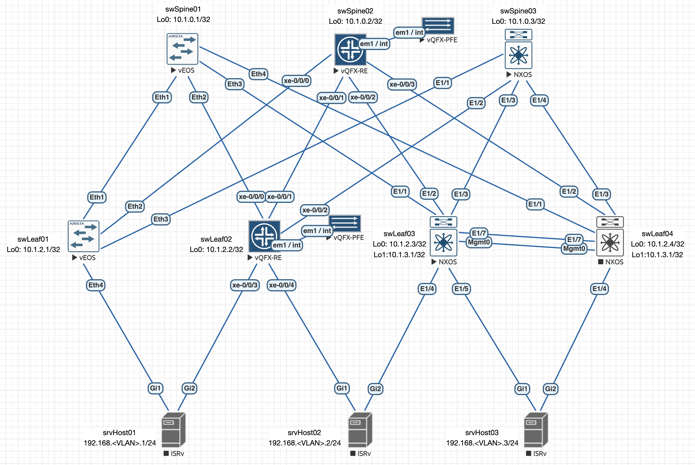

# Lab06: VxLAN. EVPN L3

## Состав работы
- [Условие задачи](#условие-задачи)
- [Описание выбранного решения](#описание-выбранного-решения)
- [Настройка Underlay (ISIS)](#настройка-underlay-isis)
  - [Коммутаторы Arista](#коммутаторы-arista)
  - [Коммутаторы Juniper](#коммутаторы-juniper)

### Условие задачи
В этой самостоятельной работе мы ожидаем, что вы самостоятельно:
- Настроите каждого клиента в своем VNI
- Настроите маршрутизацию между клиентами.
- Зафиксируете в документации - план работы, адресное пространство, схему сети, конфигурацию устройств

### Описание выбранного решения
Учитывая условие задачи, я буду выберу фабрику на базе коммутаторов Cisco Nexus 9000v, которые поддерживают единствнную сервисную модель VLAN-Based и маршрутизацию в ассиметричном режиме (Assymetric IRB).

Для построения подстилающей сети я выбираю протокол динамической маршрутизации ISIS, как наиболее гибкий и не зависящий от работоспособности стека IPv4/IPv6, что дает дополнительные выгоды при In-Band управлении.



### Настройка Underlay (ISIS)
На данном этапе необходимо выполнить всю подготовку, включаяя связанность между элементами фабрики на ребрах p2p, обнаружение и подстилающую сеть с использованием протокола ISIS.

#### Коммутаторы Arista
Настройка достаточно банальна, поэтому я приведу готовые конфигурации swSpine01:
```
hostname swSpine01
dns domain Underlay.local
!
spanning-tree mode mstp
!
interface Ethernet1
   description --- L3 p2p (no VLAN, no VRF): connection to swLeaf01:Ethernet1 (Arista)
   load-interval 60
   mtu 9000
   no switchport
   ip address unnumbered Loopback0
   ipv6 enable
   isis enable Underlay
   isis network point-to-point
!
interface Ethernet2
   description --- L3 p2p (no VLAN, no VRF): connection to swLeaf02:XE-0/0/0 (Juniper)
   load-interval 60
   mtu 9000
   no switchport
   ip address unnumbered Loopback0
   ipv6 enable
   isis enable Underlay
   isis network point-to-point
!
interface Ethernet3
   description --- L3 p2p (no VLAN, no VRF): connection to swLeaf03:Ethernet1/1 (Cisco)
   load-interval 60
   mtu 9000
   no switchport
   ip address unnumbered Loopback0
   ipv6 enable
   isis enable Underlay
   isis network point-to-point
!
interface Ethernet4
   description --- L3 p2p (no VLAN, no VRF): connection to swLeaf04:Ethernet1/1 (Cisco)
   load-interval 60
   mtu 9000
   no switchport
   ip address unnumbered Loopback0
   ipv6 enable
   isis enable Underlay
   isis network point-to-point
!
interface Loopback0
   description --- Loopback 0 (no VRF): interface for Underlay Control-Plane
   load-interval 60
   ip address 10.1.0.1/32
   isis enable Underlay
   isis passive
!
ip routing
!
ipv6 unicast-routing
!
router isis Underlay
   hello padding disabled
   net 49.0001.0100.0100.0001.00
   is-type level-2
   log-adjacency-changes
   !
   address-family ipv4 unicast
      maximum-paths 10
      bfd all-interfaces
!
end
```

Конфигурация коммутататора swLeaf01 аналогична.

Проверим работоспособность сервиса обнаружения LLDP:
```
swSpine01#show lldp neighbors
Last table change time   : 0:01:51 ago
Number of table inserts  : 7
Number of table deletes  : 6
Number of table drops    : 0
Number of table age-outs : 6

Port          Neighbor Device ID            Neighbor Port ID    TTL
---------- ----------------------------- ---------------------- ---
Et1           swLeaf01.Underlay.local       Ethernet1           120
```

Соседство по стеку IPv6 предназначенного для In-Band управления:
```
swSpine01#show ipv6 neighbors
IPv6 Address                                  Age Hardware Addr   Interface
fe80::5200:ff:fecb:38c2                   0:30:43 5000.00cb.38c2  Et1
```

и связанность через Link-local адреса:
```
swSpine01#ping fe80::5200:ff:fecb:38c2 interface ethernet 1 repeat 2
PING fe80::5200:ff:fecb:38c2%et1(fe80::5200:ff:fecb:38c2%et1) 52 data bytes
60 bytes from fe80::5200:ff:fecb:38c2%et1: icmp_seq=1 ttl=64 time=4.63 ms
60 bytes from fe80::5200:ff:fecb:38c2%et1: icmp_seq=2 ttl=64 time=1.60 ms

--- fe80::5200:ff:fecb:38c2%et1 ping statistics ---
2 packets transmitted, 2 received, 0% packet loss, time 8ms
rtt min/avg/max/mdev = 1.601/3.115/4.629/1.514 ms, ipg/ewma 7.680/4.250 ms
```

Проверим сходимость протокола ISIS:
```
swSpine01#show isis neighbors

Instance  VRF      System Id        Type Interface          SNPA              State Hold time   Circuit Id
Underlay  default  swLeaf01         L2   Ethernet1          P2P               UP    29          16
```

Полученные маршруты:
```
swSpine01#show ip route isis

VRF: default
Source Codes:
       C - connected, S - static, K - kernel,
       O - OSPF, IA - OSPF inter area, E1 - OSPF external type 1,
       E2 - OSPF external type 2, N1 - OSPF NSSA external type 1,
       N2 - OSPF NSSA external type2, B - Other BGP Routes,
       B I - iBGP, B E - eBGP, R - RIP, I L1 - IS-IS level 1,
       I L2 - IS-IS level 2, O3 - OSPFv3, A B - BGP Aggregate,
       A O - OSPF Summary, NG - Nexthop Group Static Route,
       V - VXLAN Control Service, M - Martian,
       DH - DHCP client installed default route,
       DP - Dynamic Policy Route, L - VRF Leaked,
       G  - gRIBI, RC - Route Cache Route,
       CL - CBF Leaked Route

 I L2     10.1.2.1/32
           directly connected, Ethernet1
```

И, наконец, проверим связанность между интерфейсами локальных петель:
```
swSpine01#ping 10.1.2.1 repeat 2
PING 10.1.2.1 (10.1.2.1) 72(100) bytes of data.
80 bytes from 10.1.2.1: icmp_seq=1 ttl=64 time=4.40 ms
80 bytes from 10.1.2.1: icmp_seq=2 ttl=64 time=3.91 ms

--- 10.1.2.1 ping statistics ---
2 packets transmitted, 2 received, 0% packet loss, time 7ms
rtt min/avg/max/mdev = 3.912/4.155/4.399/0.243 ms, ipg/ewma 7.199/4.338 ms
```

#### Коммутаторы Juniper
Начнем на стороне коммутатора `swSpine01`:
```


delete chassis auto-image-upgrade

```

Производим первый коммит:
```
root# commit
[edit]
  'system'
    Missing mandatory statement: 'root-authentication'
error: commit failed: (missing mandatory statements)

[edit]
root# set system root-authentication plain-text-password
New password:
Retype new password:
```

Дополнительные правки:
```
set protocols router-advertisement interface all    ! Включаем на всех портах IPv6 ND RA
set protocols lldp port-id-subtype interface-name   ! Чтобы показывал на соседях не SNMP-индекс, а название
```

Проверяем соседство LLDP:
```
swLeaf01#sh lldp neighbors
Last table change time   : 0:00:09 ago
Number of table inserts  : 3
Number of table deletes  : 0
Number of table drops    : 0
Number of table age-outs : 0

Port          Neighbor Device ID             Neighbor Port ID    TTL
---------- ------------------------------ ---------------------- ---
Et1           swSpine01.Underlay.local       Ethernet1           120
Et2           swSpine02.Underlay.local       522                 120
Et2           swSpine02.Underlay.local       xe-0/0/0            120
```

И состояние соседства IPv6:
```
root@swSpine02> show ipv6 neighbors
IPv6 Address                            Linklayer Address  State       Exp   Rtr  Secure  Interface
fe80::5200:ff:fecb:38c2                  50:00:00:cb:38:c2  stale       1054  yes  no      xe-0/0/0.0
```

Со стороны Arista swLeaf01:
```
swLeaf01#sh ipv6 neighbors
IPv6 Address                                  Age Hardware Addr   Interface
fe80::5200:ff:fed7:ee0b                   0:16:51 5000.00d7.ee0b  Et1
fe80::205:86ff:fe71:603                   0:00:24 0205.8671.0603  Et2
```

Проверяем связанность по In-Band:
```
root@swSpine02> ping fe80::5200:ff:fecb:38c2
PING6(56=40+8+8 bytes) fe80::205:86ff:fe71:603 --> fe80::5200:ff:fecb:38c2
16 bytes from fe80::5200:ff:fecb:38c2, icmp_seq=0 hlim=64 time=121.401 ms
16 bytes from fe80::5200:ff:fecb:38c2, icmp_seq=1 hlim=64 time=113.242 ms
^C
--- fe80::5200:ff:fecb:38c2 ping6 statistics ---
2 packets transmitted, 2 packets received, 0% packet loss
round-trip min/avg/max/std-dev = 113.242/117.322/121.401/4.080 ms

{master:0}
root@swSpine02> ping fe80::205:86ff:fe71:df07
PING6(56=40+8+8 bytes) fe80::205:86ff:fe71:607 --> fe80::205:86ff:fe71:df07
16 bytes from fe80::205:86ff:fe71:df07, icmp_seq=0 hlim=64 time=440.878 ms
16 bytes from fe80::205:86ff:fe71:df07, icmp_seq=1 hlim=64 time=445.353 ms
^C
--- fe80::205:86ff:fe71:df07 ping6 statistics ---
2 packets transmitted, 2 packets received, 0% packet loss
round-trip min/avg/max/std-dev = 122.430/233.850/445.353/126.772 ms
```

Далее, переходим к настройке протокола ISIS:
```
set interfaces lo0 unit 0 family iso address 49.0001.0100.0100.0002.00

set interfaces xe-0/0/0 unit 0 family iso
set interfaces xe-0/0/1 unit 0 family iso
set interfaces xe-0/0/2 unit 0 family iso
set interfaces xe-0/0/3 unit 0 family iso

set interfaces xe-0/0/1 unit 0 proxy-arp
set interfaces xe-0/0/2 unit 0 proxy-arp
set interfaces xe-0/0/3 unit 0 proxy-arp

set protocols isis interface lo0.0 passive

set protocols isis interface xe-0/0/0.0 point-to-point
set protocols isis interface xe-0/0/0.0 level 1 disable
set protocols isis interface xe-0/0/0.0 hello-padding disable

set protocols isis interface xe-0/0/1.0 point-to-point
set protocols isis interface xe-0/0/1.0 level 1 disable
set protocols isis interface xe-0/0/1.0 hello-padding disable

set protocols isis interface xe-0/0/2.0 point-to-point
set protocols isis interface xe-0/0/2.0 level 1 disable
set protocols isis interface xe-0/0/2.0 hello-padding disable

set protocols isis interface xe-0/0/3.0 point-to-point
set protocols isis interface xe-0/0/3.0 level 1 disable
set protocols isis interface xe-0/0/3.0 hello-padding disable
```

Проверяем сходимость:
```
root@swLeaf02> show isis database
IS-IS level 1 link-state database:
LSP ID                      Sequence Checksum Lifetime Attributes
swLeaf02.00-00                   0x1   0x9497     1150 L1 L2
  1 LSPs

IS-IS level 2 link-state database:
LSP ID                      Sequence Checksum Lifetime Attributes
swSpine01.00-00                  0x9   0x6408     1161 L1 L2
swSpine02.00-00                  0x3   0x5c22     1190 L1 L2
swLeaf01.00-00                   0xa   0xbe4f     1129 L1 L2
swLeaf02.00-00                   0x2   0x27d2     1162 L1 L2
  4 LSPs
```

Полученные через ISIS маршруты:
```
root@swLeaf02> show route protocol isis

inet.0: 6 destinations, 6 routes (6 active, 0 holddown, 0 hidden)
+ = Active Route, - = Last Active, * = Both

10.1.0.1/32        *[IS-IS/18] 00:01:13, metric 20
                    >  to 10.1.0.1 via xe-0/0/0.0
10.1.0.2/32        *[IS-IS/18] 00:01:12, metric 30
                    >  to 10.1.0.1 via xe-0/0/0.0
10.1.2.1/32        *[IS-IS/18] 00:01:12, metric 30
                    >  to 10.1.0.1 via xe-0/0/0.0

iso.0: 1 destinations, 1 routes (1 active, 0 holddown, 0 hidden)

inet6.0: 4 destinations, 4 routes (4 active, 0 holddown, 0 hidden)
```

И, наконец, связанность с остальными коммутаторами фабрики:
```
root@swLeaf02> ping count 2 10.1.0.1
PING 10.1.0.1 (10.1.0.1): 56 data bytes
64 bytes from 10.1.0.1: icmp_seq=0 ttl=64 time=110.828 ms
64 bytes from 10.1.0.1: icmp_seq=1 ttl=64 time=109.897 ms

--- 10.1.0.1 ping statistics ---
2 packets transmitted, 2 packets received, 0% packet loss
round-trip min/avg/max/stddev = 109.897/110.363/110.828/0.465 ms

{master:0}
root@swLeaf02> ping count 2 10.1.0.2
PING 10.1.0.2 (10.1.0.2): 56 data bytes
64 bytes from 10.1.0.2: icmp_seq=0 ttl=62 time=131.324 ms
64 bytes from 10.1.0.2: icmp_seq=1 ttl=62 time=145.245 ms

--- 10.1.0.2 ping statistics ---
2 packets transmitted, 2 packets received, 0% packet loss
round-trip min/avg/max/stddev = 131.324/138.285/145.245/6.961 ms

{master:0}
root@swLeaf02> ping count 2 10.1.2.1
PING 10.1.2.1 (10.1.2.1): 56 data bytes
64 bytes from 10.1.2.1: icmp_seq=0 ttl=63 time=136.143 ms
64 bytes from 10.1.2.1: icmp_seq=1 ttl=63 time=170.102 ms

--- 10.1.2.1 ping statistics ---
2 packets transmitted, 2 packets received, 0% packet loss
round-trip min/avg/max/stddev = 136.143/153.123/170.102/16.980 ms
```

### Коммутаторы Cisco Nexus 9000v
Конфигурация swSpine03:
```
hostname swSpine03
!
feature isis
feature lldp
feature bfd
!
ip domain-name Underlay.local
!
interface Ethernet1/1
  description --- L3 p2p (no VLAN, no VRF): connection to swLeaf01:Ethernet3 (Ar
ista)
  mtu 9000
  load-interval counter 1 60
  medium p2p
  ip unnumbered loopback0
  ipv6 link-local use-bia
  ipv6 nd reachable-time 30000
  isis network point-to-point
  ip router isis Underlay
  no shutdown

interface Ethernet1/2
  description --- L3 p2p (no VLAN, no VRF): connection to swLeaf02:XE-0/0/2 (Jun
iper)
  mtu 9000
  load-interval counter 1 60
  medium p2p
  ip unnumbered loopback0
  ipv6 link-local use-bia
  ipv6 nd reachable-time 30000
  isis network point-to-point
  ip router isis Underlay
  no shutdown

interface Ethernet1/3
  description --- L3 p2p (no VLAN, no VRF): connection to swLeaf03:Ethernet1/3 (
Cisco)
  mtu 9000
  load-interval counter 1 60
  medium p2p
  ip unnumbered loopback0
  ipv6 link-local use-bia
  ipv6 nd reachable-time 30000
  isis network point-to-point
  ip router isis Underlay
  no shutdown

interface Ethernet1/4
  mtu 9000
  load-interval counter 1 60
  medium p2p
  ip unnumbered loopback0
  ipv6 link-local use-bia
  ipv6 nd reachable-time 30000
  isis network point-to-point
  ip router isis Underlay
  no shutdown
!
interface loopback0
  description --- Loopback 0 (no VRF): interface for Underlay Control-Plane
  ip address 10.1.0.3/32
  ip router isis Underlay
  isis passive-interface level-1-2
!
boot nxos bootflash:/nxos64-cs.10.5.2.F.bin
router isis Underlay
  net 49.0001.0100.0100.0003.00
  is-type level-2
  log-adjacency-changes
  address-family ipv4 unicast
    bfd
    maximum-paths 10
```

При включении BFD я получил следующее диагностическое сообщение:
```
swSpine03(config)# feature bfd
Please disable the ICMP / ICMPv6 redirects on all IPv4 and IPv6 interfaces
running BFD sessions using the commands below

'no ip redirects '
'no ipv6 redirects '

Please configure relaxed BFD intervals when scaling above a total of 128 BFD sessions
on Cloudscale platforms and Silicon One platforms using the commands below

'bfd interval 300 min_rx 300 multiplier 3'
'bfd multihop interval 999 min_rx 999 multiplier 10'
```

Проверяем обнаружение по LLDP:
```
swSpine02(config)# sh lldp neighbors
ERROR: No neighbour information

swSpine02(config)# sh lldp all
Interface Information: Eth1/8 Enable (tx/rx/dcbx): Y/Y/N
Interface Information: Eth1/7 Enable (tx/rx/dcbx): Y/Y/N
Interface Information: Eth1/6 Enable (tx/rx/dcbx): Y/Y/N
Interface Information: Eth1/5 Enable (tx/rx/dcbx): Y/Y/N
Interface Information: Eth1/4 Enable (tx/rx/dcbx): Y/Y/N
Interface Information: Eth1/3 Enable (tx/rx/dcbx): Y/Y/N
Interface Information: Eth1/2 Enable (tx/rx/dcbx): Y/Y/N
Interface Information: Eth1/1 Enable (tx/rx/dcbx): Y/Y/N
Interface Information: mgmt0 Enable (tx/rx/dcbx): Y/Y/N

swSpine02(config)# show lldp traffic
LLDP traffic statistics:

    Total frames transmitted: 80
    Total entries aged: 0
    Total frames received: 0
    Total frames received in error: 0
    Total frames discarded: 0
    Total unrecognized TLVs: 0
    Total flap count: 0
```

Как видно из вывода, от Cisco трафик уходит, но на нее не приходит от соседей.

Переходим на Arista:
```
swLeaf01#show lldp counters ethernet 3

Port          Tx Frames    Tx Length Exceeded
---------- --------------- ------------------
Et3           73           0

Port     Rx Frames     Rx Errors     Rx Discard     TLVs Discard   TLVs Unknown
------- ------------ ------------- -------------- ---------------- ------------
Et3      44            0             0              0              78
```

и видим, что Arista и принимает от Cisco LLDP пакеты и передеет.

> Виртуальный Cisco Nexus 9000v генерирует LLDP-пакеты со специфическими опциями (включая служебные поля управления 802.1Q, кастомные TLV управления и остатки DCBXP). Из-за несовместимости структуры кадра Nexus, скорее всего, игнорирует ответы от Arista, поэтому произведем на Cisco следующие изменения:
```
no lldp tlv-select dcbxp
no lldp tlv-select port-vlan
no lldp tlv-select power-management
```

и вуаля:
```
swSpine02(config-if)# sh lldp neighbors
Capability codes:
  (R) Router, (B) Bridge, (T) Telephone, (C) DOCSIS Cable Device
  (W) WLAN Access Point, (P) Repeater, (S) Station, (O) Other
Device ID            Local Intf      Hold-time  Capability  Port ID
swLeaf01.Underlay.local
                     Eth1/1          120        BR          Ethernet3
Total entries displayed: 1
```

А вот с обнаружением IPv6 добиться нормальной работоспособности сервиса ND RA так и не получилось. Несмотря на то, что стек IPv6 поднялся и Link-local адреса коммутатор сгенерировал:
```
swSpine03# show ipv6 interface brief
IPv6 Interface Status for VRF "default"(1)
Interface        IPv6 Address/Link-local Address           Interface Status
                                                           prot/link/admin
Eth1/1           fe80::5205:ff:fe00:1b08                   up/up/up
                 fe80::5205:ff:fe00:1b08
Eth1/2           fe80::5205:ff:fe00:1b08                   down/down/down
                 fe80::5205:ff:fe00:1b08
Eth1/3           fe80::5205:ff:fe00:1b08                   down/down/down
                 fe80::5205:ff:fe00:1b08
Eth1/4           fe80::5205:ff:fe00:1b08                   down/down/down
                 fe80::5205:ff:fe00:1b08
```

соседство так и не заработало:
```
swSpine02# sh ipv6 neighbor

Flags: # - Adjacencies Throttled for Glean
       G - Adjacencies of vPC peer with G/W bit
       R - Adjacencies learnt remotely
       CP - Added via L2RIB, Control plane Adjacencies
       PS - Added via L2RIB, Peer Sync
       RO - Re-Originated Peer Sync Entry
       CC - Consistency check pending
       D  - Drop Adjacency

IPv6 Adjacency Table for VRF default
Total number of entries: 0
Address         Age       MAC Address     Pref Source     Interface         Mobi
lity Flags
```

Но со стороны swLeaf01 (Arista) мы видим наш коммутатор:
```
swLeaf01#sh ipv6 neighbors
IPv6 Address                                  Age Hardware Addr   Interface
fe80::5200:ff:fed7:ee0b                   0:44:17 5000.00d7.ee0b  Et1
fe80::5205:ff:fe00:1b08                   0:39:17 5005.0000.1b08  Et3
```

Со стороны swSpine03 есть связанность:
```
swSpine02# ping6 fe80::5205:ff:fe00:1b08 source-interface ethernet 1/1
PING6 fe80::5205:ff:fe00:1b08 (fe80::5205:ff:fe00:1b08): 56 data bytes
64 bytes from fe80::5205:ff:fe00:1b08: icmp_seq=0 time=1.977 ms
64 bytes from fe80::5205:ff:fe00:1b08: icmp_seq=1 time=1.324 ms

--- fe80::5205:ff:fe00:1b08 ping6 statistics ---
2 packets transmitted, 2 packets received, 0.00% packet loss
round-trip min/avg/max = 1.243/2.541/4.353 ms
```

Далее, проверяем сходимость ISIS:
```
swSpine03# sh isis database
IS-IS Process: Underlay LSP database VRF: default
IS-IS Level-1 Link State Database
  LSPID                 Seq Number   Checksum  Lifetime   A/P/O/T

IS-IS Level-2 Link State Database
  LSPID                 Seq Number   Checksum  Lifetime   A/P/O/T
  swSpine01.00-00       0x00000006   0xB4F3    831        0/0/0/3
  swSpine03.00-00     * 0x00000004   0xBCCD    1169       0/0/0/3
  swLeaf01.00-00        0x00000006   0xE32D    1168       0/0/0/3
```

Как видно - все замечательно.

Проверим таблицу маршрутизпции:
```
swSpine03# sh ip route
IP Route Table for VRF "default"
'*' denotes best ucast next-hop
'**' denotes best mcast next-hop
'[x/y]' denotes [preference/metric]
'%<string>' in via output denotes VRF <string>

10.1.0.1/32, ubest/mbest: 1/0
    *via 10.1.2.1, Eth1/1, [115/60], 00:06:48, isis-Underlay, L2
10.1.0.3/32, ubest/mbest: 2/0, attached
    *via 10.1.0.3, Lo0, [0/0], 00:12:12, local
    *via 10.1.0.3, Lo0, [0/0], 00:12:12, direct
10.1.2.1/32, ubest/mbest: 1/0
    *via 10.1.2.1, Eth1/1, [115/50], 00:06:51, isis-Underlay, L2
```

и можно проверить связанность с интерфейсами локальных петель настроенной части фабрики:
```
swSpine03# ping 10.1.0.1
PING 10.1.0.1 (10.1.0.1): 56 data bytes
64 bytes from 10.1.0.1: icmp_seq=0 ttl=62 time=8.383 ms
64 bytes from 10.1.0.1: icmp_seq=1 ttl=62 time=11.029 ms
64 bytes from 10.1.0.1: icmp_seq=2 ttl=62 time=10.286 ms
64 bytes from 10.1.0.1: icmp_seq=3 ttl=62 time=10.755 ms
64 bytes from 10.1.0.1: icmp_seq=4 ttl=62 time=7.962 ms

--- 10.1.0.1 ping statistics ---
5 packets transmitted, 5 packets received, 0.00% packet loss
round-trip min/avg/max = 7.962/9.683/11.029 ms
```