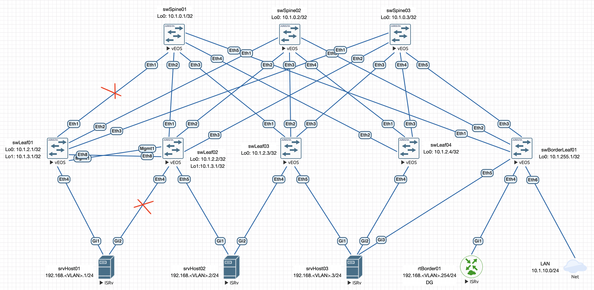
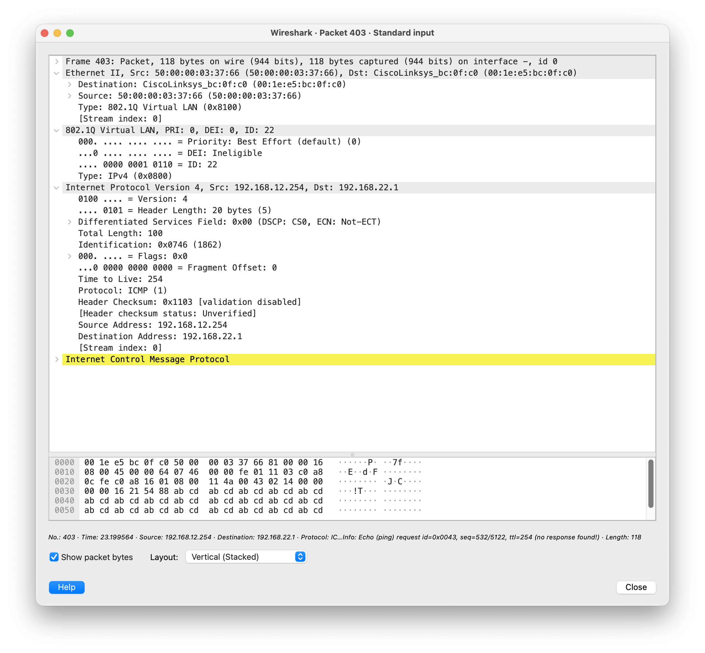

# Lab07: VxLAN. Аналоги VPC

## Состав работы
- [Условие задачи](#условие-задачи)
- [Описание выбранного решения](#описание-выбранного-решения)
- [Абонентское подключение MLAG парой (L2)](#абонентское-подключение-mlag-парой-l2)
   - [Краткое описание технологии MLAG](#краткое-описание-технологии-mlag)
   - [Настройка MLAG на стороне фабрики](#настройка-mlag-на-стороне-фабрики)
   - [Абонентское подключение и наcтройка оверлэй-маршрутизации (MLAG)](#абонентское-подключение-и-наcтройка-оверлэй-маршрутизации-mlag)
   - [Команды дополнительной диагностики MLAG](#команды-дополнительной-диагностики-mlag)
   - [Тестирование сбоя (MLAG)](#тестирование-сбоя-mlag)
- [Абонентское подключение с использованием технологии Multi-Homing (L2)](#абонентское-подключение-с-использованием-технологии-multi-homing-l2)
   - [Краткое описание технологии Multi-Homing](#краткое-описание-технологии-multi-homing)
   - [Настройка Multi-Homing на стороне фабрики](#настройка-multi-homing-на-стороне-фабрики)
   - [Настройка абонентского подключения (Multi-Himing)](#настройка-абонентского-подключения-multi-himing)
   - [Команды дополнительной диагностики Multi-Homing](#команды-дополнительной-диагностики-multi-homing)
   - [Тестирование сбоя (Multi-Homing)](#тестирование-сбоя-multi-homing)
- [Абонентское подключение L3](#абонентское-подключение-l3)
   - [Абонентское подключение L3 с использованием iBGP](#абонентское-подключение-l3-с-использованием-ibgp)
   - [Абонентское подключение L3 с использованием eBGP](#абонентское-подключение-l3-с-использованием-ebgp)
### Условие задачи
В этой самостоятельной работе мы ожидаем, что вы самостоятельно:
1. Подключите клиентов 2-я линками к различным Leaf
2. Настроите агрегированный канал со стороны клиента
3. Настроите multihoming для работы в Overlay сети. Если используете Cisco NXOS - vPC, если иной вендор - то ESI LAG (либо MC-LAG с поддержкой VXLAN)
4. Зафиксируете в документации - план работы, адресное пространство, схему сети, конфигурацию устройств
5. Опционально - протестировать отказоустойчивость - убедиться, что связнность не теряется при отключении одного из линков

### Описание выбранного решения
Продолжу работать со схемой, собранной в [предудущей лабораторной](https://github.com/abeskrovny/OTuS-DC-Networks/blob/main/Lab06/README.md).

Схема сети имеет следующий вид:


### Абонентское подключение MLAG парой (L2)

#### Краткое описание технологии MLAG
Arista MLAG — это фирменная технология агрегации каналов, которая позволяет объединить два физических (или виртуальных vEOS) коммутатора Leaf-уровня в одну логическую сущность для подключенных к ним серверов или других коммутаторов.

Главные преимущества и архитектура MLAG в Arista EOS:
- **Active/Active топология**: В отличие от классического Spanning Tree (STP), который блокирует резервные каналы, MLAG позволяет использовать 100% полосы пропускания всех аплинков.
- **Независимый Control Plane**: В отличие от технологий стекирования (где два коммутатора превращаются в один с общим Control Plane), в паре Arista MLAG каждый коммутатор сохраняет свой независимый Control Plane. Если на одном коммутаторе упадет ОС или обновится прошивка, второй продолжит передавать трафик без штормов и простоев.
- **Стандартизация для клиентов**: Серверу не нужно знать про протоколы Arista. Он подключается к двум Leaf'ам по стандартному протоколу LACP (802.3ad).

Для сборки этой схемы в классическом варианте понадобятся три базовые вещи:
- **Peer Link** (Коммутатор–Коммутатор): Физический стык между двумя коммутаторами Leaf (обычно Port-Channel из 2-4 линков). По нему синхронизируются таблицы MAC-адресов, ARP и состояния портов.
- **Peer-VLAN и SVI**: Специальный изолированный служебный VLAN (обычно используют VLAN 4094), в котором настраиваются IP-адреса для общения Лифов друг с другом (heartbeat).
- **MLAG ID**: Идентификатор, который присваивается клиентскому Port-Channel. По этому ID оба Leaf'а понимают, что этот конкретный порт подключен к одному и тому же серверу.

Внедрение MLAG в оверлейную сеть (EVPN-VxLAN) кардинально меняет поведение фабрики и является золотым стандартом для ЦОД. В терминологии Arista и стандартов RFC такая топология называется All-Active EVPN-MLAG.

Главное изменение заключается в том, что пара Лифов начинает работать как один виртуальный VTEP, что подразумевает следующие архитектурные изменения в технологии MLAG:
- **Единый (Shared) VTEP IP (Anycast VTEP)**: В классическом решении (без многослойной структуры сети) у каждого коммутатора Leaf имеется свой уникальный VTEP IP. В схеме с MLAG на обоих коммутаторах настраивается дополнительный одинаковый Loopback-интерфейс (`Loopback1`), который используется в качестве точки терминирования VxLAN. Вся остальная фабрика (включая и коммутаторы уровня Spine) видят пару Leaf'ов как одно устройство.
- **Маршруты BGP EVPN (ESI — Ethernet Segment Identifier)**: При анонсировании MAC-адресов, прилетающих c абонентских интерфейсов через MLAG-порт, оба Leaf ставят в BGP-маршрут специальный маркер — ESI. Благодаря этому удаленные Leaf'ы знают, что хост подключен к "All-Active" группе, и могут балансировать VxLAN-трафик на оба Leaf одновременно (ECMP).
- **Локальная маршрутизация через Peer-Link**: Если пакет прилетит из VxLAN-туннеля на `swLeaf01`, а нужный линк MLAG до роутера в этот момент активен на `swLeaf02`, пакет пройдет через внутренний Peer-Link стык коммутаторов.

#### Настройка MLAG на стороне фабрики
Начнем с определения VRF:
```
vrf instance vrfASYM-IRB01
   description --- VRF: RIB for Overlay Data-Plane of Assymetric IRB
!
vrf instance vrfSYM-IRB01
   description --- VRF: RIB for Overlay Data-Plane of Symmetric IRB
```

Опишем L2: пользовательские, транзитный и Peer-Link MLAG:
```
vlan 11
   name VLAN-BASED01
!
vlan 12
   name VLAN-BASED02
!
vlan 21
   name VLAN-AWARE01
!
vlan 22
   name VLAN-AWARE02
!
vlan 4001
   name L3VNI01
!
vlan 4094
   name MLAG-PEER-CONTROL
   trunk group MLAG-Peer-Link
```

Здесь следует обратить внимание на директиву `trunk group MLAG-Peer-Link`. Она изолирует указанный VLAN (или, вообще говоря, диапазон VLAN) и запрещает его автоматическую передачу по всем остальным транк-портам коммутатора даже с выставленным `switchport trunk allowed vlan all`, разрешая его прохождение строго внутри конкретной транк-группы.

Хорошим решением является использование для Peer-Link'а агрегированного порта - это позволит масштабировать полосу пропускания для состояния отказа одной из "голов" пары. Производитель крайне не рекомендует "смешивать" данный трафик ввиду его чувствительности к случайному пользовательсному трафику, который будет восприниматься парой как мусорный. 

Зададим виртуальный MAC-адрес фабрики:
```
ip virtual-router mac-address 00:1c:73:00:00:01
```

он уникален для всех коммутаторов фабрики.

Соберем агрегат для Peer-Link'а на основе портов `Ethernet8` на обоих коммутаторах:
```
interface Ethernet8
   description --- Port-channel 4094 (LACP): Channel-group for MLAG Peer-Link
   channel-group 4094 mode active
!
interface Port-Channel4094
   description --- Trunk (VLAN001): Channel-group for MLAG Peer-Link
   switchport mode trunk
   switchport trunk group MLAG-Peer-Link     ! Ограничиваем разрешенные VLAN только Peer-Link VLAN
```

Если сейчас посмотреть состояние интерфейсов (я делаю изменения на обоих "головах одновременно"), увидим их состояние:
```
swLeaf01#sh int status
Port       Name                                                             Status       Vlan      Duplex Speed  Type            Flags Encapsulation
Et1        --- L3 p2p (no VLAN, no VRF): connection for swSpine01:Ethernet1 connected    routed    full   1G     EbraTestPhyPort
Et2        --- L3 p2p (no VLAN, no VRF): connection for swSpine02:Ethernet1 connected    routed    full   1G     EbraTestPhyPort
Et3        --- L3 p2p (no VLAN, no VRF): connection for swSpine03:Ethernet1 connected    routed    full   1G     EbraTestPhyPort
Et4                                                                         connected    1         full   1G     EbraTestPhyPort
Et5                                                                         connected    1         full   1G     EbraTestPhyPort
Et6                                                                         connected    1         full   1G     EbraTestPhyPort
Et7                                                                         connected    1         full   1G     EbraTestPhyPort
Et8        --- Port-channel 4094 (LACP): Channel-group for MLAG Peer-Link   connected    in Po4094 full   1G     EbraTestPhyPort
Ma1                                                                         disabled     routed    a-full a-1G   10/100/1000
Po4094     --- Trunk (VLAN001): Channel-group for MLAG Peer-Link            connected    trunk     full   1G     N/A
```

Если L2 "поднят" и работоспособен, можно продолжать дальше и переходить к настройкам L3.

На уровне подстилающей сети нам нужно создать дополнительный петлевой интерфейс с общим IP-адресом на паре коммутаторов уровня Leaf, составляющих MLAG-пару, и включить его в процесс маршрутизации:
```
interface Loopback1
   description --- Loopback 1 (no VRF): interface for vPC instance
   load-interval 60
   ip address 10.1.1.1/32
   isis enable Underlay
   isis passive
```

Данная конфигурация должна быть произведена на обоих коммутаторах MLAG-пары.

В результате мы получим следующую картину (со стороны коммутатора уровня Spine):
```
swSpine01#sh ip route 10.1.1.1

VRF: default
Source Codes:
       C - connected, S - static, K - kernel,
       O - OSPF, IA - OSPF inter area, E1 - OSPF external type 1,
       E2 - OSPF external type 2, N1 - OSPF NSSA external type 1,
       N2 - OSPF NSSA external type2, B - Other BGP Routes,
       B I - iBGP, B E - eBGP, R - RIP, I L1 - IS-IS level 1,
       I L2 - IS-IS level 2, O3 - OSPFv3, A B - BGP Aggregate,
       A O - OSPF Summary, NG - Nexthop Group Static Route,
       V - VXLAN Control Service, M - Martian,
       DH - DHCP client installed default route,
       DP - Dynamic Policy Route, L - VRF Leaked,
       G  - gRIBI, RC - Route Cache Route,
       CL - CBF Leaked Route

 I L2     10.1.1.1/32 [115/20]
           via 10.1.2.1, Ethernet1
           via 10.1.2.2, Ethernet2
```

Экземпляр iBGP процесса при соседстве со Spine'ами будут продолжать использовать петлю `loopback0` в качестве `update-source`, строя соседство для каждого Leaf'а участника MLAG раздельно.

Настроим SVI-интерфейсы:
```
interface Vlan11
   description --- Virtual (VLAN011:VLAN-BASED01, VRF:vrfASYM-IRB01): L3 termination point
   vrf vrfASYM-IRB01
   ip address 192.168.11.201/24
   ip virtual-router address 192.168.11.253
!
interface Vlan12
   description --- Virtual (VLAN012:VLAN-BASED02, VRF:vrfSYM-IRB01): L3 termination point
   vrf vrfSYM-IRB01
   ip address 192.168.12.201/24
   ip virtual-router address 192.168.12.253
!
interface Vlan21
   description --- Virtual (VLAN021:VLAN-AWARE01, VRF:vrfASYM-IRB01): L3 termination point
   vrf vrfASYM-IRB01
   ip address 192.168.21.201/24
   ip virtual-router address 192.168.21.253
!
interface Vlan22
   description --- Virtual (VLAN022:VLAN-AWARE02, VRF:vrfSYM-IRB01): L3 termination point
   vrf vrfSYM-IRB01
   ip address 192.168.22.201/24
   ip virtual-router address 192.168.22.253
!
interface Vlan4001
   description --- Virtual (VLAN:L3VNI01, VRF:vrfL3VNI01): L3 transport interface
   no autostate
   vrf vrfSYM-IRB01
```

Я разделю L3-функционал p2p связей двух MLAG-голов: выделенный канал через интерфейс `Management1` будет использоваться исключетельно для Heartbeat-фунционала. Этот подход является корректным и соответствующим рекомендациям Arista Design Guide для предотвращения сценария Split-Brain.
```
interface Vlan4094
   description --- Virtual (VLAN:MLAG-PEER-CONTROL, no VRF): L2 MLAG Peer-Link Control IP
   no autostate                     ! Оставляем интерфейс включенным постоянно
   ip address 172.16.1.0/31
```

> В терминологии и конфигурации Arista MLAG резервный канал связи для проверки доступности соседа чаще всего называют одним из трех вариантов: `mlag-peer-check` (или `mlag-heartbeat`) — это техническое название самого функционала в документации (сервис отправки Heartbeat-пакетов). Peer-Link Backup — официальный термин Arista для этой роли.

IP-адрес на Peer-Link (`interface Vlan4094`) остается обязательным, так как он обслуживает основной Control Plane MLAG и синхронизирует служебные данные через протокол *MlagApp*, в то время как `Management`-порт рассчитан исключительно на легкие UDP-пакеты проверки состояния.
```
interface Management1
   description --- L3 p2p (no VLAN, no VRF): interface for MLAG heard-beat
   ip address 172.16.2.0/31
```

> На физических интерфейсах (в том числе и `Management1`) отсутствует опция `no autostate`. Ввиду этого, не очень хорошей идеей видится коммутация его через третье активное оборудование.

Сразу проверим связанность с техническими интерфейсами:
```
swLeaf01#ping 172.16.1.1
PING 172.16.1.1 (172.16.1.1) 72(100) bytes of data.
80 bytes from 172.16.1.1: icmp_seq=1 ttl=64 time=29.3 ms
80 bytes from 172.16.1.1: icmp_seq=2 ttl=64 time=26.9 ms
80 bytes from 172.16.1.1: icmp_seq=3 ttl=64 time=18.7 ms
80 bytes from 172.16.1.1: icmp_seq=4 ttl=64 time=18.9 ms
80 bytes from 172.16.1.1: icmp_seq=5 ttl=64 time=30.2 ms

--- 172.16.1.1 ping statistics ---
5 packets transmitted, 5 received, 0% packet loss, time 112ms
rtt min/avg/max/mdev = 18.660/24.784/30.175/5.036 ms, pipe 4, ipg/ewma 28.090/27.057 ms

swLeaf01#ping 172.16.2.1
PING 172.16.2.1 (172.16.2.1) 72(100) bytes of data.
80 bytes from 172.16.2.1: icmp_seq=1 ttl=64 time=7.83 ms
80 bytes from 172.16.2.1: icmp_seq=2 ttl=64 time=1.46 ms
80 bytes from 172.16.2.1: icmp_seq=3 ttl=64 time=5.36 ms
80 bytes from 172.16.2.1: icmp_seq=4 ttl=64 time=2.23 ms
80 bytes from 172.16.2.1: icmp_seq=5 ttl=64 time=3.00 ms

--- 172.16.2.1 ping statistics ---
5 packets transmitted, 5 received, 0% packet loss, time 107ms
rtt min/avg/max/mdev = 1.456/3.976/7.834/2.330 ms, pipe 2, ipg/ewma 26.869/5.846 ms

swLeaf01#sh arp
Address         Age (sec)  Hardware Addr   Interface
10.1.0.1          0:00:13  5000.00d7.ee0b  Ethernet1
10.1.0.2          0:00:31  5000.00d5.5dc0  Ethernet2
10.1.0.3          0:00:42  5000.00f6.ad37  Ethernet3
172.16.1.1        0:00:56  5000.0003.3766  Vlan4094, Port-Channel4094
172.16.2.1        0:00:07  5000.0004.0000  Management1
```

Включим маршрутизацию во всех VRF:
```
ip routing vrf vrfASYM-IRB01
ip routing vrf vrfSYM-IRB01
```

Состояние таблиц RIB во всех VRF:
```
swLeaf01#sh ip route vrf all

VRF: default
Source Codes:
       C - connected, S - static, K - kernel,
       O - OSPF, IA - OSPF inter area, E1 - OSPF external type 1,
       E2 - OSPF external type 2, N1 - OSPF NSSA external type 1,
       N2 - OSPF NSSA external type2, B - Other BGP Routes,
       B I - iBGP, B E - eBGP, R - RIP, I L1 - IS-IS level 1,
       I L2 - IS-IS level 2, O3 - OSPFv3, A B - BGP Aggregate,
       A O - OSPF Summary, NG - Nexthop Group Static Route,
       V - VXLAN Control Service, M - Martian,
       DH - DHCP client installed default route,
       DP - Dynamic Policy Route, L - VRF Leaked,
       G  - gRIBI, RC - Route Cache Route,
       CL - CBF Leaked Route

Gateway of last resort is not set

 I L2     10.1.0.1/32
           directly connected, Ethernet1
 I L2     10.1.0.2/32
           directly connected, Ethernet2
 I L2     10.1.0.3/32
           directly connected, Ethernet3
 C        10.1.1.1/32
           directly connected, Loopback1
 C        10.1.2.1/32
           directly connected, Loopback0
 I L2     10.1.2.2/32 [115/30]
           via 10.1.0.1, Ethernet1
           via 10.1.0.2, Ethernet2
           via 10.1.0.3, Ethernet3
 I L2     10.1.2.3/32 [115/30]
           via 10.1.0.1, Ethernet1
           via 10.1.0.2, Ethernet2
           via 10.1.0.3, Ethernet3
 I L2     10.1.2.4/32 [115/30]
           via 10.1.0.1, Ethernet1
           via 10.1.0.2, Ethernet2
           via 10.1.0.3, Ethernet3
 I L2     10.1.255.1/32 [115/30]
           via 10.1.0.1, Ethernet1
           via 10.1.0.2, Ethernet2
           via 10.1.0.3, Ethernet3
 C        172.16.1.0/31
           directly connected, Vlan4094
 C        172.16.2.0/31
           directly connected, Management1


VRF: vrfASYM-IRB01
Source Codes:
       C - connected, S - static, K - kernel,
       O - OSPF, IA - OSPF inter area, E1 - OSPF external type 1,
       E2 - OSPF external type 2, N1 - OSPF NSSA external type 1,
       N2 - OSPF NSSA external type2, B - Other BGP Routes,
       B I - iBGP, B E - eBGP, R - RIP, I L1 - IS-IS level 1,
       I L2 - IS-IS level 2, O3 - OSPFv3, A B - BGP Aggregate,
       A O - OSPF Summary, NG - Nexthop Group Static Route,
       V - VXLAN Control Service, M - Martian,
       DH - DHCP client installed default route,
       DP - Dynamic Policy Route, L - VRF Leaked,
       G  - gRIBI, RC - Route Cache Route,
       CL - CBF Leaked Route

Gateway of last resort is not set

 C        192.168.11.0/24
           directly connected, Vlan11
 C        192.168.21.0/24
           directly connected, Vlan21


VRF: vrfSYM-IRB01
Source Codes:
       C - connected, S - static, K - kernel,
       O - OSPF, IA - OSPF inter area, E1 - OSPF external type 1,
       E2 - OSPF external type 2, N1 - OSPF NSSA external type 1,
       N2 - OSPF NSSA external type2, B - Other BGP Routes,
       B I - iBGP, B E - eBGP, R - RIP, I L1 - IS-IS level 1,
       I L2 - IS-IS level 2, O3 - OSPFv3, A B - BGP Aggregate,
       A O - OSPF Summary, NG - Nexthop Group Static Route,
       V - VXLAN Control Service, M - Martian,
       DH - DHCP client installed default route,
       DP - Dynamic Policy Route, L - VRF Leaked,
       G  - gRIBI, RC - Route Cache Route,
       CL - CBF Leaked Route

Gateway of last resort is not set

 C        192.168.12.0/24
           directly connected, Vlan12
 C        192.168.22.0/24
           directly connected, Vlan22
```

Все готово для активации домена MLAG:
```
mlag configuration
   domain-id mlagLeaf01
   peer-link Port-Channel4094             ! L2 интерфейс Data Plane MLAG
   local-interface Vlan4094               ! L3 интерфейс управления Control Plane MLAG 
   peer-address 172.16.1.1                ! L3 адрес соседа интерфейса управления Control Plane MLAG
   peer-address heartbeat 172.16.2.1      ! L3 адрес для сервиса Heart-beat через интерфейс management1
```

После симметричной настройки (изменятся только IP адреса `peer-address`), проверим состояние MLAG-домена:
```
swLeaf01#show mlag detail
MLAG Configuration:
domain-id                          :          mlagLeaf01
local-interface                    :            Vlan4094
peer-address                       :          172.16.1.1
peer-link                          :    Port-Channel4094
hb-peer-address                    :          172.16.2.1
peer-config                        :          consistent

MLAG Status:
state                              :              Active
negotiation status                 :           Connected
peer-link status                   :                  Up
local-int status                   :                  Up
system-id                          :   52:00:00:03:37:66
dual-primary detection             :            Disabled
dual-primary interface errdisabled :               False

MLAG Ports:
Disabled                           :                   0
Configured                         :                   0
Inactive                           :                   0
Active-partial                     :                   0
Active-full                        :                   0

MLAG Detailed Status:
State                           :              secondary
Peer State                      :                primary
State changes                   :                      2
Last state change time          :            0:02:09 ago
Hardware ready                  :                   True
Failover                        :                  False
Failover Cause(s)               :                Unknown
Last failover change time       :                  never
Secondary from failover         :                  False
Peer MAC address                :      50:00:00:03:37:66
Peer MAC routing supported      :                  False
Reload delay                    :            300 seconds
Non-MLAG reload delay           :            300 seconds
Ports errdisabled               :                  False
Lacp standby                    :                  False
Configured heartbeat interval   :                4000 ms
Effective heartbeat interval    :                4000 ms
Heartbeat timeout               :               60000 ms
Last heartbeat timeout          :                  never
Heartbeat timeouts since reboot :                      0
UDP heartbeat alive             :                   True
Heartbeats sent/received        :                 240/70
Peer monotonic clock offset     :   49235.149939 seconds
Agent should be running         :                   True
P2p mount state changes         :                      1
Fast MAC redirection enabled    :                  False
Interface activation interlock  :            unsupported
```

Как видно из вывода, коммутатор swLeaf02 выбран в роли 'primary'.

В классическом понимании технологии Arista MLAG оба коммутатора всегда работают в режиме `Active/Active` (`All-Active`) с точки зрения передачи данных (Data Plane). Технологически не подразумевается конфигурации, в которой можно программно заставить трафик идти только через один коммутатор, а второй держать в холодном резерве — это нарушило бы саму суть агрегации каналов LACP.

Однако в паре MLAG всегда выбирается один главный коммутатор для управления служебными протоколами (Control Plane COORDINATOR). Его роли распределяются как `Primary` (основной координатор) и `Secondary` (ведомый). В EOS нет команды выставления приоритета одному из коммутаторов - Arista сознательно убрала возможность вручную выставлять приоритеты «Primary/Secondary» для самого процесса MLAG. По логике производителя, оба коммутатора абсолютно равноправны (Active/Active), а выбор того, кто станет управляющим координатором, происходит автоматически по наименьшему MAC-адресу пары

Включаем туннельный интерфейс с точкой терминирования в созданном петлевом интерфейсе и маппим пользовательские VLAN:
```
interface Vxlan1
   description --- VxLAN (no VRF): interface for Overlay Control-Plane
   vxlan source-interface Loopback1
   vxlan udp-port 4789
   vxlan vlan 11 vni 10011
   vxlan vlan 12 vni 10012
   vxlan vlan 21 vni 10021
   vxlan vlan 22 vni 10022
   vxlan vrf vrfSYM-IRB01 vni 14001
```

Состояние туннельного интерфейса:
```
swLeaf01#sh interfaces vxlan 1
Vxlan1 is up, line protocol is up (connected)
  Hardware is Vxlan
  Description: --- VxLAN (no VRF): interface for Overlay Control-Plane
  Source interface is Loopback1 and is active with 10.1.1.1
  Listening on UDP port 4789
  Replication/Flood Mode is headend with Flood List Source: CLI
  Remote MAC learning is disabled
  VNI mapping to VLANs
  Static VLAN to VNI mapping is
    [11, 10011]       [12, 10012]       [21, 10021]       [22, 10022]

  Dynamic VLAN to VNI mapping for 'evpn' is
    [4097, 14001]
  Note: All Dynamic VLANs used by VCS are internal VLANs.
        Use 'show vxlan vni' for details.
  Static VRF to VNI mapping is
   [vrfSYM-IRB01, 14001]
  MLAG Shared Router MAC is 0000.0000.0000
```

Control Plane Overlay полностью аналогичен настройкам коммутатором `swBorderLeaf01` и `swLeaf04`:
```
router bgp 65000
   router-id 10.1.2.1
   neighbor grpSPINES peer group
   neighbor grpSPINES remote-as 65000
   neighbor grpSPINES update-source Loopback0
   neighbor grpSPINES send-community
   neighbor 10.1.0.1 peer group grpSPINES
   neighbor 10.1.0.2 peer group grpSPINES
   neighbor 10.1.0.3 peer group grpSPINES
   !
   vlan 11
      rd auto
      route-target both 65000:11
      redistribute learned
   !
   vlan 12
      rd auto
      route-target both 65000:12
      redistribute learned
   !
   vlan-aware-bundle vabBUNDLE01
      rd auto
      route-target both 65000:20
      redistribute learned
      vlan 21-22
   !
   address-family evpn
      neighbor grpSPINES activate
   !
   vrf vrfSYM-IRB01
      rd 10.1.2.1:4001
      route-target import evpn 4001:4001
      route-target export evpn 4001:4001
      redistribute connected
```

Настроим клиентское подключение. Сначала, на стороне инфраструктуры:
```
interface Ethernet4
   description --- Port-channel 4 (MLAG): connection to srvHost01:Gi1
   load-interval 60
   channel-group 4 mode active
!
interface Port-Channel4
   description --- Trunk (VLAN001): connection to srvHost01:Gi1
   load-interval 60
   switchport trunk allowed vlan 1-999
   switchport mode trunk
   mlag 4
```

Эта конфигурация эквивалентна для обоих сторон MLAG-пары.

#### Абонентское подключение и наcтройка оверлэй-маршрутизации (MLAG)
Настроим LACP-подключение со стороны роутера-сервера srvHost01:
```
hostname srvHost01
!
ip domain name local
!
lldp run
!
vrf definition vrfVLAN-AWARE01
 !
 address-family ipv4
 exit-address-family
!
vrf definition vrfVLAN-AWARE02
 !
 address-family ipv4
 exit-address-family
!
vrf definition vrfVLAN-BUNDLE01
 !
 address-family ipv4
 exit-address-family
!
vrf definition vrfVLAN-BUNDLE02
 !
 address-family ipv4
 exit-address-family
!
interface Port-channel1
 description --- Trunk (VLAN001): connection to MLAG: swLeaf01, swLeaf02
 no ip address
 load-interval 60
 no negotiation auto
 no mop enabled
 no mop sysid
!
interface GigabitEthernet1
 description --- Port-channel 1 (LACP): connection to swLeaf01:Ethernet4
 no ip address
 negotiation auto
 no mop enabled
 no mop sysid
 channel-group 1 mode active
!
interface GigabitEthernet2
 description --- Port-channel 1 (LACP): connection to swLeaf02:Ethernet4
 no ip address
 load-interval 60
 negotiation auto
 no mop enabled
 no mop sysid
 channel-group 1 mode active
!
interface Port-channel1.11
 description --- Virtual (VLAN011): VLAN-BUNDLE01
 encapsulation dot1Q 11
 vrf forwarding vrfVLAN-BUNDLE01
 ip address 192.168.11.1 255.255.255.0
!
interface Port-channel1.12
 description --- Virtual (VLAN012): VLAN-BUNDLE02
 encapsulation dot1Q 12
 vrf forwarding vrfVLAN-BUNDLE02
 ip address 192.168.12.1 255.255.255.0
!
interface Port-channel1.21
 description --- Virtual (VLAN021): VLAN-AWARE01
 encapsulation dot1Q 21
 vrf forwarding vrfVLAN-AWARE01
 ip address 192.168.21.1 255.255.255.0
!
interface Port-channel1.22
 description --- Virtual (VLAN022): VLAN-AWARE02
 encapsulation dot1Q 22
 vrf forwarding vrfVLAN-AWARE02
 ip address 192.168.22.1 255.255.255.0
!
ip route vrf vrfVLAN-BUNDLE01 0.0.0.0 0.0.0.0 192.168.11.253
ip route vrf vrfVLAN-BUNDLE02 0.0.0.0 0.0.0.0 192.168.12.253
ip route vrf vrfVLAN-AWARE01 0.0.0.0 0.0.0.0 192.168.21.253
ip route vrf vrfVLAN-AWARE02 0.0.0.0 0.0.0.0 192.168.22.253
```

Проверим связанность внутри своих пар IRB:
```
srvHost01#ping vrf vrfVLAN-BUNDLE01 192.168.11.3
Type escape sequence to abort.
Sending 5, 100-byte ICMP Echos to 192.168.11.3, timeout is 2 seconds:
!!!!!
Success rate is 100 percent (5/5), round-trip min/avg/max = 56/79/114 ms
srvHost01#ping vrf vrfVLAN-BUNDLE01 192.168.21.3
Type escape sequence to abort.
Sending 5, 100-byte ICMP Echos to 192.168.21.3, timeout is 2 seconds:
!!!!!
Success rate is 100 percent (5/5), round-trip min/avg/max = 102/214/514 ms
srvHost01#ping vrf vrfVLAN-BUNDLE02 192.168.12.3
Type escape sequence to abort.
Sending 5, 100-byte ICMP Echos to 192.168.12.3, timeout is 2 seconds:
.!!!!
Success rate is 80 percent (4/5), round-trip min/avg/max = 67/96/134 ms
srvHost01#ping vrf vrfVLAN-BUNDLE02 192.168.22.3
Type escape sequence to abort.
Sending 5, 100-byte ICMP Echos to 192.168.22.3, timeout is 2 seconds:
!!!!!
Success rate is 100 percent (5/5), round-trip min/avg/max = 55/116/315 ms
```

что указывает на работоспособность всех сервисных моделей.

Осталось настроить маршрутизацию на уровне оверлейной сети: она аналогична конфигурации `swLeaf01`:
```
interface Vlan11
   ip ospf area 0.0.0.0
interface Vlan12
   ip ospf area 0.0.0.0
interface Vlan21
   ip ospf area 0.0.0.0
interface Vlan22
   ip ospf area 0.0.0.0
router ospf 10 vrf vrfASYM-IRB01
   router-id 10.1.11.1
   passive-interface default
   no passive-interface Vlan11
   no passive-interface Vlan21
   max-lsa 12000
router ospf 20 vrf vrfSYM-IRB01
   router-id 10.1.12.1
   passive-interface default
   no passive-interface Vlan12
   no passive-interface Vlan22
   max-lsa 12000
```

Аналогичная и на `swLeaf02`, но с уникальными `router-id`.

Теперь можно проверить таблицы RIB во всех VRF:
```
swLeaf02#sh ip route vrf all

VRF: default
Source Codes:
       C - connected, S - static, K - kernel,
       O - OSPF, IA - OSPF inter area, E1 - OSPF external type 1,
       E2 - OSPF external type 2, N1 - OSPF NSSA external type 1,
       N2 - OSPF NSSA external type2, B - Other BGP Routes,
       B I - iBGP, B E - eBGP, R - RIP, I L1 - IS-IS level 1,
       I L2 - IS-IS level 2, O3 - OSPFv3, A B - BGP Aggregate,
       A O - OSPF Summary, NG - Nexthop Group Static Route,
       V - VXLAN Control Service, M - Martian,
       DH - DHCP client installed default route,
       DP - Dynamic Policy Route, L - VRF Leaked,
       G  - gRIBI, RC - Route Cache Route,
       CL - CBF Leaked Route

Gateway of last resort is not set

 I L2     10.1.0.1/32
           directly connected, Ethernet1
 I L2     10.1.0.2/32
           directly connected, Ethernet2
 I L2     10.1.0.3/32
           directly connected, Ethernet3
 C        10.1.1.1/32
           directly connected, Loopback1
 I L2     10.1.2.1/32 [115/30]
           via 10.1.0.1, Ethernet1
           via 10.1.0.2, Ethernet2
           via 10.1.0.3, Ethernet3
 C        10.1.2.2/32
           directly connected, Loopback0
 I L2     10.1.2.3/32 [115/30]
           via 10.1.0.1, Ethernet1
           via 10.1.0.2, Ethernet2
           via 10.1.0.3, Ethernet3
 I L2     10.1.2.4/32 [115/30]
           via 10.1.0.1, Ethernet1
           via 10.1.0.2, Ethernet2
           via 10.1.0.3, Ethernet3
 I L2     10.1.255.1/32 [115/30]
           via 10.1.0.1, Ethernet1
           via 10.1.0.2, Ethernet2
           via 10.1.0.3, Ethernet3
 C        172.16.1.0/31
           directly connected, Vlan4094
 C        172.16.2.0/31
           directly connected, Management1


VRF: vrfASYM-IRB01
Source Codes:
       C - connected, S - static, K - kernel,
       O - OSPF, IA - OSPF inter area, E1 - OSPF external type 1,
       E2 - OSPF external type 2, N1 - OSPF NSSA external type 1,
       N2 - OSPF NSSA external type2, B - Other BGP Routes,
       B I - iBGP, B E - eBGP, R - RIP, I L1 - IS-IS level 1,
       I L2 - IS-IS level 2, O3 - OSPFv3, A B - BGP Aggregate,
       A O - OSPF Summary, NG - Nexthop Group Static Route,
       V - VXLAN Control Service, M - Martian,
       DH - DHCP client installed default route,
       DP - Dynamic Policy Route, L - VRF Leaked,
       G  - gRIBI, RC - Route Cache Route,
       CL - CBF Leaked Route

Gateway of last resort:
 O E2     0.0.0.0/0 [110/1]
           via 192.168.11.254, Vlan11

 C        192.168.11.0/24
           directly connected, Vlan11
 O        192.168.12.0/24 [110/11]
           via 192.168.11.254, Vlan11
 C        192.168.21.0/24
           directly connected, Vlan21
 O        192.168.22.0/24 [110/21]
           via 192.168.11.254, Vlan11


VRF: vrfSYM-IRB01
Source Codes:
       C - connected, S - static, K - kernel,
       O - OSPF, IA - OSPF inter area, E1 - OSPF external type 1,
       E2 - OSPF external type 2, N1 - OSPF NSSA external type 1,
       N2 - OSPF NSSA external type2, B - Other BGP Routes,
       B I - iBGP, B E - eBGP, R - RIP, I L1 - IS-IS level 1,
       I L2 - IS-IS level 2, O3 - OSPFv3, A B - BGP Aggregate,
       A O - OSPF Summary, NG - Nexthop Group Static Route,
       V - VXLAN Control Service, M - Martian,
       DH - DHCP client installed default route,
       DP - Dynamic Policy Route, L - VRF Leaked,
       G  - gRIBI, RC - Route Cache Route,
       CL - CBF Leaked Route

Gateway of last resort:
 O E2     0.0.0.0/0 [110/1]
           via 192.168.12.254, Vlan12

 O        192.168.11.0/24 [110/11]
           via 192.168.12.254, Vlan12
 B I      192.168.12.254/32 [200/0]
           via VTEP 10.1.255.1 VNI 14001 router-mac 50:00:00:15:f4:e8 local-interface Vxlan1
 C        192.168.12.0/24
           directly connected, Vlan12
 O        192.168.21.0/24 [110/21]
           via 192.168.12.254, Vlan12
 C        192.168.22.0/24
           directly connected, Vlan22
```

Проверим связанность со стороны роутера `rtBorder01`:
```
rtBorder01#sh ip route
Codes: L - local, C - connected, S - static, R - RIP, M - mobile, B - BGP
       D - EIGRP, EX - EIGRP external, O - OSPF, IA - OSPF inter area
       N1 - OSPF NSSA external type 1, N2 - OSPF NSSA external type 2
       E1 - OSPF external type 1, E2 - OSPF external type 2, m - OMP
       n - NAT, Ni - NAT inside, No - NAT outside, Nd - NAT DIA
       i - IS-IS, su - IS-IS summary, L1 - IS-IS level-1, L2 - IS-IS level-2
       ia - IS-IS inter area, * - candidate default, U - per-user static route
       H - NHRP, G - NHRP registered, g - NHRP registration summary
       o - ODR, P - periodic downloaded static route, l - LISP
       a - application route
       + - replicated route, % - next hop override, p - overrides from PfR
       & - replicated local route overrides by connected

Gateway of last resort is 10.1.10.2 to network 0.0.0.0

S*    0.0.0.0/0 [1/0] via 10.1.10.2
      10.0.0.0/8 is variably subnetted, 2 subnets, 2 masks
C        10.1.10.0/24 is directly connected, GigabitEthernet1
L        10.1.10.101/32 is directly connected, GigabitEthernet1
      192.168.11.0/24 is variably subnetted, 2 subnets, 2 masks
C        192.168.11.0/24 is directly connected, GigabitEthernet1.11
L        192.168.11.254/32 is directly connected, GigabitEthernet1.11
      192.168.12.0/24 is variably subnetted, 2 subnets, 2 masks
C        192.168.12.0/24 is directly connected, GigabitEthernet1.12
L        192.168.12.254/32 is directly connected, GigabitEthernet1.12
O     192.168.21.0/24
           [110/11] via 192.168.11.250, 23:31:02, GigabitEthernet1.11
           [110/11] via 192.168.11.204, 23:31:02, GigabitEthernet1.11
           [110/11] via 192.168.11.202, 00:02:03, GigabitEthernet1.11
           [110/11] via 192.168.11.201, 00:03:51, GigabitEthernet1.11
O     192.168.22.0/24
           [110/11] via 192.168.12.250, 23:56:10, GigabitEthernet1.12
           [110/11] via 192.168.12.204, 23:30:55, GigabitEthernet1.12
           [110/11] via 192.168.12.202, 00:01:45, GigabitEthernet1.12
           [110/11] via 192.168.12.201, 00:03:43, GigabitEthernet1.12

rtBorder01# ping 192.168.11.3
Type escape sequence to abort.
Sending 5, 100-byte ICMP Echos to 192.168.11.3, timeout is 2 seconds:
!!!!!
Success rate is 100 percent (5/5), round-trip min/avg/max = 56/109/196 ms

rtBorder01# ping 192.168.12.3
Type escape sequence to abort.
Sending 5, 100-byte ICMP Echos to 192.168.12.3, timeout is 2 seconds:
!!!!!
Success rate is 100 percent (5/5), round-trip min/avg/max = 85/143/266 ms

rtBorder01# ping 192.168.21.3
Type escape sequence to abort.
Sending 5, 100-byte ICMP Echos to 192.168.21.3, timeout is 2 seconds:
!!!!!
Success rate is 100 percent (5/5), round-trip min/avg/max = 63/105/242 ms

rtBorder01# ping 192.168.22.3
Type escape sequence to abort.
Sending 5, 100-byte ICMP Echos to 192.168.22.3, timeout is 2 seconds:
!!!!!
Success rate is 100 percent (5/5), round-trip min/avg/max = 127/280/481 ms
```

#### Команды дополнительной диагностики MLAG
Произведем полноценную диагностику MLAG-пары. Проверим конфигурацию:
```
swLeaf01#show mlag config-sanity
No global configuration inconsistencies found.

No per interface configuration inconsistencies found.
```

Вывод команды `show mlag config-sanity` показывает, что глобальные настройки и параметры интерфейсов на обоих коммутаторах полностью идентичны и корректны. В терминологии Arista EOS это означает, что кластер находится в состоянии полной синхронизации, а критические параметры (такие как MTU, членство VLAN в транках и настройки STP) не имеют расхождений, способных заблокировать трафик.

Просмотрим расширенную информацию об MLAG-домене, включая точное количество переданных/принятых служебных пакетов (MLAG control packets) через Peer-Link. Помогает понять, нет ли дропов на самом межкоммутаторном стыке.
```
swLeaf01#show mlag detail
MLAG Configuration:
domain-id                          :          mlagLeaf01
local-interface                    :            Vlan4094
peer-address                       :          172.16.1.1
peer-link                          :    Port-Channel4094
hb-peer-address                    :          172.16.2.1
peer-config                        :          consistent

MLAG Status:
state                              :              Active
negotiation status                 :           Connected
peer-link status                   :                  Up
local-int status                   :                  Up
system-id                          :   52:00:00:03:37:66
dual-primary detection             :            Disabled
dual-primary interface errdisabled :               False

MLAG Ports:
Disabled                           :                   0
Configured                         :                   0
Inactive                           :                   0
Active-partial                     :                   0
Active-full                        :                   0

MLAG Detailed Status:
State                           :              secondary
Peer State                      :                primary
State changes                   :                      2
Last state change time          :            4:07:02 ago
Hardware ready                  :                   True
Failover                        :                  False
Failover Cause(s)               :                Unknown
Last failover change time       :                  never
Secondary from failover         :                  False
Peer MAC address                :      50:00:00:03:37:66
Peer MAC routing supported      :                  False
Reload delay                    :            300 seconds
Non-MLAG reload delay           :            300 seconds
Ports errdisabled               :                  False
Lacp standby                    :                  False
Configured heartbeat interval   :                4000 ms
Effective heartbeat interval    :                4000 ms
Heartbeat timeout               :               60000 ms
Last heartbeat timeout          :                  never
Heartbeat timeouts since reboot :                      0
UDP heartbeat alive             :                   True
Heartbeats sent/received        :              7502/7410
Peer monotonic clock offset     :   49234.919719 seconds
Agent should be running         :                   True
P2p mount state changes         :                      1
Fast MAC redirection enabled    :                  False
Interface activation interlock  :            unsupported
```

К диагностическим командам есть смысл добавить следующий вывод:
```
swLeaf01#show interfaces status
Port       Name                                                             Status       Vlan      Duplex Speed  Type            Flags Encapsulation
Et1        --- L3 p2p (no VLAN, no VRF): connection for swSpine01:Ethernet1 connected    routed    full   1G     EbraTestPhyPort
Et2        --- L3 p2p (no VLAN, no VRF): connection for swSpine02:Ethernet1 connected    routed    full   1G     EbraTestPhyPort
Et3        --- L3 p2p (no VLAN, no VRF): connection for swSpine03:Ethernet1 connected    routed    full   1G     EbraTestPhyPort
Et4        --- Port-channel 4 (MLAG): connection to srvHost01:Gi1           connected    in Po4    full   1G     EbraTestPhyPort
Et5                                                                         connected    1         full   1G     EbraTestPhyPort
Et6                                                                         connected    1         full   1G     EbraTestPhyPort
Et7                                                                         connected    1         full   1G     EbraTestPhyPort
Et8        --- Port-channel 4094 (LACP): Channel-group for MLAG Peer-Link   connected    in Po4094 full   1G     EbraTestPhyPort
Ma1        --- L3 p2p (no VLAN, no VRF): interface for MLAG heard-beat      connected    routed    a-full a-1G   10/100/1000
Po4        --- Trunk (VLAN001): connection to srvHost01:Gi1                 connected    trunk     full   2G     N/A
Po4094     --- Trunk (VLAN001): Channel-group for MLAG Peer-Link            connected    trunk     full   1G     N/A
```

А также список интерфейсов, вовлеченных в MLAG:
```
swLeaf01#show mlag interfaces
                                                                   local/remote
mlag  desc                                  state  local   remote        status
----- ------------------------------- ------------ ------ -------- ------------
   4  --- Trunk (VLAN001): connectio  active-full    Po4      Po4         up/up
```

Команда просмотра таблицы MAC-адресов, ассоциированных с MLAG:
```
swLeaf01#show mac address-table mlag
          Mac Address Table
------------------------------------------------------------------

Vlan    Mac Address       Type        Ports      Moves   Last Move
----    -----------       ----        -----      -----   ---------
   1    5000.0009.0000    DYNAMIC     Po4094     1       4:17:49 ago
  11    001c.7300.0001    STATIC      Po4094
  11    5000.0003.3766    STATIC      Po4094
  12    001c.7300.0001    STATIC      Po4094
  12    5000.0003.3766    STATIC      Po4094
  21    001c.7300.0001    STATIC      Po4094
  21    5000.0003.3766    STATIC      Po4094
  22    001c.7300.0001    STATIC      Po4094
  22    5000.0003.3766    STATIC      Po4094
4001    001c.7300.0001    STATIC      Po4094
4001    5000.0003.3766    STATIC      Po4094
4094    001c.7300.0001    STATIC      Po4094
4094    5000.0003.3766    STATIC      Po4094
Total Mac Addresses for this criterion: 13
```

#### Тестирование сбоя (MLAG)
Проверим работоспособность MLAG при условии нарушения следующих соединений:



Отключим указанные на схеме линии на стороне коммутаторов уровня Leaf:
```
swLeaf01(config)#interface ethernet 1
swLeaf01(config-if-Et1)#shutdown

swLeaf02(config)#interface ethernet 4
swLeaf02(config-if-Et4)#shutdown
```

И проверим связанность со стороны роутера `rtBorder01`:
```
rtBorder01# ping 192.168.11.1
Type escape sequence to abort.
Sending 5, 100-byte ICMP Echos to 192.168.11.1, timeout is 2 seconds:
.!!!!
Success rate is 80 percent (4/5), round-trip min/avg/max = 76/138/268 ms
rtBorder01# ping 192.168.12.1
Type escape sequence to abort.
Sending 5, 100-byte ICMP Echos to 192.168.12.1, timeout is 2 seconds:
.....
Success rate is 0 percent (0/5)
rtBorder01# ping 192.168.21.1
Type escape sequence to abort.
Sending 5, 100-byte ICMP Echos to 192.168.21.1, timeout is 2 seconds:
.....
Success rate is 0 percent (0/5)
rtBorder01# ping 192.168.22.1
Type escape sequence to abort.
Sending 5, 100-byte ICMP Echos to 192.168.22.1, timeout is 2 seconds:
!!!!!
Success rate is 100 percent (5/5), round-trip min/avg/max = 93/219/651 ms
```

Что-то не все хорошо с IP-адресами, находящимися за Anycast GW.

Но как выяснилось - это просто особенность лабораторной среды и скорости сходимости динамических протоколов маршрутизации в нем. Через пару минут я получил уже адекватное поведение:
```
rtBorder01# ping 192.168.11.1
Type escape sequence to abort.
Sending 5, 100-byte ICMP Echos to 192.168.11.1, timeout is 2 seconds:
!!!!!
Success rate is 100 percent (5/5), round-trip min/avg/max = 66/92/134 ms
rtBorder01# ping 192.168.12.1
Type escape sequence to abort.
Sending 5, 100-byte ICMP Echos to 192.168.12.1, timeout is 2 seconds:
!!!!!
Success rate is 100 percent (5/5), round-trip min/avg/max = 69/98/173 ms
rtBorder01# ping 192.168.21.1
Type escape sequence to abort.
Sending 5, 100-byte ICMP Echos to 192.168.21.1, timeout is 2 seconds:
!!!!!
Success rate is 100 percent (5/5), round-trip min/avg/max = 98/118/138 ms
rtBorder01# ping 192.168.22.1
Type escape sequence to abort.
Sending 5, 100-byte ICMP Echos to 192.168.22.1, timeout is 2 seconds:
!!!!!
Success rate is 100 percent (5/5), round-trip min/avg/max = 68/88/117 ms
```

Если теперь посмотреть детальное состояние MLAG-пары:
```
swLeaf01#sh mlag detail
MLAG Configuration:
domain-id                          :          mlagLeaf01
local-interface                    :            Vlan4094
peer-address                       :          172.16.1.1
peer-link                          :    Port-Channel4094
hb-peer-address                    :          172.16.2.1
peer-config                        :          consistent

MLAG Status:
state                              :              Active
negotiation status                 :           Connected
peer-link status                   :                  Up
local-int status                   :                  Up
system-id                          :   52:00:00:03:37:66
dual-primary detection             :            Disabled
dual-primary interface errdisabled :               False

MLAG Ports:
Disabled                           :                   0
Configured                         :                   0
Inactive                           :                   0
Active-partial                     :                   1
Active-full                        :                   0

MLAG Detailed Status:
State                           :              secondary
Peer State                      :                primary
State changes                   :                      2
Last state change time          :            6:01:51 ago
Hardware ready                  :                   True
Failover                        :                  False
Failover Cause(s)               :                Unknown
Last failover change time       :                  never
Secondary from failover         :                  False
Peer MAC address                :      50:00:00:03:37:66
Peer MAC routing supported      :                  False
Reload delay                    :            300 seconds
Non-MLAG reload delay           :            300 seconds
Ports errdisabled               :                  False
Lacp standby                    :                  False
Configured heartbeat interval   :                4000 ms
Effective heartbeat interval    :                4000 ms
Heartbeat timeout               :               60000 ms
Last heartbeat timeout          :                  never
Heartbeat timeouts since reboot :                      0
UDP heartbeat alive             :                   True
Heartbeats sent/received        :            10902/10850
Peer monotonic clock offset     :   49234.800875 seconds
Agent should be running         :                   True
P2p mount state changes         :                      1
Fast MAC redirection enabled    :                  False
Interface activation interlock  :            unsupported
```

мы увидим изменения в параметре `Active-partial`.

Это состояние «частичной активности». Оно означает, что локальный коммутатор `swLeaf01` поднял свою половину `Port-Channel` до клиента, но его MLAG-сосед (`swLeaf02`) по какой-то причине свой интерфейс в этот же `Port-Channel` не добавил или не смог поднять физически. Трафик через такой порт ходить может, но отказоустойчивости нет, что представляет собой классический триггер для сетевых аномалий.

Состояние интерфейсов при этом:
```
swLeaf01#sh mlag interfaces
                                                                   local/remote
mlag desc                                    state  local  remote        status
---- ------------------------------ --------------- ------ ------- ------------
   4 --- Trunk (VLAN001): connectio active-partial    Po4     Po4       up/down
```

При этом трафик будет идти по MLAG Peer-Link'у:



### Абонентское подключение с использованием технологии Multi-Homing (L2)

#### Краткое описание технологии Multi-Homing
EVPN Multi-Homing (All-Active Multi-Homing) в архитектуре Arista EOS — это высокомасштабируемая Layer 2/3 технология операторского класса, стандартизированная в RFC 7432 (EVPN ESI), которая выступает современной альтернативой проприетарным multi-chassis технологиям (таким как MLAG/vPC). В отличие от MLAG, EVPN Multi-Homing полностью устраняет необходимость в выделенном межкоммутаторном канале синхронизации (Peer-Link / Inter-Switch Link) в Data Plane, перенося всю логику резервирования и агрегации каналов (LAG) в плоскость управления BGP EVPN Control Plane с использованием механизмов Ethernet Segment Identifier (ESI).

Технология базируется на четырех фундаментальных механизмах, обеспечивающих отказоустойчивость, балансировку и защиту от петель:
- **Ethernet Segment (ES) и ESI**: Клиентское устройство подключается к нескольким независимым VTEP-коммутаторам (масштабирование N+ за пределы пары Leaf) с помощью стандартного LACP. Группа этих физических интерфейсов на разных VTEP логически объединяется уникальным 10-байтовым идентификатором ESI, который транслируется в BGP.
- **Синхронизация через BGP EVPN Route Types**: Координация работы Multi-Homing осуществляется через специализированные типы маршрутов: Route Type 4 (Ethernet Segment Route) используется для автоматического обнаружения VTEP-соседей (PE Discovery) в рамках одного ES и выбора Designated Forwarder (DF). Route Type 1 (Ethernet A-D Route) анонсируется в режиме per-ES и per-EVI для обеспечения быстрой сходимости (Fast Convergence / Aliasing).
- **Предотвращение петель через Designated Forwarder (DF) Election**: Чтобы исключить дублирование широковещательного, неизвестного уникастного и многоадресного трафика (BUM), VTEP-коммутаторы в рамках одного ESI запускают алгоритм выбора DF. Только один коммутатор (DF) имеет право пересылать BUM-трафик из фабрики в сторону клиента для конкретного VLAN, в то время как остальные участники сегмента (Non-DF) этот трафик на выходе дропают.
- **Механизмы Aliasing и Local Bias / Split-Horizon**: При передаче известного одноадресного трафика (Known Unicast) удаленные VTEP используют Aliasing (на базе Route Type 1), балансируя нагрузку в режиме All-Active на все VTEP, подключенные к данному ESI, даже если MAC-адрес хоста был выучен только одним из них. Для защиты от петель при возврате BUM-трафика обратно в тот же сегмент на чипах Broadcom (в архитектуре Arista) применяется механизм Local Bias / Split-Horizoning: VTEP, получивший пакет, сверяет Source IP (VTEP) в VXLAN-заголовке и, если пакет пришел от соседа по ESI, запрещает его отправку в локальный интерфейс этого же Ethernet Segment.

#### Настройка Multi-Homing на стороне фабрики
Чтобы не сломать предыдущие настройки, произведенные в фабрике, переход к Multihoming-подключению хоста `srvHost03` начну с коммутатора `swLeaf03` (до сих пор он только принимал апдейты со стороны оверлея).

Сама конфигурация со стороны Leaf'а практически не отличается от конфигурации `swLeaf04` и `swBorderLeaf01`. Различия присутствуют только в конфигурации абонентского подключения.
```
vlan 11
   name VLAN-BASED01
!
vlan 12
   name VLAN-BASED02
!
vlan 21
   name VLAN-AWARE01
!
vlan 22
   name VLAN-AWARE02
!
vlan 4001
   name L3VNI01
!
vrf instance vrfASYM-IRB01
   description --- VRF: RIB for Overlay Data-Plane of Assymetric IRB
!
vrf instance vrfSYM-IRB01
   description --- VRF: RIB for Overlay Data-Plane of Symmetric IRB
!
interface Vlan11
   description --- Virtual (VLAN011:VLAN-BASED01, VRF:vrfASYM-IRB01): L3 termination point
   vrf vrfASYM-IRB01
   ip address 192.168.11.3/24
   ip ospf area 0.0.0.0
   ip virtual-router address 192.168.11.253
!
interface Vlan12
   description --- Virtual (VLAN012:VLAN-BASED02, VRF:vrfSYM-IRB01): L3 termination point
   vrf vrfSYM-IRB01
   ip address 192.168.12.3/24
   ip ospf area 0.0.0.0
   ip virtual-router address 192.168.12.253
!
interface Vlan21
   description --- Virtual (VLAN021:VLAN-AWARE01, VRF:vrfASYM-IRB01): L3 termination point
   vrf vrfASYM-IRB01
   ip address 192.168.21.3/24
   ip ospf area 0.0.0.0
   ip virtual-router address 192.168.21.253
!
interface Vlan22
   description --- Virtual (VLAN022:VLAN-AWARE02, VRF:vrfSYM-IRB01): L3 termination point
   vrf vrfSYM-IRB01
   ip address 192.168.22.3/24
   ip ospf area 0.0.0.0
   ip virtual-router address 192.168.22.253
!
interface Vlan4001
   description --- Virtual (VLAN:L3VNI01, VRF:vrfL3VNI01): L3 transport interface
   no autostate
   vrf vrfSYM-IRB01
!
interface Vxlan1
   description --- VxLAN (no VRF): interface for Overlay Control-Plane
   load-interval 60
   vxlan source-interface Loopback0
   vxlan udp-port 4789
   vxlan vlan 11 vni 10011
   vxlan vlan 12 vni 10012
   vxlan vlan 21 vni 10021
   vxlan vlan 22 vni 10022
   vxlan vrf vrfSYM-IRB01 vni 14001
!
ip virtual-router mac-address 00:1c:73:00:00:01
!
ip routing
ip routing vrf vrfASYM-IRB01
ip routing vrf vrfSYM-IRB01
!
router bgp 65000
   router-id 10.1.2.3
   neighbor grpSPINES peer group
   neighbor grpSPINES remote-as 65000
   neighbor grpSPINES update-source Loopback0
   neighbor grpSPINES send-community
   neighbor 10.1.0.1 peer group grpSPINES
   neighbor 10.1.0.2 peer group grpSPINES
   neighbor 10.1.0.3 peer group grpSPINES
   !
   vlan 11
      rd auto
      route-target both 65000:11
      redistribute learned
   !
   vlan 12
      rd auto
      route-target both 65000:12
      redistribute learned
   !
   vlan-aware-bundle vabBUNDLE01
      rd auto
      route-target both 65000:20
      redistribute learned
      vlan 21-22
   !
   address-family evpn
      neighbor grpSPINES activate
   !
   vrf vrfSYM-IRB01
      rd 10.1.2.3:4001
      route-target import evpn 4001:4001
      route-target export evpn 4001:4001
      redistribute connected
!
router ospf 10 vrf vrfASYM-IRB01
   router-id 10.1.11.3
   passive-interface default
   no passive-interface Vlan11
   no passive-interface Vlan21
   max-lsa 12000
!
router ospf 20 vrf vrfSYM-IRB01
   router-id 10.1.12.3
   passive-interface default
   no passive-interface Vlan12
   no passive-interface Vlan22
   max-lsa 12000
```

Настройка клиентского порта:
```
interface Ethernet5
   description --- Port-channel 1 (Multi-Homing): connection to srvHost3:Gi1
   load-interval 60
   channel-group 1 mode active
!
interface Port-Channel1
   description --- Trunk (VLAN001): connection to srvHost3
   load-interval 60
   switchport trunk allowed vlan 1-999
   switchport mode trunk
   !
   evpn ethernet-segment
      identifier auto lacp
   lacp system-id 001c.7300.0101
```

В настройках присутствуют следующие идентификаторы:
- **system-id**: определяет глобальный идентификатор системы LACP (System ID). Он используется протоколом LACP (802.3ad) для того, чтобы подключенное устройство могло однозначно определить, что все физические линки приходят на одно и то же логическое устройство. Я использую адрес, выбранный аналогично `ip virtual-router mac-address`.
- **ESI**: Ethernet Segment Identifier — это уникальный 10-байтовый (80-битный) идентификатор, используемый в сетевой архитектуре BGP EVPN Multi-Homing для логического объединения нескольких физических каналов или порт-каналов (Port-Channels), идущих от разных коммутаторов (VTEP) к одному конечному клиенту (серверу или роутеру). Проще говоря, это «имя» сетевого стыка, благодаря которому разрозненные коммутаторы фабрики понимают, что они подключены к одной и той же клиентской машине.

По стандарту RFC 7432 идентификатор ESI ID имеет строго фиксированную структуру размером 10 байт (80 бит). Он записывается в виде пяти групп шестнадцатеричных символов, разделенных двоеточиями.

В данном случае, через директиву `identifier auto lacp` устанавливается автоматическая сгенерация 10-байтового ESI ID на основе параметров протокола LACP. Коммутатор строго следует стандарту Type 1 ESI:
- Он выставляет первый байт в значение 01 (что означает генерацию по LACP).
- Оставшиеся байты он формирует, забирая данные из приоритета LACP и системного MAC-адреса (System ID), настроенного через директиву `lacp system-id 001c.7300.0101`.

Детальная структура ESI ID:
1. **Первый байт (Byte 0) — Тип генерации (Type)**: Этот байт определяет формат и логику, по которой будут заполнены оставшиеся 9 байт идентификатора. Согласно RFC, существуют следующие типы:
   - *00 (Arbitrary / Административный)*: Значение задается сетевым инженером вручную. Устройство никак не интерпретирует оставшиеся 9 байт, они служат просто уникальным маркером. Это самый популярный тип для лабораторных работ и Enterprise-сетей.
   - *01 (IEEE 802.1AX LACP)*: Используется при автоматической генерации, если клиент подключен по LACP. Оставшиеся байты автоматически заполняются на основе LACP System MAC и LACP System Priority.
   - *02 (MSTP / Bridge ID)*: Сегмент определяется на основе параметров Spanning Tree Root Bridge ID и приоритета.
   - *03 (DHCP IAID)*: Идентификатор генерируется автоматически на основе системных данных DHCP-сервера.
   - *04 (Router ID / MAC)*: Заполняется с использованием глобального IP-адреса маршрутизатора (Router ID) и локального индекса интерфейса.
   - *05 (AS-based)*: Формируется на основе номера автономной системы (Autonomous System Number) BGP.
2. **Остальные 9 байт (Bytes 1–9) — Значение (Value)**. Содержимое этих байт полностью зависит от выбранного типа.

В архитектуре EVPN существуют два системных значения ESI, которые нельзя назначать клиентским интерфейсам вручную:
- **0000:0000:0000:0000:0000 (All-Zero ESI)**: Зарезервировано по умолчанию. Означает, что интерфейс подключен к Single-Homed клиенту (обычный сервер без резервирования, включенный только в один Leaf).
- **FFFF:FFFF:FFFF:FFFF:FFFF (All-One ESI)**: Зарезервировано для Control Plane. Используется в сервисных сообщениях BGP EVPN (например, при передаче маршрутов по умолчанию или сигнализации EVI).

Я не нашел, как получить автоматически назначенный ESI ID, кроме просмотра EVPN маршрутов типа 1:
```
swLeaf03#sh bgp evpn route-type auto-discovery
BGP routing table information for VRF default
Router identifier 10.1.2.3, local AS number 65000
Route status codes: * - valid, > - active, S - Stale, E - ECMP head, e - ECMP
                    c - Contributing to ECMP, % - Pending best path selection
Origin codes: i - IGP, e - EGP, ? - incomplete
AS Path Attributes: Or-ID - Originator ID, C-LST - Cluster List, LL Nexthop - Link Local Nexthop

          Network                Next Hop              Metric  LocPref Weight  Path
 * >      RD: 10.1.2.3:11 auto-discovery 0 0100:1ee6:f335:0000:0100
                                 -                     -       -       0       i
 * >      RD: 10.1.2.3:12 auto-discovery 0 0100:1ee6:f335:0000:0100
                                 -                     -       -       0       i
 * >      RD: 10.1.2.3:21 auto-discovery 10021 0100:1ee6:f335:0000:0100
                                 -                     -       -       0       i
 * >      RD: 10.1.2.3:21 auto-discovery 10022 0100:1ee6:f335:0000:0100
                                 -                     -       -       0       i
 * >      RD: 10.1.2.3:1 auto-discovery 0100:1ee6:f335:0000:0100
                                 -                     -       -       0       i
```

Как видно из вывода, автоматически был сгенерирован ESI ID: `0100:1ee6:f335:0000:0100`.

Можно было определить его и руками через директиву `identifier 0000:1111:2222:3333:4444` в субконтексте `evpn ethernet-segment`.

В EVPN Multi-Homing архитектуре маршруты 4 типа (Type-4 Ethernet Segment Route) отвечают исключительно за обнаружение соседей по сегменту и проведение выборов Designated Forwarder (DF) для BUM-трафика.

Для маршрутов 4 типа BGP использует специальный служебный атрибут — ES-Import Route Target. В отличие от Type-2, который использует RT из `vlan-aware-bundle`, для Type-4 его нужно включить в BGP глобально. Без этой команды vEOS формирует сегмент локально, но не анонсирует его в BGP, что может вызвать проблемы с репликацией BUM-трафика. 

Поправить это необходимо следующим образом:
```
router bgp 65000
   address-family evpn
      route type ethernet-segment route-target auto
```

#### Настройка абонентского подключения (Multi-Homing)
Перейдем на роутер-хост `srvHost03` и удалим абонентское соединение к коммутатору `swLeaf04`:
```
srvHost03(config)#no interface gigabitEthernet 2.11
srvHost03(config)#no interface gigabitEthernet 2.12
srvHost03(config)#no interface gigabitEthernet 2.21
srvHost03(config)#no interface gigabitEthernet 2.22
srvHost03(config)#default interface gigabitEthernet 2
```

После этого, можно настроить уже подключение в агрегированном виде:
```
interface Port-channel1
 description --- Trunk (VLAN001): connection to Leafs
 no ip address
 load-interval 60
 no negotiation auto
 no mop enabled
 no mop sysid
!
interface Port-channel1.11
 description --- Virtual (VLAN011): VLAN-BUNDLE01
 encapsulation dot1Q 11
 vrf forwarding vrfVLAN-BUNDLE01
 ip address 192.168.11.3 255.255.255.0
!
interface Port-channel1.12
 description --- Virtual (VLAN012): VLAN-BUNDLE02
 encapsulation dot1Q 12
 vrf forwarding vrfVLAN-BUNDLE02
 ip address 192.168.12.3 255.255.255.0
!
interface Port-channel1.21
 description --- Virtual (VLAN021): VLAN-AWARE01
 encapsulation dot1Q 21
 vrf forwarding vrfVLAN-AWARE01
 ip address 192.168.21.3 255.255.255.0
!
interface Port-channel1.22
 description --- Virtual (VLAN022): VLAN-AWARE02
 encapsulation dot1Q 22
 vrf forwarding vrfVLAN-AWARE02
 ip address 192.168.22.3 255.255.255.0
!
interface GigabitEthernet1
 description --- Port-channel 1 (LACP): connection to swLeaf03:Ethernet5
 no ip address
 load-interval 60
 negotiation auto
 no mop enabled
 no mop sysid
 channel-group 1 mode active
```

Проверим связанность с новым подключением со стороны `rtBorder01`:
```
rtBorder01# ping 192.168.11.3
Type escape sequence to abort.
Sending 5, 100-byte ICMP Echos to 192.168.11.3, timeout is 2 seconds:
!!!!!
Success rate is 100 percent (5/5), round-trip min/avg/max = 82/132/171 ms
rtBorder01# ping 192.168.12.3
Type escape sequence to abort.
Sending 5, 100-byte ICMP Echos to 192.168.12.3, timeout is 2 seconds:
!!!!!
Success rate is 100 percent (5/5), round-trip min/avg/max = 70/97/146 ms
rtBorder01# ping 192.168.21.3
Type escape sequence to abort.
Sending 5, 100-byte ICMP Echos to 192.168.21.3, timeout is 2 seconds:
!!!!!
Success rate is 100 percent (5/5), round-trip min/avg/max = 98/225/521 ms
rtBorder01# ping 192.168.22.3
Type escape sequence to abort.
Sending 5, 100-byte ICMP Echos to 192.168.22.3, timeout is 2 seconds:
!!!!!
Success rate is 100 percent (5/5), round-trip min/avg/max = 121/166/198 ms
```

Как видно, связанность восстановлена.

Можно было бы продолжать и далее, но необходимо уделить внимание отказоустойчивости системы. 

Предположим, что на коммутаторе swLeaf03 "отваливаются" все аплинки в сторону коммутатов уровня Spine (Ethernet1, Ethernet2, Ethernet3). При этом физический линк вниз к клиенту (`Port-Channel1`) остается в статусе UP. Сервер думает, что `swLeaf03` полностью исправен, и по алгоритму LACP продолжает слать ему трафик. Пакеты прилетают на `swLeaf03`, но коммутатору некуда их дальше отправлять (все аплинки лежат). Трафик просто дропается в «черную дыру».

Чтобы решить эту проблему используется классическая функция link-tracking (или Link Tracking Group). Её задача — гарантировать, что если Leaf-коммутатор теряет аплинки в сторону фабрики и становится «черной дырой» для трафика, то коммутатор принудительно гасит свои даунлинки (абонентские порты). Сервер видит падение физического линка со своей стороны и мгновенно переводит трафик на другие живые Leaf'ы.

Эта ситуация характерна именно для MLAG/ESI. В MLAG она решается посредством внутренних процессов.

Настраивается link-tracking следующим образом:
```
link tracking group lgrPortChannel1
   links minimum 2         ! Минимальное количество аплинков требующихся для работы группы
   recovery delay 60       ! 60 с задержки перед восстановление (гашение флаппинга)
!
interface ethernet 1-3
   link tracking group lgrPortChannel1 upstream
!
interface ethernet 5
   link tracking group lgrPortChannel1 downstream
```

Получить информацию по группе можно следующим образом:
```
swLeaf03#sh link tracking group detail
Link State Group: lgrPortChannel1 Status: up
Upstream Interfaces : Ethernet2 Ethernet1 Ethernet3
Downstream Interfaces : Ethernet5
Number of times disabled : 0
Last disabled never
```

#### Команды дополнительной диагностики Multi-Homing
Перед тем, как произвести тестирование сбоя, произведем настройки из предыдущих двух пунктов на коммутаторах `swLeaf04` и `swBorderLeaf01` и включим порты `Gi2` и `Gi3` в `Port-channe1` на хосте `srvHost03`. В результате чего получим:
```
srvHost03#show interfaces port-channel 1
Port-channel1 is up, line protocol is up
  Hardware is GEChannel, address is 001e.e6f3.35c0 (bia 001e.e6f3.35c0)
  Description: --- Trunk (VLAN001): connection to Leafs
  MTU 1500 bytes, BW 3000000 Kbit/sec, DLY 10 usec,
     reliability 255/255, txload 1/255, rxload 1/255
  Encapsulation 802.1Q Virtual LAN, Vlan ID  1., loopback not set
  Keepalive set (10 sec)
  ARP type: ARPA, ARP Timeout 04:00:00
    No. of active members in this channel: 3
        Member 0 : GigabitEthernet1 , Full-duplex, 1000Mb/s
        Member 1 : GigabitEthernet2 , Full-duplex, 1000Mb/s
        Member 2 : GigabitEthernet3 , Full-duplex, 1000Mb/s
    No. of PF_JUMBO supported members in this channel : 3
  Last input 00:00:00, output 00:00:00, output hang never
  Last clearing of "show interface" counters never
  Input queue: 0/1125/0/0 (size/max/drops/flushes); Total output drops: 0
  Queueing strategy: fifo
  Output queue: 0/120 (size/max)
  1 minute input rate 5000 bits/sec, 7 packets/sec
  1 minute output rate 0 bits/sec, 0 packets/sec
     24510 packets input, 2684600 bytes, 0 no buffer
     Received 0 broadcasts (0 IP multicasts)
     0 runts, 0 giants, 0 throttles
     0 input errors, 0 CRC, 0 frame, 0 overrun, 0 ignored
     0 watchdog, 0 multicast, 0 pause input
     3183 packets output, 236878 bytes, 0 underruns
     Output 0 broadcasts (0 IP multicasts)
     0 output errors, 0 collisions, 0 interface resets
     5 unknown protocol drops
     0 babbles, 0 late collision, 0 deferred
     0 lost carrier, 0 no carrier, 0 pause output
     0 output buffer failures, 0 output buffers swapped out
```

Состояние LACP:
```
swBorderLeaf01#show lacp interface detailed all-ports
State: A = Active, P = Passive; S=ShortTimeout, L=LongTimeout;
       G = Aggregable, I = Individual; s+=InSync, s-=OutOfSync;
       C = Collecting (aggregating incoming frames), X = state machine expired,
       D = Distributing (aggregating outgoing frames),
       d = default neighbor state
             |          |                       Partner
Port Status  | Select   | Sys-id                 Port# State   OperKey PortPri
---- --------|----------|----------------------- ----- ------- ------- --------
Port Channel Port-Channel1:
Et5  Bundled | Selected | 8000,00-1e-e6-f3-35-00     1 ALGs+CD  0x0001   32768

             |Partner Collector                      Actor
Port Status  |Churn    MaxDelay Port# State    OperKey  AdminKey  PortPriority
---- --------|------- --------- ----- -------- -------- --------- -------------
Port Channel Port-Channel1:
Et5  Bundled |noChurn     32768     5 ALGs+CD   0x0001    0x0001         32768

                   |              Last                State Machines
 Port     Status   | Churn       RxTime     Rx         mux
------- -----------|---------- ----------- ---------- -------------------------
Port Channel Port-Channel1:
 Et5      Bundled  | noChurn    19:22:36    Current    CollectingDistributing

                        |
  Port         Status   |   MuxReason                         TimeoutMultiplier
--------- --------------|------------------------------------ -----------------
Port Channel Port-Channel1:
  Et5          Bundled  |   muxActorCollectingDistributing                    3
```

Маршруты типа 1:
```
swLeaf04#show bgp evpn route-type auto-discovery
BGP routing table information for VRF default
Router identifier 10.1.2.4, local AS number 65000
Route status codes: * - valid, > - active, S - Stale, E - ECMP head, e - ECMP
                    c - Contributing to ECMP, % - Pending best path selection
Origin codes: i - IGP, e - EGP, ? - incomplete
AS Path Attributes: Or-ID - Originator ID, C-LST - Cluster List, LL Nexthop - Link Local Nexthop

          Network                Next Hop              Metric  LocPref Weight  Path
 * >Ec    RD: 10.1.2.3:11 auto-discovery 0 0100:1ee6:f335:0000:0100
                                 10.1.2.3              -       100     0       i Or-ID: 10.1.2.3 C-LST: 10.1.0.1
 *  ec    RD: 10.1.2.3:11 auto-discovery 0 0100:1ee6:f335:0000:0100
                                 10.1.2.3              -       100     0       i Or-ID: 10.1.2.3 C-LST: 10.1.0.2
 *  ec    RD: 10.1.2.3:11 auto-discovery 0 0100:1ee6:f335:0000:0100
                                 10.1.2.3              -       100     0       i Or-ID: 10.1.2.3 C-LST: 10.1.0.3
 * >Ec    RD: 10.1.2.3:12 auto-discovery 0 0100:1ee6:f335:0000:0100
                                 10.1.2.3              -       100     0       i Or-ID: 10.1.2.3 C-LST: 10.1.0.1
 *  ec    RD: 10.1.2.3:12 auto-discovery 0 0100:1ee6:f335:0000:0100
                                 10.1.2.3              -       100     0       i Or-ID: 10.1.2.3 C-LST: 10.1.0.2
 *  ec    RD: 10.1.2.3:12 auto-discovery 0 0100:1ee6:f335:0000:0100
                                 10.1.2.3              -       100     0       i Or-ID: 10.1.2.3 C-LST: 10.1.0.3
 * >      RD: 10.1.2.4:11 auto-discovery 0 0100:1ee6:f335:0000:0100
                                 -                     -       -       0       i
 * >      RD: 10.1.2.4:12 auto-discovery 0 0100:1ee6:f335:0000:0100
                                 -                     -       -       0       i
 * >Ec    RD: 10.1.255.1:11 auto-discovery 0 0100:1ee6:f335:0000:0100
                                 10.1.255.1            -       100     0       i Or-ID: 10.1.255.1 C-LST: 10.1.0.3
 *  ec    RD: 10.1.255.1:11 auto-discovery 0 0100:1ee6:f335:0000:0100
                                 10.1.255.1            -       100     0       i Or-ID: 10.1.255.1 C-LST: 10.1.0.2
 *  ec    RD: 10.1.255.1:11 auto-discovery 0 0100:1ee6:f335:0000:0100
                                 10.1.255.1            -       100     0       i Or-ID: 10.1.255.1 C-LST: 10.1.0.1
 * >Ec    RD: 10.1.255.1:12 auto-discovery 0 0100:1ee6:f335:0000:0100
                                 10.1.255.1            -       100     0       i Or-ID: 10.1.255.1 C-LST: 10.1.0.2
 *  ec    RD: 10.1.255.1:12 auto-discovery 0 0100:1ee6:f335:0000:0100
                                 10.1.255.1            -       100     0       i Or-ID: 10.1.255.1 C-LST: 10.1.0.3
 *  ec    RD: 10.1.255.1:12 auto-discovery 0 0100:1ee6:f335:0000:0100
                                 10.1.255.1            -       100     0       i Or-ID: 10.1.255.1 C-LST: 10.1.0.1
 * >Ec    RD: 10.1.2.3:21 auto-discovery 10021 0100:1ee6:f335:0000:0100
                                 10.1.2.3              -       100     0       i Or-ID: 10.1.2.3 C-LST: 10.1.0.1
 *  ec    RD: 10.1.2.3:21 auto-discovery 10021 0100:1ee6:f335:0000:0100
                                 10.1.2.3              -       100     0       i Or-ID: 10.1.2.3 C-LST: 10.1.0.2
 *  ec    RD: 10.1.2.3:21 auto-discovery 10021 0100:1ee6:f335:0000:0100
                                 10.1.2.3              -       100     0       i Or-ID: 10.1.2.3 C-LST: 10.1.0.3
 * >      RD: 10.1.2.4:21 auto-discovery 10021 0100:1ee6:f335:0000:0100
                                 -                     -       -       0       i
 * >Ec    RD: 10.1.255.1:21 auto-discovery 10021 0100:1ee6:f335:0000:0100
                                 10.1.255.1            -       100     0       i Or-ID: 10.1.255.1 C-LST: 10.1.0.2
 *  ec    RD: 10.1.255.1:21 auto-discovery 10021 0100:1ee6:f335:0000:0100
                                 10.1.255.1            -       100     0       i Or-ID: 10.1.255.1 C-LST: 10.1.0.3
 *  ec    RD: 10.1.255.1:21 auto-discovery 10021 0100:1ee6:f335:0000:0100
                                 10.1.255.1            -       100     0       i Or-ID: 10.1.255.1 C-LST: 10.1.0.1
 * >Ec    RD: 10.1.2.3:21 auto-discovery 10022 0100:1ee6:f335:0000:0100
                                 10.1.2.3              -       100     0       i Or-ID: 10.1.2.3 C-LST: 10.1.0.3
 *  ec    RD: 10.1.2.3:21 auto-discovery 10022 0100:1ee6:f335:0000:0100
                                 10.1.2.3              -       100     0       i Or-ID: 10.1.2.3 C-LST: 10.1.0.2
 *  ec    RD: 10.1.2.3:21 auto-discovery 10022 0100:1ee6:f335:0000:0100
                                 10.1.2.3              -       100     0       i Or-ID: 10.1.2.3 C-LST: 10.1.0.1
 * >      RD: 10.1.2.4:21 auto-discovery 10022 0100:1ee6:f335:0000:0100
                                 -                     -       -       0       i
 * >Ec    RD: 10.1.255.1:21 auto-discovery 10022 0100:1ee6:f335:0000:0100
                                 10.1.255.1            -       100     0       i Or-ID: 10.1.255.1 C-LST: 10.1.0.2
 *  ec    RD: 10.1.255.1:21 auto-discovery 10022 0100:1ee6:f335:0000:0100
                                 10.1.255.1            -       100     0       i Or-ID: 10.1.255.1 C-LST: 10.1.0.3
 *  ec    RD: 10.1.255.1:21 auto-discovery 10022 0100:1ee6:f335:0000:0100
                                 10.1.255.1            -       100     0       i Or-ID: 10.1.255.1 C-LST: 10.1.0.1
 * >Ec    RD: 10.1.2.3:1 auto-discovery 0100:1ee6:f335:0000:0100
                                 10.1.2.3              -       100     0       i Or-ID: 10.1.2.3 C-LST: 10.1.0.2
 *  ec    RD: 10.1.2.3:1 auto-discovery 0100:1ee6:f335:0000:0100
                                 10.1.2.3              -       100     0       i Or-ID: 10.1.2.3 C-LST: 10.1.0.1
 *  ec    RD: 10.1.2.3:1 auto-discovery 0100:1ee6:f335:0000:0100
                                 10.1.2.3              -       100     0       i Or-ID: 10.1.2.3 C-LST: 10.1.0.3
 * >      RD: 10.1.2.4:1 auto-discovery 0100:1ee6:f335:0000:0100
                                 -                     -       -       0       i
 * >Ec    RD: 10.1.255.1:1 auto-discovery 0100:1ee6:f335:0000:0100
                                 10.1.255.1            -       100     0       i Or-ID: 10.1.255.1 C-LST: 10.1.0.3
 *  ec    RD: 10.1.255.1:1 auto-discovery 0100:1ee6:f335:0000:0100
                                 10.1.255.1            -       100     0       i Or-ID: 10.1.255.1 C-LST: 10.1.0.2
 *  ec    RD: 10.1.255.1:1 auto-discovery 0100:1ee6:f335:0000:0100
                                 10.1.255.1            -       100     0       i Or-ID: 10.1.255.1 C-LST: 10.1.0.1
```

Маршруты 4 типа:
```
swLeaf03#sh bgp evpn route-type ethernet-segment
BGP routing table information for VRF default
Router identifier 10.1.2.3, local AS number 65000
Route status codes: * - valid, > - active, S - Stale, E - ECMP head, e - ECMP
                    c - Contributing to ECMP, % - Pending best path selection
Origin codes: i - IGP, e - EGP, ? - incomplete
AS Path Attributes: Or-ID - Originator ID, C-LST - Cluster List, LL Nexthop - Link Local Nexthop

          Network                Next Hop              Metric  LocPref Weight  Path
 * >      RD: 10.1.2.3:1 ethernet-segment 0100:1ee6:f335:0000:0100 10.1.2.3
                                 -                     -       -       0       i
 * >Ec    RD: 10.1.2.4:1 ethernet-segment 0100:1ee6:f335:0000:0100 10.1.2.4
                                 10.1.2.4              -       100     0       i Or-ID: 10.1.2.4 C-LST: 10.1.0.3
 *  ec    RD: 10.1.2.4:1 ethernet-segment 0100:1ee6:f335:0000:0100 10.1.2.4
                                 10.1.2.4              -       100     0       i Or-ID: 10.1.2.4 C-LST: 10.1.0.2
 *  ec    RD: 10.1.2.4:1 ethernet-segment 0100:1ee6:f335:0000:0100 10.1.2.4
                                 10.1.2.4              -       100     0       i Or-ID: 10.1.2.4 C-LST: 10.1.0.1
 * >Ec    RD: 10.1.255.1:1 ethernet-segment 0100:1ee6:f335:0000:0100 10.1.255.1
                                 10.1.255.1            -       100     0       i Or-ID: 10.1.255.1 C-LST: 10.1.0.3
 *  ec    RD: 10.1.255.1:1 ethernet-segment 0100:1ee6:f335:0000:0100 10.1.255.1
                                 10.1.255.1            -       100     0       i Or-ID: 10.1.255.1 C-LST: 10.1.0.2
 *  ec    RD: 10.1.255.1:1 ethernet-segment 0100:1ee6:f335:0000:0100 10.1.255.1
                                 10.1.255.1            -       100     0       i Or-ID: 10.1.255.1 C-LST: 10.1.0.1
```

Состояние MAC-таблиц на порту агрегата:
```
swLeaf03#show mac address-table interface port-channel 1
          Mac Address Table
------------------------------------------------------------------

Vlan    Mac Address       Type        Ports      Moves   Last Move
----    -----------       ----        -----      -----   ---------
  11    001e.e6f3.35c0    DYNAMIC     Po1        2       0:01:31 ago
  12    001e.e6f3.35c0    DYNAMIC     Po1        1       0:04:35 ago
  21    001e.e6f3.35c0    DYNAMIC     Po1        1       0:04:35 ago
  22    001e.e6f3.35c0    DYNAMIC     Po1        1       0:27:24 ago
Total Mac Addresses for this criterion: 4

          Multicast Mac Address Table
------------------------------------------------------------------

Vlan    Mac Address       Type        Ports
----    -----------       ----        -----
Total Mac Addresses for this criterion: 0
```

и туннельного интерфейса:
```
swLeaf03#show vxlan address-table
          Vxlan Mac Address Table
----------------------------------------------------------------------

VLAN  Mac Address     Type      Prt  VTEP             Moves   Last Move
----  -----------     ----      ---  ----             -----   ---------
  11  5000.0006.0000  EVPN      Vx1  10.1.255.1       1       1:33:31 ago
  12  5000.0006.0000  EVPN      Vx1  10.1.255.1       1       1:33:33 ago
  21  001e.e5bc.0fc0  EVPN      Vx1  10.1.1.1         1       0:00:57 ago
  22  001e.e5bc.0fc0  EVPN      Vx1  10.1.1.1         1       0:01:03 ago
Total Remote Mac Addresses for this criterion: 4
```

#### Тестирование сбоя (Multi-Homing)
В качестве тестирования сбоя я хочу рассмотреть ситуацию, когда 2 аплинка в сторону фабрики на коммутаторе `swLeaf03` переходят в аварийное состояние:
```
swLeaf03#(config)#interface ethernet 2 - 3
swLeaf03#(config-if)#shutdown
```

В результате этого, трэк-группа должна опустить даунлинк в сторону абонентского подключения:
```
swLeaf03#show link tracking group detail
Link State Group: lgrPortChannel1 Status: down
Upstream Interfaces : Ethernet2 Ethernet1 Ethernet3
Downstream Interfaces : Ethernet5
Number of times disabled : 1
Last disabled 0:00:37 ago
```

На хосте-роутере `srvHost03` интерфейс `Gi1` должен выпасть из `Port-channel1`:
```
*Sep 22 19:35:09.748: GigabitEthernet1 taken out of port-channel1

srvHost03#show interfaces port-channel 1
Port-channel1 is up, line protocol is up
  Hardware is GEChannel, address is 001e.e6f3.35c0 (bia 001e.e6f3.35c0)
  Description: --- Trunk (VLAN001): connection to Leafs
  MTU 1500 bytes, BW 2000000 Kbit/sec, DLY 10 usec,
     reliability 255/255, txload 1/255, rxload 1/255
  Encapsulation 802.1Q Virtual LAN, Vlan ID  1., loopback not set
  Keepalive set (10 sec)
  ARP type: ARPA, ARP Timeout 04:00:00
    No. of active members in this channel: 2
        Member 0 : GigabitEthernet2 , Full-duplex, 1000Mb/s
        Member 1 : GigabitEthernet3 , Full-duplex, 1000Mb/s
    No. of PF_JUMBO supported members in this channel : 3
  Last input 00:00:00, output 00:00:01, output hang never
  Last clearing of "show interface" counters never
  Input queue: 0/750/0/0 (size/max/drops/flushes); Total output drops: 0
  Queueing strategy: fifo
  Output queue: 0/80 (size/max)
  1 minute input rate 11000 bits/sec, 8 packets/sec
  1 minute output rate 0 bits/sec, 0 packets/sec
     39481 packets input, 4625218 bytes, 0 no buffer
     Received 0 broadcasts (0 IP multicasts)
     0 runts, 0 giants, 0 throttles
     0 input errors, 0 CRC, 0 frame, 0 overrun, 0 ignored
     0 watchdog, 0 multicast, 0 pause input
     4178 packets output, 311268 bytes, 0 underruns
     Output 0 broadcasts (0 IP multicasts)
     0 output errors, 0 collisions, 0 interface resets
     7 unknown protocol drops
     0 babbles, 0 late collision, 0 deferred
     0 lost carrier, 0 no carrier, 0 pause output
     0 output buffer failures, 0 output buffers swapped out
```

После включения портов, состояние агрегата восстановится автоматически через 60 секунд:
```
*Sep 22 19:39:10.241: %EC-5-MINLINKS_MET: Port-channel Port-channel1 is up as its bundled ports (3) meets min-links
*Sep 22 19:39:10.250: GigabitEthernet1 added as member-3 to port-channel1
```

### Абонентское подключение L3
Подключение оконечных хостов на уровне L3 с использованием протоколов динамической маршрутизации непосредственно к коммутаторам доступа (Leaf) позволяет полностью отказаться от хрупких и плохо масштабируемых L2-технологий резервирования вроде MLAG или vPC. Данный подход переносит обеспечение отказоустойчивости и балансировки трафика (ECMP) на уровень стандартных механизмов маршрутизации, что гарантирует детерминированность фабрики, изоляцию доменов отказа и предсказуемое время сходимости сети (Sub-Second Convergence) при авариях.

Критически важным архитектурным решением в данном сценарии является строгое разграничение плоскостей инфраструктуры и терминирование L3-подключений серверов исключительно в виртуальном Overlay-слое (в контексте Tenant VRF), а не в физическом транспортном каркасе Underlay.

Сеть Underlay выполняет единственную служебную задачу — обеспечение высокоскоростной, максимально стабильной и топологически изолированной IP-связности между Loopback-интерфейсами VTEP (коммутаторов Leaf и Spine) для функционирования инкапсуляции VxLAN. Внедрение маршрутов и адресации конечных серверов напрямую в таблицы маршрутизации Underlay (размещенную де-факто в GRT) нарушает базовый принцип инкапсуляции, перегружает аппаратные ресурсы ASIC (TCAM-таблицы) ядра фабрики и лишает инфраструктуру необходимой гибкости.

Терминирование L3-стыка сервера внутри Overlay на базе BGP EVPN (RFC 9136 / Route Type 5) предоставляет оператору технологическую независимость Control Plane и абсолютную изоляцию трафика пользователей (Multi-Tenancy). 

Организация взаимодействия между сетевой фабрикой и оконечными хостами реализуется через iBGP или eBGP оверлей, развертываемый строго внутри изолированных клиентских контекстов (Tenant VRF).

Leaf-коммутаторы выступают здесь в роли пограничных трансляторов: они принимают префиксы от серверов по классическому BGP и, используя механизмы MP-BGP EVPN, упаковывают их в оверлей фабрики. При этом выбор между iBGP и eBGP на стыке с хостом определяет не только характер распределения автономных систем (ASN), но и диктует применение специфических механизмов Control Plane — таких как обработка AS_Path для защиты от петель или активация роли Route Reflector на интерфейсах доступа для преодоления правил iBGP Split-Horizon.

Вне зависимости от выбора протокола маршрутизации, необходимо учитывать, что один интерфейс (физический или логический) не может принадлежать двум изоляционным контекстам одновременно. В связи с этим каждый физический линк между коммутатором уровня Leaf и сервером разбивается на два тегированных субинтерфейса (802.1Q), каждый из которых терминируется в своем целевом контексте (`vrfASYM-IRB01` и `vrfSYM-IRB01` соответственно), с последующим развертыванием Layer 3 адресации внутри этих p2p-сегментов.

При этом IP-адреса стыковочных /31 подсетей и сами транспортные инкапсулирующие VLAN не инжектируются в наложенную сеть (Overlay) фабрики, выполняя исключительно локальную транзитную роль для построения BGP-соседства с хостом `srvHost02`:
```
vlan 4011                     ! Подключение через vrfASYM-IRB01 к interface VLAN011
   name L3-vrfASYM
!
vlan 4012                     ! Подключение через vrfSYM-IRB01 к interface VLAN012
   name L3-vrfSYM
```

и собираем L3 линки на стороне `swLeaf02`:
```
interface Ethernet5
   description --- Trunk (VLAN001): connection to srvHost02:Gi1
   load-interval 60
   no switchport
!
interface Ethernet5.4011
   description --- Virtual (VLAN4011, VRF: vrfASYM-IRB01): connection to Asymmetric IRB
   load-interval 60
   encapsulation dot1q vlan 4011
   vrf vrfASYM-IRB01
   ip address 172.16.2.0/31
!
interface Ethernet5.4012
   description --- Virtual (VLAN4012, VRF: vrfSYM-IRB01): connection to Symmetric IRB
   load-interval 60
   encapsulation dot1q vlan 4012
   vrf vrfSYM-IRB01
   ip address 172.16.2.2/31
```

и на стороне `swLeaf03`:
```
interface Ethernet4
   description --- Trunk (VLAN001): connection to srvHost02:Gi2
   load-interval 60
   no switchport
!
interface Ethernet4.4011
   description --- Virtual (VLAN4011, VRF: vrfASYM-IRB01): connection to Asymmetric IRB
   load-interval 60
   encapsulation dot1q vlan 4011
   vrf vrfASYM-IRB01
   ip address 172.16.3.0/31
!
interface Ethernet4.4012
   description --- Virtual (VLAN4012, VRF: vrfSYM-IRB01): connection to Symmetric IRB
   load-interval 60
   encapsulation dot1q vlan 4012
   vrf vrfSYM-IRB01
   ip address 172.16.3.2/31
```

Переходим на сторону роутера-хоста `srvHost02` и произведим следующие настройки:
```
hostname srvHost02
!
ip domain name local
!
vrf definition vrfASYM
 !
 address-family ipv4
 exit-address-family
!
vrf definition vrfSYM
 !
 address-family ipv4
 exit-address-family
!
interface GigabitEthernet1
 description --- Trunk (VLAN001): connection to swLeaf02:Ethernet5
 no ip address
 load-interval 60
!
interface GigabitEthernet1.4011
 description --- Virtual: (VLAN4011, VRF:vrfASYM): connection to swLeaf02:Ethernet5
 encapsulation dot1Q 4011
 vrf forwarding vrfASYM
 ip address 172.16.2.1 255.255.255.254
!
interface GigabitEthernet1.4012
 description --- Virtual: (VLAN4012, VRF:vrfSYM): connection to swLeaf02:Ethernet5
 encapsulation dot1Q 4012
 vrf forwarding vrfSYM
 ip address 172.16.2.3 255.255.255.254
!
interface GigabitEthernet2
 description --- Trunk (VLAN001): connection to swLeaf03:Ethernet4
 no ip address
 load-interval 60
 negotiation auto
 no mop enabled
 no mop sysid
!
interface GigabitEthernet2.4011
 description --- Virtual (VLAN4011, VRF:vrfASYM): connection to swLeaf03:Ethernet4):
 encapsulation dot1Q 4011
 vrf forwarding vrfASYM
 ip address 172.16.3.1 255.255.255.254
!
interface GigabitEthernet2.4012
 description --- Virtual (VLAN4012, VRF:vrfSYM): connection to swLeaf03:Ethernet4):
 encapsulation dot1Q 4012
 vrf forwarding vrfSYM
 ip address 172.16.3.3 255.255.255.254
```

Пинги у меня не пошли по вине Arista vEOS:
```
swLeaf02#sh ip int br
                                                                        Address
Interface         IP Address           Status    Protocol         MTU   Owner
----------------- -------------------- --------- ------------ --------- -------
Ethernet1         10.1.2.2/32          up        up              9000   Lo0
Ethernet2         10.1.2.2/32          up        up              9000   Lo0
Ethernet3         10.1.2.2/32          up        up              9000   Lo0
Ethernet5.4011    172.16.2.0/31        down      dormant         9194
Ethernet5.4012    172.16.2.2/31        down      dormant         9194
Loopback0         10.1.2.2/32          up        up             65535
Loopback1         10.1.1.1/32          up        up             65535
Management1       172.16.2.1/31        up        up              1500
Vlan11            192.168.11.202/24    up        up              1500
Vlan12            192.168.12.202/24    up        up              1500
Vlan21            192.168.21.202/24    up        up              1500
Vlan22            192.168.22.202/24    up        up              1500
Vlan4001          unassigned           up        up              1500
Vlan4094          172.16.1.1/31        up        up              1500
Vlan4097          unassigned           up        up              9164
```

Статус `dormant` на субинтерфейсах `Ethernet5.4011` и `Ethernet5.4012` возникает из-за того, что родительский физический порт `Ethernet5` находится в режиме Layer 2, в то время как L3-субинтерфейсы в Arista EOS требуют перевода порта в чистый режим маршрутизации (Routed-port). Для исправления ситуации необходимо удалить L2-конфигурацию с родительского интерфейса с помощью команды `no switchport`, после чего инициировать трафик с подключенного устройства.

После чего, состояние связанности в "асимметричном" VRF следующее (проверяем на стороне `srvHost02`):
```
srvHost02#sh ip route vrf vrfASYM

Routing Table: vrfASYM
Codes: L - local, C - connected, S - static, R - RIP, M - mobile, B - BGP
       D - EIGRP, EX - EIGRP external, O - OSPF, IA - OSPF inter area
       N1 - OSPF NSSA external type 1, N2 - OSPF NSSA external type 2
       E1 - OSPF external type 1, E2 - OSPF external type 2, m - OMP
       n - NAT, Ni - NAT inside, No - NAT outside, Nd - NAT DIA
       i - IS-IS, su - IS-IS summary, L1 - IS-IS level-1, L2 - IS-IS level-2
       ia - IS-IS inter area, * - candidate default, U - per-user static route
       H - NHRP, G - NHRP registered, g - NHRP registration summary
       o - ODR, P - periodic downloaded static route, l - LISP
       a - application route
       + - replicated route, % - next hop override, p - overrides from PfR
       & - replicated local route overrides by connected

Gateway of last resort is not set

      172.16.0.0/16 is variably subnetted, 4 subnets, 2 masks
C        172.16.2.0/31 is directly connected, GigabitEthernet1.4011
L        172.16.2.1/32 is directly connected, GigabitEthernet1.4011
C        172.16.3.0/31 is directly connected, GigabitEthernet2.4011
L        172.16.3.1/32 is directly connected, GigabitEthernet2.4011

srvHost02#ping vrf vrfASYM 172.16.2.0
Type escape sequence to abort.
Sending 5, 100-byte ICMP Echos to 172.16.2.0, timeout is 2 seconds:
!!!!!
Success rate is 100 percent (5/5), round-trip min/avg/max = 3/13/22 ms

srvHost02#ping vrf vrfASYM 172.16.3.0
Type escape sequence to abort.
Sending 5, 100-byte ICMP Echos to 172.16.3.0, timeout is 2 seconds:
!!!!!
Success rate is 100 percent (5/5), round-trip min/avg/max = 6/23/65 ms
```

и "симметричном":
```
srvHost02#sh ip route vrf vrfSYM

Routing Table: vrfSYM
Codes: L - local, C - connected, S - static, R - RIP, M - mobile, B - BGP
       D - EIGRP, EX - EIGRP external, O - OSPF, IA - OSPF inter area
       N1 - OSPF NSSA external type 1, N2 - OSPF NSSA external type 2
       E1 - OSPF external type 1, E2 - OSPF external type 2, m - OMP
       n - NAT, Ni - NAT inside, No - NAT outside, Nd - NAT DIA
       i - IS-IS, su - IS-IS summary, L1 - IS-IS level-1, L2 - IS-IS level-2
       ia - IS-IS inter area, * - candidate default, U - per-user static route
       H - NHRP, G - NHRP registered, g - NHRP registration summary
       o - ODR, P - periodic downloaded static route, l - LISP
       a - application route
       + - replicated route, % - next hop override, p - overrides from PfR
       & - replicated local route overrides by connected

Gateway of last resort is not set

      172.16.0.0/16 is variably subnetted, 4 subnets, 2 masks
C        172.16.2.2/31 is directly connected, GigabitEthernet1.4012
L        172.16.2.3/32 is directly connected, GigabitEthernet1.4012
C        172.16.3.2/31 is directly connected, GigabitEthernet2.4012
L        172.16.3.3/32 is directly connected, GigabitEthernet2.4012

srvHost02#ping vrf vrfSYM 172.16.2.2
Type escape sequence to abort.
Sending 5, 100-byte ICMP Echos to 172.16.2.2, timeout is 2 seconds:
!!!!!
Success rate is 100 percent (5/5), round-trip min/avg/max = 4/10/19 ms

srvHost02#ping vrf vrfSYM 172.16.3.2
Type escape sequence to abort.
Sending 5, 100-byte ICMP Echos to 172.16.3.2, timeout is 2 seconds:
!!!!!
Success rate is 100 percent (5/5), round-trip min/avg/max = 8/14/24 ms
```

Переходим к настройке динамической маршрутизации.

#### Абонентское подключение L3 с использованием iBGP
При использовании iBGP (ASN фабрики и сервера одинаковы) коммутаторы Leaf остаются обычными клиентами отражателя маршрутов (Route Reflector) для коммутаторов Spine, но, при этом, становятся отражателями в сторону подключенных к нему серверов.

BGP это позволяет - на одном устройстве может быть иерархия RR, при этом Spine'ы вообще не будут знать о существовании BGP-сессий с серверами, а вся нагрузка по обработке хостовых маршрутов останется на Leaf'ах.

При этом маршрутная информация от серверов, принимаемых Leaf'ом упаковывается в EVPN и продвигается далее в фабрику. Серверам же отдается только маршрут `0.0.0.0/0`, скрывая, таким образом, от него и его "клеток" всю топологию фабрики.

Конфигурация на стороная `swLeaf02`:
```
router bgp 65000
   neighbor srvHost02 peer group
   neighbor srvHost02 remote-as 65000
   neighbor srvHost02 route-reflector-client
   neighbor srvHost02 default-originate
   !
   address-family ipv4
      neighbor srvHost02 activate
   !
   vrf vrfASYM-IRB01
      rd 10.1.2.2:4011
      route-target import evpn 4011:4011
      route-target export evpn 4011:4011
      neighbor 172.16.2.1 peer group srvHost02
      redistribute connected
      !
      address-family ipv4
         neighbor 172.16.2.1 activate
```

и `swLeaf03`:
```
router bgp 65000
   neighbor srvHost02 peer group
   neighbor srvHost02 remote-as 65000
   neighbor srvHost02 route-reflector-client
   neighbor srvHost02 default-originate
   !
   address-family ipv4
      neighbor srvHost02 activate
   !
   vrf vrfASYM-IRB01
      rd 10.1.2.3:4011
      route-target import evpn 4011:4011
      route-target export evpn 4011:4011
      neighbor 172.16.3.1 peer group srvHost02
      redistribute connected
      !
      address-family ipv4
         neighbor 172.16.3.1 activate
```

Переходим на сторону сервера-роутера `srvHost02` и производим следующие настройки:
```
vrf definition vrfASYM
 rd 65000:4011
 route-target export 65000:4011
 route-target import 65000:4011
!
interface Loopback11
 description --- Loopback 11 (VRF:): VLAN011
 vrf forwarding vrfASYM
 ip address 192.168.11.2 255.255.255.255
 load-interval 60
!
router bgp 65000
 bgp log-neighbor-changes
 bgp router-id 10.1.100.2
 !
 address-family ipv4 vrf vrfASYM
  network 192.168.11.2 mask 255.255.255.255
  neighbor 172.16.2.0 remote-as 65000
  neighbor 172.16.2.0 activate
  neighbor 172.16.3.0 remote-as 65000
  neighbor 172.16.3.0 activate
 exit-address-family
```

Проверим состояние BGP со стороны любого из Leaf'ов:
```
swLeaf03#sh bgp summary vrf all
BGP summary information for VRF default
Router identifier 10.1.2.3, local AS number 65000
Neighbor          AS Session State AFI/SAFI                AFI/SAFI State   NLRI Rcd   NLRI Acc
-------- ----------- ------------- ----------------------- -------------- ---------- ----------
10.1.0.1       65000 Established   IPv4 Unicast            Negotiated              0          0
10.1.0.1       65000 Established   L2VPN EVPN              Negotiated             52         52
10.1.0.2       65000 Established   IPv4 Unicast            Negotiated              0          0
10.1.0.2       65000 Established   L2VPN EVPN              Negotiated             52         52
10.1.0.3       65000 Established   IPv4 Unicast            Negotiated              0          0
10.1.0.3       65000 Established   L2VPN EVPN              Negotiated             52         52

BGP summary information for VRF vrfASYM-IRB01
Router identifier 192.168.21.3, local AS number 65000
Neighbor            AS Session State AFI/SAFI                AFI/SAFI State   NLRI Rcd   NLRI Acc
---------- ----------- ------------- ----------------------- -------------- ---------- ----------
172.16.3.1       65000 Established   IPv4 Unicast            Negotiated              1          1

BGP summary information for VRF vrfSYM-IRB01
Router identifier 192.168.22.3, local AS number 65000
Neighbor          AS Session State AFI/SAFI                AFI/SAFI State   NLRI Rcd   NLRI Acc
-------- ----------- ------------- ----------------------- -------------- ---------- ----------
```

и со стороны самого сервера:
```
srvHost02#sh bgp vrf * all
For address family: IPv4 Unicast


For address family: IPv6 Unicast


For address family: VPNv4 Unicast

BGP table version is 10, local router ID is 10.1.100.2
Status codes: s suppressed, d damped, h history, * valid, > best, i - internal,
              r RIB-failure, S Stale, m multipath, b backup-path, f RT-Filter,
              x best-external, a additional-path, c RIB-compressed,
              t secondary path, L long-lived-stale,
Origin codes: i - IGP, e - EGP, ? - incomplete
RPKI validation codes: V valid, I invalid, N Not found

     Network          Next Hop            Metric LocPrf Weight Path
Route Distinguisher: 65000:4011 (default for vrf vrfASYM)
 *>i  0.0.0.0          172.16.3.0                    100      0 ?
 * i                   172.16.2.0                    100      0 ?
 r>i  172.16.2.0/31    172.16.2.0                    100      0 i
 r>i  172.16.3.0/31    172.16.3.0                    100      0 i
 *>i  192.168.11.0     172.16.3.0                    100      0 i
     Network          Next Hop            Metric LocPrf Weight Path
 * i                   172.16.2.0                    100      0 i
 *>   192.168.11.2/32  0.0.0.0                  0         32768 i
 *>i  192.168.21.0     172.16.3.0                    100      0 i
 * i                   172.16.2.0                    100      0 i

For address family: IPv4 Multicast


For address family: L2VPN E-VPN


For address family: VPNv4 Multicast


For address family: MVPNv4 Unicast


For address family: MVPNv6 Unicast


For address family: VPNv4 Flowspec
```

Однако, при проверке связанности получим что-то типа:
```
srvHost02#ping vrf vrfASYM 192.168.11.1
Type escape sequence to abort.
Sending 5, 100-byte ICMP Echos to 192.168.11.1, timeout is 2 seconds:
!!!!!
Success rate is 100 percent (5/5), round-trip min/avg/max = 12/18/27 ms
srvHost02#ping vrf vrfASYM 192.168.11.3
Type escape sequence to abort.
Sending 5, 100-byte ICMP Echos to 192.168.11.3, timeout is 2 seconds:
.....
Success rate is 0 percent (0/5)
srvHost02#ping vrf vrfASYM 192.168.11.1
Type escape sequence to abort.
Sending 5, 100-byte ICMP Echos to 192.168.11.1, timeout is 2 seconds:
!!!!!
Success rate is 100 percent (5/5), round-trip min/avg/max = 15/23/37 ms
srvHost02#ping vrf vrfASYM 192.168.11.254
Type escape sequence to abort.
Sending 5, 100-byte ICMP Echos to 192.168.11.254, timeout is 2 seconds:
.....
Success rate is 0 percent (0/5)
srvHost02#ping vrf vrfASYM 192.168.11.253
Type escape sequence to abort.
Sending 5, 100-byte ICMP Echos to 192.168.11.253, timeout is 2 seconds:
!!!!!
Success rate is 100 percent (5/5), round-trip min/avg/max = 4/5/8 ms
srvHost02#ping vrf vrfASYM 192.168.11.254
Type escape sequence to abort.
Sending 5, 100-byte ICMP Echos to 192.168.11.254, timeout is 2 seconds:
.....
Success rate is 0 percent (0/5)
```

Результаты пингов с сервера `srvHost02` наглядно демонстрируют классическую проблему асимметричной модели маршрутизации, когда нарушается симметрия трафика из-за отсутствия необходимых SVI-интерфейсов и MAC/IP-маршрутов на удаленных Leaf-коммутаторах.

> У меня не получилось совладать с этой проблемой. Однако, при переходе на BGP с OSPF в Tennant-VRF результат может измениться (проверю это в следующей лабораторной).

#### Абонентское подключение L3 с использованием eBGP
При использовании eBGP сервер и фабрика находятся в разных автономных системах: ASN фабрики 65000, а ASN сервера — 65001. Механизм отражения маршрутов (Route Reflection) на стыке с хостом полностью исключается из архитектуры. Пограничные коммутаторы Leaf взаимодействуют с серверами на базе классических правил междоменной маршрутизации, оставаясь при этом стандартными iBGP-клиентами Spine-отражателей (Route Reflectors) внутри самой фабрики.

BGP нативно поддерживает изоляцию политик: Leaf выполняет роль полноценной границы автономных систем (ASBR) внутри конкретного VRF. Коммутаторы Spine по-прежнему изолированы от прямого взаимодействия с серверами и ничего не знают о существовании внешних eBGP-сессий, однако нагрузка по обработке хостовых префиксов распределяется более эффективно за счет нативного механизма eBGP Loop Prevention (фильтрация по AS_Path), работающего без дополнительных накладных расходов на иерархию RR.

При этом маршрутная информация, принимаемая Leaf-коммутатором от серверов по eBGP, автоматически очищается от локальных атрибутов удаленной AS, упаковывается в формат MP-BGP EVPN (в виде маршрутов Type 5 при использовании Symmetric IRB) и транслируется в ядро фабрики. В обратную сторону — для минимизации таблиц маршрутизации на хосте — серверам через eBGP-сессию передается исключительно дефолтный маршрут 0.0.0.0/0, что полностью скрывает внутреннюю топологию, адресацию инфраструктурных стыков фабрики и других тенантов от конечных вычислительных узлов.

Начнем на стороне коммутатора `swLeaf02`. Если вспомнить, мы использовали привязку `VLAN4011`/`VNI14001`:
```
interface Vlan4001
   description --- Virtual (VLAN:L3VNI01, VRF:vrfL3VNI01): L3 transport interface
   no autostate
   vrf vrfSYM-IRB01
!
interface Vxlan1
   description --- VxLAN (no VRF): interface for Overlay Control-Plane
   vxlan vrf vrfSYM-IRB01 vni 14001
```

при маршрутизации EVPN трафика с использованием симметричного IRB для продвижения трафика между точками терминирования туннелей VxLAN.

В архитектуре Symmetric IRB на интерфейсе `Vlan4001` (транзитном L3 SVI) IP-адрес не требуется (или используется фиктивный/локальный), в то время как для подключения сервера IP-адрес обязателен, из-за принципиальной разницы в механизмах работы Control Plane этих двух участков сети.

В Symmetric IRB пакет идет от одного Leaf к другому через этот L3 VNI (14001), логика Next-Hop и Data Plane работает следующим образом:
- **Control Plane (BGP EVPN)**: В качестве Next-Hop для маршрутов Type 5 коммутаторы используют IP-адрес `Loopback0` удаленного Leaf'а (VTEP IP), а не IP-адрес этого VLAN'а.
- **Data Plane (VxLAN)**: При инкапсуляции пакета в VxLAN, Arista подставляет в качестве Destination IP внешний адрес VTEP соседа (`Loopback0`). А внутренний (payload) Ethernet-заголовок кадра адресуется на Router MAC-адрес удаленного Лифа (тот самый `overlay routing ecmp asymmetric` или `router virtual-mac 00:1c:73:00:01:01` c уникальным адресом данного Leaf'а).

Поскольку Leaf-коммутаторы находят друг друга по связке «VTEP IP + Router MAC», им абсолютно не важна IP-адресация внутри самого транзитного `Vlan4001`. Пакеты маршрутизируются на базе аппаратных MAC-адресов самих коммутаторов, поэтому на `interface Vlan4001` IP-адрес можно было вообще не назначать, оставив его в режиме чистой привязки к VRF, как и было ранее.

Когда мы выходим за пределы VxLAN-фабрики к серверу `srvHost02`, аппаратная магия Router MAC заканчивается. На этом стыке начинает работать классический, стандартный стек TCP/IP и протокол BGP, для которых IP-адрес жизненно необходим.

Время его назначить. Однако, напрямую "затянуть" его не получится: `/32` сеть Arista не дает назначить на какой-либо интерфейс кроме обратной петли, а назначение с префиксом `/24` будет конфликтовать с настройкой `interface vlan12`. Выбраться из этого можно следующщим образом:
```
interface Loopback12
   description --- Loopback 12 (VRF: vrfSYM-IRB01): interface for vrfSYM-IRB01 Control-Plane
   load-interval 60
   ip address 192.168.12.102/32
!
interface Vlan4001
   ip address unnumbered Loopback0
```

Проверим:
```
swLeaf02#sh ip int br
                                                                        Address
Interface         IP Address           Status    Protocol         MTU   Owner
----------------- -------------------- --------- ------------ --------- -------
Ethernet1         10.1.2.2/32          up        up              9000   Lo0
Ethernet2         10.1.2.2/32          up        up              9000   Lo0
Ethernet3         10.1.2.2/32          up        up              9000   Lo0
Ethernet5         unassigned           up        up              1500
Ethernet5.4011    172.16.2.0/31        up        up              1500
Ethernet5.4012    172.16.2.2/31        up        up              1500
Loopback0         10.1.2.2/32          up        up             65535
Loopback1         10.1.1.1/32          up        up             65535
Loopback12        192.168.12.102/32    up        up             65535
Management1       172.16.2.1/31        up        up              1500
Vlan11            192.168.11.202/24    up        up              1500
Vlan12            192.168.12.202/24    up        up              1500
Vlan21            192.168.21.202/24    up        up              1500
Vlan22            192.168.22.202/24    up        up              1500
Vlan4001          192.168.12.102/32    up        up              1500   Lo12
Vlan4094          172.16.1.1/31        up        up              1500
Vlan4097          unassigned           up        up              9164
```

и пинги:
```
swLeaf02#ping vrf vrfSYM-IRB01 192.168.12.1
PING 192.168.12.1 (192.168.12.1) 72(100) bytes of data.
80 bytes from 192.168.12.1: icmp_seq=1 ttl=255 time=31.1 ms
80 bytes from 192.168.12.1: icmp_seq=2 ttl=255 time=23.4 ms
80 bytes from 192.168.12.1: icmp_seq=3 ttl=255 time=16.7 ms
80 bytes from 192.168.12.1: icmp_seq=4 ttl=255 time=15.5 ms
80 bytes from 192.168.12.1: icmp_seq=5 ttl=255 time=10.3 ms

--- 192.168.12.1 ping statistics ---
5 packets transmitted, 5 received, 0% packet loss, time 83ms
rtt min/avg/max/mdev = 10.292/19.396/31.110/7.190 ms, pipe 3, ipg/ewma 20.682/24.774 ms
```

Переходим к настройке BGP:
```
router bgp 65000
   vrf vrfSYM-IRB01
      neighbor 172.16.2.3 remote-as 65001
      neighbor 172.16.2.3 default-originate
      redistribute connected
      !
      address-family ipv4
         neighbor 172.16.2.3 activate
         redistribute connected
```

> Команда `redistribute connected` предназначена для отправки всех локальных SVI (Vlan12, Vlan22) в EVPN через маршрут Type 5.

Однако, в VRF светилась "инфраструктурная" петля, поэтому я решил изменить конфигурацию:
```
interface Vlan4001
   description --- Virtual (VLAN:L3VNI01, VRF:vrfL3VNI01): L3 transport interface
   no autostate
   vrf vrfSYM-IRB01
   ip address 192.168.102.1/31
!
no interface loopback12
```

Аналогичные настройки производит и на втором плече - `swLeaf03`.

Переходим на сторону сервера-роутера `srvHost02`. И мы тут же упремся в архитектурную особенность Cisco IOS: запустить второй отдельный процесс BGP с другим номером автономной системы (например, `router bgp 65001`) на Cisco ISR нельзя. Архитектура Cisco IOS/IOS-XE жестко ограничивает устройство — на одном маршрутизаторе может быть запущен только один глобальный процесс router bgp:
```
srvHost02(config)#router bgp 65001
BGP is already running; AS is 65000
```

Я удалю ASN:65000 и построю честный eBGP.
```
vrf definition vrfSYM
 rd 65001:4012
 route-target export 65001:4012
 route-target import 65001:4012
!
interface Loopback12
 description --- Loopback 12 (VRF: vrfSYM): VLAN012
 vrf forwarding vrfSYM
 ip address 192.168.12.2 255.255.255.255
 load-interval 60
!
router bgp 65001
 bgp router-id 192.168.0.2
 bgp log-neighbor-changes
 !
 address-family ipv4 vrf vrfSYM
  network 192.168.12.2 mask 255.255.255.255
  neighbor 172.16.2.2 remote-as 65000
  neighbor 172.16.2.2 activate
  neighbor 172.16.3.2 remote-as 65000
  neighbor 172.16.3.2 activate
 exit-address-family
```

У нас опять появляется ситуация "частичной" связанности, происходящей из-за того, что мной было решено использовать в оверлее OSPF из-за желания разделить домены маршрутизации инфраструктуры и, по-сути, Tennant'а. При этом, OSPF, который работал на серверах-роутерах ничего не знает о "внутренней" инфраструктуре фабрики и пока технология позволяла работать мультикасту поверх предоставленного транспорта, OSPF работал.

Работал как раз до этого момента.

Если у преподавателя есть идея, куда бежать - я готов :)