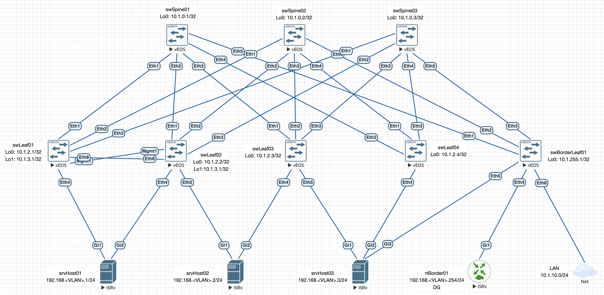

# Lab08: VxLAN. Оптимизация таблиц маршрутизации

## Состав работы
- [Условие задачи](#условие-задачи)

### Условие задачи
В этой самостоятельной работе мы ожидаем, что вы самостоятельно:
- Разместите двух "клиентов" в разных VRF в рамках одной фабрики.
- Настроите маршрутизацию между клиентами через внешнее устройство (граничный роутер\фаерволл\etc)
- Зафиксируете в документации - план работы, адресное пространство, схему сети, настройки сетевого оборудования

### Описание выбранного решения
С точки зрения схемы сети, я оставлю решение из [Lab06]() и [Lab07](), но произведу следующие действия:
1. Оставлю обе сервисные модели (VLAN-Based и VLAN-Aware Based);
2. Полностью перейду на симметричную модель моршрутизации (Symmetric IRB);
3. Удалю OSPF, оставив на уровне оверлея только один BGP;
4. Переделаю подключение L3 сервера и размещу за ним "внутренний" сегмент.

Схема коммутации сети остается следующая:

Кроме того, я хочу гармонизировать все идентификаторы, их названия и произвести весь необходимый для реальной задачи тюнинг.

Будем считать, что в DC расположены два клиента: TenantA и TenantB и их сервисы могут мигрировать на любой хост (в лабораторной - хост-роутер). У каждого из клиентов есть некоторое количество L2 сегментов. Связь между клиентами возможна только через файрвол rtBorder01, стоящим также на стыке с интернетом.

### Настройка фабрики
Настройку фабрики (для удобства проверки) начнем с `swBorderLeaf01`.