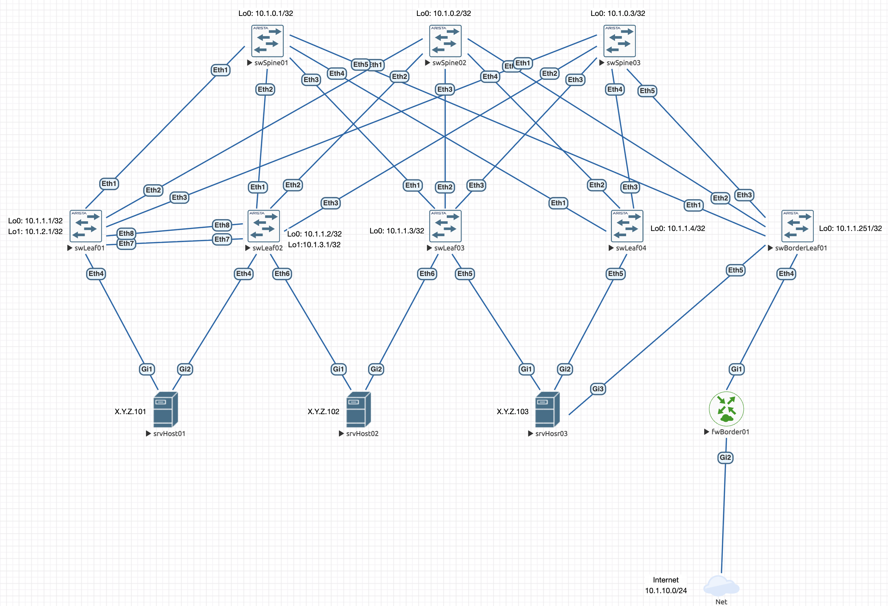

# Lab08: VxLAN. Оптимизация таблиц маршрутизации

## Состав работы
- [Условие задачи](#условие-задачи)
- [Описание выбранного решения](#описание-выбранного-решения)
- [Настройка фабрики](#настройка-фабрики)
   - [Настройка базового функционала Underlay/Overlay](#настройка-базового-функционала-underlayoverlay)
   - [Переход с Ingress Replication на Multicast](#переход-с-ingress-replication-на-multicast)
   - [Настройка стыка с сетью Интернет](#настройка-стыка-с-сетью-интернет)
   - [Настройка подключения сервера `srvHost03` (L2 Multi-Home)](#настройка-подключения-сервера-srvhost03-l2-multi-home)
   - [Настройка подключения сервера `srvHost01` (MLAG)](#настройка-подключения-сервера-srvhost01-mlag)
   - [Настройка подключения сервера `srvHost02` (L3)](#настройка-подключения-сервера-srvhost02-l3)
   - [Дополнительная задача (ликинг между VRF)](#дополнительная-задача-ликинг-между-vrf)

### Условие задачи
В этой самостоятельной работе мы ожидаем, что вы самостоятельно:
- Разместите двух "клиентов" в разных VRF в рамках одной фабрики.
- Настроите маршрутизацию между клиентами через внешнее устройство (граничный роутер\фаерволл\etc)
- Зафиксируете в документации - план работы, адресное пространство, схему сети, настройки сетевого оборудования

### Описание выбранного решения
С точки зрения схемы сети, я оставлю решение из [Lab06]() и [Lab07](), но произведу следующие действия:
1. Оставлю обе сервисные модели (VLAN-Based и VLAN-Aware Based);
2. Полностью перейду на симметричную модель моршрутизации (Symmetric IRB);
3. Удалю OSPF, оставив на уровне оверлея только один BGP;
4. Переделаю подключение L3 сервера и размещу за ним "внутренний" сегмент.

Схема коммутации сети остается следующая:



Кроме того, я хочу гармонизировать все идентификаторы, их названия и произвести весь необходимый для реальной задачи тюнинг.

### Настройка фабрики

#### Настройка базового функционала Underlay/Overlay
На уровне подстилающей сети я буду использовать приватную сеть А-класса 10.0.0.0/8, генерация адреса в которой будет производиться согласно правила `10.<Pod>.<Type>.<Number>`, где:
- **Pod (Point of Delivery)**: "точка предоставления услуг" - модульный блок сетевой и вычислительной инфраструктуры, который имеет четко определенные границы, предсказуемую производительность и масштабируется как единое целое.
- **Type**: тип оборудования:
   - *0-100*: физическое;
      - 1: коммутатор уровня Leaf;
      - 2: коммутатор уровня Spine;
      - 3: коммутатор уровня Super-Spine;

Согласно схеме, настройки в табличном виде предствалены в таблице:

*Таблица 1: Адресация подстилающей (андерлейной) сети*

| **Hostname** | **Type** | **IFace** | **IPv4** | **NSAP** |
|-----------------|--------------|-----------|---------------|---------------------------|
| swSpine01 | 02 (Spine) | Loopback0 | 10.1.2.1/32 | 49.0001.0100.0100.0001.00 |
| swSpine02 | 02 (Spine) | Loopback0 | 10.1.2.2/32 | 49.0001.0100.0100.0002.00 |
| swSpine03 | 02 (Spine) | Loopback0 | 10.1.2.3/32 | 49.0001.0100.0100.0003.00 |
| swLeaf01 | 01 (Std Leaf) | Loopback0 | 10.1.1.1/32 | 49.0001.0100.0100.1001.00 |
| swLeaf02 | 01 (Std Leaf) | Loopback0 | 10.1.1.2/32 | 49.0001.0100.0100.1002.00 |
| swLeaf03 | 01 (Std Leaf) | Loopback0 | 10.1.1.3/32 | 49.0001.0100.0100.1003.00 |
| swLeaf04 | 01 (Std Leaf) | Loopback0 | 10.1.1.4/32 | 49.0001.0100.0100.1004.00 |
| swBorderLeaf01 | 01 (Std Leaf) | Loopback0 | 10.1.1.251/32 | 49.0001.0100.0100.1251.00 |

Начальные конфигурации коммутаторов уровня Spine (на примере `swSpine01`):
```
swSpine01#sh run
! Command: show running-config
! device: swSpine01 (vEOS-lab, EOS-4.33.1.1F)
!
! boot system flash:/vEOS-lab.swi
!
no aaa root
!
no service interface inactive port-id allocation disabled
!
transceiver qsfp default-mode 4x10G
!
interface defaults                     !! Настраиваем сосотояние физических интерфейсов по-умолчанию
   !! Security Off, Jumbo-frame on
   mtu 9000                          
   !
   ethernet
      shutdown                         !! Отключаем по требованиям безопасности
!
service routing protocols model multi-agent     !! Обязательное переключение на многоагентную архитектуру
!
hostname swSpine01
dns domain Underlay.local
!
spanning-tree mode mstp                !! Оставляем, чтобы не нарушить консистентность L2
!
system l1
   unsupported speed action error
   unsupported error-correction action error
!
interface Ethernet1
   description --- L3 p2p: (no VLAN, no VRF): connection to swLeaf01:Ethernet1
   no shutdown
   load-interval 60
   mtu 9000
   no switchport
   ip address unnumbered Loopback0
   ipv6 enable
   isis enable Underlay
   isis network point-to-point
!
interface Ethernet2
   description --- L3 p2p: (no VLAN, no VRF): connection to swLeaf02:Ethernet1
   no shutdown
   load-interval 60
   mtu 9000
   no switchport
   ip address unnumbered Loopback0
   ipv6 enable
   isis enable Underlay
   isis network point-to-point
!
interface Ethernet3
   description --- L3 p2p: (no VLAN, no VRF): connection to swLeaf03:Ethernet1
   no shutdown
   load-interval 60
   mtu 9000
   no switchport
   ip address unnumbered Loopback0
   ipv6 enable
   isis enable Underlay
   isis network point-to-point
!
interface Ethernet4
   description --- L3 p2p: (no VLAN, no VRF): connection to swLeaf04:Ethernet1
   no shutdown
   load-interval 60
   mtu 9000
   no switchport
   ip address unnumbered Loopback0
   ipv6 enable
   isis enable Underlay
   isis network point-to-point
!
interface Ethernet5
   description --- L3 p2p: (no VLAN, no VRF): connection to swBorderLeaf01:Ethernet1
   no shutdown
   load-interval 60
   mtu 9000
   no switchport
   ip address unnumbered Loopback0
   ipv6 enable
   isis enable Underlay
   isis network point-to-point
!
interface Ethernet6
   shutdown
!
interface Ethernet7
   shutdown
!
interface Ethernet8
   shutdown
!
interface Loopback0
   description --- Loopback (no VLAN, no VRF): interface for Underlay Control-Plane
   load-interval 60
   ip address 10.1.2.1/32
   isis enable Underlay
   isis passive
!
interface Management1
!
ip routing
!
ipv6 unicast-routing
!
router bgp 65001
   !! Main Layer of Overlay Control-Plane
   router-id 10.1.2.1
   update wait-for-convergence            !! Принудительно удерживать отправку BGP-апдейтов (Updates) соседям до тех пор, пока сеть полностью не сойдется (не спамить сеть промежуточными данными)
   update wait-install                    !! Производить ожидание записи маршрутов в аппаратный FIB (предотвращает блэкхол на время записи)
   no bgp default ipv4-unicast            !! Отключает семейство IPv4 для экономии ресурсов устройства
   timers bgp 3 9                         !! Параметр Keepalive = 3 секунды и Holdtime = 9 секунд
   distance bgp 20 200 200                !! Указываем административные дистанции: eBGP, iBGP, local BGP
   graceful-restart restart-time 300      !! Указывает максимальное время рестарта BGP процесса
   graceful-restart                       !! Требует от соседей не удалять маршруты через локальный коммутатор на время перезагрузки процесса
   maximum-paths 16 ecmp 16
   neighbor grpLEAFS peer group
   neighbor grpLEAFS remote-as 65001
   neighbor grpLEAFS update-source Loopback0
   neighbor grpLEAFS bfd
   neighbor grpLEAFS bfd interval 100 min-rx 100 multiplier 3
   neighbor grpLEAFS route-reflector-client
   neighbor grpLEAFS send-community extended
   neighbor 10.1.1.1 peer group grpLEAFS
   neighbor 10.1.1.2 peer group grpLEAFS
   neighbor 10.1.1.3 peer group grpLEAFS
   neighbor 10.1.1.4 peer group grpLEAFS
   neighbor 10.1.1.251 peer group grpLEAFS
   !
   address-family evpn
      neighbor grpLEAFS activate
      neighbor grpLEAFS next-hop-unchanged
!
router isis Underlay
   hello padding disabled
   net 49.0001.0100.0100.0001.00
   router-id ipv4 10.1.0.1
   is-type level-2
   log-adjacency-changes
   set-overload-bit on-startup 300
   !
   address-family ipv4 unicast
      maximum-paths 16
      bfd all-interfaces
!
router multicast
   ipv4
      software-forwarding kernel
   !
   ipv6
      software-forwarding kernel
!
end
```

Начальные конфигурации коммутаторов уровня Leaf (на примере `swLeaf01`):
```
swLeaf01#sh run
! Command: show running-config
! device: swLeaf01 (vEOS-lab, EOS-4.33.1.1F)
!
! boot system flash:/vEOS-lab.swi
!
no aaa root
!
no service interface inactive port-id allocation disabled
!
transceiver qsfp default-mode 4x10G
!
interface defaults
   !! Security Off, Jumbo-frame on
   mtu 9000
   !
   ethernet
      shutdown
!
service routing protocols model multi-agent
!
hostname swLeaf01
dns domain Underlay.local
!
spanning-tree mode mstp
!
system l1
   unsupported speed action error
   unsupported error-correction action error
!
interface Ethernet1
   description --- L3 p2p: (no VLAN, no VRF): connection to swSpine01:Ethernet1
   no shutdown
   load-interval 60
   mtu 9000
   no switchport
   ip address unnumbered Loopback0
   ipv6 enable
   isis enable Underlay
   isis network point-to-point
!
interface Ethernet2
   description --- L3 p2p: (no VLAN, no VRF): connection to swSpine02:Ethernet1
   no shutdown
   load-interval 60
   mtu 9000
   no switchport
   ip address unnumbered Loopback0
   ipv6 enable
   isis enable Underlay
   isis network point-to-point
!
interface Ethernet3
   description --- L3 p2p: (no VLAN, no VRF): connection to swSpine03:Ethernet1
   no shutdown
   load-interval 60
   mtu 9000
   no switchport
   ip address unnumbered Loopback0
   ipv6 enable
   isis enable Underlay
   isis network point-to-point
!
interface Ethernet4
   shutdown
!
interface Ethernet5
   shutdown
!
interface Ethernet6
   shutdown
!
interface Ethernet7
   shutdown
!
interface Ethernet8
   shutdown
!
interface Loopback0
   description --- Loopback (no VLAN, no VRF): interface for Underlay Control-Plane
   ip address 10.1.1.1/32
   isis enable Underlay
   isis passive
!
interface Management1
!
ip routing
!
ipv6 unicast-routing
!
router bgp 65001
   !! Main Layer of Overlay Control-Plane
   router-id 10.1.1.1
   update wait-for-convergence
   update wait-install
   no bgp default ipv4-unicast
   timers bgp 3 9
   distance bgp 20 200 200
   graceful-restart restart-time 300
   graceful-restart
   maximum-paths 16 ecmp 16
   neighbor grpLEAFS peer group
   neighbor grpSPINES peer group
   neighbor grpSPINES remote-as 65001
   neighbor grpSPINES update-source Loopback0
   neighbor grpSPINES bfd
   neighbor grpSPINES bfd interval 100 min-rx 100 multiplier 3
   neighbor grpSPINES route-reflector-client
   neighbor grpSPINES send-community extended
   neighbor 10.1.2.1 peer group grpSPINES
   neighbor 10.1.2.2 peer group grpSPINES
   neighbor 10.1.2.3 peer group grpSPINES
   !
   address-family evpn
      neighbor grpSPINES activate
!
router isis Underlay
   hello padding disabled
   net 49.0001.0100.0100.1001.00
   router-id ipv4 10.1.1.1
   is-type level-2
   log-adjacency-changes
   set-overload-bit on-startup 300
   !
   address-family ipv4 unicast
      maximum-paths 16
      bfd all-interfaces
!
router multicast
   ipv4
      software-forwarding kernel
   !
   ipv6
      software-forwarding kernel
```

> Если серверы подключены только к коммутаторая уровня Leaf, то блок `address-family ipv4` в конфигурации уровня Spine рекомендуется полностью удалить. Это разгрузит процессор Spine'а и защитит его от ненужных маршрутов.

Конфигурации всех хостов сброшены.

На уровне наложенной сети (оверлейной) будет использоваться iBGP c ASN:65001 (последняя декада указывает на номер POD'а).

С точки зрения поддержки арендаторов, необходимо подготовить отдельные VRF для изоляции их Data-Plane между друг-другом и Control-Plane самой фабрики.

*Таблица 2: Накладные (оверлейные) сети L3*

| **Арендатор** | **VRF Name** | **ASN** | **Target** | **L3VNI** | **L3VLAN** |
|-|-|-|-|-|-|
| Tenant A | TENANT-A | 65101 | 101 | 1101000 | 4001 |
| Tenant B | TENANT-B | 65102 | 102 | 1102000 | 4002 |

Донстройка потребуется только на стороне коммутаторов уровня Leaf.
```
vlan 4001
   !! VLAN for L3VPN Symmetric IRB
   name L3VPN:TENANT-A
!
vlan 4002
   !! VLAN for L3VPN Symmetric IRB
   name L3VPN:TENANT-B
!
vrf instance TENANT-A
   description --- VRF: RIB for Tenant-A
!
vrf instance TENANT-B
   description --- VRF: RIB for Tenant-B
!
interface Vlan4001
   description --- Virtual (VLAN4001, VRF: TENANT-A): interface for L3 VPN tunneling via Symmetric IRB
   no autostate
   vrf TENANT-A
!
interface Vlan4002
   description --- Virtual (VLAN4002, VRF: TENANT-B): interface for L3 VPN tunneling via Symmetric IRB
   no autostate
   vrf TENANT-B
!
interface Vxlan1
   description --- VxLAN (no VRF): interface for Overlay Control-Plane
   load-interval 60
   vxlan source-interface Loopback0                   !! Справедливо для всех Leaf кроме организующих MLAG-пару (swLeaf01 и swLeaf02)
   vxlan udp-port 4789
   vxlan vrf TENANT-A vni 1101000
   vxlan vrf TENANT-B vni 1102000
   vxlan learn-restrict any                           !! Блокировка Data Plane Learning (противодействие атаке MAC-address Hijacking / VTEP Spoofing, использующей динамическое обучение)
!
ip virtual-router mac-address 00:1c:73:00:00:01       !! Задает Anycast MAC (уникальный для всей фабрики)
!
ip routing vrf TENANT-A
ip routing vrf TENANT-B
!
router bgp 65001
   vrf TENANT-A
      !! VRF for Tenant A
      rd 10.1.1.251:101
      route-target import evpn 65101:101
      route-target export evpn 65101:101
      !
      address-family ipv4
         redistribute connected
   !
   vrf TENANT-B
      !! VRF for Tenant B
      rd 10.1.1.251:102
      route-target import evpn 65102:102
      route-target export evpn 65102:102
      !
      address-family ipv4
         redistribute connected
```

Указанные настройки необходимо произвести на всех Leaf'ах фабрики, на которых присутствует хотя бы один VLAN из арендаторских. Фактически, L3VNI создают инфраструктуру для транспорта изолированного трафика каждого их VRF по фабрике. Количество VLAN, присутствующих на конкретном Leaf'е (подключенных через абонентское подключение с сервоеров) не имеет значения, так как маршрутизация внутри VRF будет производиться с помощью технологии Anycast Gateway.

Пользовательские VLAN могут быть произвольными, поэтому нам надо будет либо производить их мутацию на выходе из VTEP, либо использовать пользовательские где это возможно с перенесением логики нумерации на VNI.

*Таблица 3: Накладные (оверлейные) сети L2*

| **Арендатор** | VLAN ID | IP/MASK | VNI |
|-|-|-|-|
| Tenant A | 137 | 192.168.12.0/24 | 1101137 |
| Tenant A | 1026 | 10.128.14.0/24 | 1101026 |
| Tenant A | 6 | 172.12.23.0/24 | 1101006 |
| Tenant B | 23 | 192.168.23.0/24 | 1102023 |
| Tenant B | 889 | 10.1.1.0/24 | 1102889 |

Настройки, связанные с L2-сервисами имеют следующий вид:
```
vlan 6
   name TENANT-A:VLAN006
!
vlan 23
   name TENANT-B:VLAN023
!
vlan 137
   name TENANT-A:VLAN137
!
vlan 889
   name TENANT-B:VLAN889
!
vlan 1026
   name TENANT-A:VLAN026
!
interface Vlan6
   description --- Virtual (VLAN006, VRF: TENANT-A): interface for L3 termination
   no autostate
   vrf TENANT-A
   ip address 172.12.23.2/24
   ip virtual-router address 172.12.23.1
!
interface Vlan23
   description --- Virtual (VLAN023, VRF: TENANT-B): interface for L3 termination
   no autostate
   vrf TENANT-B
   ip address 192.168.23.2/24
   ip virtual-router address 192.168.23.1
!
interface Vlan137
   description --- Virtual (VLAN137, VRF: TENANT-A): interface for L3 termination
   no autostate
   vrf TENANT-A
   ip address 192.168.12.2/24
   ip virtual-router address 192.168.12.1
!
interface Vlan889
   description --- Virtual (VLAN889, VRF: TENANT-B): interface for L3 termination
   no autostate
   vrf TENANT-B
   ip address 10.1.1.2/24
   ip virtual-router address 10.1.1.1
!
interface Vlan1026
   description --- Virtual (VLAN1026, VRF: TENANT-A): interface for L3 termination
   no autostate
   vrf TENANT-A
   ip address 10.128.14.2/24
   ip virtual-router address 10.128.14.1
!
interface Vxlan1
   vxlan vlan 6 vni 1101006
   vxlan vlan 23 vni 1102023
   vxlan vlan 137 vni 1101137
   vxlan vlan 889 vni 1102889
   vxlan vlan 1026 vni 1101026
!
router bgp 65001
   vlan-aware-bundle vabTENANT-A
      rd 10.1.1.251:101
      route-target both 65101:101
      redistribute learned
      vlan 6,137,1026
   !
   vlan-aware-bundle vabTENANT-B
      rd 10.1.1.251:102
      route-target both 65102:102
      redistribute learned
      vlan 23,889
```

 > Если на отдельном коммутаторе уровня Leaf отсутствует тот или иной пользовательский VLAN, его можно не описывать на соответствующем оборудовании.

#### Переход с Ingress Replication на Multicast
Хотя Ingress Replication невероятно прост в настройке (не требует PIM в Underlay), у него есть критические архитектурные недостатки, которые делают его неприменимым в больших фабриках:
• **Огромная нагрузка на аплинки Ingress-лифа**: Когда хост за Leaf'ом генерирует BUM-пакет (например, ARP-запрос), этот Leaf обязан физически скопировать данный пакет (реплицировать) столько раз, сколько удаленных VTEP-соседей находится в этой сети. Если в фабрике 50 коммутаторов уровня Leaf, коммутатор отправит 49 одинаковых копий пакета в свои аплинки, утилизируя полосу пропускания оверлейными дублями.
• **Линейный рост задержки (Serialization Delay)**: Аппаратный чипсет (ASIC) коммутатора не может вытолкнуть 50 пакетов в кабель одновременно — он отправляет их последовательно, один за другим. В итоге 50-й коммутатор получит свой ARP-запрос значительно позже, чем 1-й, что увеличивает RTT (Round-Trip Time - время приема-передачи) для базовых сетевых процедур.
• **Ограничения аппаратных таблиц (Flood List Limits)**: У любого чипа есть жесткий лимит на размер так называемого Flood List (списка репликации). При достижении определенного количества VTEP-соседей коммутатор просто аппаратно не сможет обслуживать такую конфигурацию.
• **Плохая утилизация ресурсов Spines**: Вместо того чтобы коммутатор уровня Spine один раз принял пакет и сам размножил его по сети, он используется как глупый транзит для десятков одинаковых копий пакетов, которые Leaf наплодил самостоятельно.

Для перевода обработки **BUM-трафика** (Broadcast, Unknown Unicast, Multicast) с Head-End Replication (HER / Ingress Replication) на **Multicast в Underlay-сети** на коммутаторах Arista EOS, необходимо настроить протокол **PIM ASN / PIM SM** в транспортной сети и изменить способ флудинга на интерфейсе `Vxlan1`.

**PIM SM — Protocol Independent Multicast - Sparse Mode** (Независимый от протоколов мультикаст — разреженный режим). Это базовый протокол и зонтичный стандарт (описан в RFC 7761). Сам по себе PIM-SM определяет принципы построения деревьев распределения трафика (MDT) на основе reverse path forwarding (RPF). Внутри PIM-SM существуют две разные архитектурные модели обслуживания: ASM и SSM:
• **PIM ASM — Any Source Multicast** (Мультикаст от любого источника). В этой модели получателю (Receiver) абсолютно всё равно, кто отправляет данные. При этом, он не знает, откуда пойдет поток, поэтому в сети нужен посредник — Rendezvous Point (RP).
• **PIM SSM — Source-Specific Multicast** (Мультикаст от конкретного источника). В этой модели получатель знает не только группу, но и точный IP-адрес источника, который вещает. RP не требуется.

Главное отличие между ними заключается в том, знает ли получатель трафика заранее, кто этот трафик транслирует, и как сеть организует встречу источника и получателя. Использование SSM в Underlay возможно, но требует специфической поддержки со стороны оверлейного Control-Plane. Ввиду этого я буду использовать более простой в конфигурировании вариант PIM ASM.

При использовании PIM-ASM коммутаторы строят так называемое **Shared Tree (Общее дерево)**, обозначаемое в таблицах маршрутизации как **`(*, G)`**, где `*` — это любой источник, а `G` — мультикаст-группа. Точкой сборки (корнем дерева) всегда выступает RP. Источник шлет трафик на RP. RP шлет трафик по общему дереву получателю. Если трафика много, коммутаторы пытаются переключиться на кратчайший путь до источника (Shortest Path Tree / SPT).

При объявлении RP будем использовать статический режим (для EVPN/VxLAN фабрик динамический BSR практически никогда не используется) с выделенным петлевым интерфейсом `loopback255` на стороне коммутаторов уровня Spine.

В рамках данного решения для каждого широковещательного сегмента оверлея (VNI) или группы сегментов (VLAN-Aware Bundle) выделяется уникальный адрес многоадресной рассылки (Multicast Group) из диапазона административно ограничиваемых адресов 239.0.0.0/8.

Каждый VTEP-коммутатор (Leaf) осуществляет аппаратную посадку широковещательного домена на соответствующую мультикаст-группу транспортной сети. Сигнализация и построение деревьев распределения BUM-трафика обеспечиваются протоколом PIM Sparse Mode (PIM-SM).

С точки зрения Underlay-маршрутизации (OSPF/IS-IS/BGP), одинаковый IP-адрес RP анонсируется всеми спайнами одновременно. Ближайшие лифы выбирают кратчайший путь (по метрике IGP или ECMP) до этого адреса.

Однако сам по себе PIM Sparse-Mode не умеет синхронизировать состояние источников мультикаста между разными физическими коммутаторами. Если один Leaf зарегистрировал источник трафика (Source) на Spine01, а другой Leaf запрашивает этот трафик (Receiver) у Spine02, то без дополнительного протокола синхронизации мультикаст работать не будет.

Для решения этой задачи в сетях на Arista EOS применяются два основных протокола: MSDP и PIM Anycast (RFC 4610):
- **Синхронизация через PIM Anycast**: Самый простой и лаконичный способ, встроенный в сам протокол PIM. Спайны общаются между собой, используя свои **уникальные IP-адреса**, а Anycast IP используют только для обслуживания лифов. Когда на `Spine01` приходит запрос регистрации от источника (через Anycast IP), он пересылает сообщение `PIM Register` на все остальные коммутаторы Spine, перечисленные в его peer-листе.
- Синхронизация через MSDP: Является классическим подхобом. Spine'ы устанавливают между собой TCP-соединения. Когда `swSpine01` узнает о новом источнике мультикаста, он генерирует Source-Active (SA) сообщение и отправляет его по TCP всем MSDP-соседям. Таким образом, все Spine'ы ведут идентичную базу данных активных источников.

Итоговый выбор PIM-ASM cо статическим указанием IP-адреса RP на стороне коммутаторов Spine и Anycast-синхронизацией между ними. Сторона Spine'ов:
```
ip multicast-routing
!
interface Loopback255
   description --- Loopback (no VLAN, no VRF): interface for VIP Anycast PIM-ASM
   load-interval 60
   ip address 10.1.255.255/32
   isis enable Underlay
   isis passive
!
interface Ethernet1 - 5
   pim ipv4 sparse-mode
!
router pim sparse-mode
   ipv4
      rp address 10.1.255.255                !! Указание адреса RP PIM Anycast фабирики
      anycast-rp 10.1.255.255 10.1.2.1       !! Настройка синхронизации PIM Anycast c swSpine01
      anycast-rp 10.1.255.255 10.1.2.2       !! Настройка синхронизации PIM Anycast c swSpine02
      anycast-rp 10.1.255.255 10.1.2.3       !! Настройка синхронизации PIM Anycast c swSpine03
```

Проверим работоспособность RP:
```
swSpine01#show ip pim rp
Group: 224.0.0.0/4
  RP: 10.1.255.255
    Uptime: 0:03:18, Expires: never, Priority: 0, Override: False
```

Перенесем данные настройки на все коммутаторы уровня Spine. На коммутаторах уровня Leaf производим следующие настройки:
```
interface Ethernet1 - 3
   pim ipv4 sparse-mode
!
router pim sparse-mode
   ipv4
      rp address 10.1.255.255
!
interface Vxlan1
   vxlan vlan 6 flood group 239.1.0.6
   vxlan vlan 23 flood group 239.1.0.23
   vxlan vlan 137 flood group 239.1.1.37
   vxlan vlan 889 flood group 239.1.8.89
   vxlan vlan 1026 flood group 239.1.10.26
```

Проверяем:
```
swLeaf04(config)#sh ip pim rp
Group: 224.0.0.0/4
  RP: 10.1.255.255
    Uptime: 0:00:49, Expires: never, Priority: 0, Override: False

swLeaf04(config)#sh ip pim neighbor
PIM Neighbor Table for default VRF
Neighbor Address  Interface  Uptime    Expires   Mode    Transport
10.1.2.1          Ethernet1  00:03:03  00:01:35  sparse  datagram
10.1.2.2          Ethernet2  00:03:03  00:01:18  sparse  datagram
10.1.2.3          Ethernet3  00:03:02  00:01:23  sparse  datagram
```

Вся инфраструктура готова. Если посмотреть настройки VxLAN:
```
swLeaf04(config-if-Vx1)#sh vxlan vtep
Remote VTEPS for Vxlan1:

VTEP       Tunnel Type(s)
---------- --------------

Total number of remote VTEPS:  0

swBorderLeaf01#sh vxlan vtep
Remote VTEPS for Vxlan1:

VTEP           Tunnel Type(s)
-------------- --------------
10.1.1.4       unicast

Total number of remote VTEPS:  1
```

Как видно, режим репликации переключился с `flood` на `unicast`.

Однако, несмотря на работоспособность фабрики, у меня не "завелся" Anycast RP в полной мере: не синхронизировались между собой RP расположенные на Spine'ах.

Проверим подключения к мультикаст группам на стороне коммутаторов Spine:
```
swSpine01#sh ip pim upstream joins
Neighbor address: 10.1.1.4
 Via interface: Ethernet4 (10.1.2.1)
  Group: 239.1.8.89
    Joins:
      10.1.1.4/32 SPT
    Prunes:
      No prunes included
  Group: 239.1.0.6
    Joins:
      10.1.1.4/32 SPT
    Prunes:
      No prunes included
  Group: 239.1.10.26
    Joins:
      10.1.1.4/32 SPT
    Prunes:
      No prunes included

swSpine02#sh ip pim upstream joins
Neighbor address: 10.1.1.4
 Via interface: Ethernet4 (10.1.2.2)
  Group: 239.1.0.23
    Joins:
      10.1.1.4/32 SPT
    Prunes:
      No prunes included
Neighbor address: 10.1.1.251
 Via interface: Ethernet5 (10.1.2.2)
  Group: 239.1.0.23
    Joins:
      10.1.1.251/32 SPT
    Prunes:
      No prunes included
  Group: 239.1.1.37
    Joins:
      10.1.1.251/32 SPT
    Prunes:
      No prunes included
  Group: 239.1.10.26
    Joins:
      10.1.1.251/32 SPT
    Prunes:
      No prunes included

swSpine03#sh ip pim upstream joins
Neighbor address: 10.1.1.4
 Via interface: Ethernet4 (10.1.2.3)
  Group: 239.1.1.37
    Joins:
      10.1.1.4/32 SPT
    Prunes:
      No prunes included
Neighbor address: 10.1.1.251
 Via interface: Ethernet5 (10.1.2.3)
  Group: 239.1.8.89
    Joins:
      10.1.1.251/32 SPT
    Prunes:
      No prunes included
  Group: 239.1.0.6
    Joins:
      10.1.1.251/32 SPT
    Prunes:
      No prunes included
```

Разница в выводах команд `show ip pim upstream joins` между тремя Spine-коммутаторами — это штатное поведение отлично работающей фабрики. Эта разница обусловлена тремя фундаментальными сетевыми механизмами: Anycast RP, ECMP-балансировкой в Underlay и логикой RPF (Reverse Path Forwarding) check в протоколе PIM.

Поскольку адрес RP (`10.1.255.255`) настроен как Anycast на всех трех Spine'ах одновременно и анонсируется через IS-IS, каждый Leaf-коммутатор (`swLeaf04` с IP `10.1.1.4` и его сосед `swBorderLeaf01` c IP `10.1.1.251`) видит три одинаковых по стоимости пути (ECMP) до этой точки рандеву.
Когда Leaf генерирует PIM Join-запрос для конкретной мультикаст-группы, он выполняет RPF-выбор: он берет IP-адрес RP, смотрит в свою таблицу юникаст-маршрутизации и выбирает строго одного конкретного соседа (один Spine) для отправки запроса на эту группу. Хеш-алгоритм ECMP на лифах распределяет разные группы по разным аплинкам.

Однако, при этом, если посмотреть маршрут до группы существующего клиента, получим следующее:
```
swSpine01#sh ip mroute 239.1.1.37
PIM Bidirectional Mode Multicast Routing Table
RPF route: U - From unicast routing table
           M - From multicast routing table
PIM Sparse Mode Multicast Routing Table
Flags: E - Entry forwarding on the RPT, J - Joining to the SPT
    R - RPT bit is set, S - SPT bit is set, L - Source is attached
    W - Wildcard entry, X - External component interest
    I - SG Include Join alert rcvd, P - Programmed in hardware
    H - Joining SPT due to policy, D - Joining SPT due to protocol
    Z - Entry marked for deletion, C - Learned from a DR via a register
    A - Learned via Anycast RP Router, M - Learned via MSDP
    N - May notify MSDP, K - Keepalive timer not running
    T - Switching Incoming Interface, B - Learned via Border Router
    V - Source is reachable via Evpn Tenant Domain
    F - Learned via MVPN
RPF route: U - From unicast routing table
           M - From multicast routing table

swSpine02#sh ip mroute 239.1.1.37
PIM Bidirectional Mode Multicast Routing Table
RPF route: U - From unicast routing table
           M - From multicast routing table
PIM Sparse Mode Multicast Routing Table
Flags: E - Entry forwarding on the RPT, J - Joining to the SPT
    R - RPT bit is set, S - SPT bit is set, L - Source is attached
    W - Wildcard entry, X - External component interest
    I - SG Include Join alert rcvd, P - Programmed in hardware
    H - Joining SPT due to policy, D - Joining SPT due to protocol
    Z - Entry marked for deletion, C - Learned from a DR via a register
    A - Learned via Anycast RP Router, M - Learned via MSDP
    N - May notify MSDP, K - Keepalive timer not running
    T - Switching Incoming Interface, B - Learned via Border Router
    V - Source is reachable via Evpn Tenant Domain
    F - Learned via MVPN
RPF route: U - From unicast routing table
           M - From multicast routing table
239.1.1.37
  10.1.1.251, 0:57:37, flags: SP
    Incoming interface: Ethernet5
    RPF route: [U] 10.1.1.251/32 [115/20] via 10.1.1.251
    Outgoing interface list:
      Ethernet4

swSpine03#sh ip mroute 239.1.1.37
PIM Bidirectional Mode Multicast Routing Table
RPF route: U - From unicast routing table
           M - From multicast routing table
PIM Sparse Mode Multicast Routing Table
Flags: E - Entry forwarding on the RPT, J - Joining to the SPT
    R - RPT bit is set, S - SPT bit is set, L - Source is attached
    W - Wildcard entry, X - External component interest
    I - SG Include Join alert rcvd, P - Programmed in hardware
    H - Joining SPT due to policy, D - Joining SPT due to protocol
    Z - Entry marked for deletion, C - Learned from a DR via a register
    A - Learned via Anycast RP Router, M - Learned via MSDP
    N - May notify MSDP, K - Keepalive timer not running
    T - Switching Incoming Interface, B - Learned via Border Router
    V - Source is reachable via Evpn Tenant Domain
    F - Learned via MVPN
RPF route: U - From unicast routing table
           M - From multicast routing table
239.1.1.37
  10.1.1.4, 17:24:36, flags: SP
    Incoming interface: Ethernet4
    RPF route: [U] 10.1.1.4/32 [115/20] via 10.1.1.4
    Outgoing interface list:
      Ethernet5
```

Как видно, синхронизация Anycast не работает.

На данный момент, ввиду работоспособности всей фабрики, я решил отложить эксперементы до окончательного завершения лабораторной.

#### Настройка стыка с сетью Интернет
Начну со стороны стыка с роутером-файрволом `fwBorder01`, на коммутаторе фабрики `swBorderLeaf01`.

Арендаторские VLAN  используются ими для терминирования своих устройств и сервисов. Было бы не очень хорошей идеей "растягивать" какой-нибудь из пользовательских VLAN до "роутера-на-палке". Для этих целей я попробую использовать VLAN предназначенные для L3VPN:
```
interface Vlan4001
   description --- Virtual (VLAN4001, VRF: TENANT-A): interface for L3 VPN tunneling via Symmetric IRB
   no autostate
   vrf TENANT-A
   ip address 10.1.101.1/31
!
interface Vlan4002
   description --- Virtual (VLAN4002, VRF: TENANT-B): interface for L3 VPN tunneling via Symmetric IRB
   no autostate
   vrf TENANT-B
   ip address 10.1.102.1/31
```

Конфигурация роутера `fwBorder01` предполагает терминирование каждого арендатора в собственный VRF и
имеет следующий вид:
```
hostname fwBorder01
!
ip domain name local
!
vrf definition TENANT-A
 description --- VRF: Tenant A RIB
 rd 65101:101
 !
 address-family ipv4
  route-target export 65101:101
  route-target import 65101:101
 exit-address-family
!
vrf definition TENANT-B
 description --- VRF: Tenant B RIB
 rd 65102:102
 !
 address-family ipv4
  route-target export 65102:102
  route-target import 65102:102
 exit-address-family
!
lldp run
!
interface GigabitEthernet1
 description --- Trunk (VLAN001): connection to swBorderLeaf01:Ethernet4
 no ip address
 load-interval 60
 negotiation auto
 no mop enabled
 no mop sysid
!
interface GigabitEthernet1.4001
 description --- Virtual (VLAN4001, no VRF): interconnection to Tenant A
 encapsulation dot1Q 4001
 vrf forwarding TENANT-A
 ip address 10.1.101.0 255.255.255.254
!
interface GigabitEthernet1.4002
 description --- Virtual (VLAN4002, no VRF): interconnection to Tenant B
 encapsulation dot1Q 4002
 vrf forwarding TENANT-B
 ip address 10.1.102.0 255.255.255.254
!
interface GigabitEthernet2
 description --- Access (VLAN001): Connection to Internet
 ip dhcp client client-id ascii fwBorder01
 ip address dhcp
 negotiation auto
 no mop enabled
 no mop sysid
!
ip route 0.0.0.0 0.0.0.0 dhcp
```

Проверим связанность со стороны роутера:
```
fwBorder01#ping vrf TENANT-A 10.1.101.1
Type escape sequence to abort.
Sending 5, 100-byte ICMP Echos to 10.1.101.1, timeout is 2 seconds:
!!!!!
Success rate is 100 percent (5/5), round-trip min/avg/max = 2/6/11 ms

fwBorder01#ping vrf TENANT-B 10.1.102.1
Type escape sequence to abort.
Sending 5, 100-byte ICMP Echos to 10.1.102.1, timeout is 2 seconds:
!!!!!
Success rate is 100 percent (5/5), round-trip min/avg/max = 4/5/8 ms
```

Теперь на стороне коммутатора `swBorderLeaf01`, если посмотреть маршруты EVPN, можно увидеть маршруты типа 5 (`ip-prefix`):
```
swBorderLeaf01#sh bgp evpn
BGP routing table information for VRF default
Router identifier 10.1.1.251, local AS number 65001
Route status codes: * - valid, > - active, S - Stale, E - ECMP head, e - ECMP
                    c - Contributing to ECMP, % - Pending best path selection
Origin codes: i - IGP, e - EGP, ? - incomplete
AS Path Attributes: Or-ID - Originator ID, C-LST - Cluster List, LL Nexthop - Link Local Nexthop

          Network                Next Hop              Metric  LocPref Weight  Path
 * >      RD: 10.1.1.251:101 ip-prefix 10.1.101.0/31
                                 -                     -       -       0       i
 * >      RD: 10.1.1.251:102 ip-prefix 10.1.102.0/31
                                 -                     -       -       0       i
```

У меня `fwBorder01` подключен к сети Интернет через интерфейс `Gi2` (DHCP):
```
fwBorder01#sh ip route
Codes: L - local, C - connected, S - static, R - RIP, M - mobile, B - BGP
       D - EIGRP, EX - EIGRP external, O - OSPF, IA - OSPF inter area
       N1 - OSPF NSSA external type 1, N2 - OSPF NSSA external type 2
       E1 - OSPF external type 1, E2 - OSPF external type 2, m - OMP
       n - NAT, Ni - NAT inside, No - NAT outside, Nd - NAT DIA
       i - IS-IS, su - IS-IS summary, L1 - IS-IS level-1, L2 - IS-IS level-2
       ia - IS-IS inter area, * - candidate default, U - per-user static route
       H - NHRP, G - NHRP registered, g - NHRP registration summary
       o - ODR, P - periodic downloaded static route, l - LISP
       a - application route
       + - replicated route, % - next hop override, p - overrides from PfR
       & - replicated local route overrides by connected

Gateway of last resort is 10.1.10.2 to network 0.0.0.0

S*    0.0.0.0/0 [1/0] via 10.1.10.2
      10.0.0.0/8 is variably subnetted, 3 subnets, 2 masks
C        10.1.10.0/24 is directly connected, GigabitEthernet2
S        10.1.10.2/32 [254/0] via 10.1.10.2, GigabitEthernet2
L        10.1.10.90/32 is directly connected, GigabitEthernet2

fwBorder01# ping 8.8.8.8 repeat 3
Type escape sequence to abort.
Sending 3, 100-byte ICMP Echos to 8.8.8.8, timeout is 2 seconds:
!!!
Success rate is 100 percent (3/3), round-trip min/avg/max = 35/35/36 ms
```

Необходимо создать eBGP-соседство между VRF'ами на `swBorderLeaf01` и `fwBorder01`, что позволит добиться связанности вдоль сети фабрики к точке терминирования VRF пользователя на стороне выделенного роутера.

На стороне `swBorderLeaf01` произведем следующие настройки:
```
router bgp 65001
   neighbor grpONEARMSYSTEM peer group
   neighbor grpONEARMSYSTEMS peer group
   neighbor grpONEARMSYSTEMS bfd
   neighbor grpONEARMSYSTEMS bfd interval 100 min-rx 100 multiplier 3
   !
   vrf TENANT-A
      neighbor 10.1.101.0 peer group grpONEARMSYSTEM
      neighbor 10.1.101.0 remote-as 65100
      neighbor 10.1.101.0 update-source Vlan4001
   !
   vrf TENANT-B
      neighbor 10.1.102.0 peer group grpONEARMSYSTEM
      neighbor 10.1.102.0 remote-as 65100
      neighbor 10.1.102.0 update-source Vlan4002
```

На стороне файрвола `fwBorder01`:
```
interface GigabitEthernet1.4001
 bfd interval 100 min_rx 100 multiplier 3    ! В Cisco IOS тюнинг bfd осуществляется в контексте интерфейса
!
interface GigabitEthernet1.4002
 bfd interval 100 min_rx 100 multiplier 3
!
router bgp 65100
 bgp router-id 10.1.100.1
 bgp log-neighbor-changes
 bgp update-delay 1
 bgp graceful-restart restart-time 300
 bgp graceful-restart
 timers bgp 3 9
 !
 address-family ipv4 vrf TENANT-A
  neighbor 10.1.101.1 remote-as 65001
  neighbor 10.1.101.1 description --- Peer: connection between System-on-a-Stick and Leaf switches in VRF TENANT-A
  neighbor 10.1.101.1 update-source GigabitEthernet1.4001
  neighbor 10.1.101.1 fall-over bfd
  neighbor 10.1.101.1 activate
  neighbor 10.1.101.1 default-originate
 exit-address-family
!
 address-family ipv4 vrf TENANT-B
  neighbor 10.1.102.1 remote-as 65001
  neighbor 10.1.102.1 description --- Peer: connection between System-on-a-Stick and Leaf switches in VRF TENANT-B
  neighbor 10.1.102.1 update-source GigabitEthernet1.4002
  neighbor 10.1.102.1 fall-over bfd
  neighbor 10.1.102.1 activate
  neighbor 10.1.102.1 default-originate
 exit-address-family
```

На этой стадии можно проверить состояние таблиц маршрутизации:
```
swBorderLeaf01#sh ip route vrf TENANT-B

VRF: TENANT-B
Source Codes:
       C - connected, S - static, K - kernel,
       O - OSPF, IA - OSPF inter area, E1 - OSPF external type 1,
       E2 - OSPF external type 2, N1 - OSPF NSSA external type 1,
       N2 - OSPF NSSA external type2, B - Other BGP Routes,
       B I - iBGP, B E - eBGP, R - RIP, I L1 - IS-IS level 1,
       I L2 - IS-IS level 2, O3 - OSPFv3, A B - BGP Aggregate,
       A O - OSPF Summary, NG - Nexthop Group Static Route,
       V - VXLAN Control Service, M - Martian,
       DH - DHCP client installed default route,
       DP - Dynamic Policy Route, L - VRF Leaked,
       G  - gRIBI, RC - Route Cache Route,
       CL - CBF Leaked Route

Gateway of last resort:
 B E      0.0.0.0/0 [20/0]
           via 10.1.102.0, Vlan4002

 C        10.1.102.0/31
           directly connected, Vlan4002
```

Осталось настроить NAT с route-leaking на стороне `fwBorder01`:
```
interface GigabitEthernet1.4001
 ip nat inside
!
interface GigabitEthernet1.4002
 ip nat inside
!
interface GigabitEthernet2
 ip nat outside
!
ip access-list standard aclNAT:TENANT-A
 10 permit any
!
ip access-list standard aclNAT:TENANT-B
 10 permit any
!
ip nat inside source list aclNAT:TENANT-A interface GigabitEthernet2 vrf TENANT-A overload
ip nat inside source list aclNAT:TENANT-B interface GigabitEthernet2 vrf TENANT-B overload
!
ip route vrf TENANT-A 0.0.0.0 0.0.0.0 10.1.10.2 global
ip route vrf TENANT-B 0.0.0.0 0.0.0.0 10.1.10.2 global
```

Проверим со стороны `swBorderLeaf01`:
```
swBorderLeaf01#ping vrf TENANT-A 8.8.8.8
PING 8.8.8.8 (8.8.8.8) 72(100) bytes of data.
80 bytes from 8.8.8.8: icmp_seq=1 ttl=105 time=36.3 ms
80 bytes from 8.8.8.8: icmp_seq=2 ttl=105 time=36.0 ms
80 bytes from 8.8.8.8: icmp_seq=3 ttl=105 time=34.5 ms
80 bytes from 8.8.8.8: icmp_seq=4 ttl=105 time=37.4 ms
80 bytes from 8.8.8.8: icmp_seq=5 ttl=105 time=33.2 ms

--- 8.8.8.8 ping statistics ---
5 packets transmitted, 5 received, 0% packet loss, time 111ms
rtt min/avg/max/mdev = 33.218/35.468/37.433/1.473 ms, pipe 3, ipg/ewma 27.693/35.818 ms

swBorderLeaf01#ping vrf TENANT-B 8.8.8.8
PING 8.8.8.8 (8.8.8.8) 72(100) bytes of data.
80 bytes from 8.8.8.8: icmp_seq=1 ttl=105 time=33.5 ms
80 bytes from 8.8.8.8: icmp_seq=2 ttl=105 time=34.7 ms
80 bytes from 8.8.8.8: icmp_seq=3 ttl=105 time=35.1 ms
80 bytes from 8.8.8.8: icmp_seq=4 ttl=105 time=36.7 ms
80 bytes from 8.8.8.8: icmp_seq=5 ttl=105 time=34.6 ms

--- 8.8.8.8 ping statistics ---
5 packets transmitted, 5 received, 0% packet loss, time 104ms
rtt min/avg/max/mdev = 33.502/34.900/36.658/1.026 ms, pipe 3, ipg/ewma 26.107/34.231 ms
```

#### Настройка подключения сервера `srvHost03` (L2 Multi-Home)
Переходим к коммутаторам `swLeaf03`, `swLeaf04` и `swBorderLeaf01`. Их конфигурация опирается на описанную в части [Настройка базового функционала Underlay/Overlay](#настройка-базового-функционала-underlayoverlay) с дополнением, связанным с абонентским подключением по технологии Multi-Home:
```
link tracking group ltgPortChannel5       !! Создаем аварийный трекинг для интерфейса Po5
   links minimum 2                        !! Минимум 2 аплинка к Spine'ам
   recovery delay 60                      !! Подавление флаппинга
!
interface Port-Channel5
   description --- Trunk (VLAN001): connection to srvHost03
   load-interval 60
   switchport trunk allowed vlan 6,23,137,889,1026
   switchport mode trunk
   !
   evpn ethernet-segment
      identifier auto lacp                !! Идентификарор LACP задаем автоматически (должен быть уникален на всех соединениях данного агрегата)
   lacp system-id 001c.7300.0005
!
interface Ethernet5
   description --- Port-channel 5 (Multi-Home): connection to srvHost03:Gi2
   no shutdown
   load-interval 60
   channel-group 5 mode active
   link tracking group ltgPortChannel5 downstream
!
router bgp 65001
   address-family evpn
      route type ethernet-segment route-target auto
```

На абонентской стороне (`srvHost03`) настройки следующие:
```
hostname srvHost03
!
ip domain name local
!
ip vrf VLAN006
 description --- VRF (TENANT-A): vrf for VLAN006
!
ip vrf VLAN023
 description --- VRF (TENANT-B): vrf for VLAN023
!
ip vrf VLAN1026
 description --- VRF (TENANT-A): vrf for VLAN1026
!
ip vrf VLAN137
 description --- VRF (TENANT-A): vrf for VLAN137
!
ip vrf VLAN889
 description --- VRF (TENANT-B): vrf for VLAN889
!
lldp run
cdp run
!
interface Port-channel1
 description --- Trunk (VLAN001): conneciotn to fabric
 no ip address
 load-interval 60
 no negotiation auto
 no mop enabled
 no mop sysid
!
interface Port-channel1.6
 description --- Virtual (VLAN006, TENANT-A): "TENANT-A:VLAN6"
 encapsulation dot1Q 6
 ip vrf forwarding VLAN006
 ip address 172.12.23.103 255.255.255.0
!
interface Port-channel1.23
 description --- Virtual (VLAN023, VRF: TENANT-B): "TENANT-B:VLAN023"
 encapsulation dot1Q 23
 ip vrf forwarding VLAN023
 ip address 192.168.23.103 255.255.255.0
!
interface Port-channel1.137
 description --- Virtual (VLAN137, VRF: TENANT-A): "TENANT-A:VLAN137"
 encapsulation dot1Q 137
 ip vrf forwarding VLAN137
 ip address 192.168.12.103 255.255.255.0
!
interface Port-channel1.889
 description --- Virtual (VLAN889, VRF: TENANT-B): "TENANT-B:VLAN889"
 encapsulation dot1Q 889
 ip vrf forwarding VLAN889
 ip address 10.1.1.103 255.255.255.0
!
interface Port-channel1.1026
 description --- Virtual (VLAN1026, TENANT-A): "TENANT-A:VLAN1026"
 encapsulation dot1Q 1026
 ip vrf forwarding VLAN1026
 ip address 10.128.14.103 255.255.255.0
!
interface GigabitEthernet1
 description --- Port-channel (Multi-Home): connection to swLeaf03:Ethernet5
 no ip address
 load-interval 60
 negotiation auto
 no mop enabled
 no mop sysid
 channel-group 1 mode active
!
interface GigabitEthernet2
 description --- Port-channel (Multi-Home): connection to swLeaf04:Ethernet5
 no ip address
 load-interval 60
 negotiation auto
 no mop enabled
 no mop sysid
 channel-group 1 mode active
!
interface GigabitEthernet3
 description --- Port-channel (Multi-Home): connection to swBorderLeaf01:Ethernet5
 no ip address
 load-interval 60
 negotiation auto
 no mop enabled
 no mop sysid
 channel-group 1 mode active
!
ip route vrf VLAN137 0.0.0.0 0.0.0.0 192.168.12.1
ip route vrf VLAN1026 0.0.0.0 0.0.0.0 10.128.14.1
ip route vrf VLAN006 0.0.0.0 0.0.0.0 172.12.23.1
ip route vrf VLAN023 0.0.0.0 0.0.0.0 192.168.23.1
ip route vrf VLAN889 0.0.0.0 0.0.0.0 10.1.1.1
```

Проверим на стороне `srvHost03`:
```
srvHost03#show interfaces port-channel 1
Port-channel1 is up, line protocol is up
  Hardware is GEChannel, address is 001e.e6f3.35c0 (bia 001e.e6f3.35c0)
  Description: --- Trunk (VLAN001): conneciotn to fabric
  MTU 1500 bytes, BW 3000000 Kbit/sec, DLY 10 usec,
     reliability 255/255, txload 1/255, rxload 1/255
  Encapsulation 802.1Q Virtual LAN, Vlan ID  1., loopback not set
  Keepalive set (10 sec)
  ARP type: ARPA, ARP Timeout 04:00:00
    No. of active members in this channel: 3
        Member 0 : GigabitEthernet1 , Full-duplex, 1000Mb/s
        Member 1 : GigabitEthernet2 , Full-duplex, 1000Mb/s
        Member 2 : GigabitEthernet3 , Full-duplex, 1000Mb/s
    No. of PF_JUMBO supported members in this channel : 3
  Last input 00:00:00, output 00:06:50, output hang never
  Last clearing of "show interface" counters never
  Input queue: 0/1125/0/0 (size/max/drops/flushes); Total output drops: 0
  Queueing strategy: fifo
  Output queue: 0/120 (size/max)
  1 minute input rate 0 bits/sec, 0 packets/sec
  1 minute output rate 0 bits/sec, 0 packets/sec
     8419 packets input, 921734 bytes, 0 no buffer
     Received 0 broadcasts (0 IP multicasts)
     0 runts, 0 giants, 0 throttles
     0 input errors, 0 CRC, 0 frame, 0 overrun, 0 ignored
     0 watchdog, 0 multicast, 0 pause input
     295 packets output, 26062 bytes, 0 underruns
     Output 0 broadcasts (0 IP multicasts)
     0 output errors, 0 collisions, 0 interface resets
     20 unknown protocol drops
     0 babbles, 0 late collision, 0 deferred
     0 lost carrier, 0 no carrier, 0 pause output
     0 output buffer failures, 0 output buffers swapped out
```

и выход в интернет:
```
srvHost03#ping vrf VLAN137 8.8.8.8
Type escape sequence to abort.
Sending 5, 100-byte ICMP Echos to 8.8.8.8, timeout is 2 seconds:
!!!!!
Success rate is 100 percent (5/5), round-trip min/avg/max = 56/69/82 ms
```

#### Настройка подключения сервера `srvHost01` (MLAG)
Произведем настройку MLAG-пары `swLeaf01` и `swLeaf02`. Их стартовая конфигурация аналогична описанной в части [Настройка базового функционала Underlay/Overlay](#настройка-базового-функционала-underlayoverlay) со следующими отличиями:
```
interface Loopback1                    !! Задаем общий интерфейс MLAG-пары
   description --- Loopback (no VLAN, no VRF): interface for MLAG source
   load-interval 60
   ip address 10.1.0.1/32
   isis enable Underlay
   isis network point-to-point
```

Далее, собираем MLAG. Я буду использовать для Peer-Link'а два интерфейса, объединенных в агрегат. На самом агрегате будет поднять L3 как для обслуживания MLAG, так и для пульса:
```
vlan 4094                              !! VLAN для L2 Peer-Link
   name MLAG:PEER-CONTROL
   trunk group tgrMLAG:PEER-LINK       !! Ограничиваем использование VLAN только данной группой
!
interface Port-Channel4094
   description --- Trunk (VLAN001): MLAG Peer Link
   load-interval 60
   switchport mode trunk
   switchport trunk group tgrMLAG:PEER-LINK
   no shutdown
!
interface ethernet 7 - 8
   description --- Port-channel 4094 (LACP): MLAG Peer Link
   no shutdown
   load-interval 60
   channel-group 4094 mode active
!
interface Vlan4094
   description --- Virtual (VLAN4094, no VRF): L3 MLAG Peer Link
   load-interval 60
   no autostate
   ip address 10.1.0.2/31
!
mlag configuration
   !! MLAG: swLeaf01-swLeaf02
   domain-id mlag01
   local-interface Vlan4094
   peer-address 10.1.0.2
   peer-address heartbeat 10.1.0.2
   peer-link Port-Channel4094
```

После дублирования на второе плечо можно посмотреть состояние:
```
swLeaf01#sh mlag
MLAG Configuration:
domain-id                          :              mlag01
local-interface                    :            Vlan4094
peer-address                       :            10.1.0.3
peer-link                          :    Port-Channel4094
hb-peer-address                    :            10.1.0.3
peer-config                        :        inconsistent

MLAG Status:
state                              :              Active
negotiation status                 :           Connected
peer-link status                   :                  Up
local-int status                   :                  Up
system-id                          :   52:00:00:03:37:66
dual-primary detection             :            Disabled
dual-primary interface errdisabled :               False

MLAG Ports:
Disabled                           :                   0
Configured                         :                   0
Inactive                           :                   0
Active-partial                     :                   0
Active-full                        :                   0
```

Настрою абонентское подключение к роутеру-сервер `srvHost01` со стороны MLAG-пары (настройки идентичны):
```
interface Port-Channel4
   description --- Trunk (VLAN001): connection to srvHost01
   load-interval 60
   switchport trunk allowed vlan 6,23,137,889,1026
   switchport mode trunk
   mlag 4
!
interface Ethernet4
   description --- Port-channel 4 (MLAG): connection to srvHost01:Gi1
   no shutdown
   load-interval 60
   channel-group 4 mode active
```

Настроим абонентское подключение (`srvHost01`):
```
hostname srvHost01
!
ip domain name local
!
ip vrf VLAN006
 description --- VRF (TENANT-A): vrf for VLAN006
!
ip vrf VLAN023
 description --- VRF (TENANT-B): vrf for VLAN023
!
ip vrf VLAN1026
 description --- VRF (TENANT-A): vrf for VLAN1026
!
ip vrf VLAN137
 description --- VRF (TENANT-A): vrf for VLAN137
!
ip vrf VLAN889
 description --- VRF (TENANT-B): vrf for VLAN889
!
lldp run
!
interface Port-channel1
 description --- Trunk (VLAN001): connection to MLAG: swLeaf01, swLeaf02
 no ip address
 load-interval 60
 no negotiation auto
 no mop enabled
 no mop sysid
!
interface Port-channel1.6
 description --- Virtual (VLAN006, TENANT-A): "TENANT-A:VLAN6"
 encapsulation dot1Q 6
 ip vrf forwarding VLAN006
 ip address 172.12.23.101 255.255.255.0
!
interface Port-channel1.23
 description --- Virtual (VLAN023, VRF: TENANT-B): "TENANT-B:VLAN023"
 encapsulation dot1Q 23
 ip vrf forwarding VLAN023
 ip address 192.168.23.101 255.255.255.0
!
interface Port-channel1.137
 description --- Virtual (VLAN137, VRF: TENANT-A): "TENANT-A:VLAN137"
 encapsulation dot1Q 137
 ip vrf forwarding VLAN137
 ip address 192.168.12.101 255.255.255.0
!
interface Port-channel1.889
 description --- Virtual (VLAN889, VRF: TENANT-B): "TENANT-B:VLAN889"
 encapsulation dot1Q 889
 ip vrf forwarding VLAN889
 ip address 10.1.1.101 255.255.255.0
!
interface Port-channel1.1026
 description --- Virtual (VLAN1026, TENANT-A): "TENANT-A:VLAN1026"
 encapsulation dot1Q 1026
 ip vrf forwarding VLAN1026
 ip address 10.128.14.101 255.255.255.0
!
interface GigabitEthernet1
 description --- Port-channel 1 (MLAG): connection to swLeaf01:Ethernet4
 no ip address
 load-interval 60
 negotiation auto
 no mop enabled
 no mop sysid
 channel-group 1 mode active
!
interface GigabitEthernet2
 description --- Port-channel 1 (MLAG): connection to swLeaf02:Ethernet4
 no ip address
 load-interval 60
 negotiation auto
 no mop enabled
 no mop sysid
 channel-group 1 mode active
```

Проверяем на произвольном VLAN:
```
srvHost01#ping vrf VLAN137 8.8.8.8
Type escape sequence to abort.
Sending 5, 100-byte ICMP Echos to 8.8.8.8, timeout is 2 seconds:
!!!!!
Success rate is 100 percent (5/5), round-trip min/avg/max = 51/93/236 ms

srvHost01#show interfaces port-channel 1
Port-channel1 is up, line protocol is up
  Hardware is GEChannel, address is 001e.e5bc.0fc0 (bia 001e.e5bc.0fc0)
  Description: --- Trunk (VLAN001): connection to MLAG: swLeaf01, swLeaf02
  MTU 1500 bytes, BW 2000000 Kbit/sec, DLY 10 usec,
     reliability 255/255, txload 1/255, rxload 1/255
  Encapsulation 802.1Q Virtual LAN, Vlan ID  1., loopback not set
  Keepalive set (10 sec)
  ARP type: ARPA, ARP Timeout 04:00:00
    No. of active members in this channel: 2
        Member 0 : GigabitEthernet1 , Full-duplex, 1000Mb/s
        Member 1 : GigabitEthernet2 , Full-duplex, 1000Mb/s
    No. of PF_JUMBO supported members in this channel : 2
  Last input 00:00:01, output 00:00:13, output hang never
  Last clearing of "show interface" counters never
  Input queue: 0/750/60593/0 (size/max/drops/flushes); Total output drops: 0
  Queueing strategy: fifo
  Output queue: 0/80 (size/max)
  1 minute input rate 0 bits/sec, 0 packets/sec
  1 minute output rate 0 bits/sec, 0 packets/sec
     1019 packets input, 112049 bytes, 0 no buffer
     Received 0 broadcasts (0 IP multicasts)
     0 runts, 0 giants, 0 throttles
...
```

На стороне любого из плечей MLAG:
```
swLeaf01#show mlag interfaces
                                                                   local/remote
mlag  desc                                  state  local   remote        status
----- ------------------------------- ------------ ------ -------- ------------
   4  --- Trunk (VLAN001): connectio  active-full    Po4      Po4         up/up

swLeaf01#show mlag config-sanity
No per interface configuration inconsistencies found.

Global configuration inconsistencies:
    Feature                    Attribute       Local value    Peer value
-------------- ---------------------------- ----------------- ----------
   bridging        admin-state vlan 4001            active             -
   bridging        admin-state vlan 4002            active             -
   bridging       mac-learning vlan 4001              True             -
   bridging       mac-learning vlan 4002              True             -

swLeaf01#show mlag subinterfaces
No MLAG sub-interfaces configured

swLeaf01#show mlag tunnel
Received packets: 946
Transmitted packets: 478
Decapsulated packets: 946
Encapsulated packets: 478
FrameType                  DecapPkts       EncapPkts
IEEE BPDU                          0               0
IGMP                               0               0
IGMPv3                             0               0
PIM                                0               0
PVST BPDU                          0               0
```

#### Настройка подключения сервера `srvHost02` (L3)
Настроим, сначала, сторону фабрики. На коммутаторе `swLeaf02` произведем следующие изменения:
```
interface Ethernet6
   description --- Trunk (VLAN001): connection to srvHost02:Gi1
   no shutdown
   load-interval 60
   no switchport
!
interface Ethernet6.4001
   description --- L3 p2p: (VLAN4001, VRF: TENANT-A): connection to VRF TENANT-A
   load-interval 60
   encapsulation dot1q vlan 4001
   vrf TENANT-A
   ip address 10.1.101.2/31
!
interface Ethernet6.4002
   description --- L3 p2p: (VLAN4002, VRF: TENANT-B): connection to VRF TENANT-B
   load-interval 60
   encapsulation dot1q vlan 4002
   vrf TENANT-B
   ip address 10.1.102.2/31
!
router bgp 65001
   neighbor grpONEARMSYSTEMS peer group
   neighbor grpONEARMSYSTEMS bfd
   neighbor grpONEARMSYSTEMS bfd interval 100 min-rx 100 multiplier 3
   !
   address-family ipv4
      neighbor grpONEARMSYSTEMS activate
   !
   vrf TENANT-A
      maximum-paths 16 ecmp 16
      neighbor 10.1.101.3 peer group grpONEARMSYSTEMS
      neighbor 10.1.101.3 remote-as 65101
      neighbor 10.1.101.3 update-source Ethernet6.4001
      neighbor 10.1.101.3 default-originate
   !
   vrf TENANT-B
      maximum-paths 16 ecmp 16
      neighbor 10.1.102.3 peer group grpONEARMSYSTEMS
      neighbor 10.1.102.3 remote-as 65101
      neighbor 10.1.102.3 update-source Ethernet6.4002
      neighbor 10.1.102.3 default-originate
```

Аналогичные настройки и на стороне `swLeaf03` с учетом p2p адресов.
```
interface Ethernet6
   description --- Trunk (VLAN001): connection to srvHost02:Gi1
   no shutdown
   load-interval 60
   no switchport
!
interface Ethernet6.4001
   description --- L3 p2p: (VLAN4001, VRF: TENANT-A): connection to VRF TENANT-A
   load-interval 60
   encapsulation dot1q vlan 4001
   vrf TENANT-A
   ip address 10.1.101.4/31
!
interface Ethernet6.4002
   description --- L3 p2p: (VLAN4002, VRF: TENANT-B): connection to VRF TENANT-B
   load-interval 60
   encapsulation dot1q vlan 4002
   vrf TENANT-B
   ip address 10.1.102.4/31
!
router bgp 65001
   neighbor grpONEARMSYSTEMS peer group
   neighbor grpONEARMSYSTEMS bfd
   neighbor grpONEARMSYSTEMS bfd interval 100 min-rx 100 multiplier 3
   !
   address-family ipv4
      neighbor grpONEARMSYSTEMS activate
   !
   vrf TENANT-A
      maximum-paths 16 ecmp 16
      neighbor 10.1.101.5 peer group grpONEARMSYSTEMS
      neighbor 10.1.101.5 remote-as 65101
      neighbor 10.1.101.5 update-source Ethernet6.4001
      neighbor 10.1.101.5 default-originate
   !
   vrf TENANT-B
      neighbor 10.1.102.5 peer group grpONEARMSYSTEMS
      neighbor 10.1.102.5 remote-as 65101
      neighbor 10.1.102.5 update-source Ethernet6.4002
      neighbor 10.1.102.5 default-originate
```

После этого, необходимо настроить сервер-роутер `srvHost02`:
```
hostname srvHost02
!
ip domain name local
!
vrf definition TENANT-A
 description --- VRF: Tenant A RIB
 rd 65101:101
 !
 address-family ipv4
  route-target export 65101:101
  route-target import 65101:101
 exit-address-family
!
vrf definition TENANT-B
 description --- VRF: Tenant B RIB
 rd 65102:102
 !
 address-family ipv4
  route-target export 65102:102
  route-target import 65102:102
 exit-address-family
!
lldp run
!
interface Loopback101               !! Сеть "за сервером" в VRF TENANT-A
 description --- Loopback 101 (no VLAN, VRF: TENANT-A): LAN for VRF TENANT-A
 vrf forwarding TENANT-A
 ip address 10.101.10.1 255.255.255.0
 load-interval 60
!
interface Loopback102               !! Сеть "за сервером" в VRF TENANT-B
 description --- Loopback 102 (no VLAN, VRF: TENANT-B): LAN for VRF TENANT-B
 vrf forwarding TENANT-B
 ip address 10.102.10.1 255.255.255.0
 load-interval 60
!
interface GigabitEthernet1
 description --- Trunk (VLAN001): connection to swLeaf02:Ethernet6
 no ip address
 load-interval 60
 negotiation auto
 no mop enabled
 no mop sysid
!
interface GigabitEthernet1.4001
 description --- L3 p2p: (VLAN4001, VRF: TENANT-A): connection to VRF TENANT-A
 encapsulation dot1Q 4001
 vrf forwarding TENANT-A
 ip address 10.1.101.3 255.255.255.254
 bfd interval 100 min_rx 100 multiplier 3
!
interface GigabitEthernet1.4002
 description --- L3 p2p: (VLAN4002, VRF: TENANT-B): connection to VRF TENANT-B
 encapsulation dot1Q 4002
 vrf forwarding TENANT-B
 ip address 10.1.102.3 255.255.255.254
 bfd interval 100 min_rx 100 multiplier 3
!
interface GigabitEthernet2
 description --- Trunk (VLAN001): connection to swLeaf03:Ethernet6
 no ip address
 load-interval 60
 negotiation auto
 no mop enabled
 no mop sysid
!
interface GigabitEthernet2.4001
 description --- L3 p2p: (VLAN4001, VRF: TENANT-A): connection to VRF TENANT-A
 encapsulation dot1Q 4001
 vrf forwarding TENANT-A
 ip address 10.1.101.5 255.255.255.254
 bfd interval 100 min_rx 100 multiplier 3
!
interface GigabitEthernet2.4002
 description --- L3 p2p: (VLAN4002, VRF: TENANT-B): connection to VRF TENANT-B
 encapsulation dot1Q 4002
 vrf forwarding TENANT-B
 ip address 10.1.102.5 255.255.255.254
 bfd interval 100 min_rx 100 multiplier 3
!
router bgp 65101
 bgp router-id 10.1.100.2
 bgp log-neighbor-changes
 bgp update-delay 1
 bgp graceful-restart restart-time 300
 bgp graceful-restart
 timers bgp 3 9
 maximum-paths 16
 !
 address-family ipv4 vrf TENANT-A
  network 10.101.10.0 mask 255.255.255.0
  neighbor 10.1.101.2 remote-as 65001
  neighbor 10.1.101.2 description --- Peer: connection to fabric
  neighbor 10.1.101.2 update-source GigabitEthernet1.4001
  neighbor 10.1.101.2 fall-over bfd
  neighbor 10.1.101.2 activate
  neighbor 10.1.101.4 remote-as 65001
  neighbor 10.1.101.4 description --- Peer: connection to fabric
  neighbor 10.1.101.4 update-source GigabitEthernet2.4001
  neighbor 10.1.101.4 fall-over bfd
  neighbor 10.1.101.4 activate
  maximum-paths 16
 exit-address-family
 !
 address-family ipv4 vrf TENANT-B
  network 10.102.10.0 mask 255.255.255.0
  neighbor 10.1.102.2 remote-as 65001
  neighbor 10.1.102.2 description --- Peer: connection to fabric
  neighbor 10.1.102.2 update-source GigabitEthernet1.4002
  neighbor 10.1.102.2 fall-over bfd
  neighbor 10.1.102.2 activate
  neighbor 10.1.102.4 remote-as 65001
  neighbor 10.1.102.4 description --- Peer: connection to fabric
  neighbor 10.1.102.4 update-source GigabitEthernet2.4002
  neighbor 10.1.102.4 fall-over bfd
  neighbor 10.1.102.4 activate
  maximum-paths 16
 exit-address-family
```

После настройки, проверим состояние таблиц в обоих VRF:
```
srvHost02#sh ip route vrf TENANT-A

Routing Table: TENANT-A
Codes: L - local, C - connected, S - static, R - RIP, M - mobile, B - BGP
       D - EIGRP, EX - EIGRP external, O - OSPF, IA - OSPF inter area
       N1 - OSPF NSSA external type 1, N2 - OSPF NSSA external type 2
       E1 - OSPF external type 1, E2 - OSPF external type 2, m - OMP
       n - NAT, Ni - NAT inside, No - NAT outside, Nd - NAT DIA
       i - IS-IS, su - IS-IS summary, L1 - IS-IS level-1, L2 - IS-IS level-2
       ia - IS-IS inter area, * - candidate default, U - per-user static route
       H - NHRP, G - NHRP registered, g - NHRP registration summary
       o - ODR, P - periodic downloaded static route, l - LISP
       a - application route
       + - replicated route, % - next hop override, p - overrides from PfR
       & - replicated local route overrides by connected

Gateway of last resort is 10.1.101.4 to network 0.0.0.0

B*    0.0.0.0/0 [20/0] via 10.1.101.4, 00:05:22
                [20/0] via 10.1.101.2, 00:05:22
      10.0.0.0/8 is variably subnetted, 9 subnets, 3 masks
B        10.1.101.0/31 [20/0] via 10.1.101.4, 00:05:22
                       [20/0] via 10.1.101.2, 00:05:22
C        10.1.101.2/31 is directly connected, GigabitEthernet1.4001
L        10.1.101.3/32 is directly connected, GigabitEthernet1.4001
C        10.1.101.4/31 is directly connected, GigabitEthernet2.4001
L        10.1.101.5/32 is directly connected, GigabitEthernet2.4001
C        10.101.10.0/24 is directly connected, Loopback101
L        10.101.10.1/32 is directly connected, Loopback101
B        10.128.14.0/24 [20/0] via 10.1.101.4, 00:05:22
                        [20/0] via 10.1.101.2, 00:05:22
B        10.128.14.103/32 [20/0] via 10.1.101.2, 00:29:22
      172.12.0.0/16 is variably subnetted, 2 subnets, 2 masks
B        172.12.23.0/24 [20/0] via 10.1.101.4, 00:05:22
                        [20/0] via 10.1.101.2, 00:05:22
B        172.12.23.103/32 [20/0] via 10.1.101.2, 00:29:22
      192.168.12.0/24 is variably subnetted, 2 subnets, 2 masks
B        192.168.12.0/24 [20/0] via 10.1.101.4, 00:05:22
                         [20/0] via 10.1.101.2, 00:05:22
B        192.168.12.103/32 [20/0] via 10.1.101.2, 00:29:22

srvHost02#sh ip route vrf TENANT-B

Routing Table: TENANT-B
Codes: L - local, C - connected, S - static, R - RIP, M - mobile, B - BGP
       D - EIGRP, EX - EIGRP external, O - OSPF, IA - OSPF inter area
       N1 - OSPF NSSA external type 1, N2 - OSPF NSSA external type 2
       E1 - OSPF external type 1, E2 - OSPF external type 2, m - OMP
       n - NAT, Ni - NAT inside, No - NAT outside, Nd - NAT DIA
       i - IS-IS, su - IS-IS summary, L1 - IS-IS level-1, L2 - IS-IS level-2
       ia - IS-IS inter area, * - candidate default, U - per-user static route
       H - NHRP, G - NHRP registered, g - NHRP registration summary
       o - ODR, P - periodic downloaded static route, l - LISP
       a - application route
       + - replicated route, % - next hop override, p - overrides from PfR
       & - replicated local route overrides by connected

Gateway of last resort is 10.1.102.4 to network 0.0.0.0

B*    0.0.0.0/0 [20/0] via 10.1.102.4, 00:06:00
                [20/0] via 10.1.102.2, 00:06:00
      10.0.0.0/8 is variably subnetted, 9 subnets, 3 masks
B        10.1.1.0/24 [20/0] via 10.1.102.4, 00:06:00
                     [20/0] via 10.1.102.2, 00:06:00
B        10.1.1.103/32 [20/0] via 10.1.102.2, 00:30:00
B        10.1.102.0/31 [20/0] via 10.1.102.4, 00:06:00
                       [20/0] via 10.1.102.2, 00:06:00
C        10.1.102.2/31 is directly connected, GigabitEthernet1.4002
L        10.1.102.3/32 is directly connected, GigabitEthernet1.4002
C        10.1.102.4/31 is directly connected, GigabitEthernet2.4002
L        10.1.102.5/32 is directly connected, GigabitEthernet2.4002
C        10.102.10.0/24 is directly connected, Loopback102
L        10.102.10.1/32 is directly connected, Loopback102
      192.168.23.0/24 is variably subnetted, 2 subnets, 2 masks
B        192.168.23.0/24 [20/0] via 10.1.102.4, 00:06:00
                         [20/0] via 10.1.102.2, 00:06:00
B        192.168.23.103/32 [20/0] via 10.1.102.2, 00:30:00
```

Все замечательно. Проверим связанность:
```
srvHost02# ping vrf TENANT-A 8.8.8.8 source loopback 101
Type escape sequence to abort.
Sending 5, 100-byte ICMP Echos to 8.8.8.8, timeout is 2 seconds:
Packet sent with a source address of 10.101.10.1
!!!!!
Success rate is 100 percent (5/5), round-trip min/avg/max = 76/83/99 ms

srvHost02# ping vrf TENANT-B 8.8.8.8 source loopback 102
Type escape sequence to abort.
Sending 5, 100-byte ICMP Echos to 8.8.8.8, timeout is 2 seconds:
Packet sent with a source address of 10.102.10.1
!!!!!
Success rate is 100 percent (5/5), round-trip min/avg/max = 57/78/121 ms

srvHost02# ping vrf TENANT-A 10.128.14.101 source loopback 101
Type escape sequence to abort.
Sending 5, 100-byte ICMP Echos to 10.128.14.101, timeout is 2 seconds:
Packet sent with a source address of 10.101.10.1
!!!!!
Success rate is 100 percent (5/5), round-trip min/avg/max = 32/55/93 ms

srvHost02# ping vrf TENANT-A 10.128.14.103 source loopback 101
Type escape sequence to abort.
Sending 5, 100-byte ICMP Echos to 10.128.14.103, timeout is 2 seconds:
Packet sent with a source address of 10.101.10.1
!!!!!
Success rate is 100 percent (5/5), round-trip min/avg/max = 11/30/81 m
```

Ну и проверим существование EVPN маршрутов типа 5:
```
swLeaf02#show bgp evpn route-type ip-prefix ipv4
BGP routing table information for VRF default
Router identifier 10.1.1.2, local AS number 65001
Route status codes: * - valid, > - active, S - Stale, E - ECMP head, e - ECMP
                    c - Contributing to ECMP, % - Pending best path selection
Origin codes: i - IGP, e - EGP, ? - incomplete
AS Path Attributes: Or-ID - Originator ID, C-LST - Cluster List, LL Nexthop - Link Local Nexthop

          Network                Next Hop              Metric  LocPref Weight  Path
 * >Ec    RD: 10.1.1.251:101 ip-prefix 0.0.0.0/0
                                 10.1.1.251            -       100     0       65100 i Or-ID: 10.1.1.251 C-LST: 10.1.2.2
 *  ec    RD: 10.1.1.251:101 ip-prefix 0.0.0.0/0
                                 10.1.1.251            -       100     0       65100 i Or-ID: 10.1.1.251 C-LST: 10.1.2.3 10.1.1.4 10.1.2.2
 * >      RD: 10.1.1.251:102 ip-prefix 0.0.0.0/0
                                 10.1.1.251            -       100     0       65100 i Or-ID: 10.1.1.251 C-LST: 10.1.2.2
 * >      RD: 10.1.1.2:102 ip-prefix 10.1.1.0/24
                                 -                     -       -       0       i
...
```

#### Дополнительная задача (ликинг между VRF)
Итак, необходимо на стороне роутера на палке `fwBorder01` устроить контроллируемую утечку маршрутов между двумя отдельными подсетями.

Я выбираю со стороны VRF `TENANT-A` `VLAN137` c адресацией `192.168.12.0/24` и со стороны VRF `TENANT-B` `VLAN889` с адресацией `10.1.1.0/24`. Эти сети должны иметь связанность между собой через внешний роутер.

Стоя на роутере `fwBorder01` просмотрим маршруты, полученные через BGP со всеми атрибутами:
```
fwBorder01#show bgp vpnv4 unicast all
BGP table version is 261, local router ID is 10.1.100.1
Status codes: s suppressed, d damped, h history, * valid, > best, i - internal,
              r RIB-failure, S Stale, m multipath, b backup-path, f RT-Filter,
              x best-external, a additional-path, c RIB-compressed,
              t secondary path, L long-lived-stale,
Origin codes: i - IGP, e - EGP, ? - incomplete
RPKI validation codes: V valid, I invalid, N Not found

     Network          Next Hop            Metric LocPrf Weight Path
Route Distinguisher: 65101:101 (default for vrf TENANT-A)
      0.0.0.0          0.0.0.0                                0 i
 r>   10.1.101.0/31    10.1.101.1                             0 65001 i
 *>   10.1.101.2/31    10.1.101.1                             0 65001 i
 *>   10.1.101.4/31    10.1.101.1                             0 65001 i
 *>   10.101.10.0/24   10.1.101.1                             0 65001 65101 i
 *>   10.128.14.0/24   10.1.101.1                             0 65001 i
 *>   172.12.23.0/24   10.1.101.1                             0 65001 i
 *>   192.168.12.0     10.1.101.1                             0 65001 i
Route Distinguisher: 65102:102 (default for vrf TENANT-B)
      0.0.0.0          0.0.0.0                                0 i
 *>   10.1.1.0/24      10.1.102.1                             0 65001 i
 r>   10.1.102.0/31    10.1.102.1                             0 65001 i
     Network          Next Hop            Metric LocPrf Weight Path
 *>   10.1.102.2/31    10.1.102.1                             0 65001 i
 *>   10.1.102.4/31    10.1.102.1                             0 65001 i
 *>   10.102.10.0/24   10.1.102.1                             0 65001 65101 i
 *>   192.168.23.0     10.1.102.1                             0 65001 i
```

Здесь мы видим, что требуемые сетки приходят, но приходят они разными RD. Фактически, нам нужно в каждом из VRF отловить нужные маршруты, промаркировать им RT c новым значением и импортировать отобранные записи в RIB соответствующего VRF.

Начнем с VRF TENANT-A. Смотрим более детально направление:
```
fwBorder01#show bgp vpnv4 unicast all 192.168.12.0
BGP routing table entry for 65101:101:192.168.12.0/24, version 245
Paths: (1 available, best #1, table TENANT-A)
  Not advertised to any peer
  Refresh Epoch 1
  65001
    10.1.101.1 (via vrf TENANT-A) from 10.1.101.1 (10.1.0.101)
      Origin IGP, localpref 100, valid, external, best
      Extended Community: RT:65101:101
      rx pathid: 0, tx pathid: 0x0
      Updated on Oct 2 2026 14:24:57 UTC
BGP routing table entry for 65102:102:0.0.0.0/0, version 28
Paths: (1 available, no best path)
  Advertised to update-groups:
     16
  Refresh Epoch 1
  Local, (default-originate)
    0.0.0.0 (via default) from 0.0.0.0 (10.1.100.1)
      Origin IGP, localpref 100, external
      rx pathid: 0, tx pathid: 0x0
      Updated on Oct 1 2026 15:02:29 UTC
```

Как видно из вывода, мы получили следующий RT: `Extended Community: RT:65101:101`. Отберем его и допишем в него `RT:65102:102`:
```
ip prefix-list lstLEAKING:TENANT-A seq 5 permit 192.168.12.0/24      !! Описываем сети для утечки из VRF TENANT-A
!
route-map rmapLEAKING:TENANT-A permit 10
 match ip address prefix-list lstLEAKING:TENANT-A     !! Отбираем сети утекающие сети
 set extcommunity rt 65102:102                        !! Переписываем им RT целевой таблицы
!
route-map rmapLEAKING:TENANT-A permit 20              !! Остальные пропускаем
!
vrf definition TENANT-A
 !
 address-family ipv4
  export map rmapLEAKING:TENANT-A                     !! Экспортируем через созданный route-map
  exit-address-family
!
router bgp 65100
 address-family vpnv4                                 !! Семейство, необходимое для ликинга
 exit-address-family
```

Перезапускаем процесс BGP на роутере:
```
clear bgp vpnv4 unicast *
```

и смотрим результат в таблице TENANT-B:
```
fwBorder01#show ip route vrf TENANT-B bgp

Routing Table: TENANT-B
Codes: L - local, C - connected, S - static, R - RIP, M - mobile, B - BGP
       D - EIGRP, EX - EIGRP external, O - OSPF, IA - OSPF inter area
       N1 - OSPF NSSA external type 1, N2 - OSPF NSSA external type 2
       E1 - OSPF external type 1, E2 - OSPF external type 2, m - OMP
       n - NAT, Ni - NAT inside, No - NAT outside, Nd - NAT DIA
       i - IS-IS, su - IS-IS summary, L1 - IS-IS level-1, L2 - IS-IS level-2
       ia - IS-IS inter area, * - candidate default, U - per-user static route
       H - NHRP, G - NHRP registered, g - NHRP registration summary
       o - ODR, P - periodic downloaded static route, l - LISP
       a - application route
       + - replicated route, % - next hop override, p - overrides from PfR
       & - replicated local route overrides by connected

Gateway of last resort is 10.1.10.2 to network 0.0.0.0

      10.0.0.0/8 is variably subnetted, 6 subnets, 3 masks
B        10.1.1.0/24 [20/0] via 10.1.102.1, 00:00:19
B        10.1.102.2/31 [20/0] via 10.1.102.1, 00:00:19
B        10.1.102.4/31 [20/0] via 10.1.102.1, 00:00:19
B        10.102.10.0/24 [20/0] via 10.1.102.1, 00:00:19
B     192.168.12.0/24 [20/0] via 10.1.101.1 (TENANT-A), 00:00:19
B     192.168.23.0/24 [20/0] via 10.1.102.1, 00:00:19
```

Здесь отчетливо видна строка с ликингом сети `192.168.12.0/24 [20/0] via 10.1.101.1 (TENANT-A), 00:00:19`. 

Проверим, не нарушили ли мы чего:
```
fwBorder01#show bgp vpnv4 unicast all
BGP table version is 21, local router ID is 10.1.100.1
Status codes: s suppressed, d damped, h history, * valid, > best, i - internal,
              r RIB-failure, S Stale, m multipath, b backup-path, f RT-Filter,
              x best-external, a additional-path, c RIB-compressed,
              t secondary path, L long-lived-stale,
Origin codes: i - IGP, e - EGP, ? - incomplete
RPKI validation codes: V valid, I invalid, N Not found

     Network          Next Hop            Metric LocPrf Weight Path
Route Distinguisher: 65101:101 (default for vrf TENANT-A)
      0.0.0.0          0.0.0.0                                0 i
 r>   10.1.101.0/31    10.1.101.1                             0 65001 i
 *>   10.1.101.2/31    10.1.101.1                             0 65001 i
 *>   10.1.101.4/31    10.1.101.1                             0 65001 i
 *>   10.101.10.0/24   10.1.101.1                             0 65001 65101 i
 *>   10.128.14.0/24   10.1.101.1                             0 65001 i
 *>   172.12.23.0/24   10.1.101.1                             0 65001 i
 *>   192.168.12.0     10.1.101.1                             0 65001 i
Route Distinguisher: 65102:102 (default for vrf TENANT-B)
      0.0.0.0          0.0.0.0                                0 i
 *>   10.1.1.0/24      10.1.102.1                             0 65001 i
 r>   10.1.102.0/31    10.1.102.1                             0 65001 i
     Network          Next Hop            Metric LocPrf Weight Path
 *>   10.1.102.2/31    10.1.102.1                             0 65001 i
 *>   10.1.102.4/31    10.1.102.1                             0 65001 i
 *>   10.102.10.0/24   10.1.102.1                             0 65001 65101 i
 *>   192.168.12.0     10.1.101.1                             0 65001 i
 *>   192.168.23.0     10.1.102.1                             0 65001 i
```

Отлично! Сделаем обратный лик (из VRF TENANT-B в TENANT-A):
```
ip prefix-list lstLEAKING:TENANT-B seq 5 permit 10.1.1.0/24
!
route-map rmapLEAKING:TENANT-B permit 10
 match ip address prefix-list lstLEAKING:TENANT-B
 set extcommunity rt 65101:101
!
vrf definition TENANT-B
 description --- VRF: Tenant B RIB
 rd 65102:102
 !
 address-family ipv4
  export map rmapLEAKING:TENANT-2
  route-target export 65102:102
  route-target import 65102:102
 exit-address-family
```

Перезапускаем BGP и проверяем связанность:
```
srvHost03#ping vrf VLAN889 192.168.12.103
Type escape sequence to abort.
Sending 5, 100-byte ICMP Echos to 192.168.12.103, timeout is 2 seconds:
!!!!!
Success rate is 100 percent (5/5), round-trip min/avg/max = 31/46/61 ms
```

При этом таблицы маршрутизации в них следующие:
```
fwBorder01#sh ip route vrf TENANT-A

Routing Table: TENANT-A
Codes: L - local, C - connected, S - static, R - RIP, M - mobile, B - BGP
       D - EIGRP, EX - EIGRP external, O - OSPF, IA - OSPF inter area
       N1 - OSPF NSSA external type 1, N2 - OSPF NSSA external type 2
       E1 - OSPF external type 1, E2 - OSPF external type 2, m - OMP
       n - NAT, Ni - NAT inside, No - NAT outside, Nd - NAT DIA
       i - IS-IS, su - IS-IS summary, L1 - IS-IS level-1, L2 - IS-IS level-2
       ia - IS-IS inter area, * - candidate default, U - per-user static route
       H - NHRP, G - NHRP registered, g - NHRP registration summary
       o - ODR, P - periodic downloaded static route, l - LISP
       a - application route
       + - replicated route, % - next hop override, p - overrides from PfR
       & - replicated local route overrides by connected

Gateway of last resort is 10.1.10.2 to network 0.0.0.0

S*    0.0.0.0/0 [1/0] via 10.1.10.2
      10.0.0.0/8 is variably subnetted, 7 subnets, 3 masks
B        10.1.1.0/24 [20/0] via 10.1.102.1 (TENANT-B), 01:02:13
C        10.1.101.0/31 is directly connected, GigabitEthernet1.4001
L        10.1.101.0/32 is directly connected, GigabitEthernet1.4001
B        10.1.101.2/31 [20/0] via 10.1.101.1, 01:02:13
B        10.1.101.4/31 [20/0] via 10.1.101.1, 01:02:13
B        10.101.10.0/24 [20/0] via 10.1.101.1, 01:02:13
B        10.128.14.0/24 [20/0] via 10.1.101.1, 01:02:13
      172.12.0.0/24 is subnetted, 1 subnets
B        172.12.23.0 [20/0] via 10.1.101.1, 01:02:13
B     192.168.12.0/24 [20/0] via 10.1.101.1, 01:02:13
fwBorder01#sh ip route vrf TENANT-B
fwBorder01#sh ip route vrf TENANT-B

Routing Table: TENANT-B
Codes: L - local, C - connected, S - static, R - RIP, M - mobile, B - BGP
       D - EIGRP, EX - EIGRP external, O - OSPF, IA - OSPF inter area
       N1 - OSPF NSSA external type 1, N2 - OSPF NSSA external type 2
       E1 - OSPF external type 1, E2 - OSPF external type 2, m - OMP
       n - NAT, Ni - NAT inside, No - NAT outside, Nd - NAT DIA
       i - IS-IS, su - IS-IS summary, L1 - IS-IS level-1, L2 - IS-IS level-2
       ia - IS-IS inter area, * - candidate default, U - per-user static route
       H - NHRP, G - NHRP registered, g - NHRP registration summary
       o - ODR, P - periodic downloaded static route, l - LISP
       a - application route
       + - replicated route, % - next hop override, p - overrides from PfR
       & - replicated local route overrides by connected

Gateway of last resort is 10.1.10.2 to network 0.0.0.0

S*    0.0.0.0/0 [1/0] via 10.1.10.2
      10.0.0.0/8 is variably subnetted, 6 subnets, 3 masks
B        10.1.1.0/24 [20/0] via 10.1.102.1, 01:02:17
C        10.1.102.0/31 is directly connected, GigabitEthernet1.4002
L        10.1.102.0/32 is directly connected, GigabitEthernet1.4002
B        10.1.102.2/31 [20/0] via 10.1.102.1, 01:02:17
B        10.1.102.4/31 [20/0] via 10.1.102.1, 01:02:17
B        10.102.10.0/24 [20/0] via 10.1.102.1, 01:02:17
B     192.168.12.0/24 [20/0] via 10.1.101.1 (TENANT-A), 01:02:17
B     192.168.23.0/24 [20/0] via 10.1.102.1, 01:02:17
```

Передают в фабрику роутер `fwBorder01` следующие маршруты:
```
fwBorder01#show bgp vrf TENANT-A neighbors 10.1.101.1 advertised-routes
% Command accepted but obsolete, unreleased or unsupported; see documentation.

BGP table version is 26, local router ID is 10.1.100.1
Status codes: s suppressed, d damped, h history, * valid, > best, i - internal,
              r RIB-failure, S Stale, m multipath, b backup-path, f RT-Filter,
              x best-external, a additional-path, c RIB-compressed,
              t secondary path, L long-lived-stale,
Origin codes: i - IGP, e - EGP, ? - incomplete
RPKI validation codes: V valid, I invalid, N Not found

Originating default network 0.0.0.0

     Network          Next Hop            Metric LocPrf Weight Path
Route Distinguisher: 65101:101 (default for vrf TENANT-A)
 *>   10.1.1.0/24      10.1.102.1                             0 65001 i

Total number of prefixes 1

fwBorder01#show bgp vrf TENANT-B neighbors 10.1.102.1 advertised-routes
% Command accepted but obsolete, unreleased or unsupported; see documentation.

BGP table version is 26, local router ID is 10.1.100.1
Status codes: s suppressed, d damped, h history, * valid, > best, i - internal,
              r RIB-failure, S Stale, m multipath, b backup-path, f RT-Filter,
              x best-external, a additional-path, c RIB-compressed,
              t secondary path, L long-lived-stale,
Origin codes: i - IGP, e - EGP, ? - incomplete
RPKI validation codes: V valid, I invalid, N Not found

Originating default network 0.0.0.0

     Network          Next Hop            Metric LocPrf Weight Path
Route Distinguisher: 65102:102 (default for vrf TENANT-B)
 *>   192.168.12.0     10.1.101.1                             0 65001 i
```

А на коммутаторе `swBorderLeaf01` имеем следующую картину:
```
swBorderLeaf01#sh bgp summary vrf all
BGP summary information for VRF default
Router identifier 10.1.1.251, local AS number 65001
Neighbor          AS Session State AFI/SAFI                AFI/SAFI State   NLRI Rcd   NLRI Acc
-------- ----------- ------------- ----------------------- -------------- ---------- ----------
10.1.2.1       65001 Established   IPv4 Unicast            Advertised              0          0
10.1.2.1       65001 Established   L2VPN EVPN              Negotiated             71         71
10.1.2.2       65001 Established   IPv4 Unicast            Advertised              0          0
10.1.2.2       65001 Established   L2VPN EVPN              Negotiated             62         62
10.1.2.3       65001 Established   IPv4 Unicast            Advertised              0          0
10.1.2.3       65001 Established   L2VPN EVPN              Negotiated             72         72

BGP summary information for VRF TENANT-A
Router identifier 10.1.0.101, local AS number 65001
Neighbor            AS Session State AFI/SAFI                AFI/SAFI State   NLRI Rcd   NLRI Acc
---------- ----------- ------------- ----------------------- -------------- ---------- ----------
10.1.101.0       65100 Established   IPv4 Unicast            Negotiated              1          1

BGP summary information for VRF TENANT-B
Router identifier 10.1.0.102, local AS number 65001
Neighbor            AS Session State AFI/SAFI                AFI/SAFI State   NLRI Rcd   NLRI Acc
---------- ----------- ------------- ----------------------- -------------- ---------- ----------
10.1.102.0       65100 Established   IPv4 Unicast            Negotiated              1          1
```

Но Arista на входе суммаризирует его до `0.0.0.0/0`:
```
swBorderLeaf01#sh ip bgp neighbors 10.1.101.0 received-routes vrf TENANT-A
BGP routing table information for VRF TENANT-A
Router identifier 10.1.0.101, local AS number 65001
Route status codes: s - suppressed contributor, * - valid, > - active, E - ECMP head, e - ECMP
                    S - Stale, c - Contributing to ECMP, b - backup, L - labeled-unicast
                    % - Pending best path selection
Origin codes: i - IGP, e - EGP, ? - incomplete
RPKI Origin Validation codes: V - valid, I - invalid, U - unknown
AS Path Attributes: Or-ID - Originator ID, C-LST - Cluster List, LL Nexthop - Link Local Nexthop

          Network                Next Hop              Metric  AIGP       LocPref Weight  Path
 * >      0.0.0.0/0              10.1.101.0            -       -          -       -       65100 i
```

Хотя, при отдаче DG это вполне понятная ситуация. Состояние EVPN маршрутов типа 5 имеет следующий вид:
```
swBorderLeaf01#show bgp evpn route-type ip-prefix ipv4
BGP routing table information for VRF default
Router identifier 10.1.1.251, local AS number 65001
Route status codes: * - valid, > - active, S - Stale, E - ECMP head, e - ECMP
                    c - Contributing to ECMP, % - Pending best path selection
Origin codes: i - IGP, e - EGP, ? - incomplete
AS Path Attributes: Or-ID - Originator ID, C-LST - Cluster List, LL Nexthop - Link Local Nexthop

          Network                Next Hop              Metric  LocPref Weight  Path
 * >      RD: 10.1.1.251:101 ip-prefix 0.0.0.0/0
                                 -                     -       100     0       65100 i
 * >      RD: 10.1.1.251:102 ip-prefix 0.0.0.0/0
                                 -                     -       100     0       65100 i
 * >Ec    RD: 10.1.1.2:102 ip-prefix 10.1.1.0/24
                                 10.1.0.1              -       100     0       i Or-ID: 10.1.1.2 C-LST: 10.1.2.3
 *  ec    RD: 10.1.1.2:102 ip-prefix 10.1.1.0/24
                                 10.1.0.1              -       100     0       i Or-ID: 10.1.1.2 C-LST: 10.1.2.1
 *  ec    RD: 10.1.1.2:102 ip-prefix 10.1.1.0/24
                                 10.1.0.1              -       100     0       i Or-ID: 10.1.1.2 C-LST: 10.1.2.2
 * >Ec    RD: 10.1.1.3:102 ip-prefix 10.1.1.0/24
                                 10.1.1.3              -       100     0       i Or-ID: 10.1.1.3 C-LST: 10.1.2.3
 *  ec    RD: 10.1.1.3:102 ip-prefix 10.1.1.0/24
                                 10.1.1.3              -       100     0       i Or-ID: 10.1.1.3 C-LST: 10.1.2.1 10.1.1.2 10.1.2.3
 *  ec    RD: 10.1.1.3:102 ip-prefix 10.1.1.0/24
                                 10.1.1.3              -       100     0       i Or-ID: 10.1.1.3 C-LST: 10.1.2.2 10.1.1.4 10.1.2.3
 * >Ec    RD: 10.1.1.4:102 ip-prefix 10.1.1.0/24
                                 10.1.1.4              -       100     0       i Or-ID: 10.1.1.4 C-LST: 10.1.2.3
 *  ec    RD: 10.1.1.4:102 ip-prefix 10.1.1.0/24
                                 10.1.1.4              -       100     0       i Or-ID: 10.1.1.4 C-LST: 10.1.2.1 10.1.1.2 10.1.2.2
 *  ec    RD: 10.1.1.4:102 ip-prefix 10.1.1.0/24
                                 10.1.1.4              -       100     0       i Or-ID: 10.1.1.4 C-LST: 10.1.2.2
 * >      RD: 10.1.1.251:102 ip-prefix 10.1.1.0/24
                                 -                     -       -       0       i
 * >      RD: 10.1.1.251:101 ip-prefix 10.1.101.0/31
                                 -                     -       -       0       i
 * >Ec    RD: 10.1.1.2:101 ip-prefix 10.1.101.2/31
                                 10.1.0.1              -       100     0       i Or-ID: 10.1.1.2 C-LST: 10.1.2.3
 *  ec    RD: 10.1.1.2:101 ip-prefix 10.1.101.2/31
                                 10.1.0.1              -       100     0       i Or-ID: 10.1.1.2 C-LST: 10.1.2.1
 *  ec    RD: 10.1.1.2:101 ip-prefix 10.1.101.2/31
                                 10.1.0.1              -       100     0       i Or-ID: 10.1.1.2 C-LST: 10.1.2.2 10.1.1.4 10.1.2.3
 * >Ec    RD: 10.1.1.3:101 ip-prefix 10.1.101.4/31
                                 10.1.1.3              -       100     0       i Or-ID: 10.1.1.3 C-LST: 10.1.2.3
 *  ec    RD: 10.1.1.3:101 ip-prefix 10.1.101.4/31
                                 10.1.1.3              -       100     0       i Or-ID: 10.1.1.3 C-LST: 10.1.2.1 10.1.1.2 10.1.2.3
 *  ec    RD: 10.1.1.3:101 ip-prefix 10.1.101.4/31
                                 10.1.1.3              -       100     0       i Or-ID: 10.1.1.3 C-LST: 10.1.2.2 10.1.1.4 10.1.2.3
 * >      RD: 10.1.1.251:102 ip-prefix 10.1.102.0/31
                                 -                     -       -       0       i
 * >Ec    RD: 10.1.1.2:102 ip-prefix 10.1.102.2/31
                                 10.1.0.1              -       100     0       i Or-ID: 10.1.1.2 C-LST: 10.1.2.3
 *  ec    RD: 10.1.1.2:102 ip-prefix 10.1.102.2/31
                                 10.1.0.1              -       100     0       i Or-ID: 10.1.1.2 C-LST: 10.1.2.1
 *  ec    RD: 10.1.1.2:102 ip-prefix 10.1.102.2/31
                                 10.1.0.1              -       100     0       i Or-ID: 10.1.1.2 C-LST: 10.1.2.2 10.1.1.4 10.1.2.3
 * >Ec    RD: 10.1.1.3:102 ip-prefix 10.1.102.4/31
                                 10.1.1.3              -       100     0       i Or-ID: 10.1.1.3 C-LST: 10.1.2.3
 *  ec    RD: 10.1.1.3:102 ip-prefix 10.1.102.4/31
                                 10.1.1.3              -       100     0       i Or-ID: 10.1.1.3 C-LST: 10.1.2.1 10.1.1.2 10.1.2.3
 *  ec    RD: 10.1.1.3:102 ip-prefix 10.1.102.4/31
                                 10.1.1.3              -       100     0       i Or-ID: 10.1.1.3 C-LST: 10.1.2.2 10.1.1.4 10.1.2.3
 * >Ec    RD: 10.1.1.2:101 ip-prefix 10.101.10.0/24
                                 10.1.0.1              0       100     0       65101 i Or-ID: 10.1.1.2 C-LST: 10.1.2.3
 *  ec    RD: 10.1.1.2:101 ip-prefix 10.101.10.0/24
                                 10.1.0.1              0       100     0       65101 i Or-ID: 10.1.1.2 C-LST: 10.1.2.1
 *  ec    RD: 10.1.1.2:101 ip-prefix 10.101.10.0/24
                                 10.1.0.1              0       100     0       65101 i Or-ID: 10.1.1.2 C-LST: 10.1.2.2 10.1.1.4 10.1.2.3
 * >Ec    RD: 10.1.1.3:101 ip-prefix 10.101.10.0/24
                                 10.1.1.3              0       100     0       65101 i Or-ID: 10.1.1.3 C-LST: 10.1.2.3
 *  ec    RD: 10.1.1.3:101 ip-prefix 10.101.10.0/24
                                 10.1.1.3              0       100     0       65101 i Or-ID: 10.1.1.3 C-LST: 10.1.2.1 10.1.1.2 10.1.2.3
 *  ec    RD: 10.1.1.3:101 ip-prefix 10.101.10.0/24
                                 10.1.1.3              0       100     0       65101 i Or-ID: 10.1.1.3 C-LST: 10.1.2.2 10.1.1.2 10.1.2.3
 * >Ec    RD: 10.1.1.2:102 ip-prefix 10.102.10.0/24
                                 10.1.0.1              0       100     0       65101 i Or-ID: 10.1.1.2 C-LST: 10.1.2.3
 *  ec    RD: 10.1.1.2:102 ip-prefix 10.102.10.0/24
                                 10.1.0.1              0       100     0       65101 i Or-ID: 10.1.1.2 C-LST: 10.1.2.1
 *  ec    RD: 10.1.1.2:102 ip-prefix 10.102.10.0/24
                                 10.1.0.1              0       100     0       65101 i Or-ID: 10.1.1.2 C-LST: 10.1.2.2 10.1.1.4 10.1.2.3
 * >Ec    RD: 10.1.1.3:102 ip-prefix 10.102.10.0/24
                                 10.1.1.3              0       100     0       65101 i Or-ID: 10.1.1.3 C-LST: 10.1.2.3
 *  ec    RD: 10.1.1.3:102 ip-prefix 10.102.10.0/24
                                 10.1.1.3              0       100     0       65101 i Or-ID: 10.1.1.3 C-LST: 10.1.2.1 10.1.1.2 10.1.2.3
 *  ec    RD: 10.1.1.3:102 ip-prefix 10.102.10.0/24
                                 10.1.1.3              0       100     0       65101 i Or-ID: 10.1.1.3 C-LST: 10.1.2.2 10.1.1.2 10.1.2.3
 * >Ec    RD: 10.1.1.1:101 ip-prefix 10.128.14.0/24
                                 10.1.0.1              -       100     0       i Or-ID: 10.1.1.1 C-LST: 10.1.2.3
 *  ec    RD: 10.1.1.1:101 ip-prefix 10.128.14.0/24
                                 10.1.0.1              -       100     0       i Or-ID: 10.1.1.1 C-LST: 10.1.2.1
 *  ec    RD: 10.1.1.1:101 ip-prefix 10.128.14.0/24
                                 10.1.0.1              -       100     0       i Or-ID: 10.1.1.1 C-LST: 10.1.2.2 10.1.1.4 10.1.2.3
 * >Ec    RD: 10.1.1.2:101 ip-prefix 10.128.14.0/24
                                 10.1.0.1              -       100     0       i Or-ID: 10.1.1.2 C-LST: 10.1.2.3
 *  ec    RD: 10.1.1.2:101 ip-prefix 10.128.14.0/24
                                 10.1.0.1              -       100     0       i Or-ID: 10.1.1.2 C-LST: 10.1.2.1
 *  ec    RD: 10.1.1.2:101 ip-prefix 10.128.14.0/24
                                 10.1.0.1              -       100     0       i Or-ID: 10.1.1.2 C-LST: 10.1.2.2 10.1.1.4 10.1.2.3
 * >Ec    RD: 10.1.1.3:101 ip-prefix 10.128.14.0/24
                                 10.1.1.3              -       100     0       i Or-ID: 10.1.1.3 C-LST: 10.1.2.3
 *  ec    RD: 10.1.1.3:101 ip-prefix 10.128.14.0/24
                                 10.1.1.3              -       100     0       i Or-ID: 10.1.1.3 C-LST: 10.1.2.1 10.1.1.2 10.1.2.3
 *  ec    RD: 10.1.1.3:101 ip-prefix 10.128.14.0/24
                                 10.1.1.3              -       100     0       i Or-ID: 10.1.1.3 C-LST: 10.1.2.2 10.1.1.2 10.1.2.3
 * >Ec    RD: 10.1.1.4:101 ip-prefix 10.128.14.0/24
                                 10.1.1.4              -       100     0       i Or-ID: 10.1.1.4 C-LST: 10.1.2.3
 *  ec    RD: 10.1.1.4:101 ip-prefix 10.128.14.0/24
                                 10.1.1.4              -       100     0       i Or-ID: 10.1.1.4 C-LST: 10.1.2.1 10.1.1.2 10.1.2.3
 *  ec    RD: 10.1.1.4:101 ip-prefix 10.128.14.0/24
                                 10.1.1.4              -       100     0       i Or-ID: 10.1.1.4 C-LST: 10.1.2.2
 * >      RD: 10.1.1.251:101 ip-prefix 10.128.14.0/24
                                 -                     -       -       0       i
 * >Ec    RD: 10.1.1.1:101 ip-prefix 172.12.23.0/24
                                 10.1.0.1              -       100     0       i Or-ID: 10.1.1.1 C-LST: 10.1.2.3
 *  ec    RD: 10.1.1.1:101 ip-prefix 172.12.23.0/24
                                 10.1.0.1              -       100     0       i Or-ID: 10.1.1.1 C-LST: 10.1.2.1
 *  ec    RD: 10.1.1.1:101 ip-prefix 172.12.23.0/24
                                 10.1.0.1              -       100     0       i Or-ID: 10.1.1.1 C-LST: 10.1.2.2 10.1.1.4 10.1.2.3
 * >Ec    RD: 10.1.1.2:101 ip-prefix 172.12.23.0/24
                                 10.1.0.1              -       100     0       i Or-ID: 10.1.1.2 C-LST: 10.1.2.3
 *  ec    RD: 10.1.1.2:101 ip-prefix 172.12.23.0/24
                                 10.1.0.1              -       100     0       i Or-ID: 10.1.1.2 C-LST: 10.1.2.1
 *  ec    RD: 10.1.1.2:101 ip-prefix 172.12.23.0/24
                                 10.1.0.1              -       100     0       i Or-ID: 10.1.1.2 C-LST: 10.1.2.2 10.1.1.4 10.1.2.3
 * >Ec    RD: 10.1.1.3:101 ip-prefix 172.12.23.0/24
                                 10.1.1.3              -       100     0       i Or-ID: 10.1.1.3 C-LST: 10.1.2.3
 *  ec    RD: 10.1.1.3:101 ip-prefix 172.12.23.0/24
                                 10.1.1.3              -       100     0       i Or-ID: 10.1.1.3 C-LST: 10.1.2.1 10.1.1.2 10.1.2.3
 *  ec    RD: 10.1.1.3:101 ip-prefix 172.12.23.0/24
                                 10.1.1.3              -       100     0       i Or-ID: 10.1.1.3 C-LST: 10.1.2.2 10.1.1.2 10.1.2.3
 * >Ec    RD: 10.1.1.4:101 ip-prefix 172.12.23.0/24
                                 10.1.1.4              -       100     0       i Or-ID: 10.1.1.4 C-LST: 10.1.2.3
 *  ec    RD: 10.1.1.4:101 ip-prefix 172.12.23.0/24
                                 10.1.1.4              -       100     0       i Or-ID: 10.1.1.4 C-LST: 10.1.2.1 10.1.1.2 10.1.2.3
 *  ec    RD: 10.1.1.4:101 ip-prefix 172.12.23.0/24
                                 10.1.1.4              -       100     0       i Or-ID: 10.1.1.4 C-LST: 10.1.2.2
 * >      RD: 10.1.1.251:101 ip-prefix 172.12.23.0/24
                                 -                     -       -       0       i
 * >Ec    RD: 10.1.1.1:101 ip-prefix 192.168.12.0/24
                                 10.1.0.1              -       100     0       i Or-ID: 10.1.1.1 C-LST: 10.1.2.3
 *  ec    RD: 10.1.1.1:101 ip-prefix 192.168.12.0/24
                                 10.1.0.1              -       100     0       i Or-ID: 10.1.1.1 C-LST: 10.1.2.1
 *  ec    RD: 10.1.1.1:101 ip-prefix 192.168.12.0/24
                                 10.1.0.1              -       100     0       i Or-ID: 10.1.1.1 C-LST: 10.1.2.2 10.1.1.4 10.1.2.3
 * >Ec    RD: 10.1.1.2:101 ip-prefix 192.168.12.0/24
                                 10.1.0.1              -       100     0       i Or-ID: 10.1.1.2 C-LST: 10.1.2.3
 *  ec    RD: 10.1.1.2:101 ip-prefix 192.168.12.0/24
                                 10.1.0.1              -       100     0       i Or-ID: 10.1.1.2 C-LST: 10.1.2.1
 *  ec    RD: 10.1.1.2:101 ip-prefix 192.168.12.0/24
                                 10.1.0.1              -       100     0       i Or-ID: 10.1.1.2 C-LST: 10.1.2.2 10.1.1.4 10.1.2.3
 * >Ec    RD: 10.1.1.3:101 ip-prefix 192.168.12.0/24
                                 10.1.1.3              -       100     0       i Or-ID: 10.1.1.3 C-LST: 10.1.2.3
 *  ec    RD: 10.1.1.3:101 ip-prefix 192.168.12.0/24
                                 10.1.1.3              -       100     0       i Or-ID: 10.1.1.3 C-LST: 10.1.2.1 10.1.1.2 10.1.2.3
 *  ec    RD: 10.1.1.3:101 ip-prefix 192.168.12.0/24
                                 10.1.1.3              -       100     0       i Or-ID: 10.1.1.3 C-LST: 10.1.2.2 10.1.1.2 10.1.2.3
 * >Ec    RD: 10.1.1.4:101 ip-prefix 192.168.12.0/24
                                 10.1.1.4              -       100     0       i Or-ID: 10.1.1.4 C-LST: 10.1.2.3
 *  ec    RD: 10.1.1.4:101 ip-prefix 192.168.12.0/24
                                 10.1.1.4              -       100     0       i Or-ID: 10.1.1.4 C-LST: 10.1.2.1 10.1.1.2 10.1.2.3
 *  ec    RD: 10.1.1.4:101 ip-prefix 192.168.12.0/24
                                 10.1.1.4              -       100     0       i Or-ID: 10.1.1.4 C-LST: 10.1.2.2
 * >      RD: 10.1.1.251:101 ip-prefix 192.168.12.0/24
                                 -                     -       -       0       i
 * >Ec    RD: 10.1.1.2:102 ip-prefix 192.168.23.0/24
                                 10.1.0.1              -       100     0       i Or-ID: 10.1.1.2 C-LST: 10.1.2.3
 *  ec    RD: 10.1.1.2:102 ip-prefix 192.168.23.0/24
                                 10.1.0.1              -       100     0       i Or-ID: 10.1.1.2 C-LST: 10.1.2.1
 *  ec    RD: 10.1.1.2:102 ip-prefix 192.168.23.0/24
                                 10.1.0.1              -       100     0       i Or-ID: 10.1.1.2 C-LST: 10.1.2.2
 * >Ec    RD: 10.1.1.3:102 ip-prefix 192.168.23.0/24
                                 10.1.1.3              -       100     0       i Or-ID: 10.1.1.3 C-LST: 10.1.2.3
 *  ec    RD: 10.1.1.3:102 ip-prefix 192.168.23.0/24
                                 10.1.1.3              -       100     0       i Or-ID: 10.1.1.3 C-LST: 10.1.2.1 10.1.1.2 10.1.2.3
 *  ec    RD: 10.1.1.3:102 ip-prefix 192.168.23.0/24
                                 10.1.1.3              -       100     0       i Or-ID: 10.1.1.3 C-LST: 10.1.2.2 10.1.1.4 10.1.2.3
 * >Ec    RD: 10.1.1.4:102 ip-prefix 192.168.23.0/24
                                 10.1.1.4              -       100     0       i Or-ID: 10.1.1.4 C-LST: 10.1.2.3
 *  ec    RD: 10.1.1.4:102 ip-prefix 192.168.23.0/24
                                 10.1.1.4              -       100     0       i Or-ID: 10.1.1.4 C-LST: 10.1.2.1 10.1.1.2 10.1.2.2
 *  ec    RD: 10.1.1.4:102 ip-prefix 192.168.23.0/24
                                 10.1.1.4              -       100     0       i Or-ID: 10.1.1.4 C-LST: 10.1.2.2
 * >      RD: 10.1.1.251:102 ip-prefix 192.168.23.0/24
                                 -                     -       -       0       i
```