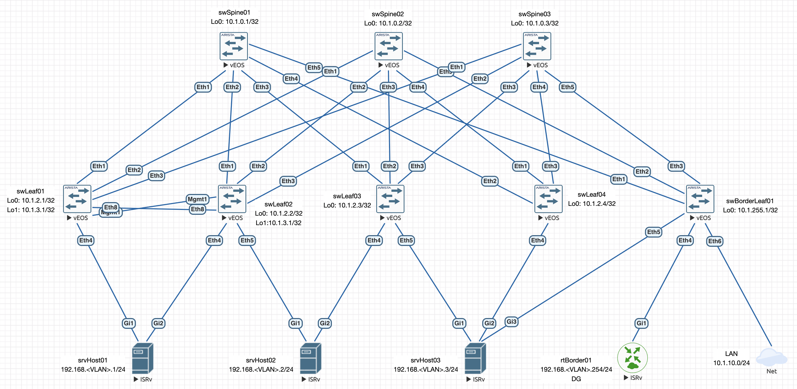

# Lab08: VxLAN. Оптимизация таблиц маршрутизации

## Состав работы
- [Условие задачи](#условие-задачи)

### Условие задачи
В этой самостоятельной работе мы ожидаем, что вы самостоятельно:
- Разместите двух "клиентов" в разных VRF в рамках одной фабрики.
- Настроите маршрутизацию между клиентами через внешнее устройство (граничный роутер\фаерволл\etc)
- Зафиксируете в документации - план работы, адресное пространство, схему сети, настройки сетевого оборудования

### Описание выбранного решения
С точки зрения схемы сети, я оставлю решение из [Lab06]() и [Lab07](), но произведу следующие действия:
1. Оставлю обе сервисные модели (VLAN-Based и VLAN-Aware Based);
2. Полностью перейду на симметричную модель моршрутизации (Symmetric IRB);
3. Удалю OSPF, оставив на уровне оверлея только один BGP;
4. Переделаю подключение L3 сервера и размещу за ним "внутренний" сегмент.

Схема коммутации сети остается следующая:



Кроме того, я хочу гармонизировать все идентификаторы, их названия и произвести весь необходимый для реальной задачи тюнинг.

На уровне подстилающей сети я буду использовать приватную сеть А-класса 10.0.0.0/8, генерация адреса в которой будет производиться согласно правила `10.<Pod>.<Type>.<Number>`, где:
- **Pod (Point of Delivery)**: "точка предоставления услуг" - модульный блок сетевой и вычислительной инфраструктуры, который имеет четко определенные границы, предсказуемую производительность и масштабируется как единое целое.
- **Type**: тип оборудования:
   - *0-100*: физическое;
      - 1: коммутатор уровня Leaf;
      - 2: коммутатор уровня Spine;
      - 3: коммутатор уровня Super-Spine.
   - *101-200*: виртуальное.

Согласно схеме, настройки в табличном виде предствалены в таблице:

*Таблица 1: Адресация подстилающей (андерлейной) сети*

| **Hostname** | **Type** | **IFace** | **IPv4** | **NSAP** |
|-----------------|--------------|-----------|---------------|---------------------------|
| swSpine01 | 02 (Spine) | Loopback0 | 10.1.2.1/32 | 49.0001.0100.0100.0001.00 |
| swSpine02 | 02 (Spine) | Loopback0 | 10.1.2.2/32 | 49.0001.0100.0100.0002.00 |
| swSpine03 | 02 (Spine) | Loopback0 | 10.1.2.3/32 | 49.0001.0100.0100.0003.00 |
| swLeaf01 | 01 (Std Leaf) | Loopback0 | 10.1.1.1/32 | 49.0001.0100.0100.1001.00 |
| swLeaf02 | 01 (Std Leaf) | Loopback0 | 10.1.1.2/32 | 49.0001.0100.0100.1002.00 |
| swLeaf03 | 01 (Std Leaf) | Loopback0 | 10.1.1.3/32 | 49.0001.0100.0100.1003.00 |
| swLeaf04 | 01 (Std Leaf) | Loopback0 | 10.1.1.4/32 | 49.0001.0100.0100.1004.00 |
| swBorderLeaf01 | 01 (Std Leaf) | Loopback0 | 10.1.1.251/32 | 49.0001.0100.0100.1251.00 |

Начальные конфигурации коммутаторов уровня Spine (на примере `swSpine01`):
```
swSpine01#sh run
! Command: show running-config
! device: swSpine01 (vEOS-lab, EOS-4.33.1.1F)
!
! boot system flash:/vEOS-lab.swi
!
no aaa root
!
no service interface inactive port-id allocation disabled
!
transceiver qsfp default-mode 4x10G
!
service routing protocols model multi-agent
!
hostname swSpine01
dns domain Underlay.local
!
spanning-tree mode mstp
!
system l1
   unsupported speed action error
   unsupported error-correction action error
!
interface Ethernet1
   description --- L3 p2p: (no VLAN, no VRF): connection to swLeaf01:Ethernet1
   load-interval 60
   mtu 9000
   no switchport
   ip address unnumbered Loopback0
   ipv6 enable
   isis enable Underlay
   isis network point-to-point
!
interface Ethernet2
   description --- L3 p2p: (no VLAN, no VRF): connection to swLeaf02:Ethernet1
   load-interval 60
   mtu 9000
   no switchport
   ip address unnumbered Loopback0
   ipv6 enable
   isis enable Underlay
   isis network point-to-point
!
interface Ethernet3
   description --- L3 p2p: (no VLAN, no VRF): connection to swLeaf03:Ethernet1
   load-interval 60
   mtu 9000
   no switchport
   ip address unnumbered Loopback0
   ipv6 enable
   isis enable Underlay
   isis network point-to-point
!
interface Ethernet4
   description --- L3 p2p: (no VLAN, no VRF): connection to swLeaf04:Ethernet1
   load-interval 60
   mtu 9000
   no switchport
   ip address unnumbered Loopback0
   ipv6 enable
   isis enable Underlay
   isis network point-to-point
!
interface Ethernet5
   description --- L3 p2p: (no VLAN, no VRF): connection to swBorderLeaf01:Ethernet1
   load-interval 60
   mtu 9000
   no switchport
   ip address unnumbered Loopback0
   ipv6 enable
   isis enable Underlay
   isis network point-to-point
!
interface Ethernet6
!
interface Ethernet7
!
interface Ethernet8
!
interface Loopback0
   description --- Loopback (no VLAN, no VRF): interface for Underlay Control-Plane
   load-interval 60
   ip address 10.1.2.1/32
   isis enable Underlay
   isis passive
!
interface Management1
!
ip routing
!
ipv6 unicast-routing
!
router bgp 65001
   !! Main Layer of Overlay Control-Plane
   !! Main Layer of Overlay Control-Plane
   router-id 10.1.2.1
   update wait-for-convergence
   update wait-install
   timers bgp 3 9
   graceful-restart restart-time 300
   graceful-restart
   maximum-paths 16
   neighbor grpLEAFS peer group
   neighbor grpLEAFS remote-as 65001
   neighbor grpLEAFS update-source Loopback0
   neighbor grpLEAFS bfd
   neighbor grpLEAFS bfd interval 100 min-rx 100 multiplier 3
   neighbor grpLEAFS route-reflector-client
   neighbor grpLEAFS send-community
   neighbor 10.1.1.1 peer group grpLEAFS
   neighbor 10.1.1.2 peer group grpLEAFS
   neighbor 10.1.1.3 peer group grpLEAFS
   neighbor 10.1.1.4 peer group grpLEAFS
   neighbor 10.1.1.251 peer group grpLEAFS
   !
   address-family evpn
      neighbor grpLEAFS activate
      neighbor grpLEAFS next-hop-unchanged
!
router isis Underlay
   hello padding disabled
   net 49.0001.0100.0100.0001.00
   router-id ipv4 10.1.0.1
   is-type level-2
   log-adjacency-changes
   set-overload-bit on-startup 300
   !
   address-family ipv4 unicast
      maximum-paths 16
      bfd all-interfaces
!
router multicast
   ipv4
      software-forwarding kernel
   !
   ipv6
      software-forwarding kernel
!
end
```

Начальные конфигурации коммутаторов уровня Leaf (на примере `swLeaf01`):
```
swLeaf01#sh run
! Command: show running-config
! device: swLeaf01 (vEOS-lab, EOS-4.33.1.1F)
!
! boot system flash:/vEOS-lab.swi
!
no aaa root
!
no service interface inactive port-id allocation disabled
!
transceiver qsfp default-mode 4x10G
!
service routing protocols model multi-agent
!
hostname swLeaf01
dns domain Underlay.local
!
spanning-tree mode mstp
!
system l1
   unsupported speed action error
   unsupported error-correction action error
!
interface Ethernet1
   description --- L3 p2p: (no VLAN, no VRF): connection to swSpine01:Ethernet1
   load-interval 60
   mtu 9000
   no switchport
   ip address unnumbered Loopback0
   ipv6 enable
   isis enable Underlay
   isis network point-to-point
!
interface Ethernet2
   description --- L3 p2p: (no VLAN, no VRF): connection to swSpine02:Ethernet1
   load-interval 60
   mtu 9000
   no switchport
   ip address unnumbered Loopback0
   ipv6 enable
   isis enable Underlay
   isis network point-to-point
!
interface Ethernet3
   description --- L3 p2p: (no VLAN, no VRF): connection to swSpine03:Ethernet1
   load-interval 60
   mtu 9000
   no switchport
   ip address unnumbered Loopback0
   ipv6 enable
   isis enable Underlay
   isis network point-to-point
!
interface Ethernet4
!
interface Ethernet5
!
interface Ethernet6
!
interface Ethernet7
!
interface Ethernet8
!
interface Loopback0
   description --- Loopback (no VLAN, no VRF): interface for Underlay Control-Plane
   ip address 10.1.1.1/32
   isis enable Underlay
   isis passive
!
interface Management1
!
ip routing
!
ipv6 unicast-routing
!
router bgp 65001
   !! !! Main Layer of Overlay Control-Plane
   router-id 10.1.1.1
   update wait-for-convergence
   update wait-install
   timers bgp 3 9
   graceful-restart restart-time 300
   graceful-restart
   maximum-paths 16
   neighbor grpLEAFS peer group
   neighbor grpSPINES peer group
   neighbor grpSPINES remote-as 65001
   neighbor grpSPINES update-source Loopback0
   neighbor grpSPINES bfd
   neighbor grpSPINES bfd interval 100 min-rx 100 multiplier 3
   neighbor grpSPINES route-reflector-client
   neighbor grpSPINES send-community
   neighbor 10.1.2.1 peer group grpSPINES
   neighbor 10.1.2.2 peer group grpSPINES
   neighbor 10.1.2.3 peer group grpSPINES
   !
   address-family evpn
      neighbor grpLEAFS activate
!
router isis Underlay
   hello padding disabled
   net 49.0001.0100.0100.1001.00
   router-id ipv4 10.1.1.1
   is-type level-2
   log-adjacency-changes
   set-overload-bit on-startup 300
   !
   address-family ipv4 unicast
      maximum-paths 16
      bfd all-interfaces
!
router multicast
   ipv4
      software-forwarding kernel
   !
   ipv6
      software-forwarding kernel
```

> Если серверы подключены только к коммутаторая уровня Leaf, то блок `address-family ipv4` в конфигурации уровня Spine рекомендуется полностью удалить. Это разгрузит процессор Spine'а и защитит его от ненужных маршрутов.

Конфигурации всех хостов сброшены.

На уровне наложенной сети (оверлейной) будет использоваться iBGP c ASN:65001 (последняя декада указывает на номер POD'а). Все арендаторы (Tenant) будут находиться в ???

*Таблица 2: Накладные (оверлейные) сети L3*

| **Арендатор** | **VRF Name** | **ASN** | **Target** |
|-|-|-|-|
| Tenant A | TENANT-A | 65101 | 101 |
| Tenant B | TENANT-B | 65102 | 102 |

*Таблица 3: Накладные (оверлейные) сети L2*

| **Арендатор** | VLAN ID | IP/MASK | VNI |
|-|-|-|-|
| Tenant A | 137 | 192.168.12.0/24 | |
| Tenant A | 1026 | 10.128.14.0/24 | |
| Tenant A | 6 | 172.12.23.0/24 | |
|-|
| Tenant B | 23 | 192.168.23.0/24 | |
| Tenant B | 889 | 10.1.1.0/24 | |

VLAN могут быть произвольными, как и IP в VRF - это прирогатива заказчика. Для выхода мы используем nat

VNI - 110000 VLAN100
VLAN101 - VNI110011

VNI -120000 VLAN200
VLAN201 - VNI120021

Allowed range is: 1-1677
10010000
1- POD1
001 - Tenant1
0000 - VLAN

куда совать L3VNI для каждого тенанта


---

1. Ускорение сходимости и оптимизация трафика
Помимо уже настроенного advertisement-interval 0, для EVPN оверлея критически важны следующие параметры:
• update-wait-time 0 и update-wait-install 0
По умолчанию Arista после перезагрузки или падения сессии выдерживает паузу перед отправкой и установкой EVPN-маршрутов, чтобы собрать полную картину сети. В лабах и отказоустойчивых фабриках эту задержку отключают для мгновенного старта.
• next-hop-unchanged (только если оверлей на iBGP)
Если ваши Spine и Leaf находятся в одной AS (iBGP), то Spine-коммутаторы при пересылке EVPN Route Type-2/3 не должны менять IP Next-Hop на свой собственный. Иначе Leaf-коммутаторы попытаются построить VXLAN-туннель до Spine, а не до целевого Leaf.
2. Защита от «мигания» сети (Route Flapping)
• bgp convergence-time 0
Ускоряет время, через которое Arista считает сеть сошедшейся, убирая внутренние системные задержки планировщика BGP.
• evpn route-flap-damping
Если на каком-то сервере начнет «мигать» сетевой интерфейс, он завалит всю фабрику миллионами EVPN-апдейтов (MAC/IP Route Type-2). Этот механизм временно штрафует и замораживает нестабильные маршруты на Leaf, защищая Control Plane коммутаторов.
3. Масштабирование и оптимизация памяти
• graceful-restart (или long-lived-graceful-restart)
Позволяет Control Plane (процессу BGP) перезагрузиться (например, при обновлении Arista EOS) без прерывания передачи трафика через Data Plane (чип коммутатора). Соседи будут удерживать маршруты, зная, что коммутатор скоро вернется.

router bgp 65001
   ! -- Общий тюнинг процесса BGP --
   bgp convergence-time 0
   update-wait-time 0
   update-wait-install 0
   graceful-restart restart-time 120
   
   ! -- Настройка группы соседей --
   neighbor OVERLAY-PEERS peer group
   neighbor OVERLAY-PEERS remote-as 65001  <-- (Если iBGP, для eBGP укажите remote-as external)
   neighbor OVERLAY-PEERS update-source Loopback0
   neighbor OVERLAY-PEERS send-community
   neighbor OVERLAY-PEERS fall-over bfd
   neighbor OVERLAY-PEERS advertisement-interval 0


Чтобы при падении (отвале) BGP-соседа маршрутизатор Arista отправлял EVPN-апдейты (а именно — отзывы маршрутов, Withdrawals) незамедлительно, вам нужно отключить задержку, которая называется MRAI (Min Route Advertisement Interval).


===
У каждого из них существуют свои

VLAN, VNI, L3VPI, VRF

*Таблица 1: Настройки арендаторов*

| Hostname | Lb0 IPv4 | AFI | Area ID | System ID | NSEL |

===

Будем считать, что в DC расположены два клиента: TenantA и TenantB и их сервисы могут мигрировать на любой из хостов (в лабораторной - хост-роутер). У каждого из клиентов есть некоторое количество L2 сегментов. Связь между клиентами возможна только через файрвол rtBorder01, стоящим также на стыке с интернетом.

### Настройка фабрики
Настройку фабрики (для удобства проверки) начнем с `swBorderLeaf01`. Удалим все настройки, связанные с OSPF, старые VLAN и все настройки

