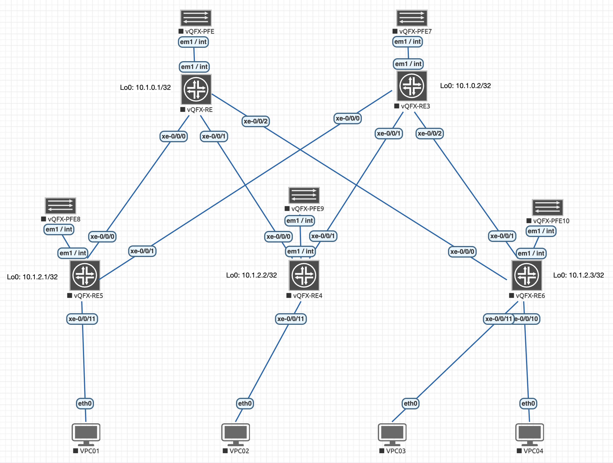

# Juniper Underlay:OSPF

## Особенности виртуализации и подготовка к работе 
Учитывая тот факт, что лабораторные проводятся на EVE-NG, необходимо принимать и митигировать вызовы, связанные с переносом софта (JunOS) под QEMU.

Juniper vQFX — это виртуализированный аналог высокопроизводительных аппаратных коммутаторов Juniper серий QFX (в частности, QFX10000 и QFX5100). Он разработан для моделирования, тестирования и валидации сетевых топологий (включая фабрики Clos, EVPN-VXLAN, eBGP/iBGP-Underlay/Overlay) в виртуальных средах эмуляции, таких как EVE-NG, GNS3 или VMware ESXi.

Основная особенность архитектуры vQFX заключается в её двухнодовой структуре (Twin-VM). В отличие от монолитных виртуальных роутеров (например, vMX), vQFX разделен на две независимые виртуальные машины (ноды): Routing Engine (RE) и Packet Forwarding Engine (PFE). Это полностью повторяет разделение плоскостей управления (Control Plane) и передачи данных (Data Plane) в реальных модульных коммутаторах Juniper.


Разберем компоненты:
- **Компонент управления: vQFX-RE (Routing Engine)**. Виртуальная машина vQFX-RE отвечает за Control Plane (плоскость управления). На ней запущена полноценная операционная система Junos OS (FreeBSD).
    - *Функции*: 
        - Обеспечение работы интерфейса командной строки (CLI) и управление конфигурационным файлом.
        - Запуск протоколов маршрутизации (BGP, OSPF, IS-IS) и построение таблиц маршрутизации (Routing Information Base — RIB).
        - Обработка системных событий, SNMP, политик маршрутизации и генерация таблицы коммутации (Forwarding Information Base — FIB).
    - *Специфика в EVE-NG*: Эта нода предоставляет пользователю доступ к консоли коммутатора. Именно к этой ноде подключаются все внешние для виртуального коммутатора кабели. Порты, выходящие из RE, в интерфейсе EVE-NG обычно обозначаются как eth1, eth2 и т.д., а внутри операционной системы Junos они отображаются как высокоскоростные интерфейсы xe- (10G) или et- (100G).
- **Компонент коммутации: vQFX-PFE (Packet Forwarding Engine)**. Виртуальная машина vQFX-PFE отвечает за Data Plane (плоскость передачи данных). В ней развернута специализированная среда Linux, эмулирующая работу программно-аппаратного комплекса коммутации Juniper.
    - *Функции*:
        - Эмуляция работы кремниевого чипсета (ASIC) Juniper Trio / Q5.
        - Аппаратная (на программном уровне) обработка, инкапсуляция/декапсуляция и продвижение пакетов на основе FIB-таблицы, полученной от RE.
        - Генерация виртуальных сетевых интерфейсов линейной карты (портов данных).
    - *Специфика в EVE-NG*: Не используется для внешнего управления в среде EVE-NG.
- **Межкомпонентное взаимодействие (Внутренняя шина)**. Для синхронизации RE и PFE между ними создается выделенный изолированный канал связи.
    - *Технология туннелирования*: Связь осуществляется через проприетарный внутренний протокол Juniper — RPIO (Routing Engine to Packet Forwarding Engine Input/Output), который инкапсулируется в UDP/IP-туннель (за это отвечает демон rpio_tunnel_br).
    - *Связующие интерфейсы*: В среде EVE-NG для этого строго выделены внутренние порты. На обоих сторонах - это интерфейсы `em1`/`int` (но могут зависеть от среды виртуализации и шаблона).
    - *Адресация*: На интерфейсе `em1` программно закрепляется IP-адрес из диапазона Link-Local (традиционно 169.254.0.2/24). Через этот IP-адрес RE передает на PFE скомпилированную таблицу FIB и конфигурацию портов.
- **Состояние «FPC Online» и инициализация портов**. Поскольку физические порты данных генерируются на стороне PFE, плата управления (RE) изначально ничего не знает об их существовании. Процесс инициализации vQFX выглядит следующим образом:
    1. Загружается операционная система Junos на RE. В этот момент в CLI видны только системные порты (`em0`, `em1`, `fxp0`). В режиме конфигурации порты `xe-` видны как текстовая заготовка, но в операционной системе их нет.
    2. Загружается PFE и через внутренний линк `em1` связывается с RE.
    3. RE распознает PFE как подключенную виртуальную линейную карту (Flexible PIC Concentrator — FPC 0).
    4. При успешном установлении RPIO-туннеля команда `show chassis fpc` возвращает статус `Slot 0 -> Online`.
    5. Только после перехода FPC в состояние `Online` операционная система Junos динамически активирует интерфейсы типа `xe-` или `et-` в CLI (`show interfaces terse`), делая устройство полноценным коммутатором фабрики Clos.

### Начальное конфигурирование пары RE-PFE

**Правила подключения компонентов** (оба виртуальных компонента должны быть выключены для коммутации соединений):
- На vQFX-PFE необходимо выбрать: `em1`/`int`.
- На vQFX-RE выберите: `em1`/`int`.


После этого, запускаем обе ноды и переходим в telnet-соединение к ноде RE.

Произведем полный этап подготовки виртуального маршрутизатора к ручному конфигурированию.

В результате загрузки полуичм системное приглашение:
```
Sun Aug 30 18:46:06 UTC 2026

vqfx-re (ttyd0)

login:
```

Вводим дефолтные аутентификационные параметры: `root`/`Juniper`, после чего попадаем в командную оболочку `csh`:
```
--- JUNOS 20.3R1.8 built 2020-09-21 09:20:04 UTC
root@vqfx-re:RE:0%
```

Фактически мы получаем командную строку FreeBSD. Для перехода в режим управления коммутатором, необходимо использовать интерпрететор `cli`:
```
root@vqfx-re:RE:0% cli
{master:0}
root@vqfx-re>
```

Это основной режим управления коммутатором. Переход в режим конфигурирования осуществляется командой `configure`:
```
root@vqfx-re> configure
Entering configuration mode

{master:0}[edit]
```

Следует отметить, что стартовая конфигурация сильно перегружена сервисом Juniper ZTP (Zero Touch Provisioning), часто вешающей на все интерфейсы DHCP и vendor-id, чтобы коммутатор мог автоматически найти сервер управления при первой загрузке.

Я предпочитаю удалить все ненужные интерфейсы и их настройки, чтобы не путаться:
```
root@swSpine01# wildcard delete interfaces .*
  matched: et-0/0/0
  matched: xe-0/0/0:0
  matched: xe-0/0/0:1
  matched: xe-0/0/0:2
  matched: xe-0/0/0:3
  matched: et-0/0/1
  matched: xe-0/0/1
  matched: xe-0/0/1:0
  ...
Delete 409 objects? [yes,no] (no) yes

{master:0}[edit]
```

установить на интерфейс связи с PFE правильный IP-адрес (он одинаковый для всех инсталляций):
```
root@vqfx-re# set interfaces em1 unit 0 family inet address 169.254.0.2/24
```

установить новый пароль:
```
root@vqfx-re# set system root-authentication plain-text-password
New password: <PASSWORD>
Retype new password: <PASSWORD>

{master:0}[edit]
```

> Пароль должен соответствовать политикам безопасности и должен содержать символы разного регистра, цифры или знаки пунктуации (require change of case, digits or punctuation).

и произвести коммит:
```
root@vqfx-re# commit
configuration check succeeds
commit complete

{master:0}[edit]
```

После этого необоходимо подождать, пока PE и PFE перестроят туннель. И можно проверить связанность:
```
root@vqfx-re# run show arp
MAC Address       Address         Name                      Interface               Flags
50:00:00:01:00:01 169.254.0.1     169.254.0.1               em1.0                   none

{master:0}[edit]

root@vqfx-re# run ping 169.254.0.1
PING 169.254.0.1 (169.254.0.1): 56 data bytes
64 bytes from 169.254.0.1: icmp_seq=0 ttl=64 time=2.824 ms
64 bytes from 169.254.0.1: icmp_seq=1 ttl=64 time=1.422 ms
64 bytes from 169.254.0.1: icmp_seq=2 ttl=64 time=1.293 ms
^C
--- 169.254.0.1 ping statistics ---
3 packets transmitted, 3 packets received, 0% packet loss
round-trip min/avg/max/stddev = 1.293/1.846/2.824/0.693 ms

{master:0}[edit]
```

После этого можно проверить высокоуровневые интерфейсы: список всех линейных карт FPC:
```
root@vqfx-re# run show chassis hardware
Hardware inventory:
Item             Version  Part number  Serial number     Description
Chassis                                08061003465       QFX3500

{master:0}[edit]
```

и слоты:
```
root@vqfx-re# run show chassis fpc
                     Temp  CPU Utilization (%)   CPU Utilization (%)  Memory    Utilization (%)
Slot State            (C)  Total  Interrupt      1min   5min   15min  DRAM (MB) Heap     Buffer
  0  Online           Testing  41         4        0      0      0    1920        0         45
  1  Empty
  2  Empty
  3  Empty
  4  Empty
  5  Empty
  6  Empty
  7  Empty
  8  Empty
  9  Empty

{master:0}[edit]
```

Слот `0` находится в состоянии `Online`, следовательно в неконфигурационном режиме мы должны будем увидеть "присутствующие" интерфейсы.

```
root@vqfx-re# exit
Exiting configuration mode

{master:0}

root@vqfx-re> show interfaces terse
Interface               Admin Link Proto    Local                 Remote
gr-0/0/0                up    up
pfe-0/0/0               up    up
pfe-0/0/0.16383         up    up   inet
                                   inet6
pfh-0/0/0               up    up
pfh-0/0/0.16383         up    up   inet
pfh-0/0/0.16384         up    up   inet
xe-0/0/0                up    up
xe-0/0/0.16386          up    up
xe-0/0/1                up    up
xe-0/0/1.16386          up    up
xe-0/0/2                up    up
xe-0/0/2.16386          up    up
xe-0/0/3                up    up
xe-0/0/3.16386          up    up
xe-0/0/4                up    up
xe-0/0/4.16386          up    up
xe-0/0/5                up    up
xe-0/0/5.16386          up    up
xe-0/0/6                up    up
xe-0/0/6.16386          up    up
xe-0/0/7                up    up
...
```

Все интерфейсы присутствуют. Можно приступать к дальнейшим действиям.

### Сброс до фабричных настроек
В случае, если понадобится сброс до "фабричных" настроек, рекомендую выполнить следующие действия:
```
root@vqfx-re:RE:0% cli
{master:0}

root@swSpine01> configure
Entering configuration mode

{master:0}[edit]

root@swSpine01# load factory-default
warning: activating factory configuration

root@swSpine01# commit
[edit]
  'system'
    Missing mandatory statement: 'root-authentication'
error: commit failed: (missing mandatory statements)
```

Операционная система Junos запрещает применять любые изменения (commit), пока этот пароль не будет установлен. Это базовое требование безопасности Juniper.

Чтобы успешно применить конфигурацию, вам нужно сначала задать пароль суперпользователя.
```
root@swSpine01# set system root-authentication plain-text-password
New password:
Retype new password:

{master:0}[edit]
```

После этого возможна перезапись конфигурации:
```
root@swSpine01# commit
configuration check succeeds
Generating DSA key /etc/ssh/ssh_host_dsa_key
Generating public/private dsa key pair.
Your identification has been saved in /config/ssh_host_dsa_key.
Your public key has been saved in /config/ssh_host_dsa_key.pub.
The key fingerprint is:
SHA256:GpLLyRM9Eo9b8aIhTbBS40uO3qDOAnZgl0oz1jUBaQ8 root@swSpine01
The key's randomart image is:
+---[DSA 1024]----+
|  +.o..          |
| o E o           |
|. * B o          |
| % B B o         |
|=.X O B S        |
|+oo= @ =         |
|+...O .          |
|+    .           |
|.o               |
+----[SHA256]-----+

swSpine01 (ttyd0)

login:
```

Можно воспользоваться и рекомендуемым производителем методом через команду контекста управления `request system zeroize`, но в окружении EVE-NG это не является хорошей идеей по следующей причине. В результате такого действия конфигурация будет полностью стерта (как это происходит с аппаратными решениями), но, при этом, в отличии от рекомендованного варианта (load factory-default) не будет скопирован шаблон, оптимизированный для работы в окружении среды виртуализации.

### Возможные проблемы и их решения
У меня при полном отключении пары RE/PFE, коммутатор Juniper QFX загрузился в режиме подчинённого узла (Linecard) внутри виртуального шасси (Virtual Chassis):
```
root@swLeaf01:LC:1% cli
warning: This chassis is operating in a non-master role as part of a virtual-chassis (VC) system.
warning: Use of interactive commands should be limited to debugging and VC Port operations.
warning: Full CLI access is provided by the Virtual Chassis Master (VC-M) chassis.
warning: The VC-M can be identified through the show virtual-chassis status command executed at this console.
warning: Please logout and log into the VC-M to use CLI.
{linecard:1}
root@swLeaf01>
```

Это происходит потому, что плата коммутации (PFE) пытается связаться с платой управления (RE) по внутренним IP-адресам (128.0.0.16 или 10.0.0.16), но не может до нее достучаться, так как она не успела загрузиться. Из-за этого, виртуальный коммутатор считает себя подчиненным при недоступном VC-M.

На физическом железе, привести в чувство мятежный PFE можно командой:
```
root@swLeaf01> request session member 0
connect to address 128.0.0.16: No route to host
Trying 10.0.0.16...
fpc0: No route to host
```

но для ее срабатывания придется подождать.

Заблокировать переход в режим линейной карты можно, запретив коммутатору работать в данном режиме, передав в режиме конфигурации следующие команды:
```
set virtual-chassis no-split-detection
set virtual-chassis member 0 mastership-priority 255
```

Здесь:
- no-split-detection — отключает алгоритм, который заставляет коммутатор паниковать и уходить в Linecard, если он теряет связь со вторым участником.
- mastership-priority 255 — выставляет максимальный приоритет. Коммутатор всегда будет объявлять себя Мастером, даже если база данных vctopo.db пересоздастся.

После чего будет произведена переинициализация системы (без перезагрузки)):
```
root@swLeaf01# commit and-quit

swLeaf01 (ttyd0)

login:
```

Но следует обратить внимание на то, что в текущей сессии карта может "подключиться" не к слоту 0, например:
```
root@swLeaf01> show chassis fpc
                     Temp  CPU Utilization (%)   CPU Utilization (%)  Memory    Utilization (%)
Slot State            (C)  Total  Interrupt      1min   5min   15min  DRAM (MB) Heap     Buffer
  0  Empty
  1  Online           Testing  56         7        0      0      0    1920        0         44
  2  Empty
  3  Empty
  4  Empty
  5  Empty
  6  Empty
  7  Empty
  8  Empty
  9  Empty
```

что создаст неработоспособную конфигурацию для виртуального коммутатора.

Я вылечил перезагрузкой. Все следующие загрузки системы произведились правильно.

Либо, что является более вандальным вариантом, можно удалить базы, используемые сервисом Virtual Chassis из окружения командного процессора (`start shell`):
```
rm -f /config/vctopo.db
rm -f /var/db/vctopo.db
rm -f /data/config/vctopo.db
```

и произведя перезагрузку PFE:
```
exit && reboot
```

## Первоначальная настройка
Схема подключений стенда имеет следующий вид:



После удаления интерфейсов, конфигурация приобретает удобное состояние для первоначальной ручной настройки:
```
root@vqfx-re# show
## Last changed: 2026-08-30 19:00:04 UTC
version 20.3R1.8;
system {
    host-name vqfx-re;
    root-authentication {
        encrypted-password "$6$qwIDF/35$sQ8xBVZioJaf8ZkiPqXGYMPURFw2YfrASAoGwgHRK2uPbop5M5HjELmT/JHNrGeNNAo9vCqPNNKgji8oFZNlT."; ## SECRET-DATA
        ssh-rsa "ssh-rsa AAAAB3NzaC1yc2EAAAABIwAAAQEA6NF8iallvQVp22WDkTkyrtvp9eWW6A8YVr+kz4TjGYe7gHzIw+niNltGEFHzD8+v1I2YJ6oXevct1YeS0o9HZyN1Q9qgCgzUFtdOKLv6IedplqoPkcmF0aYet2PkEDo3MlTBckFXPITAMzF8dJSIFo9D8HfdOV0IAdx4O7PtixWKn5y2hMNG0zQPyUecp4pzC6kivAIhyfHilFR61RGL+GPXQ2MWZWFYbAGjyiYJnAmCP3NOTd0jMZEnDkbUvxhMmBYSdETk1rRgm+R4LOzFUGaHqHDLKLX+FIPKcF96hrucXzcWyLbIbEgE98OHlnVYCzRdK8jlqm8tehUc9c9WhQ== vagrant insecure public key"; ## SECRET-DATA
    }
    login {
        user vagrant {
            uid 2000;
            class super-user;
            authentication {
                ssh-rsa "ssh-rsa AAAAB3NzaC1yc2EAAAABIwAAAQEA6NF8iallvQVp22WDkTkyrtvp9eWW6A8YVr+kz4TjGYe7gHzIw+niNltGEFHzD8+v1I2YJ6oXevct1YeS0o9HZyN1Q9qgCgzUFtdOKLv6IedplqoPkcmF0aYet2PkEDo3MlTBckFXPITAMzF8dJSIFo9D8HfdOV0IAdx4O7PtixWKn5y2hMNG0zQPyUecp4pzC6kivAIhyfHilFR61RGL+GPXQ2MWZWFYbAGjyiYJnAmCP3NOTd0jMZEnDkbUvxhMmBYSdETk1rRgm+R4LOzFUGaHqHDLKLX+FIPKcF96hrucXzcWyLbIbEgE98OHlnVYCzRdK8jlqm8tehUc9c9WhQ== vagrant insecure public key"; ## SECRET-DATA
            }
        }
    }
    services {
        ssh {
            root-login allow;
        }
        netconf {
            ssh;
        }
        rest {
            http {
                port 8080;
            }
            enable-explorer;
        }
    }
    syslog {
        user * {
            any emergency;
        }
        file messages {
            any notice;
            authorization info;
        }
        file interactive-commands {
            interactive-commands any;
        }
    }
    extensions {
        providers {
            juniper {
                license-type juniper deployment-scope commercial;
            }
            chef {
                license-type juniper deployment-scope commercial;
            }
        }
    }
}
interfaces {
    em1 {
        unit 0 {
            family inet {
                address 169.254.0.2/24;
            }
        }
    }
}
forwarding-options {
    storm-control-profiles default {
        all;
    }
}
protocols {
    igmp-snooping {
        vlan default;
    }
}
vlans {
    default {
        vlan-id 1;
    }
}

{master:0}[edit]
```

Начнем с настройки коммутатора swSpine01. Настройка остальных коммутаторов во многом аналогична. 

Произведем следующие настройки:
```
set system host-name swSpine01              ! Задаем системное имя устройства
set system domain-name Underlay.local       ! Указываем DNS-домен

set protocols lldp interface all            ! Включаем протокол LLDP
set protocols lldp-med interface all        ! Включаем расширение LLDP-MED

set chassis network-services enhanced-ip    ! Включение оптимизации распределения обработки трафика между PFE и RE
```

В рамках первоначальной настройки нам необходимо настроить интерфейс локальной петли lo0.0, используемой для Underlay-слоя и p2p интерфейсы, являющиеся гранями, соединяющими Spine'ы и Leaf'ы фабрики. Будем использовать на гранях unnumbered с Link-local IPv6 адресом для Inbound-управления.
```
set interfaces lo0.0 family inet address 10.1.0.1/32
set interfaces lo0 description "--- Virtual (no VRF, no VLAN): Underlay Control Plane"
```

Получаем следующую конфигурацию:
```
root@swSpine01# show interfaces lo0
description "--- Virtual (no VRF, no VLAN): Underlay Control Plane";
unit 0 {
    family inet {
        address 10.1.0.1/32;
    }
}
```

Проверим доступность:
```
root@swSpine01# exit
Exiting configuration mode

{master:0}
root@swSpine01> ping 10.1.0.1 count 2
PING 10.1.0.1 (10.1.0.1): 56 data bytes
64 bytes from 10.1.0.1: icmp_seq=0 ttl=64 time=2.599 ms
64 bytes from 10.1.0.1: icmp_seq=1 ttl=64 time=0.628 ms
64 bytes from 10.1.0.1: icmp_seq=2 ttl=64 time=8.534 ms
64 bytes from 10.1.0.1: icmp_seq=3 ttl=64 time=0.757 ms
^C
--- 10.1.0.1 ping statistics ---
4 packets transmitted, 4 packets received, 0% packet loss
round-trip min/avg/max/stddev = 0.628/3.130/8.534/3.216 ms

{master:0}
```

Далее, необходимо настроить интерфейсы `xe0/0/0-2`, участвующие в p2p, включив в них IPv6 link-local адрес (используемых для подключения в случае аварии). Настроим интерфейс `xe-0/0/0`:
```
set interfaces xe-0/0/0 unit 0 family inet unnumbered-address lo0.0 ! Используем адрес lo0 для включения протокола IPv4 и установления OSPF-соседства
set interfaces xe-0/0/0 unit 0 family inet6     ! Включаем протокол IPv6 для генерации Link-local адреса.и использования в рамках In-Band управления
```

а остальные скопируем (также в контексте конфигурирования):
```
copy interfaces xe-0/0/0 to xe-0/0/1
copy interfaces xe-0/0/0 to xe-0/0/2
```

Осталось добавить описания:
```
set interfaces xe-0/0/0 description "--- L3 (no VRF, no VLAN): p2p connection to swLeaf01:xe0/0/0"
set interfaces xe-0/0/1 description "--- L3 (no VRF, no VLAN): p2p connection to swLeaf02:xe0/0/1"
set interfaces xe-0/0/2 description "--- L3 (no VRF, no VLAN): p2p connection to swLeaf02:xe0/0/2"
```

После произведенных действий интерфейсы p2p получат Link-local адреса, но не будет работать сервис Router Advertisement - мы не будем видить соседей, а команда `show ipv6 neighbors` будет иметь нулевой вывод.

Это абсолютно нормальное и стандартное поведение стека IPv6 в Junos. Пока не поступит трафик, интерфейс будет находится в режиме экономии ресурсов и не будет слать фоновые широковещательные NDP-запросы (Neighbor Solicitation). 

Однако, если произвести ping соседа, ядро Junos инициирует его поиск, отправит NDP, на что получит ответ и запишет соседский Link-local адрес в таблицу — после чего show ipv6 neighbors начинает его видеть.

Чтобы заставить коммутатор сразу включить сервис обнаружения, можно либо включить его на конкретном интерфейсе:
```
set protocols router-advertisement interface xe-0/0/0.0
```

либо глобально:
```
set protocols router-advertisement interface all
```

После чего (если настроить и ответные стороны), соседство будет иметь вид, аналогичный следующему:
```
root@swSpine01# run show ipv6 neighbors
IPv6 Address                            Linklayer Address  State       Exp   Rtr  Secure  Interface
fe80::205:86ff:fe71:2103                 02:05:86:71:21:03  stale       410   yes  no      xe-0/0/1.0
fe80::205:86ff:fe71:2a03                 02:05:86:71:2a:03  stale       101   yes  no      xe-0/0/2.0
fe80::205:86ff:fe71:a803                 02:05:86:71:a8:03  stale       569   yes  no      xe-0/0/0.0
Total entries: 3

{master:0}[edit]
```

Теперь в случае расхождения связанности к какому-то коммутатору, можно будет осуществить доступ через его Link-local IPv6-адрес, подключившись, например, следующим образом:
```
root@swSpine02> ssh fe80::205:86ff:fe71:2607
The authenticity of host 'fe80::205:86ff:fe71:2607 (fe80::205:86ff:fe71:2607)' can't be established.
ECDSA key fingerprint is SHA256:tDUQi+3Wvgv8dwZOIVqJNZwi3AzUCF26+Q4JcrBZVB4.
Are you sure you want to continue connecting (yes/no)? yes
Warning: Permanently added 'fe80::205:86ff:fe71:2607' (ECDSA) to the list of known hosts.
Password:
root@swSpine01:RE:0%
```

### 


Поскольку вы строите фабрику EVPN/VXLAN, инкапсуляция VXLAN добавляет к каждому пакету ровно 50 байт оверхеда (заголовки сокетов UDP, VXLAN и внешний IP-заголовок). Если ваш клиент внутри сети отправит стандартный пакет размером 1500 байт, Leaf-коммутатор упакует его в VXLAN, и на Spine полетит кадр размером 1550 байт.

Если на Spine или Leaf L2 MTU останется равен 1500, коммутаторы начнут дропать реальный клиентский трафик.

Правильная настройка для фабрики:
Чтобы фабрика работала без потерь, физический линк (L2) делают больше («Jumbo Frames»), а для служебных протоколов самого коммутатора (OSPF, IS-IS, BGP, SSH) оставляют стандартный IP MTU.

```
# 1. Поднимаем L2 MTU с запасом для VXLAN (до Jumbo-кадров)
set interfaces xe-0/0/0 mtu 9216

# 2. Ограничиваем IP MTU для системного трафика (OSPF/BGP/SSH), 
# чтобы unnumbered lo0.0 не генерировал пакеты по 16кб
set interfaces xe-0/0/0 unit 0 family inet mtu 1500

commit and-quit
```


В конфигурации Juniper:
set interfaces xe-0/0/0 mtu 9216 — это L2 MTU (Media MTU). Он определяет максимальный размер всего Ethernet-кадра, включая заголовки L2, который физический (или виртуальный) порт способен отправить или принять.
set interfaces xe-0/0/0 unit 0 family inet mtu 1500 — это L3 MTU (Protocol MTU). Он определяет максимальный размер IP-пакета (полезной нагрузки внутри Ethernet-кадра).


root@swSpine01# set interfaces xe-0/0/0 unit 0 family inet6 mtu 1500


Чтобы оверлей работал длинными пакетами, нужно идти в противоположную сторону — не уменьшать L3 MTU, а увеличивать L2 MTU (Jumbo Frames) на пути между Leaf и Spine.

Идеальная конфигурация для линков внутри фабрики (Underlay):
set interfaces xe-0/0/0 mtu 9216
set interfaces xe-0/0/0 unit 0 family inet mtu 9000

mtu 9216 (на физическом интерфейсе): Гарантирует, что любые VXLAN-пакеты (1550 байт, 1600 байт или даже Jumbo-кадры от клиентов) пролетят между Leaf и Spine без ограничений.
family inet mtu 9000 (на логическом): Защитит стек самого Junos. Теперь lo0.0 при генерации SSH или OSPF будет нарезать пакеты по 9000 байт. А так как физический порт готов принимать до 9216 байт, пакеты проскочат мгновенно (при условии, что вы подняли MTU в самом EVE-NG, как мы обсуждали в предыдущем шаге).


Жёсткие 16384 байт вшиты в ядро системы


EVE-NG:
cp /opt/unetlab/html/includes/config.php.distribution /opt/unetlab/html/includes/config.php


<?php
// TEMPLATE MODE .missing or .hided
DEFINE('TEMPLATE_DISABLED','.hided') ;
$TEMPLATE_MTU = 9216;
?>


```
root@swSpine01> show interfaces lo0
Physical interface: lo0, Enabled, Physical link is Up
  Interface index: 6, SNMP ifIndex: 6
  Description: --- Virtual (no VRF, no VLAN): Underlay Control Plane
  Type: Loopback, MTU: Unlimited
  Device flags   : Present Running Loopback
  Interface flags: SNMP-Traps
  Link flags     : None
  Last flapped   : Never
    Input packets : 43741
    Output packets: 43741

  Logical interface lo0.0 (Index 548) (SNMP ifIndex 16)
    Flags: SNMP-Traps Encapsulation: Unspecified
    Input packets : 26
    Output packets: 26
    Protocol inet, MTU: Unlimited
    Max nh cache: 0, New hold nh limit: 0, Curr nh cnt: 0, Curr new hold cnt: 0,
    NH drop cnt: 0
      Flags: Sendbcast-pkt-to-re
      Addresses, Flags: Is-Default Is-Primary
        Local: 10.1.0.1
    Protocol inet6, MTU: Unlimited
    Max nh cache: 0, New hold nh limit: 0, Curr nh cnt: 0, Curr new hold cnt: 0,
    NH drop cnt: 0
      Flags: None
        Local: fe80::205:860f:fc71:c500
...
```
Вывод Protocol inet, MTU: Unlimited наглядно показывает корень проблемы: в вашей версии Junos для виртуального интерфейса lo0.0 значение MTU определено как Unlimited (Без ограничений).

Когда вы запускаете SSH-сессию, использующую unnumbered-адрес этого интерфейса, Junos пытается отправить огромный пакет, который физически не может быть фрагментирован или передан через виртуальные линки EVE-NG.

Поскольку изменить MTU для lo0 или заставить его фрагментировать пакеты стандартными методами в Junos невозможно, единственный способ наладить BGP и SSH в такой схеме — отказаться от unnumbered-address на интерфейсах Underlay-сети (стыках Leaf-Spine).


Вариант 2. TCP MSS Clamping для BGP и системного трафика
Документация Juniper предлагает использовать механизм TCP MSS для контроля размера пакетов управляющих протоколов, если под ними лежит Jumbo-линк.
Поскольку вы будете настраивать BGP, чтобы его сессии (и SSH) не падали из-за фрагментации, добавьте в конфигурацию BGP:
set protocols bgp group <имя_группы> tcp-mss 1024


run ping 10.1.2.1 size 8500 do-not-fragment source 10.1.0.1


[root@hstLAB01:~] esxcli network vswitch standard set -m 9000 -v vSwitch0
[root@hstLAB01:~] esxcli network ip interface set -m 9000 -i vmk0

root@vmEVE-NG:~# ping -M do -s 8972 10.1.10.11
PING 10.1.10.11 (10.1.10.11) 8972(9000) bytes of data.
8980 bytes from 10.1.10.11: icmp_seq=1 ttl=64 time=0.193 ms
8980 bytes from 10.1.10.11: icmp_seq=2 ttl=64 time=0.222 ms
8980 bytes from 10.1.10.11: icmp_seq=3 ttl=64 time=0.133 ms
^C
--- 10.1.10.11 ping statistics ---
3 packets transmitted, 3 received, 0% packet loss, time 2056ms
rtt min/avg/max/mdev = 0.133/0.182/0.222/0.037 ms

root@vmEVE-NG:~# for i in $(ls /sys/class/net/); do ip link set dev $i mtu 9000 2>/dev/null; done


Чтобы эта проблема не повторялась при следующих перезагрузках лабы, вам нужно жестко зафиксировать роль Master (коммутатор №0) в файле конфигурации. Тогда при загрузке Junos будет игнорировать любые внешние попытки переключить его роль


set virtual-chassis member 0 mastership-priority 255


Переходим на сторону swLeaf01:
```
root@vqfx-re:RE:0% cli
{master:0}

root@vqfx-re> configure
Entering configuration mode

{master:0}[edit]

root@vqfx-re# set system root-authentication plain-text-password
New password:
Retype new password:

{master:0}[edit]

root@vqfx-re# wildcard delete interfaces .*
  matched: et-0/0/0
  matched: xe-0/0/0
  matched: xe-0/0/0:0
  matched: xe-0/0/0:1
  matched: xe-0/0/0:2
  matched: xe-0/0/0:3
  matched: et-0/0/1
  matched: xe-0/0/1
  ...
Delete 410 objects? [yes,no] (no) yes

{master:0}[edit]

root@vqfx-re# commit
configuration check succeeds
Generating DSA key /etc/ssh/ssh_host_dsa_key
Generating public/private dsa key pair.
Your identification has been saved in /config/ssh_host_dsa_key.
Your public key has been saved in /config/ssh_host_dsa_key.pub.
The key fingerprint is:
SHA256:cvsfYNFcloBpbg9aNCnONOSgPfKsZW8Z+ATqBM8K930 root@vqfx-re
The key's randomart image is:
+---[DSA 1024]----+
|      ...  +..o. |
|     o o+ Bo o.  |
|  . o ++.*..o    |
|   + = +o =.     |
|. . = B S+oo     |
| o = = *.= ..    |
|  . + . E   .    |
|       o .   .   |
|          ...    |
+----[SHA256]-----+
commit complete

vqfx-re (ttyd0)

login:
...

Авторизуемся с новыми учетными данными и настраиваем:
```
set system host-name swLeaf01
set system domain-name Underlay.local

set interfaces lo0 description "--- Virtual (no VRF, no VLAN): Underlay Control Plane"
set interfaces lo0.0 family inet address 10.1.2.1/32

set interfaces xe-0/0/0 description "--- L3 (no VRF, no VLAN): p2p connection to swSpine01/Et1"
set interfaces xe-0/0/0 mtu 9214
set interfaces xe-0/0/0 unit 0 family inet unnumbered-address lo0.0

set interfaces xe-0/0/1 description "--- L3 (no VRF, no VLAN): p2p connection to swSpine02/Et1"
set interfaces xe-0/0/1 mtu 9214
set interfaces xe-0/0/1 unit 0 family inet unnumbered-address lo0.0
```


Чтобы коммутатор пересчитывал скорость интерфейсов для системных счетчиков и SNMP каждые 60 секунд, выполните:junosset system snmp-interface-calculate-rate 60


```
window@swSpine01> show bfd session
                                                  Detect   Transmit
Address                  State     Interface      Time     Interval  Multiplier
10.1.2.1                 Up        xe-0/0/0.0     6.000     2.000        3
10.1.2.2                 Up        xe-0/0/1.0     0.300     0.100        3
10.1.2.3                 Up        xe-0/0/2.0     0.300     0.100        3

3 sessions, 3 clients
Cumulative transmit rate 20.5 pps, cumulative receive rate 20.5 pps

{master:0}
```

```
```
