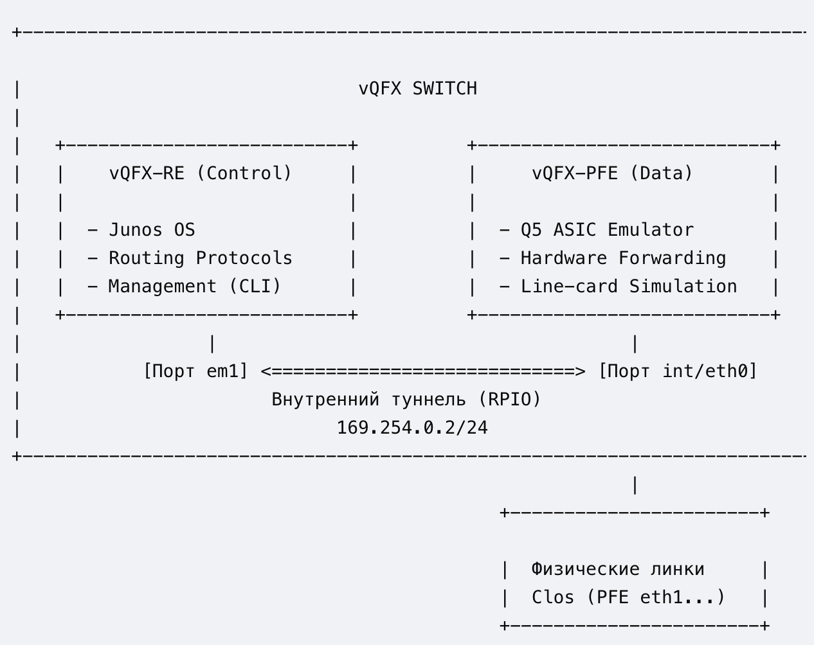
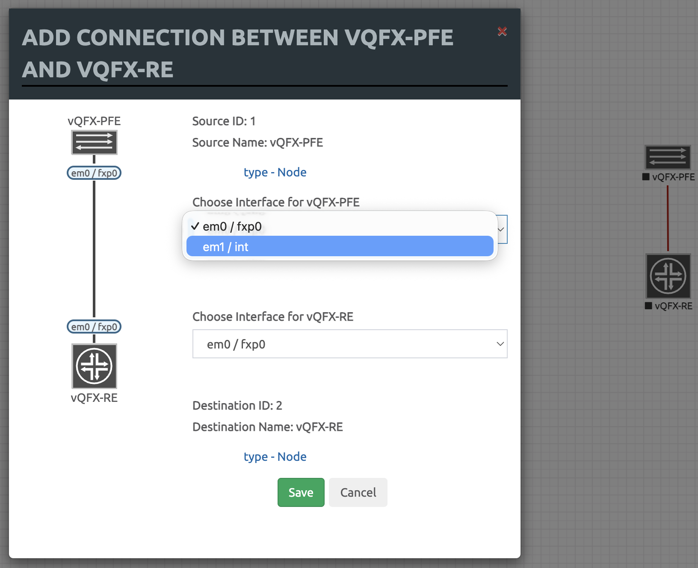
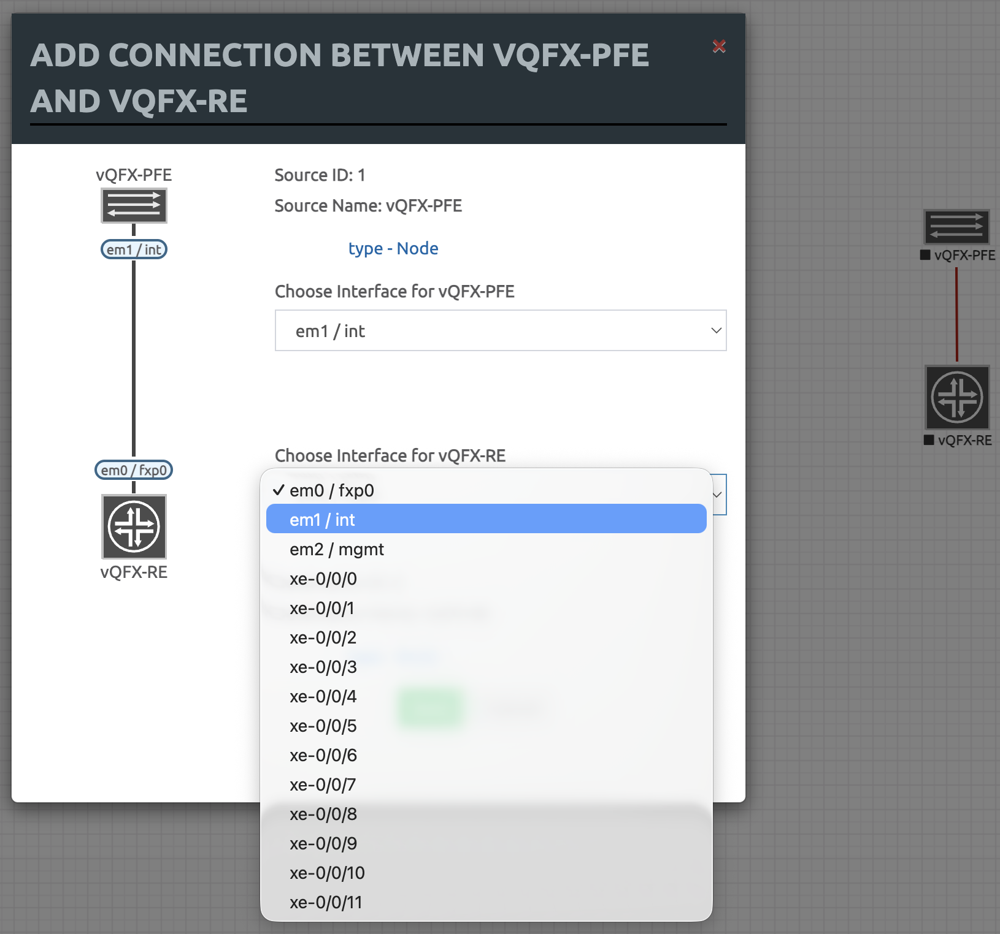

# Juniper Underlay:OSPF

## Особенности виртуализации и подготовка к работе 
Учитывая тот факт, что лабораторные проводятся на EVE-NG, необходимо принимать и митигировать вызовы, связанные с переносом софта (JunOS) под QEMU.

Juniper vQFX — это виртуализированный аналог высокопроизводительных аппаратных коммутаторов Juniper серий QFX (в частности, QFX10000 и QFX5100). Он разработан для моделирования, тестирования и валидации сетевых топологий (включая фабрики Clos, EVPN-VXLAN, eBGP/iBGP-Underlay/Overlay) в виртуальных средах эмуляции, таких как EVE-NG, GNS3 или VMware ESXi.

Основная особенность архитектуры vQFX заключается в её двухнодовой структуре (Twin-VM). В отличие от монолитных виртуальных роутеров (например, vMX), vQFX разделен на две независимые виртуальные машины (ноды): Routing Engine (RE) и Packet Forwarding Engine (PFE). Это полностью повторяет разделение плоскостей управления (Control Plane) и передачи данных (Data Plane) в реальных модульных коммутаторах Juniper.



Разберем компоненты:
- **Компонент управления: vQFX-RE (Routing Engine)**. Виртуальная машина vQFX-RE отвечает за Control Plane (плоскость управления). На ней запущена полноценная операционная система Junos OS (FreeBSD).
    - *Функции*: 
        - Обеспечение работы интерфейса командной строки (CLI) и управление конфигурационным файлом.
        - Запуск протоколов маршрутизации (BGP, OSPF, IS-IS) и построение таблиц маршрутизации (Routing Information Base — RIB).
        - Обработка системных событий, SNMP, политик маршрутизации и генерация таблицы коммутации (Forwarding Information Base — FIB).
    - *Специфика в EVE-NG*: Эта нода предоставляет пользователю доступ к консоли коммутатора. Сама по себе RE-нода не имеет физических портов для передачи транзитного трафика (дата-плейна).
- **Компонент коммутации: vQFX-PFE (Packet Forwarding Engine)**. Виртуальная машина vQFX-PFE отвечает за Data Plane (плоскость передачи данных). В ней развернута специализированная среда Linux, эмулирующая работу программно-аппаратного комплекса коммутации Juniper.
    - *Функции*:
        - Эмуляция работы кремниевого чипсета (ASIC) Juniper Trio / Q5.
        - Аппаратная (на программном уровне) обработка, инкапсуляция/декапсуляция и продвижение пакетов на основе FIB-таблицы, полученной от RE.
        - Генерация виртуальных сетевых интерфейсов линейной карты (портов данных).
    - *Специфика в EVE-NG*: Именно к этой ноде подключаются все внешние для виртуального коммутатора кабели. Порты, выходящие из PFE, в интерфейсе EVE-NG обычно обозначаются как eth1, eth2 и т.д., а внутри операционной системы Junos они отображаются как высокоскоростные интерфейсы xe- (10G) или et- (100G).
- **Межкомпонентное взаимодействие (Внутренняя шина)**. Для синхронизации RE и PFE между ними создается выделенный изолированный канал связи.
    - *Технология туннелирования*: Связь осуществляется через проприетарный внутренний протокол Juniper — RPIO (Routing Engine to Packet Forwarding Engine Input/Output), который инкапсулируется в UDP/IP-туннель (за это отвечает демон rpio_tunnel_br).
    - *Связующие интерфейсы*: В среде EVE-NG для этого строго выделены внутренние порты. На стороне RE это интерфейс em1, а на стороне PFE — порт int (или eth0 в зависимости от шаблона).
    - *Адресация*: На интерфейсе em1 программно закрепляется IP-адрес из диапазона Link-Local (традиционно 169.254.0.2/24). Через этот IP-адрес RE передает на PFE скомпилированную таблицу FIB и конфигурацию портов.
- **Состояние «FPC Online» и инициализация портов**. Поскольку физические порты данных генерируются на стороне PFE, плата управления (RE) изначально ничего не знает об их существовании.Процесс инициализации vQFX выглядит следующим образом:
    1. Загружается операционная система Junos на RE. В этот момент в CLI видны только системные порты (em0, em1, fxp0). В режиме конфигурации порты xe- видны как текстовая заготовка, но в операционной системе их нет.
    2. Загружается PFE и через внутренний линк em1 связывается с RE.
    3. RE распознает PFE как подключенную виртуальную линейную карту (Flexible PIC Concentrator — FPC 0).
    4. При успешном установлении RPIO-туннеля команда show chassis fpc возвращает статус Slot 0 -> Online.
    5. Только после перехода FPC в состояние Online операционная система Junos динамически активирует интерфейсы типа xe- или et- в CLI (show interfaces terse), делая устройство полноценным коммутатором фабрики Clos.

**Правила подключения компонентов** (оба виртуальных компонента должны быть выключены для коммутации соединений):
- На vQFX-PFE необходимо выбрать: em1 / int.
- На vQFX-RE выберите: em1 / int.





После этого, запускаем обе ноды и переходим в telnet-соединение к ноде RE.

Произведем полный этап подготовки виртуального маршрутизатора к ручному конфигурированию.

В результате загрузки полуичм системное приглашение:
```
Sun Aug 30 18:46:06 UTC 2026

vqfx-re (ttyd0)

login:
```

Вводим дефолтные аутентификационные параметры: `root`/`Juniper`, после чего попадаем в командную оболочку `csh`:
```
--- JUNOS 20.3R1.8 built 2020-09-21 09:20:04 UTC
root@vqfx-re:RE:0%
```

Фактически мы получаем командную строку FreeBSD. Для перехода в режим управления коммутатором, необходимо использовать интерпрететор `cli`:
```
root@vqfx-re:RE:0% cli
{master:0}
root@vqfx-re>
```

Это основной режим управления коммутатором. Переход в режим конфигурирования осуществляется командой `configure`
```
root@vqfx-re> configure
Entering configuration mode

{master:0}[edit]
```

Следует отметить, что стартовая конфигурация сильно перегружена сервисом Juniper ZTP (Zero Touch Provisioning), часто вешающей на все интерфейсы DHCP и vendor-id, чтобы коммутатор мог автоматически найти сервер управления при первой загрузке.

Я предпочитаю удалить все ненужные интерфейсы и их настройки, чтобы не путаться:
```
root@swSpine01# wildcard delete interfaces .*
  matched: et-0/0/0
  matched: xe-0/0/0:0
  matched: xe-0/0/0:1
  matched: xe-0/0/0:2
  matched: xe-0/0/0:3
  matched: et-0/0/1
  matched: xe-0/0/1
  matched: xe-0/0/1:0
  ...
Delete 409 objects? [yes,no] (no) yes

{master:0}[edit]
```

установить на интерфейс связи с PFE правильный IP-адрес (он одинаковый для всех инсталляций):
```
root@vqfx-re# set interfaces em1 unit 0 family inet address 169.254.0.2/24
```

установить новый пароль:
```
root@vqfx-re# set system root-authentication plain-text-password
New password: <PASSWORD>
Retype new password: <PASSWORD>

{master:0}[edit]
```

> Пароль должен соответствовать политикам безопасности и должен содержать символы разного регистра, цифры или знаки пунктуации (require change of case, digits or punctuation).

и произвести коммит:
```
root@vqfx-re# commit
configuration check succeeds
commit complete

{master:0}[edit]
```

После этого необоходимо подождать, пока PE и PFE перестроят туннель. И можно проверить связанность:
```
root@vqfx-re# run show arp
MAC Address       Address         Name                      Interface               Flags
50:00:00:01:00:01 169.254.0.1     169.254.0.1               em1.0                   none

{master:0}[edit]

root@vqfx-re# run ping 169.254.0.1
PING 169.254.0.1 (169.254.0.1): 56 data bytes
64 bytes from 169.254.0.1: icmp_seq=0 ttl=64 time=2.824 ms
64 bytes from 169.254.0.1: icmp_seq=1 ttl=64 time=1.422 ms
64 bytes from 169.254.0.1: icmp_seq=2 ttl=64 time=1.293 ms
^C
--- 169.254.0.1 ping statistics ---
3 packets transmitted, 3 packets received, 0% packet loss
round-trip min/avg/max/stddev = 1.293/1.846/2.824/0.693 ms

{master:0}[edit]
```

После этого можно проверить высокоуровневые интерфейсы: списов всех линейных карт FPC:
```
root@vqfx-re# run show chassis hardware
Hardware inventory:
Item             Version  Part number  Serial number     Description
Chassis                                08061003465       QFX3500

{master:0}[edit]
```

и слоты:
```
root@vqfx-re# run show chassis fpc
                     Temp  CPU Utilization (%)   CPU Utilization (%)  Memory    Utilization (%)
Slot State            (C)  Total  Interrupt      1min   5min   15min  DRAM (MB) Heap     Buffer
  0  Online           Testing  41         4        0      0      0    1920        0         45
  1  Empty
  2  Empty
  3  Empty
  4  Empty
  5  Empty
  6  Empty
  7  Empty
  8  Empty
  9  Empty

{master:0}[edit]
```

Слот `0` находится в состоянии `Online`, следовательно в неконфигурационном режиме мы должны будем увидеть "присутствующие" интерфейсы.

```
root@vqfx-re# exit
Exiting configuration mode

{master:0}

root@vqfx-re> show interfaces terse
Interface               Admin Link Proto    Local                 Remote
gr-0/0/0                up    up
pfe-0/0/0               up    up
pfe-0/0/0.16383         up    up   inet
                                   inet6
pfh-0/0/0               up    up
pfh-0/0/0.16383         up    up   inet
pfh-0/0/0.16384         up    up   inet
xe-0/0/0                up    up
xe-0/0/0.16386          up    up
xe-0/0/1                up    up
xe-0/0/1.16386          up    up
xe-0/0/2                up    up
xe-0/0/2.16386          up    up
xe-0/0/3                up    up
xe-0/0/3.16386          up    up
xe-0/0/4                up    up
xe-0/0/4.16386          up    up
xe-0/0/5                up    up
xe-0/0/5.16386          up    up
xe-0/0/6                up    up
xe-0/0/6.16386          up    up
xe-0/0/7                up    up
...
```

Все интерфейсы присутствуют. Можно приступать к дальнейшим действиям.

В случае, если понадобится сброс до "фабричных" настроек, необходимо выполнить следующие действия:
```
root@vqfx-re:RE:0% cli
{master:0}

root@swSpine01> configure
Entering configuration mode

{master:0}[edit]

root@swSpine01# load factory-default
warning: activating factory configuration

root@swSpine01# commit
[edit]
  'system'
    Missing mandatory statement: 'root-authentication'
error: commit failed: (missing mandatory statements)
```

Операционная система Junos запрещает применять любые изменения (commit), пока этот пароль не будет установлен. Это базовое требование безопасности Juniper.

Чтобы успешно применить конфигурацию, вам нужно сначала задать пароль суперпользователя.
```
root@swSpine01# set system root-authentication plain-text-password
New password:
Retype new password:

{master:0}[edit]
```

После этого возможна перезапись конфигурации:
```
root@swSpine01# commit
configuration check succeeds
Generating DSA key /etc/ssh/ssh_host_dsa_key
Generating public/private dsa key pair.
Your identification has been saved in /config/ssh_host_dsa_key.
Your public key has been saved in /config/ssh_host_dsa_key.pub.
The key fingerprint is:
SHA256:GpLLyRM9Eo9b8aIhTbBS40uO3qDOAnZgl0oz1jUBaQ8 root@swSpine01
The key's randomart image is:
+---[DSA 1024]----+
|  +.o..          |
| o E o           |
|. * B o          |
| % B B o         |
|=.X O B S        |
|+oo= @ =         |
|+...O .          |
|+    .           |
|.o               |
+----[SHA256]-----+

swSpine01 (ttyd0)

login:
```

## Предварительная очистка до фабричных настроек
После этого конфигурация приобретает удобное состояние для первоначальной ручной настройки:
```
root@swSpine01# show
## Last changed: 2026-08-30 13:33:53 UTC
version 20.3R1.8;
system {
    root-authentication {
        encrypted-password "$6$xy0BPUN1$xtjjSl/PPFUzQIMITOybWxirmFxGLA60OCLW7WI0A0grIMJnGrdT3cAGRDgmexLimfGA7F6HzOCUlalPVrri3."; ## SECRET-DATA
    }
    syslog {
        user * {
            any emergency;
        }
        file messages {
            any notice;
            authorization info;
        }
        file interactive-commands {
            interactive-commands any;
        }
    }
    extensions {
        providers {
            juniper {
                license-type juniper deployment-scope commercial;
            }
            chef {
                license-type juniper deployment-scope commercial;
            }
        }
    }
}
forwarding-options {
    storm-control-profiles default {
        all;
    }
}
protocols {
    igmp-snooping {
        vlan default;
    }
}
vlans {
    default {
        vlan-id 1;
    }
}
```

## Первоначальная настройка
В рамках первоначальной настройки нам необходимо настроить интерфейс локальной петли lo0.0, используемой для Underlay-слоя и p2p интерфейсы, являющиеся гранями, соединяющими Spine'ы и Leaf'ы фабрики. Будем использовать на них unnumbered.
```
set interfaces lo0.0 family inet address 10.1.0.1/32
set interfaces lo0 description "--- Virtual (no VRF, no VLAN): Underlay Control Plane"
```

Получаем следующую конфигурацию:
```
root@swSpine01# show interfaces lo0
description "--- Virtual (no VRF, no VLAN): Underlay Control Plane";
unit 0 {
    family inet {
        address 10.1.0.1/32;
    }
}
```

Проверим доступность:
```
root@swSpine01# exit
Exiting configuration mode

{master:0}
root@swSpine01> ping 10.1.0.1
PING 10.1.0.1 (10.1.0.1): 56 data bytes
64 bytes from 10.1.0.1: icmp_seq=0 ttl=64 time=2.599 ms
64 bytes from 10.1.0.1: icmp_seq=1 ttl=64 time=0.628 ms
64 bytes from 10.1.0.1: icmp_seq=2 ttl=64 time=8.534 ms
64 bytes from 10.1.0.1: icmp_seq=3 ttl=64 time=0.757 ms
^C
--- 10.1.0.1 ping statistics ---
4 packets transmitted, 4 packets received, 0% packet loss
round-trip min/avg/max/stddev = 0.628/3.130/8.534/3.216 ms

{master:0}
```

Далее, необходимо настроить интерфейсы `xe0/0/0-2`, участвующие в p2p:
```
set interfaces xe-0/0/0 description "--- L3 (no VRF, no VLAN): p2p connection to swLeaf01/Et1"
set interfaces xe-0/0/0 mtu 9214
set interfaces xe-0/0/0 unit 0 family inet unnumbered-address lo0.0

set interfaces xe-0/0/1 description "--- L3 (no VRF, no VLAN): p2p connection to swLeaf02/Et1"
set interfaces xe-0/0/1 mtu 9214
set interfaces xe-0/0/1 unit 0 family inet unnumbered-address lo0.0

set interfaces xe-0/0/2 description "--- L3 (no VRF, no VLAN): p2p connection to swLeaf02/Et1"
set interfaces xe-0/0/2 mtu 9214
set interfaces xe-0/0/2 unit 0 family inet unnumbered-address lo0.0
```

Переходим на сторону swLeaf01:
```
root@vqfx-re:RE:0% cli
{master:0}

root@vqfx-re> configure
Entering configuration mode

{master:0}[edit]

root@vqfx-re# set system root-authentication plain-text-password
New password:
Retype new password:

{master:0}[edit]

root@vqfx-re# wildcard delete interfaces .*
  matched: et-0/0/0
  matched: xe-0/0/0
  matched: xe-0/0/0:0
  matched: xe-0/0/0:1
  matched: xe-0/0/0:2
  matched: xe-0/0/0:3
  matched: et-0/0/1
  matched: xe-0/0/1
  ...
Delete 410 objects? [yes,no] (no) yes

{master:0}[edit]

root@vqfx-re# commit
configuration check succeeds
Generating DSA key /etc/ssh/ssh_host_dsa_key
Generating public/private dsa key pair.
Your identification has been saved in /config/ssh_host_dsa_key.
Your public key has been saved in /config/ssh_host_dsa_key.pub.
The key fingerprint is:
SHA256:cvsfYNFcloBpbg9aNCnONOSgPfKsZW8Z+ATqBM8K930 root@vqfx-re
The key's randomart image is:
+---[DSA 1024]----+
|      ...  +..o. |
|     o o+ Bo o.  |
|  . o ++.*..o    |
|   + = +o =.     |
|. . = B S+oo     |
| o = = *.= ..    |
|  . + . E   .    |
|       o .   .   |
|          ...    |
+----[SHA256]-----+
commit complete

vqfx-re (ttyd0)

login:
...

Авторизуемся с новыми учетными данными и настраиваем:
```
set system host-name swLeaf01
set system domain-name Underlay.local

set interfaces lo0 description "--- Virtual (no VRF, no VLAN): Underlay Control Plane"
set interfaces lo0.0 family inet address 10.1.2.1/32

set interfaces xe-0/0/0 description "--- L3 (no VRF, no VLAN): p2p connection to swSpine01/Et1"
set interfaces xe-0/0/0 mtu 9214
set interfaces xe-0/0/0 unit 0 family inet unnumbered-address lo0.0

set interfaces xe-0/0/1 description "--- L3 (no VRF, no VLAN): p2p connection to swSpine02/Et1"
set interfaces xe-0/0/1 mtu 9214
set interfaces xe-0/0/1 unit 0 family inet unnumbered-address lo0.0
```


Чтобы коммутатор пересчитывал скорость интерфейсов для системных счетчиков и SNMP каждые 60 секунд, выполните:junosset system snmp-interface-calculate-rate 60